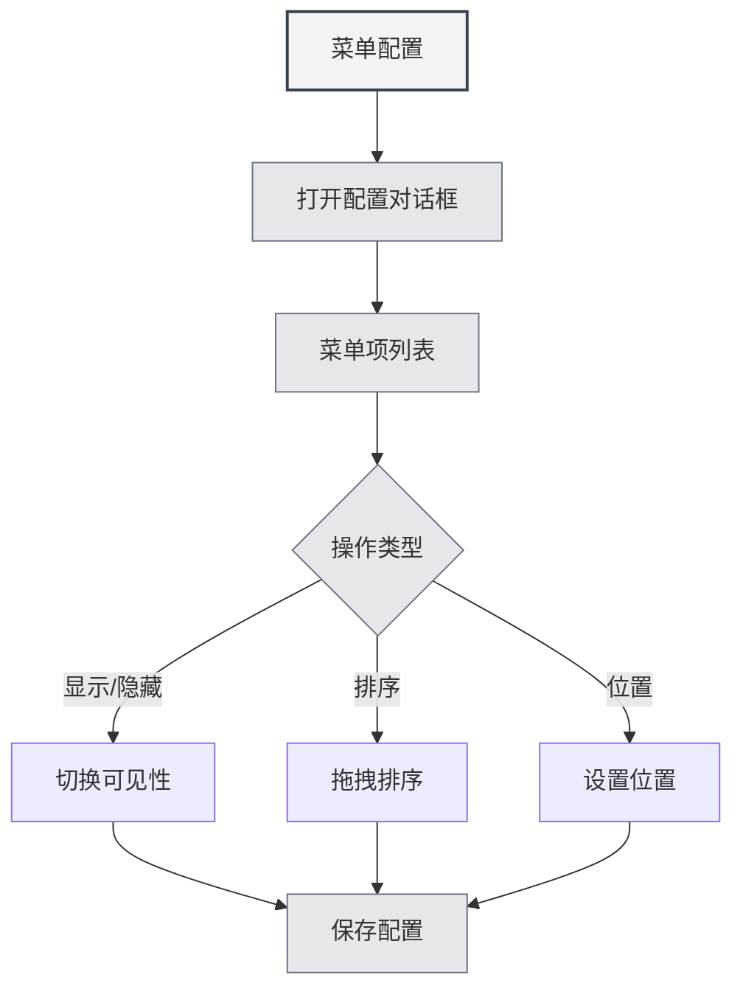

# 菜单配置

## 概述

菜单配置功能允许您自定义左侧菜单的显示和顺序。通过菜单配置，您可以隐藏不需要的菜单项，调整菜单顺序，设置菜单位置，打造个性化的界面布局。

## 打开菜单配置

### 访问方式

可以通过以下方式打开菜单配置：

- **设置页面**：在设置页面中可能有菜单配置入口
- **菜单选项**：在左侧菜单的"更多功能"中可能有菜单配置选项
- **右键菜单**：某些菜单项可能有配置选项

您可以通过顶部菜单栏访问菜单配置：

<MenuItemsDemo mode="demo" :items='[{"id": "settings"}]' />

<MenuItemsDemo mode="demo" :items='[{"id": "file"}]' />

<MenuItemsDemo mode="demo" :items='[{"id": "edit"}]' />

<MenuItemsDemo mode="demo" :items='[{"id": "view"}]' />

## 菜单项管理

### 菜单项列表

菜单配置页面显示所有可配置的菜单项：

- **菜单项名称**：显示菜单项的名称
- **可见性**：显示菜单项是否可见
- **位置**：显示菜单项的位置（顶部/底部）
- **核心标识**：标识核心菜单项（不可隐藏）

<MenuItemsDemo mode="demo" :items='[{"id": "ai-assistant"}]' />

<MenuItemsDemo mode="demo" :items='[{"id": "help"}]' />

### 菜单项类型

菜单项分为两种类型：

- **核心菜单项**：必须显示的菜单项，不能隐藏
  - 主页
  - 文件
  - 设置
  - 更多功能
  - 退出
- **普通菜单项**：可以隐藏的菜单项
  - AI助手
  - 最近文件
  - 知识库
  - 工作目录
  - 用户手册
  - 用户反馈
  - LLM统计
  - 调试工具（开发环境）

## 显示/隐藏菜单项

### 隐藏菜单项

可以隐藏不需要的菜单项：

1. **打开配置**：打开菜单配置对话框
2. **找到菜单项**：找到要隐藏的菜单项
3. **切换可见性**：切换菜单项的可见性开关
4. **保存配置**：点击"保存"按钮保存配置

<DialogDemo mode="demo" dialogType="menu-config" />

### 显示菜单项

可以显示已隐藏的菜单项：

1. **打开配置**：打开菜单配置对话框
2. **找到菜单项**：找到要显示的菜单项
3. **切换可见性**：切换菜单项的可见性开关
4. **保存配置**：点击"保存"按钮保存配置

<ViewMenuItemsDemo mode="demo" :items='["settings"]' />

### 核心菜单项限制

核心菜单项不能隐藏：

- **强制显示**：核心菜单项始终显示
- **无法隐藏**：核心菜单项的可见性开关会被禁用
- **自动恢复**：如果尝试隐藏核心菜单项，会自动恢复为显示状态

## 菜单项排序

### 拖拽排序

可以通过拖拽调整菜单项顺序：

1. **打开配置**：打开菜单配置对话框
2. **拖拽菜单项**：点击并拖拽菜单项的拖拽手柄
3. **调整位置**：将菜单项拖到目标位置
4. **保存配置**：点击"保存"按钮保存配置

<ViewMenuItemsDemo mode="demo" :items='["agent"]' />

### 排序规则

菜单项排序遵循以下规则：

- **位置分组**：顶部菜单项和底部菜单项分开排序
- **分割线**：顶部和底部之间会有分割线
- **自动调整**：拖拽到不同位置会自动调整位置属性

## 菜单位置设置

### 位置类型

菜单项可以设置两种位置：

- **顶部**：显示在菜单栏的顶部区域
- **底部**：显示在菜单栏的底部区域

### 设置位置

可以设置菜单项的位置：

1. **打开配置**：打开菜单配置对话框
2. **拖拽到位置**：将菜单项拖拽到顶部或底部区域
3. **自动调整**：系统会自动调整位置属性
4. **保存配置**：点击"保存"按钮保存配置

<LeftMenu mode="demo" />

### 位置分割线

顶部和底部之间会有分割线：

- **自动显示**：如果有顶部和底部菜单项，会自动显示分割线
- **不可拖拽**：分割线不可拖拽，用于视觉分隔
- **自动隐藏**：如果只有顶部或底部菜单项，分割线会自动隐藏

## 配置保存

### 自动保存

某些操作会自动保存配置：

- **可见性切换**：切换菜单项可见性时自动保存
- **位置调整**：调整菜单位置时自动保存

### 手动保存

也可以手动保存配置：

1. **调整配置**：调整菜单项的顺序和可见性
2. **点击保存**：点击"保存"按钮
3. **配置生效**：配置会立即生效

### 重置配置

可以重置菜单配置：

1. **打开配置**：打开菜单配置对话框
2. **点击重置**：点击"重置"按钮
3. **确认重置**：确认重置操作
4. **恢复默认**：配置会恢复到默认状态

**注意事项**：

- 重置操作不可恢复
- 重置后核心菜单项仍然会保持显示

<DialogDemo mode="demo" dialogType="confirm-reset" />

## 配置持久化

### 配置存储

菜单配置会保存在本地：

- **本地存储**：配置保存在本地设置中
- **自动加载**：下次启动应用时自动加载配置
- **多窗口同步**：配置会在所有窗口间同步

### 配置迁移

旧版本的配置会自动迁移：

- **位置迁移**：旧版本的"middle"位置会自动迁移为"bottom"
- **兼容处理**：系统会自动处理旧版本的配置格式
- **平滑升级**：升级后配置会自动适配新版本

## 最佳实践

1. **精简菜单**：隐藏不常用的菜单项，保持界面简洁
2. **合理排序**：将常用菜单项放在前面，方便访问
3. **位置分组**：将相关菜单项放在同一位置区域
4. **定期调整**：根据使用习惯定期调整菜单配置
5. **备份配置**：重要配置可以备份，方便恢复

## 注意事项

1. **核心菜单项**：核心菜单项不能隐藏，必须显示
2. **配置保存**：某些操作会自动保存，某些需要手动保存
3. **重置操作**：重置操作不可恢复，请谨慎使用
4. **多窗口同步**：配置会在所有窗口间同步
5. **开发工具**：调试工具只在开发环境中显示

## 相关文档

- [[settings.basic|基础设置]]
- [[core.multi-tab|多标签页管理]]

<MainTabs mode="demo" />
