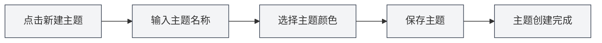

# 自定义主题管理

## 概述

自定义主题管理允许您创建、编辑、删除和复制自定义主题。通过自定义主题，您可以打造符合个人喜好的界面外观，提升使用体验。

## 新建自定义主题

### 创建新主题

1. 在主题设置页面，点击"新建主题"卡片（+图标）
2. 在弹出的对话框中：
   - 输入主题名称（可选，默认使用颜色值）
   - 选择主题颜色（使用颜色选择器）
3. 点击"保存"按钮

### 主题颜色选择

颜色选择器提供以下功能：

- **颜色选择**：点击颜色区域选择颜色
- **预设颜色**：从预设颜色列表中选择
- **透明度调整**：调整颜色的透明度（Alpha通道）
- **颜色值输入**：直接输入HEX颜色值

### 主题命名

- **自动命名**：如果不输入名称，系统会使用颜色值作为名称
- **自定义名称**：输入有意义的名称，便于识别和管理
- **命名建议**：使用描述性的名称，如"工作主题"、"夜间模式"等

## 编辑自定义主题

### 修改主题

1. 在主题列表中，找到要编辑的自定义主题
2. 点击主题卡片上的"更多"按钮（三个点图标）
3. 选择"编辑"
4. 在对话框中修改主题名称或颜色
5. 点击"保存"按钮

### 快速编辑颜色

您也可以直接在主题卡片上编辑颜色：

1. 点击主题卡片上的颜色选择器
2. 选择新颜色
3. 颜色会立即应用

**注意事项**：
- 预设主题不能编辑
- 只有自定义主题可以编辑
- 编辑后需要保存才能永久生效

## 删除自定义主题

### 删除主题

1. 在主题列表中，找到要删除的自定义主题
2. 点击主题卡片上的"更多"按钮
3. 选择"删除"
4. 确认删除操作

**注意事项**：
- 删除操作不可恢复
- 如果删除的是当前使用的主题，系统会自动切换到默认主题
- 预设主题不能删除

## 复制主题

### 复制现有主题

1. 在主题列表中，找到要复制的主题
2. 点击主题卡片上的"更多"按钮
3. 选择"复制"
4. 系统会创建一个副本，名称后添加"副本"
5. 可以编辑副本创建新主题

### 使用场景

- **基于现有主题创建新主题**：复制后修改颜色
- **创建主题变体**：创建相似但略有不同的主题
- **备份主题**：复制作为备份

## 主题颜色设置

### 颜色选择器功能

颜色选择器提供丰富的颜色选择功能：

- **颜色面板**：点击选择颜色
- **预设颜色**：快速选择常用颜色
- **颜色值输入**：直接输入HEX、RGB、HSL等格式
- **透明度调整**：调整颜色的透明度

### 预设颜色

MetaDoc提供了多种预设颜色：

- **基础色**：红、橙、黄、绿、青、蓝、紫、灰
- **浅色系**：浅红、浅橙、浅黄等
- **深色系**：深红、深橙、深黄等

### 颜色格式

支持的颜色格式：

- **HEX**：`#FF5733`（最常用）
- **RGB**：`rgb(255, 87, 51)`
- **HSL**：`hsl(9, 100%, 60%)`

## 主题应用

### 应用自定义主题

1. 在主题列表中，点击要使用的自定义主题卡片
2. 主题会立即应用
3. 界面颜色会根据主题色自动生成

### 主题色影响

主题色会影响以下界面元素：

- **背景色**：主背景和次背景
- **文本色**：主要文本和次要文本
- **侧边栏**：侧边栏背景和文本
- **编辑器**：编辑器背景和工具栏
- **其他元素**：按钮、边框、高亮等

### 自动配色

MetaDoc会根据主题色自动生成配色方案：

- **浅色主题**：主题色较亮时，生成浅色配色
- **深色主题**：主题色较暗时，生成深色配色
- **配色算法**：使用颜色混合和饱和度调整

## 主题管理

### 主题列表

主题设置页面显示所有可用主题：

- **预设主题**：系统内置的主题
- **自定义主题**：用户创建的主题
- **当前主题**：显示选中标记

### 主题排序

主题按以下顺序显示：

1. 系统同步主题（跟随系统）
2. 浅色/深色预设主题
3. 自定义主题（按创建时间）

### 主题状态

每个主题卡片显示：

- **主题色预览**：显示主题的主要颜色
- **主题名称**：显示主题的名称
- **颜色值**：显示颜色的HEX值
- **选中标记**：当前使用的主题

## 最佳实践

1. **主题命名**：使用有意义的名称，便于识别
2. **颜色选择**：选择护眼的颜色，避免过于鲜艳
3. **主题备份**：重要主题建议复制备份
4. **定期清理**：删除不再使用的主题，保持列表整洁
5. **测试效果**：创建主题后测试实际效果，根据使用体验调整

## 注意事项

1. **预设主题**：预设主题不能编辑或删除
2. **主题兼容性**：某些主题可能在不同环境下显示效果不同
3. **颜色选择**：建议选择对比度适中的颜色，保证可读性
4. **主题数量**：建议不要创建过多主题，保持列表简洁
5. **主题同步**：主题更改会在所有窗口间同步

## 相关文档

- [[settings.theme|主题配置]]
- [[settings.basic|基础设置]]
- [[core.editor-settings|编辑器设置]]
