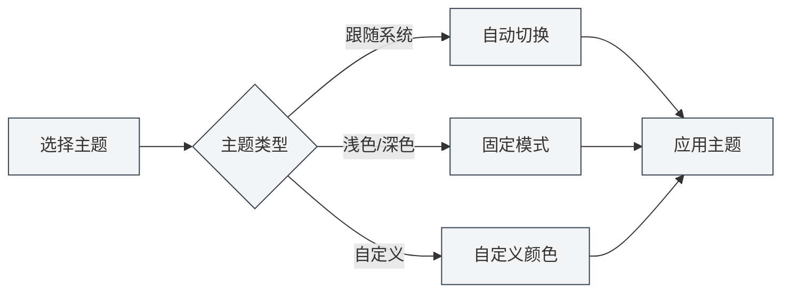

# 主题配置

## 概述

主题配置允许您自定义MetaDoc的外观，包括全局主题、内容主题、代码主题等。合理配置主题可以提升使用体验，减少视觉疲劳。

## 全局主题

### 主题类型

MetaDoc支持以下全局主题类型：

- **跟随系统深浅**：自动跟随操作系统的浅色/深色模式
- **跟随系统颜色**：跟随操作系统的主题色（Windows 11）
- **浅色**：固定使用浅色主题
- **深色**：固定使用深色主题
- **自定义**：使用自定义主题颜色

### 选择主题

1. 在主题设置页面，浏览主题卡片
2. 点击想要使用的主题卡片
3. 主题会立即应用

您可以通过顶部菜单栏访问主题设置：

<MenuItemsDemo mode="demo" :items='[{"id": "settings"}]' />

### 主题设置界面

下图展示了主题设置页面的完整界面：

<Demo component="SettingThemeSection" mode="demo" />

主题设置界面包含以下主要功能区域：

- **全局主题**：选择浅色、深色、跟随系统或自定义主题
- **内容主题**：设置编辑器区域的显示主题
- **代码主题**：选择代码块的语法高亮主题
- **行号显示**：控制代码块是否显示行号
- **自定义主题**：创建和管理自定义颜色主题

### 主题预览

每个主题卡片都会显示：

- **主题色预览**：显示主题的主要颜色
- **主题名称**：显示主题的名称
- **选中标记**：当前使用的主题会显示选中标记

## 内容主题

### 设置内容主题

内容主题控制文档编辑区域的显示主题：

- **自动**：跟随全局主题
- **浅色**：固定使用浅色内容主题
- **深色**：固定使用深色内容主题

### 使用场景

- **全局深色，内容浅色**：适合在暗环境中编辑浅色文档
- **全局浅色，内容深色**：适合在亮环境中编辑深色文档
- **自动模式**：内容主题自动跟随全局主题

## 代码主题

### 设置代码主题

代码主题控制代码块的语法高亮主题：

- **自动**：跟随全局主题自动选择
- **自定义**：从代码主题列表中选择

### 代码主题列表

MetaDoc支持多种代码主题，包括：

- **浅色主题**：GitHub、VS、OneLight等
- **深色主题**：Monokai、Dracula、OneDark等

### 选择建议

- **浅色文档**：使用浅色代码主题
- **深色文档**：使用深色代码主题
- **自动模式**：让系统自动选择，保持一致性

## 行号显示

### 显示行号

启用"代码框显示行号"后，代码块会显示行号：

- **启用**：代码块左侧显示行号
- **禁用**：不显示行号

### 使用场景

- **代码调试**：行号有助于定位代码位置
- **代码分享**：行号便于引用特定行
- **代码阅读**：行号有助于理解代码结构

## 主题切换

### 实时切换

主题切换会立即生效：

1. 选择新主题
2. 界面立即更新
3. 所有窗口同步应用

### 主题同步

- **多窗口同步**：所有窗口会自动同步主题
- **设置保存**：主题选择会自动保存
- **下次启动**：下次启动时会使用上次选择的主题

## 预设主题

### 内置主题

MetaDoc提供了多种预设主题：

- **浅色主题**：适合明亮环境
- **深色主题**：适合暗环境
- **系统同步**：自动跟随系统设置

### 预设主题特点

- **优化配色**：经过精心设计的配色方案
- **护眼设计**：减少视觉疲劳
- **一致性**：保证界面元素的一致性

## 最佳实践

1. **环境适配**：根据使用环境选择主题
2. **内容匹配**：内容主题与文档类型匹配
3. **代码可读性**：选择代码可读性高的代码主题
4. **定期调整**：根据使用体验调整主题设置

## 注意事项

1. **系统兼容性**：跟随系统主题需要操作系统支持
2. **主题一致性**：建议保持全局主题和内容主题的一致性
3. **代码主题**：代码主题会影响代码的可读性
4. **自定义主题**：自定义主题需要手动创建和管理

## 相关文档

- [[settings.theme-custom|自定义主题管理]]
- [[settings.basic|基础设置]]
- [[core.editor-settings|编辑器设置]]
