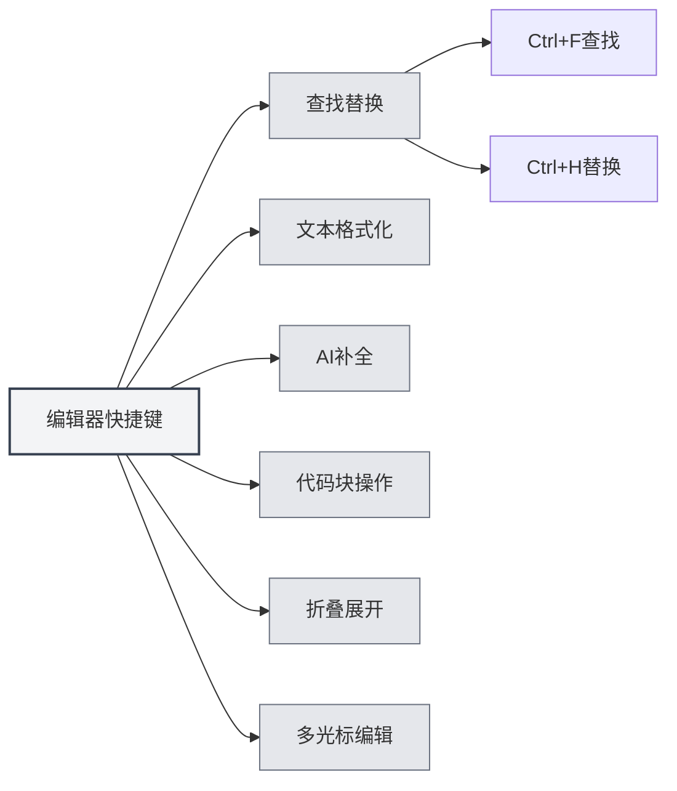

# 编辑器快捷键

## 概述

编辑器快捷键是在编辑器界面中使用的快捷键，包括文本编辑、查找替换、格式化等功能。熟练掌握这些快捷键可以提升编辑效率。

**说明**：查找/替换（Ctrl+F、Ctrl+H）由应用全局实现；加粗/斜体/链接/代码块等由底层编辑器（Markdown 使用 Vditor，LaTeX 使用 Monaco）提供，若无效请以实际编辑器行为为准。

## 查找替换

### 查找

- **快捷键**：`Ctrl+F`（Windows/Linux）或 `Cmd+F`（macOS）
- **功能**：打开查找对话框
- **使用场景**：在文档中查找特定文本

### 查找替换

- **快捷键**：`Ctrl+H`（Windows/Linux）或 `Cmd+H`（macOS）
- **功能**：打开查找替换对话框
- **使用场景**：查找并替换文本

### 查找功能

查找对话框支持以下功能：

- **查找文本**：输入要查找的文本
- **替换文本**：输入替换后的文本
- **正则表达式**：支持正则表达式搜索
- **大小写匹配**：区分大小写
- **全字匹配**：匹配完整单词

查找替换菜单界面如下：

<SearchReplaceMenu mode="demo" :position='{"top": 100, "left": 200}' :adapter='null' />

## 文本格式化

### 加粗

- **快捷键**：`Ctrl+B`（Windows/Linux）或 `Cmd+B`（macOS）
- **功能**：将选中文本加粗
- **使用场景**：强调重要内容

### 斜体

- **快捷键**：`Ctrl+I`（Windows/Linux）或 `Cmd+I`（macOS）
- **功能**：将选中文本设为斜体
- **使用场景**：表示引用或强调

### 插入链接

- **快捷键**：`Ctrl+K`（Windows/Linux）或 `Cmd+K`（macOS）
- **功能**：插入链接
- **使用场景**：添加超链接

**注意事项**：此快捷键可能与保存全部（Ctrl+K S）冲突，需要先按Ctrl+K，然后按K，而不是同时按。

## AI补全

### 手动触发补全

- **快捷键**：`Shift+Tab`
- **功能**：手动触发AI自动补全
- **使用场景**：需要AI补全时手动触发

### 补全触发按键

AI补全还可以通过以下按键自动触发：

- **Enter**：按Enter键触发
- **Space**：按空格键触发
- **分号**：按分号（;）触发
- **斜杠**：按斜杠（/）触发

这些触发按键可以在[[settings.llm|LLM配置]]中设置。

## 代码块操作

### 插入代码块

- **快捷键**：`Ctrl+Shift+K`（Markdown编辑器）
- **功能**：插入代码块
- **使用场景**：添加代码示例

## 折叠展开

### 折叠代码块

- **快捷键**：`Ctrl+Shift+[`（Windows/Linux）或 `Cmd+Option+[`（macOS）
- **功能**：折叠当前代码块或环境
- **使用场景**：隐藏不需要查看的代码

### 展开代码块

- **快捷键**：`Ctrl+Shift+]`（Windows/Linux）或 `Cmd+Option+]`（macOS）
- **功能**：展开折叠的代码块或环境
- **使用场景**：查看折叠的内容

## 多光标编辑

### 选中所有相同单词

- **快捷键**：`Ctrl+Shift+L`（Windows/Linux）或 `Cmd+Shift+L`（macOS）
- **功能**：选中文档中所有相同的单词并添加光标
- **使用场景**：批量编辑相同的文本

## 撤销和重做

### 撤销

- **快捷键**：`Ctrl+Z`（Windows/Linux）或 `Cmd+Z`（macOS）
- **功能**：撤销上一步操作
- **使用场景**：撤销误操作

### 重做

- **快捷键**：`Ctrl+Y` 或 `Ctrl+Shift+Z`（Windows/Linux）或 `Cmd+Shift+Z`（macOS）
- **功能**：重做被撤销的操作
- **使用场景**：恢复撤销的操作

## 选择操作

### 全选

- **快捷键**：`Ctrl+A`（Windows/Linux）或 `Cmd+A`（macOS）
- **功能**：选中所有文本
- **使用场景**：选择全部内容进行复制或删除

### 复制

- **快捷键**：`Ctrl+C`（Windows/Linux）或 `Cmd+C`（macOS）
- **功能**：复制选中文本
- **使用场景**：复制内容到剪贴板

### 粘贴

- **快捷键**：`Ctrl+V`（Windows/Linux）或 `Cmd+V`（macOS）
- **功能**：粘贴剪贴板内容
- **使用场景**：粘贴复制的内容

### 剪切

- **快捷键**：`Ctrl+X`（Windows/Linux）或 `Cmd+X`（macOS）
- **功能**：剪切选中文本
- **使用场景**：移动文本内容

## 编辑器快捷键列表

### Windows/Linux快捷键

| 功能             | 快捷键                     |
| ---------------- | -------------------------- |
| 查找             | `Ctrl+F`                   |
| 查找替换         | `Ctrl+H`                   |
| 加粗             | `Ctrl+B`                   |
| 斜体             | `Ctrl+I`                   |
| 插入链接         | `Ctrl+K`                   |
| 插入代码块       | `Ctrl+Shift+K`             |
| 折叠             | `Ctrl+Shift+[`             |
| 展开             | `Ctrl+Shift+]`             |
| 选中所有相同单词 | `Ctrl+Shift+L`             |
| 撤销             | `Ctrl+Z`                   |
| 重做             | `Ctrl+Y` 或 `Ctrl+Shift+Z` |
| 全选             | `Ctrl+A`                   |
| 复制             | `Ctrl+C`                   |
| 粘贴             | `Ctrl+V`                   |
| 剪切             | `Ctrl+X`                   |
| AI补全           | `Shift+Tab`                |

### macOS快捷键

| 功能             | 快捷键         |
| ---------------- | -------------- |
| 查找             | `Cmd+F`        |
| 查找替换         | `Cmd+H`        |
| 加粗             | `Cmd+B`        |
| 斜体             | `Cmd+I`        |
| 插入链接         | `Cmd+K`        |
| 插入代码块       | `Cmd+Shift+K`  |
| 折叠             | `Cmd+Option+[` |
| 展开             | `Cmd+Option+]` |
| 选中所有相同单词 | `Cmd+Shift+L`  |
| 撤销             | `Cmd+Z`        |
| 重做             | `Cmd+Shift+Z`  |
| 全选             | `Cmd+A`        |
| 复制             | `Cmd+C`        |
| 粘贴             | `Cmd+V`        |
| 剪切             | `Cmd+X`        |
| AI补全           | `Shift+Tab`    |

## Markdown编辑器特有快捷键

### Vditor快捷键

Markdown编辑器基于Vditor，支持以下快捷键：

- **加粗**：`Ctrl+B`
- **斜体**：`Ctrl+I`
- **插入链接**：`Ctrl+K`
- **插入代码块**：`Ctrl+Shift+K`

## LaTeX编辑器特有快捷键

### Monaco编辑器快捷键

LaTeX编辑器基于Monaco Editor，支持以下快捷键：

- **折叠**：`Ctrl+Shift+[`
- **展开**：`Ctrl+Shift+]`
- **选中所有相同单词**：`Ctrl+Shift+L`
- **多光标编辑**：`Alt+Click` 添加光标

## 快捷键使用技巧

### 组合使用

可以组合使用多个快捷键：

1. **查找并替换**：`Ctrl+H` 打开查找替换，然后使用Tab键切换输入框
2. **格式化文本**：选中文本后使用 `Ctrl+B` 或 `Ctrl+I` 格式化
3. **批量编辑**：使用 `Ctrl+Shift+L` 选中所有相同单词，然后统一编辑

### 快捷键记忆

- **格式化**：B（Bold）、I（Italic）对应加粗和斜体
- **查找**：F（Find）、H（Hunt/查找替换）
- **折叠**：`[` 和 `]` 对应折叠和展开

## 最佳实践

1. **熟练使用**：熟练掌握常用编辑快捷键
2. **组合操作**：结合多个快捷键完成复杂编辑
3. **批量编辑**：使用多光标功能批量编辑
4. **快速格式化**：使用快捷键快速格式化文本
5. **查找替换**：使用查找替换功能提高效率

## 注意事项

1. **平台差异**：Windows/Linux使用Ctrl，macOS使用Cmd
2. **快捷键冲突**：某些快捷键可能与编辑器功能冲突
3. **上下文相关**：某些快捷键只在特定上下文中有效
4. **编辑器差异**：Markdown和LaTeX编辑器支持的快捷键可能不同
5. **AI补全**：Shift+Tab是手动触发，自动触发需要配置触发按键

## 相关文档

- [[shortcuts.global|全局快捷键]]
- [[core.editor-basics|编辑器基础操作]]
- [[markdown.features|Markdown编辑器功能]]
- [[ai.completion|AI自动补全]]

<MenuItemsDemo mode="demo" :items='[{"id": "file"}]' />

<ViewMenuItemsDemo mode="demo" :items='["editor"]' />

<AIChat mode="demo" />

<CompletionSettingsPanel mode="demo" />

<SettingLlmSection mode="demo" />

<MainTabs mode="demo" />

<QuickStartPanel mode="demo" />

<Outline mode="demo" />

<AgentView mode="demo" />

<LaTeXEditorDemo mode="demo" />

<SettingBasicSection mode="demo" />

<SettingThemeSection mode="demo" />

<KnowledgeBase mode="demo" />
