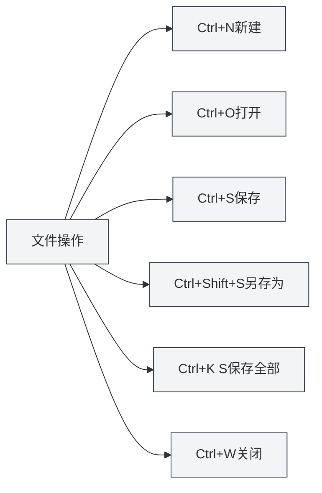

# 全局快捷键

## 概述

全局快捷键是MetaDoc中可以在任何界面使用的快捷键。熟练掌握这些快捷键可以显著提升工作效率。

**说明**：本文档中的快捷键已与当前代码实现核对，均在主进程或渲染进程中实现并可用。

## 文件操作

### 新建文档

- **快捷键**：`Ctrl+N`（Windows/Linux）或 `Cmd+N`（macOS）
- **功能**：创建新的空白文档
- **使用场景**：快速开始新的文档编辑

### 打开文档

- **快捷键**：`Ctrl+O`（Windows/Linux）或 `Cmd+O`（macOS）
- **功能**：打开文件选择对话框
- **使用场景**：打开已有文档

### 保存文档

- **快捷键**：`Ctrl+S`（Windows/Linux）或 `Cmd+S`（macOS）
- **功能**：保存当前文档
- **使用场景**：保存编辑内容，防止丢失

### 另存为

- **快捷键**：`Ctrl+Shift+S`（Windows/Linux）或 `Cmd+Shift+S`（macOS）
- **功能**：将当前文档保存为新文件
- **使用场景**：创建文档副本或更改保存位置

### 保存全部文档

- **快捷键**：`Ctrl+K S`（Windows/Linux）或 `Cmd+K S`（macOS）
- **功能**：保存所有打开的文档
- **使用说明**：先按 `Ctrl+K`（或 `Cmd+K`），然后按 `S`
- **使用场景**：一次性保存所有文档

<MenuItemsDemo mode="demo" :items='[{"id": "file", "items": ["save-all"]}]' />

### 关闭文件

- **快捷键**：`Ctrl+W`（Windows/Linux）或 `Cmd+W`（macOS）
- **功能**：关闭当前标签页
- **使用场景**：关闭不需要的文档

## 标签页操作

标签页栏显示所有打开的文档，支持新建、切换、关闭等操作：

<MainTabs mode="demo" />

<ViewMenuItemsDemo mode="demo" :items='["editor", "outline"]' />

### 新建标签页

- **快捷键**：`Ctrl+T`（Windows/Linux）或 `Cmd+T`（macOS）
- **功能**：创建新的标签页
- **使用场景**：快速创建新文档

### 切换标签页

#### 下一个标签页

- **快捷键**：`Ctrl+Tab`（Windows/Linux）或 `Cmd+Tab`（macOS）
- **功能**：切换到下一个标签页
- **使用说明**：按住 `Ctrl+Tab` 会显示标签页切换浮层，可以继续按Tab键选择或直接点击
- **使用场景**：快速在多个文档间切换

<TabSwitcherOverlay mode="demo" />

#### 上一个标签页

- **快捷键**：`Ctrl+Shift+Tab`（Windows/Linux）或 `Cmd+Shift+Tab`（macOS）
- **功能**：切换到上一个标签页
- **使用场景**：反向切换标签页

### 重新打开已关闭的标签页

- **快捷键**：`Ctrl+Shift+T`（Windows/Linux）或 `Cmd+Shift+T`（macOS）
- **功能**：重新打开最近关闭的标签页
- **使用说明**：可以连续使用，依次恢复最近关闭的标签页（最多恢复20个）
- **使用场景**：误关闭标签页后快速恢复

<MainTabs mode="demo" />

## 其他快捷键

### 打开用户手册

- **快捷键**：`F1`
- **功能**：打开用户手册页面
- **使用场景**：需要查看帮助文档时

<MenuItemsDemo mode="demo" :items='[{"id": "help"}]' />

## 快捷键列表

### Windows/Linux快捷键

| 功能           | 快捷键           |
| -------------- | ---------------- |
| 新建文档       | `Ctrl+N`         |
| 打开文档       | `Ctrl+O`         |
| 保存文档       | `Ctrl+S`         |
| 另存为         | `Ctrl+Shift+S`   |
| 保存全部       | `Ctrl+K S`       |
| 关闭标签页     | `Ctrl+W`         |
| 新建标签页     | `Ctrl+T`         |
| 下一个标签页   | `Ctrl+Tab`       |
| 上一个标签页   | `Ctrl+Shift+Tab` |
| 重新打开已关闭 | `Ctrl+Shift+T`   |
| 打开用户手册   | `F1`             |

### macOS快捷键

| 功能           | 快捷键          |
| -------------- | --------------- |
| 新建文档       | `Cmd+N`         |
| 打开文档       | `Cmd+O`         |
| 保存文档       | `Cmd+S`         |
| 另存为         | `Cmd+Shift+S`   |
| 保存全部       | `Cmd+K S`       |
| 关闭标签页     | `Cmd+W`         |
| 新建标签页     | `Cmd+T`         |
| 下一个标签页   | `Cmd+Tab`       |
| 上一个标签页   | `Cmd+Shift+Tab` |
| 重新打开已关闭 | `Cmd+Shift+T`   |
| 打开用户手册   | `F1`            |

## 快捷键使用技巧

### 组合键顺序

某些快捷键需要按顺序按下：

- **保存全部**：先按 `Ctrl+K`，然后按 `S`（不是同时按）
- **标签页切换**：按住 `Ctrl+Tab` 显示浮层，然后继续按Tab选择

### 快捷键冲突

如果快捷键与系统或其他软件冲突：

- **系统快捷键**：某些系统快捷键可能优先
- **其他软件**：关闭冲突的软件或修改其快捷键
- **自定义快捷键**：未来版本可能支持自定义快捷键

### 记忆技巧

- **文件操作**：使用标准的文件操作快捷键（Ctrl+N/O/S）
- **标签页操作**：使用Tab键相关组合
- **保存全部**：使用Ctrl+K作为命令前缀

## 最佳实践

1. **熟练使用**：熟练掌握常用快捷键，提升效率
2. **组合使用**：结合多个快捷键完成复杂操作
3. **标签页切换**：使用Ctrl+Tab快速切换，避免鼠标操作
4. **定期保存**：养成使用Ctrl+S定期保存的习惯
5. **快速恢复**：误关闭标签页时使用Ctrl+Shift+T快速恢复

## 注意事项

1. **平台差异**：Windows/Linux使用Ctrl，macOS使用Cmd
2. **快捷键冲突**：注意与其他软件的快捷键冲突
3. **组合键顺序**：某些快捷键需要按顺序按下
4. **标签页切换**：Ctrl+Tab会显示浮层，可以继续选择
5. **保存全部**：Ctrl+K S需要先按Ctrl+K，再按S

## 相关文档

- [[shortcuts.editor|编辑器快捷键]]
- [[core.file-operations|文件操作]]
- [[core.multi-tab|多标签页管理]]

<MenuItemsDemo mode="demo" :items='[{"id": "file"}]' />

<MainTabs mode="demo" />

<ViewMenuItemsDemo mode="demo" :items='["editor", "outline", "agent"]' />

<QuickStartPanel mode="demo" />
