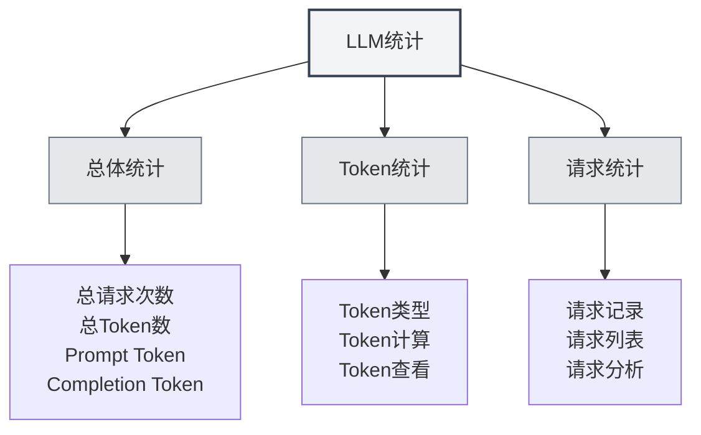

# LLM统计

## 概述

LLM统计功能用于跟踪和查看LLM API的使用情况，包括Token使用量、请求次数、成本统计等信息。这些统计数据可以帮助您了解LLM的使用情况，优化使用策略。

## 打开LLM统计

### 访问方式

可以通过以下方式打开LLM统计页面：

- **设置页面**：在设置页面中可能有LLM统计入口
- **菜单选项**：某些菜单中可能有LLM统计选项
- **快捷键**：某些情况下可能有快捷键（未来可能支持）

<SettingLlmSection mode="demo" />

## 统计信息

### 总体统计

LLM统计页面显示以下总体统计信息：

- **总请求次数**：所有LLM请求的总次数
- **总Token数**：所有请求使用的总Token数
- **Prompt Token**：所有请求的Prompt Token总数
- **Completion Token**：所有请求的Completion Token总数

<DataAnalysisDisplay mode="demo" />

### 时间范围筛选

可以按时间范围筛选统计数据：

- **全部时间**：查看所有时间的统计数据
- **今天**：查看今天的统计数据
- **本周**：查看本周的统计数据
- **本月**：查看本月的统计数据
- **自定义范围**：选择自定义的开始和结束日期

<ChartGenerationDisplay mode="demo" />

### 统计图表

统计页面可能包含以下图表：

- **Token使用趋势**：显示Token使用量随时间的变化趋势
- **请求次数趋势**：显示请求次数随时间的变化趋势
- **模型使用分布**：显示不同模型的使用情况
- **请求类型分布**：显示不同类型请求的分布情况

## Token统计

### Token类型

Token统计包括以下类型：

- **Prompt Token**：输入提示的Token数
- **Completion Token**：生成内容的Token数
- **Total Token**：总Token数（Prompt + Completion）

### Token计算

Token计算方式：

- **自动记录**：每次LLM请求后自动记录Token使用量
- **实时更新**：统计数据实时更新
- **累计统计**：统计数据累计计算

<AgentSessionManager mode="demo" />

### Token查看

可以查看以下Token信息：

- **总Token数**：所有请求的总Token数
- **平均Token数**：每次请求的平均Token数
- **最大Token数**：单次请求的最大Token数
- **最小Token数**：单次请求的最小Token数

## 请求统计

### 请求记录

每次LLM请求都会记录以下信息：

- **时间戳**：请求的时间
- **模型名称**：使用的模型名称
- **请求类型**：请求类型（chat/completion）
- **Token使用量**：本次请求的Token使用量

### 请求列表

可以查看请求列表：

- **时间排序**：按时间倒序排列
- **详细信息**：查看每次请求的详细信息
- **筛选功能**：按模型、类型等筛选请求

<AIChat mode="demo" />

### 请求分析

可以对请求进行分析：

- **请求频率**：分析请求的频率
- **模型使用**：分析不同模型的使用情况
- **类型分布**：分析不同类型请求的分布

## 成本统计

### 成本计算

成本统计基于以下信息：

- **Token使用量**：根据Token使用量计算成本
- **模型定价**：不同模型有不同的定价
- **成本估算**：提供成本估算（如果支持）

<CompletionSettingsPanel mode="demo" />

### 成本查看

可以查看以下成本信息：

- **总成本**：所有请求的总成本
- **日均成本**：平均每天的成本
- **模型成本**：不同模型的成本分布
- **成本趋势**：成本随时间的变化趋势

**注意事项**：成本统计仅供参考，实际成本以API提供商的账单为准。

## 数据导出

### 导出功能

可以导出统计数据：

- **导出格式**：可能支持多种格式（JSON、CSV等）
- **导出范围**：可以选择导出全部或筛选后的数据
- **导出内容**：可以选择导出哪些统计信息

### 数据备份

统计数据会自动保存：

- **本地存储**：统计数据保存在本地
- **自动保存**：每次请求后自动保存
- **数据持久化**：应用重启后数据仍然保留

## 清空统计

### 清空操作

可以清空统计数据：

1. 打开LLM统计页面
2. 找到清空统计按钮
3. 确认清空操作
4. 统计数据会被清空

**注意事项**：

- 清空操作不可恢复
- 清空前建议先导出数据备份
- 清空后所有统计数据会丢失

## 统计设置

### 统计开关

可以控制统计功能：

- **启用统计**：启用LLM使用统计
- **禁用统计**：禁用统计功能（不记录数据）

### 统计精度

可以设置统计精度：

- **详细记录**：记录每次请求的详细信息
- **简化记录**：只记录总体统计信息

## 最佳实践

1. **定期查看**：定期查看LLM使用统计，了解使用情况
2. **成本控制**：根据成本统计控制使用量
3. **优化策略**：根据统计数据优化使用策略
4. **数据备份**：定期导出统计数据备份
5. **合理使用**：根据统计信息合理使用LLM功能

## 注意事项

1. **统计准确性**：统计数据基于API返回的Token信息
2. **成本估算**：成本统计仅供参考，实际成本以账单为准
3. **数据存储**：统计数据存储在本地，不会上传
4. **隐私保护**：统计数据不包含具体内容，只包含使用量信息
5. **性能影响**：统计功能对性能影响很小，可以放心使用

## 相关文档

- [[settings.llm|LLM配置]]
- [[ai.chat|AI对话功能]]
- [[ai.completion|AI自动补全]]

<QuickStartPanel mode="demo" />
