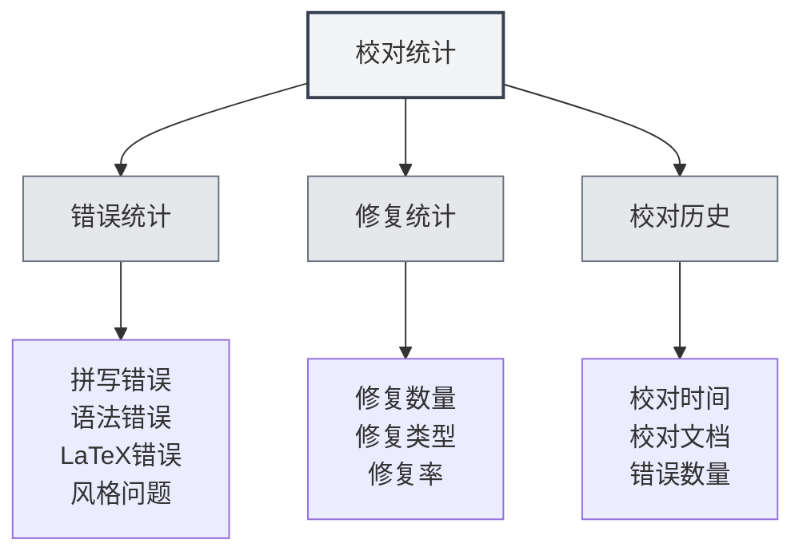

# 校对工具统计

## 概述

校对工具统计功能用于跟踪和查看文档校对的使用情况，包括拼写检查、语法检查等统计信息。这些统计数据可以帮助您了解校对功能的使用情况，优化校对策略。

## 校对统计介绍

### 什么是校对统计

校对统计记录文档校对过程中的相关信息：

- **错误统计**：记录检测到的错误数量和类型
- **修复统计**：记录修复的错误数量
- **校对历史**：记录校对操作的历史

### 统计类型

校对统计包括以下类型：

- **拼写错误**：拼写检查发现的错误
- **语法错误**：语法检查发现的错误
- **LaTeX错误**：LaTeX语法检查发现的错误
- **风格问题**：风格检查发现的问题
- **其他错误**：其他类型的错误

<ProofreadView mode="demo" />

## 错误统计

### 错误分类

校对工具会将错误分类统计：

- **拼写错误**：单词拼写错误的数量
- **语法错误**：语法错误的数量
- **LaTeX错误**：LaTeX语法错误的数量
- **风格问题**：写作风格问题的数量
- **其他错误**：其他类型错误的数量

<DiffDisplay mode="demo" />

### 错误计数

每次校对会统计错误：

- **总错误数**：所有错误的总数
- **各类错误数**：各类错误的数量
- **错误分布**：错误类型的分布情况

## 修复统计

### 修复记录

记录错误修复的情况：

- **修复数量**：已修复的错误数量
- **修复类型**：修复的错误类型
- **修复率**：修复错误的比例

### 修复历史

可以查看修复历史：

- **修复时间**：错误修复的时间
- **修复内容**：修复的具体内容
- **修复方式**：修复的方式（手动/自动）

<OutlineTreeDisplay mode="demo" />

## 校对历史

### 历史记录

记录校对操作的历史：

- **校对时间**：校对操作的时间
- **校对文档**：被校对的文档
- **错误数量**：发现的错误数量
- **修复数量**：修复的错误数量

### 历史查看

可以查看校对历史：

- **历史列表**：显示所有校对历史记录
- **详细信息**：查看每次校对的详细信息
- **统计分析**：对历史数据进行统计分析

<ViewMenuItemsDemo mode="demo" :items='["settings"]' />

## 统计视图

### 统一视图

统一视图显示所有错误：

- **错误列表**：按顺序显示所有错误
- **错误详情**：显示每个错误的详细信息
- **错误定位**：可以定位到错误位置

<DataAnalysisDisplay mode="demo" />

### 分类视图

分类视图按类型显示错误：

- **按类型分组**：错误按类型分组显示
- **类型统计**：显示每个类型的错误数量
- **类型筛选**：可以筛选特定类型的错误

## 统计导出

### 导出功能

可以导出校对统计：

- **导出格式**：可能支持多种格式（JSON、CSV等）
- **导出范围**：可以选择导出全部或筛选后的数据
- **导出内容**：可以选择导出哪些统计信息

<ChartGenerationDisplay mode="demo" />

## 最佳实践

1. **定期校对**：定期使用校对功能检查文档
2. **关注统计**：关注错误统计，了解文档质量
3. **及时修复**：发现错误及时修复
4. **分析趋势**：分析错误趋势，改进写作习惯
5. **利用历史**：利用历史记录，跟踪文档改进

## 注意事项

1. **统计准确性**：统计数据基于校对工具的检测结果
2. **误报处理**：某些检测可能是误报，需要人工判断
3. **数据存储**：统计数据存储在本地，不会上传
4. **隐私保护**：统计数据不包含具体内容，只包含统计信息
5. **性能影响**：统计功能对性能影响很小，可以放心使用

## 相关文档

- [[ai.proofread|AI校对功能]]
- [[statistics.llm|LLM统计]]

<QuickStartPanel mode="demo" />
