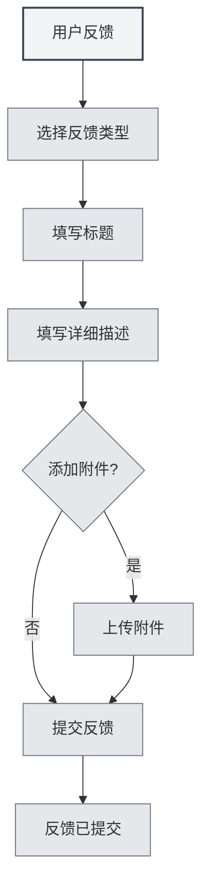

# 用户反馈

## 概述

用户反馈功能允许您向MetaDoc团队提交问题报告、功能建议或其他反馈。您的反馈对我们改进产品非常重要。

## 打开用户反馈

### 访问方式

可以通过以下方式打开用户反馈页面：

- **设置页面**：在"关于"设置页面中点击"用户反馈"按钮
- **菜单选项**：某些菜单中可能有用户反馈选项
- **快捷键**：某些情况下可能有快捷键（未来可能支持）

## 反馈类型

### 反馈类型选择

提交反馈时需要选择反馈类型：

- **BUG反馈**：报告软件错误或问题
- **功能建议**：提出新功能或改进建议
- **安全性反馈**：报告安全问题
- **其他**：其他类型的反馈

### 类型说明

- **BUG反馈**：用于报告软件错误、崩溃、异常行为等问题
- **功能建议**：用于提出新功能需求或现有功能的改进建议
- **安全性反馈**：用于报告安全漏洞或安全问题
- **其他**：用于其他类型的反馈，如使用问题、文档问题等

## 反馈内容

### 标题

反馈标题应该：

- **简洁明了**：简要描述问题或建议
- **具体明确**：避免使用模糊的标题
- **必填项**：标题是必填项

### 详细描述

详细描述应该包含：

- **问题描述**：清晰描述遇到的问题
- **期待结果**：说明期待的结果
- **其他信息**：提供其他有助于诊断的信息
- **联系方式**：可选的联系方式，方便后续跟进

### 反馈模板

系统会提供反馈模板，包含以下部分：

- **系统信息**：自动填充系统信息
- **问题描述**：描述问题的区域
- **期待结果**：期待结果的区域
- **其他信息**：其他信息的区域
- **联系方式**：可选的联系方式

## 附件上传

### 附件支持

可以上传附件来辅助说明问题：

- **文件类型**：支持任何类型的文件
- **文件大小**：单个文件不超过10MB
- **总大小**：所有附件总大小不超过50MB
- **文件数量**：最多上传5个附件

### 附件用途

附件可以用于：

- **截图**：提供问题截图
- **日志文件**：提供错误日志
- **示例文件**：提供问题示例文件
- **其他文件**：提供其他相关文件

### 附件规则

- **单个文件限制**：单个文件不超过10MB
- **总大小限制**：所有附件总大小不超过50MB
- **数量限制**：最多上传5个附件
- **类型限制**：文件类型不限，以Gist能力为准

## 提交反馈

### 提交步骤

1. **选择类型**：选择反馈类型
2. **填写标题**：填写反馈标题
3. **填写描述**：填写详细描述
4. **添加附件**：可选，添加附件
5. **提交反馈**：点击"提交反馈"按钮

您可以通过设置页面访问用户反馈：

<MenuItemsDemo mode="demo" :items='[{"id": "settings"}]' />

### 提交验证

提交前会进行验证：

- **标题验证**：确保标题不为空
- **描述验证**：确保描述不为空
- **附件验证**：确保附件符合规则

### 提交结果

提交后会显示结果：

- **提交成功**：显示成功消息
- **提交失败**：显示错误消息和原因

## 其他联系方式

### 邮件反馈

也可以通过邮件反馈：

- **邮箱地址**：在反馈页面底部显示
- **复制邮箱**：可以复制邮箱地址
- **邮件主题**：建议使用明确的主题

### QQ群

可以加入官方QQ群：

- **QQ群号**：在反馈页面底部显示
- **复制群号**：可以复制QQ群号
- **加入群组**：加入群组后可以实时反馈

## 反馈处理

### 反馈流程

反馈提交后的处理流程：

1. **接收反馈**：系统接收您的反馈
2. **分类处理**：根据反馈类型分类
3. **问题分析**：分析问题或建议
4. **跟进处理**：根据情况跟进处理
5. **反馈回复**：可能通过邮件或QQ群回复

### 反馈优先级

反馈会根据类型和严重程度设置优先级：

- **安全性反馈**：最高优先级
- **严重BUG**：高优先级
- **功能建议**：中等优先级
- **其他反馈**：一般优先级

## 最佳实践

1. **详细描述**：尽可能详细地描述问题或建议
2. **提供截图**：如果可能，提供问题截图
3. **提供日志**：如果遇到错误，提供错误日志
4. **提供示例**：如果可能，提供问题示例文件
5. **联系方式**：提供联系方式以便后续跟进

## 注意事项

1. **反馈格式**：按照模板格式填写反馈
2. **附件大小**：注意附件大小限制
3. **联系方式**：提供联系方式以便后续跟进
4. **反馈类型**：选择正确的反馈类型
5. **系统信息**：系统信息会自动填充，不要删除

## 相关文档

- [[settings.about|关于信息]]
- [[user.profile|用户资料]]
