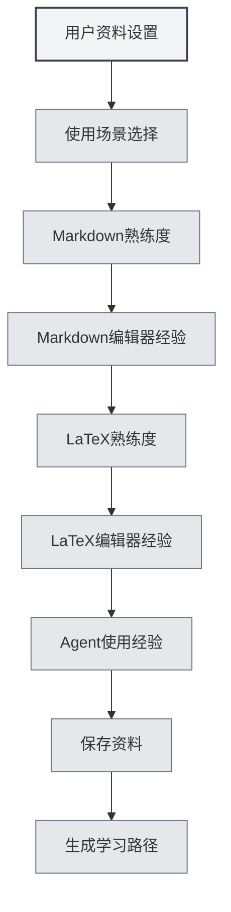

# 用户资料

## 概述

用户资料功能允许您设置个人信息和使用偏好，帮助MetaDoc更好地理解您的需求，提供个性化的使用体验和学习路径。

## 用户资料设置

### 打开用户资料

可以通过以下方式打开用户资料对话框：

- **主页提示**：首次使用时，主页可能会提示设置用户资料
- **用户手册**：在用户手册中可以访问用户资料设置
- **菜单选项**：某些菜单中可能有用户资料选项

<QuickStartPanel mode="demo" />

### 用户资料界面

用户资料界面包含以下主要部分：

<UserProfileView mode="demo" />

### 资料设置向导

用户资料设置采用分步向导形式：

1. **使用场景**：选择主要使用场景
2. **Markdown熟练度**：评估Markdown语法熟悉程度
3. **Markdown编辑器经验**：选择使用过的Markdown编辑器类型
4. **LaTeX熟练度**：评估LaTeX语法熟悉程度
5. **LaTeX编辑器经验**：选择使用过的LaTeX编辑器类型
6. **Agent使用经验**：评估Agent框架使用经验

## 使用场景选择

### 场景类型

可以选择以下使用场景：

- **学生**：适合学生用户，重点学习基础编辑和Markdown功能
- **研究者**：适合研究者，重点学习LaTeX和学术写作功能
- **IT从业者**：适合IT从业者，重点学习Agent框架和高级功能
- **办公用户**：适合办公用户，重点学习基础功能和导出
- **其他**：其他使用场景

### 场景影响

选择的场景会影响：

- **学习路径**：系统会推荐相应的学习路径
- **功能推荐**：优先推荐相关功能
- **AI理解**：帮助AI更好地理解您的需求

## 技能评估

### Markdown熟练度

评估您对Markdown语法的熟悉程度：

- **无经验**：从未使用过Markdown
- **基础**：了解基本语法（标题、列表、链接等）
- **中级**：熟悉常用语法和扩展功能
- **高级**：精通Markdown，了解各种扩展语法

<QuickStartLatex mode="demo" />

### LaTeX熟练度

评估您对LaTeX语法的熟悉程度：

- **无经验**：从未使用过LaTeX
- **基础**：了解基本语法和文档结构
- **中级**：熟悉常用环境和命令
- **高级**：精通LaTeX，能够编写复杂文档

<MenuItemsDemo mode="demo" :items='[{"id": "file"}]' />

### Agent使用经验

评估您对Agent框架的使用经验：

- **无经验**：从未使用过Agent功能
- **基础**：了解基本概念，使用过简单功能
- **中级**：熟悉工具集和工作流
- **高级**：能够创建复杂的Agent配置和工作流

<AgentView mode="demo" />

## 编辑器经验

### Markdown编辑器经验

选择您使用过的Markdown编辑器类型：

- **WYSIWYG编辑器**：使用过所见即所得编辑器
- **其他Markdown编辑器**：使用过其他Markdown编辑器

### LaTeX编辑器经验

选择您使用过的LaTeX编辑器类型：

- **在线LaTeX编辑器**：使用过在线LaTeX编辑器
- **本地LaTeX编辑器**：使用过本地LaTeX编辑器

## 使用偏好设置

### 编辑偏好

可以设置编辑相关的偏好：

- **编辑模式**：偏好使用的编辑模式
- **预览方式**：偏好使用的预览方式
- **自动保存**：自动保存偏好

<MainTabs mode="demo" />

### 功能偏好

可以设置功能相关的偏好：

- **常用功能**：标记常用的功能
- **功能优先级**：设置功能的优先级
- **界面布局**：偏好使用的界面布局

<ViewMenuItemsDemo mode="demo" :items='["settings"]' />

## 用户画像设置

### 画像生成

基于您的设置，系统会生成用户画像：

- **技能水平**：评估各项技能水平
- **使用场景**：识别主要使用场景
- **学习需求**：分析学习需求

### 画像应用

用户画像会应用于：

- **学习路径**：推荐个性化的学习路径
- **功能推荐**：优先推荐相关功能
- **AI辅助**：帮助AI更好地理解需求

## 学习路径推荐

### 路径类型

根据用户资料，系统会推荐相应的学习路径：

- **学生路径**：适合学生用户的学习路径
- **研究者路径**：适合研究者的学习路径
- **IT从业者路径**：适合IT从业者的学习路径
- **办公用户路径**：适合办公用户的学习路径

<AIChat mode="demo" />

### 路径内容

学习路径包含：

- **文档列表**：按顺序排列的学习文档
- **学习目标**：每个文档的学习目标
- **预计时间**：完成学习预计需要的时间

## 资料更新

### 修改资料

可以随时修改用户资料：

1. 打开用户资料对话框
2. 修改各项设置
3. 保存更改

### 资料同步

用户资料会：

- **本地保存**：保存在本地
- **多窗口同步**：在所有窗口间同步
- **持久化**：下次启动时仍然有效

## 最佳实践

1. **如实填写**：如实填写各项信息，获得更准确的推荐
2. **定期更新**：随着技能提升，定期更新资料
3. **场景选择**：选择最符合实际使用情况的场景
4. **技能评估**：客观评估自己的技能水平
5. **利用推荐**：充分利用系统推荐的学习路径

## 注意事项

1. **资料隐私**：用户资料仅存储在本地，不会上传
2. **资料可选**：用户资料设置是可选的，可以不设置
3. **推荐参考**：学习路径推荐仅供参考，可以根据需要调整
4. **技能变化**：技能水平会变化，建议定期更新
5. **多场景**：如果使用多个场景，可以选择最主要的场景

## 相关文档

- [[home.features|主页功能]]
- [[user.feedback|用户反馈]]
- [[quick-start.guide|快速开始指南]]

<QuickStartPanel mode="demo" />

<MenuItemsDemo mode="demo" :items='[{"id": "settings"}]' />

<MainTabs mode="demo" />
