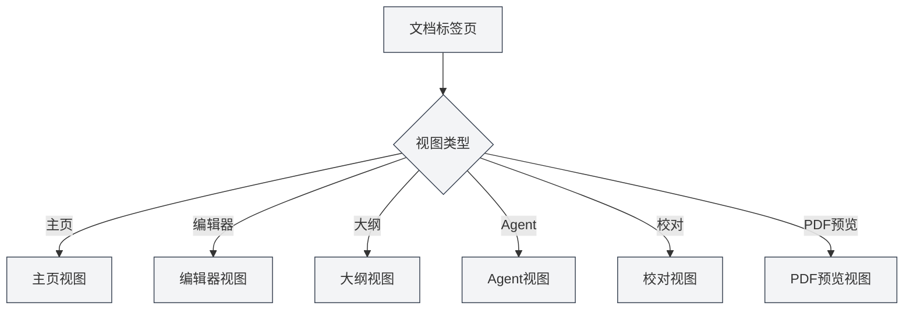

# 视图类型

## 概述

MetaDoc支持多种视图类型，每种视图提供不同的功能和界面。您可以根据需要切换不同的视图来完成各种任务。

## 视图类型介绍

### 主页视图

主页视图是MetaDoc的入口界面，提供快速开始和最近文档功能。

<QuickStartPanel mode="demo" />

**主要功能**：

- **快速开始**：选择文档格式，快速创建新文档
- **最近文档**：显示最近打开的文档列表
- **用户手册**：快速访问用户手册
- **用户资料**：访问用户资料设置

**使用场景**：

- 启动应用后的初始界面
- 需要快速创建新文档
- 查看最近使用的文档

您可以通过侧边栏切换不同的视图。

### 编辑器视图

编辑器视图是文档编辑的主要界面，支持Markdown、LaTeX和纯文本编辑。

<LaTeXEditor mode="demo" />

**主要功能**：

- **Markdown编辑**：使用Vditor编辑器编辑Markdown文档
- **LaTeX编辑**：使用Monaco编辑器编辑LaTeX文档
- **纯文本编辑**：使用Monaco编辑器编辑纯文本
- **实时预览**：Markdown编辑器支持实时预览

**使用场景**：

- 编辑文档内容
- 编写技术文档
- 创作学术论文

### 大纲视图

大纲视图显示文档的结构化大纲，方便查看和编辑文档结构。

<Outline mode="demo" />

**主要功能**：

- **大纲显示**：以树形结构显示文档标题
- **节点操作**：添加、编辑、删除、移动节点
- **拖拽排序**：拖拽节点调整顺序
- **AI功能**：生成子章节、生成内容、大纲优化

**使用场景**：

- 查看文档结构
- 快速导航到特定章节
- 编辑文档大纲
- 使用AI生成内容

### Agent视图

Agent视图提供Agent框架的交互界面，用于创建和管理Agent会话。

<AgentView mode="demo" />

**主要功能**：

- **会话管理**：创建、编辑、删除Agent会话
- **工具配置**：配置Agent使用的工具集
- **工作流**：创建和执行工作流
- **消息交互**：与Agent进行对话

**使用场景**：

- 使用Agent完成复杂任务
- 自动化文档处理
- 批量操作文档

### 校对视图

校对视图提供AI校对功能，检查文档中的错误并提供修改建议。

<ProofreadView mode="demo" />

**主要功能**：

- **错误检测**：检测拼写、语法、LaTeX语法错误
- **错误列表**：显示所有检测到的错误
- **错误修复**：单个修复或一键修复全部
- **词典管理**：添加单词到词典

**使用场景**：

- 检查文档错误
- 提高文档质量
- 修正拼写和语法错误

### PDF预览视图

PDF预览视图显示LaTeX文档编译后的PDF预览（仅LaTeX文档）。

<PdfPreviewPanel mode="demo" pdfUrl="" />

**主要功能**：

- **PDF显示**：显示编译后的PDF内容
- **缩放控制**：放大、缩小PDF
- **刷新PDF**：重新编译并刷新PDF
- **定位到代码**：从PDF位置定位到LaTeX代码

**使用场景**：

- 预览LaTeX文档效果
- 检查PDF格式
- 定位PDF中的问题

## 视图切换

### 切换方式

可以通过以下方式切换视图：

<MainTabs mode="demo" />

<ViewMenuItemsDemo mode="demo" :items='["editor", "outline", "agent"]' />

1. **视图菜单**：点击左侧的视图菜单按钮
2. **视图选择器**：在视图菜单中选择要切换的视图
3. **快捷键**：某些视图可能有快捷键（未来可能支持）

### 视图菜单

视图菜单显示在左侧边栏：

- **主页**：切换到主页视图
- **编辑器**：切换到编辑器视图
- **大纲**：切换到大纲视图
- **Agent**：切换到Agent视图
- **校对**：切换到校对视图
- **PDF预览**：切换到PDF预览视图（仅LaTeX文档）

### 视图状态

每个文档标签页都有独立的视图状态：

- **视图记忆**：切换视图后，视图状态会保存
- **下次打开**：下次打开文档时会恢复到上次的视图
- **多标签页**：不同标签页可以使用不同的视图

## 视图特性

### 视图独立性

每个视图都是独立的：

- **状态独立**：每个视图有独立的状态
- **数据同步**：视图间数据自动同步
- **切换快速**：视图切换非常快速，无需重新加载

### 视图组合

某些视图可以组合使用：

- **编辑器+大纲**：同时查看编辑器和大纲
- **编辑器+PDF预览**：LaTeX编辑器可以同时显示代码和PDF
- **编辑器+校对**：可以在编辑时进行校对

## 视图使用建议

### 编辑文档

- **编辑器视图**：主要使用编辑器视图进行编辑
- **大纲视图**：需要查看结构时切换到大纲视图
- **PDF预览**：LaTeX文档编辑时使用PDF预览查看效果

### 文档校对

- **校对视图**：专门用于文档校对
- **编辑器视图**：校对后回到编辑器视图继续编辑

### Agent任务

- **Agent视图**：创建和管理Agent会话
- **编辑器视图**：查看Agent处理后的文档

## 注意事项

1. **视图切换**：视图切换会保存当前状态
2. **PDF预览**：仅LaTeX文档支持PDF预览视图
3. **视图状态**：每个标签页的视图状态独立保存
4. **数据同步**：视图间数据会自动同步
5. **性能考虑**：某些视图可能占用较多资源

## 相关文档

- [[core.multi-tab|多标签页管理]]
- [[outline.basics|大纲视图功能]]
- [[agent.session|Agent会话管理]]
- [[ai.proofread|AI校对功能]]
- [[latex.pdf-preview|PDF预览功能]]
