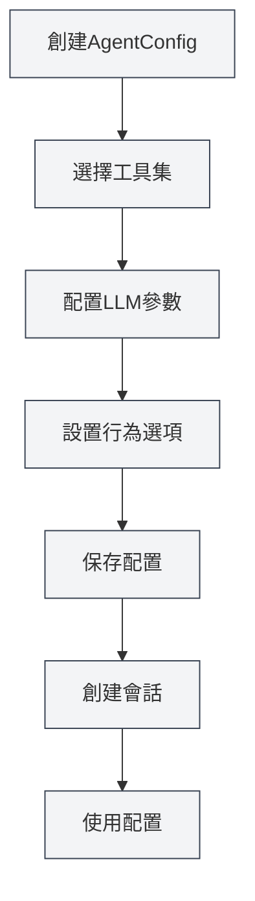

# Agent配置管理

## 概述

Agent配置（AgentConfig）是Agent框架的核心組件，用於定義Agent的身份和能力範圍。每個AgentConfig關聯一組工具集，決定Agent可以使用哪些工具，並可以配置LLM參數和行為選項。

AgentConfig透過工具集交集機制，靈活控制Agent的能力範圍，讓您可以為不同場景創建專門的Agent配置。

<AgentView mode="demo" />

## 核心概念

### AgentConfig結構

AgentConfig包含以下主要部分：

- **基本資訊**：ID、名稱、描述、版本號
- **工具集關聯**：關聯的工具集ID列表（取交集）
- **LLM配置**：模型、溫度、最大Token數、系統提示詞等
- **行為配置**：是否允許工具調用、最大調用次數等
- **場景類型**：outline、editor、analysis、visualization、custom

### 工具集交集

當AgentConfig關聯多個工具集時，可用的工具是所有工具集的交集：

- 工具集A包含：`[tool1, tool2, tool3]`
- 工具集B包含：`[tool2, tool3, tool4]`
- AgentConfig可用工具為：`[tool2, tool3]`

這種機制讓您可以精確控制Agent的能力範圍。

<AgentConfigManager mode="demo" />

## 創建AgentConfig

### 創建新配置

創建AgentConfig的步驟：

1. **開啟Agent管理**：在Agent視圖中點擊"管理" → "Agent配置"
2. **創建配置**：點擊"新建配置"按鈕
3. **填寫基本資訊**：
   - 名稱：配置的名稱（支援多語言）
   - 描述：配置的描述（支援多語言）
4. **選擇工具集**：從下拉清單中選擇一個或多個工具集
5. **配置LLM**（可選）：
   - 系統提示詞：自定義系統提示詞
   - 注入時間戳：是否在系統提示詞中注入當前時間
6. **設置行為**（可選）：
   - 最大工具調用次數：限制Agent的工具調用次數（null表示無限制）
7. **保存配置**：點擊"保存"按鈕

<AgentView mode="demo" />

您可以透過側邊欄訪問Agent視圖：

### 默認配置

系統提供一個默認的AgentConfig（`default-agent-config`），包含所有內建工具，不可刪除但可以複製。

## 編輯AgentConfig

### 編輯操作

編輯現有AgentConfig：

1. **開啟管理介面**：在Agent配置管理介面找到要編輯的配置
2. **點擊編輯**：點擊配置卡片上的"編輯"按鈕
3. **修改配置**：修改名稱、描述、工具集、LLM配置或行為配置
4. **保存更改**：點擊"保存"按鈕

**注意**：默認配置（`default-agent-config`）不允許編輯，但可以複製後編輯。

<AgentConfigManager mode="demo" />

## 刪除AgentConfig

### 刪除操作

刪除不需要的AgentConfig：

1. **開啟管理介面**：在Agent配置管理介面找到要刪除的配置
2. **點擊刪除**：點擊配置卡片上的"刪除"按鈕
3. **確認刪除**：在彈出的確認對話框中確認刪除

<AgentConfigManager mode="demo" />

**注意**：

- 默認配置（`default-agent-config`）不可刪除
- 刪除配置不會影響已創建的會話，但新會話將無法使用該配置
- 如果配置正在被會話使用，刪除前會提示

## 複製AgentConfig

### 複製操作

複製現有AgentConfig：

1. **開啟管理介面**：在Agent配置管理介面找到要複製的配置
2. **點擊複製**：點擊配置卡片上的"複製"按鈕
3. **編輯副本**：系統會創建一個副本，名稱自動添加"（副本）"後綴
4. **保存修改**：根據需要修改副本並保存

<AgentView mode="demo" />

複製配置會複製所有設置，包括工具集關聯、LLM配置和行為配置。

## 匯入/匯出AgentConfig

### 匯出配置

匯出AgentConfig為JSON檔案：

1. **開啟管理介面**：在Agent配置管理介面找到要匯出的配置
2. **點擊匯出**：點擊配置卡片上的"匯出"按鈕
3. **選擇位置**：選擇保存位置和檔案名
4. **保存檔案**：點擊保存匯出配置

匯出的JSON檔案包含配置的所有資訊，可以用於備份或分享。

<AgentConfigManager mode="demo" />

### 匯入配置

從JSON檔案匯入AgentConfig：

1. **開啟管理介面**：在Agent配置管理介面
2. **點擊匯入**：點擊"匯入配置"按鈕
3. **選擇檔案**：選擇要匯入的JSON檔案
4. **驗證數據**：系統驗證檔案格式和內容
5. **匯入配置**：匯入成功後創建新配置

匯入的配置會創建新的ID，不會覆蓋現有配置（除非使用覆蓋模式）。

## LLM配置

### 系統提示詞

AgentConfig可以配置自定義系統提示詞：

- **默認提示詞**：如果不設置，使用Agent框架的默認系統提示詞
- **自定義提示詞**：可以設置專門的系統提示詞，定義Agent的角色和行為
- **時間戳注入**：可以選擇是否在系統提示詞中注入當前時間

### LLM參數

AgentConfig可以覆蓋全域LLM配置：

- **模型**：指定使用的LLM模型
- **溫度**：控制輸出的隨機性（0-2）
- **最大Token數**：限制單次調用的最大Token數

**注意**：如果AgentConfig未設置LLM參數，將使用全域LLM配置。

<AgentConfigManager mode="demo" />

## 行為配置

### 工具調用控制

AgentConfig可以控制工具調用行為：

- **允許工具調用**：是否允許Agent調用工具（默認允許）
- **最大工具調用次數**：限制單次任務的最大工具調用次數（null表示無限制）
- **允許工作流調用**：是否允許Agent調用工作流（默認允許）

### 使用場景

不同的行為配置適用於不同場景：

- **純對話場景**：禁用工具調用，只進行對話
- **有限工具場景**：限制工具調用次數，避免過度調用
- **全功能場景**：允許所有工具調用，無限制

<AgentConfigManager mode="demo" />

## 場景類型

AgentConfig可以設置場景類型，用於分類和管理：

- **outline**：大綱場景，用於文件結構相關任務
- **editor**：編輯器場景，用於文件編輯任務
- **analysis**：分析場景，用於文件分析任務
- **visualization**：可視化場景，用於圖表生成任務
- **custom**：自定義場景

場景類型主要用於分類，不影響Agent的實際行為。

## 使用技巧

### 配置組織

1. **命名規範**：使用清晰的名稱，如"數據分析Agent"、"文件編輯Agent"
2. **場景分類**：使用場景類型進行分類管理
3. **工具集選擇**：根據任務需求選擇合適的工具集組合

<AgentConfigManager mode="demo" />

### 工具集交集

1. **精確控制**：使用多個工具集的交集，精確控制Agent的能力
2. **工具集設計**：設計專門的工具集，然後透過交集組合使用
3. **測試驗證**：創建配置後，測試工具集交集是否正確

<AgentConfigManager mode="demo" />

### LLM配置

1. **系統提示詞**：為不同場景編寫專門的系統提示詞
2. **參數調優**：根據任務特點調整溫度和最大Token數
3. **時間戳注入**：對於需要時間感知的任務，啟用時間戳注入

## 常見問題

### Q: 如何創建專門的Agent配置？

A: 創建新配置，選擇專門的工具集，設置自定義系統提示詞和行為配置。例如，創建"數據分析Agent"，關聯數據分析工具集，設置專門的系統提示詞。

### Q: 工具集交集是什麼意思？

A: 當AgentConfig關聯多個工具集時，可用的工具是所有工具集的交集。例如，工具集A包含`[tool1, tool2, tool3]`，工具集B包含`[tool2, tool3, tool4]`，則AgentConfig可用工具為`[tool2, tool3]`。

### Q: 可以修改默認配置嗎？

A: 默認配置（`default-agent-config`）不允許編輯，但可以複製後編輯。複製默認配置，然後修改副本。

### Q: LLM配置和全域配置的關係？

A: 如果AgentConfig設置了LLM參數，將使用AgentConfig的設置；否則使用全域LLM配置。AgentConfig的設置優先級更高。

### Q: 如何限制Agent的工具調用次數？

A: 在AgentConfig的行為配置中，設置"最大工具調用次數"。設置為具體數字（如10）限制調用次數，設置為null表示無限制。

### Q: 刪除配置會影響現有會話嗎？

A: 刪除配置不會影響已創建的會話，但新會話將無法使用該配置。如果配置正在被會話使用，刪除前會提示。

<AgentView mode="demo" />

## 相關文件

- [[agent.introduction|Agent框架概述]]
- [[agent.tools|工具集管理]]
- [[agent.session|Agent會話管理]]
- [[agent.engine|Agent引擎管理]]