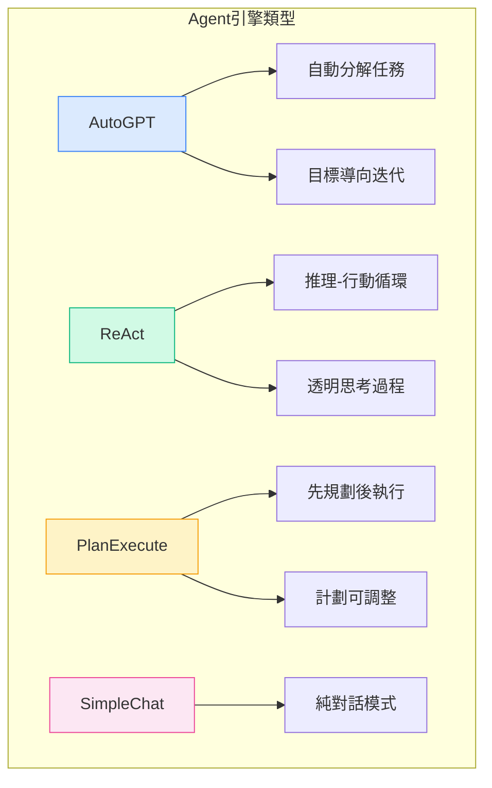
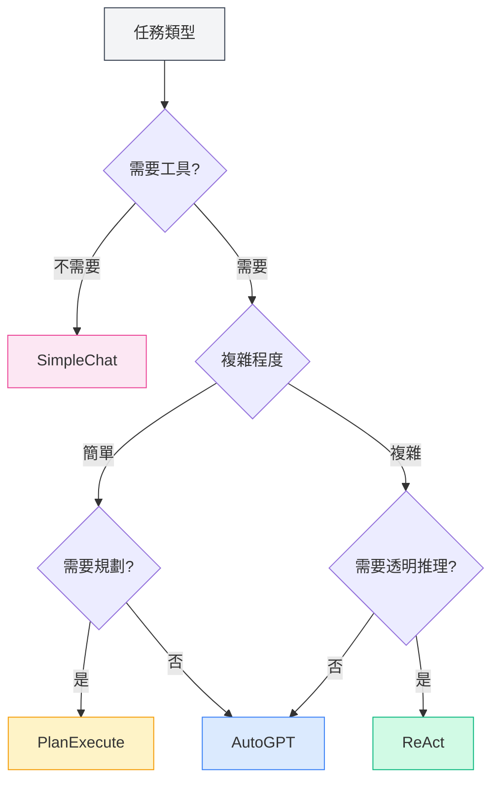
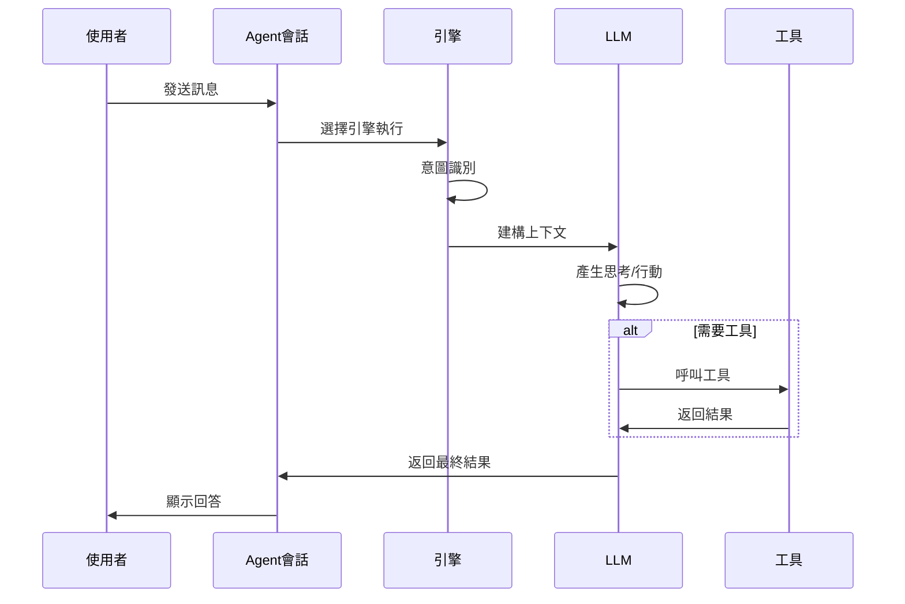

# Agent引擎管理

## 概述

Agent引擎定義了Agent的執行策略和行為方式。MetaDoc提供多種內建引擎，每種引擎採用不同的AI執行範式，適用於不同的任務場景。透過選擇合適的引擎，您可以讓Agent以最適合的方式完成特定任務。

<AgentView mode="demo" />

## 引擎類型

MetaDoc支援以下Agent引擎：

| 引擎名稱        | 特點                        | 適用場景           |
| --------------- | --------------------------- | ------------------ |
| **AutoGPT**     | 自動任務分解，目標導向迭代  | 複雜多步驟任務     |
| **ReAct**       | 推理-行動循環，思考過程透明 | 需要詳細推理的任務 |
| **PlanExecute** | 先規劃後執行，計劃可調整    | 結構化任務         |
| **SimpleChat**  | 純對話，不呼叫工具          | 簡單問答           |



## 引擎詳解

### AutoGPT引擎

**特點**：

- **自動任務分解**：將複雜任務自動分解為子任務
- **目標導向**：圍繞最終目標迭代執行
- **自主決策**：Agent自主決定下一步行動

<AgentView mode="demo" />
<AgentEngineManager mode="demo" />

**適用場景**：

- 研究和資訊收集
- 多步驟文件處理
- 開放式創作任務

**範例**：

```
使用者：幫我寫一篇關於人工智慧的綜述文章
Agent：[自動分解為：1.收集資料 2.整理大綱 3.撰寫內容 4.潤色修改]
```

### ReAct引擎

**特點**：

- **推理-行動循環**：顯式展示思考過程（Reasoning）和行動（Action）
- **可追溯**：每一步都有清晰的推理依據
- **透明可控**：使用者可以看到Agent的思考邏輯

<AgentView mode="demo" />
<AgentEngineManager mode="demo" />

**適用場景**：

- 需要解釋推理過程的任務
- 邏輯分析任務
- 教學演示場景

**範例**：

```
思考：使用者需要我解釋這個程式碼的功能
行動：呼叫程式碼分析工具
觀察：[工具返回結果]
思考：基於分析結果，我可以解釋...
```

### PlanExecute引擎

**特點**：

- **先規劃後執行**：首先制定完整計劃，然後按計劃執行
- **計劃可調整**：執行過程中可以修改計劃
- **結構化輸出**：輸出格式規範，易於理解

<AgentView mode="demo" />
<AgentEngineManager mode="demo" />

**適用場景**：

- 專案管理任務
- 結構化文件產生
- 流程化工作

**範例**：

```
計劃：
1. 分析需求
2. 設計方案
3. 實現功能
4. 測試驗證

執行：按步驟完成每個階段
```

### SimpleChat引擎

**特點**：

- **純對話模式**：僅進行對話，不呼叫任何工具
- **快速回應**：無需等待工具執行
- **簡單直接**：適合簡單問答

**適用場景**：

- 一般性問答
- 概念解釋
- 簡單對話

**注意**：此引擎不呼叫工具，因此無法執行檔案操作、資料分析等功能。

<AgentEngineManager mode="demo" />

## 選擇引擎

### 如何選擇合適的引擎

根據任務特點選擇引擎：



<AgentView mode="demo" />

### 選擇建議

| 任務場景 | 推薦引擎             |
| -------- | -------------------- |
| 日常問答 | SimpleChat           |
| 文件編輯 | AutoGPT 或 ReAct     |
| 資料分析 | ReAct 或 PlanExecute |
| 程式碼編寫 | ReAct                |
| 研究調研 | AutoGPT              |
| 專案管理 | PlanExecute          |

<AgentView mode="demo" />

## 配置引擎

### 在Agent配置中選擇引擎

1. 進入 [[agent.introduction|Agent框架概述]]
2. 建立或編輯一個Agent配置
3. 在"引擎"選項中選擇想要的引擎類型
4. 儲存配置

### 引擎參數設定

不同引擎可能有特定的參數設定：

**通用參數**：

- **最大迭代次數**：限制Agent的思考和行動輪數
- **逾時時間**：單次呼叫的最大等待時間
- **溫度**：控制輸出的創造性程度

**引擎特定參數**：

- **AutoGPT**：目標分解深度
- **ReAct**：思考過程顯示選項
- **PlanExecute**：計劃調整權限

## 引擎執行流程

### 通用執行流程



### 不同引擎的執行特點

**AutoGPT執行特點**：

1. 分析使用者目標
2. 自動分解為子任務
3. 逐個執行子任務
4. 彙總結果返回

**ReAct執行特點**：

1. 產生思考過程
2. 確定下一步行動
3. 執行行動（呼叫工具或產生回覆）
4. 觀察結果
5. 循環直到完成任務

**PlanExecute執行特點**：

1. 分析需求
2. 制定完整計劃
3. 按步驟執行
4. 返回結構化結果

## 自訂引擎

### 引擎配置自訂

對於進階使用者，可以自訂引擎行為：

1. **修改系統提示詞**：調整Agent的角色和行為
2. **設定工具偏好**：指定優先使用的工具
3. **調整推理參數**：溫度、最大Token數等

### 建立自訂引擎（進階）

開發者可以建立新的引擎類型：

1. 繼承基礎引擎介面
2. 實現特定的執行邏輯
3. 註冊到引擎管理器
4. 在配置中選擇使用

## 最佳實踐

### 引擎選擇原則

1. **從簡單開始**：不確定時先用SimpleChat測試
2. **根據複雜度選擇**：複雜任務用AutoGPT或ReAct
3. **考慮可解釋性**：需要解釋時用ReAct

### 最佳化引擎效果

1. **清晰描述需求**：引擎的效果很大程度上取決於輸入的清晰度
2. **合理使用工具**：為Agent配置合適的工具集
3. **設定合理限制**：透過最大迭代次數等參數控制成本
4. **及時回饋**：對Agent的回答給予回饋，幫助改進

## 常見問題

### Q: 為什麼Agent沒有按預期執行？

A: 可能原因：

- 引擎選擇不合適
- 工具集配置不足
- 任務描述不清晰
- 達到了最大迭代次數限制

### Q: 可以在對話中切換引擎嗎？

A: 目前不支援在單次對話中切換引擎。如需更換引擎，建議：

1. 結束目前會話
2. 建立新會話
3. 選擇使用不同引擎的Agent配置

### Q: 哪種引擎最適合初學者？

A: 建議：

- 先用SimpleChat熟悉對話功能
- 然後嘗試ReAct，觀察推理過程
- 熟練後再使用AutoGPT處理複雜任務

### Q: 引擎會影響回答品質嗎？

A: 會。不同引擎的思考方式和執行策略不同：

- 同樣的任務，不同引擎可能給出不同答案
- 選擇合適的引擎可以顯著提升效果
- 建議針對不同類型的任務配置不同的Agent

## 相關文件

- [[agent.introduction|Agent框架概述]]
- [[agent.introduction|Agent框架概述]]
- [[agent.session|Agent會話管理]]
- [[agent.tools|工具集管理]]
