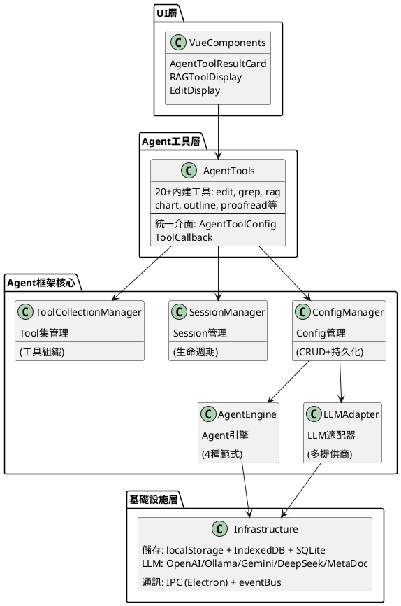
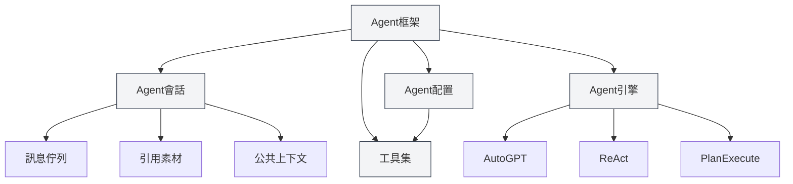
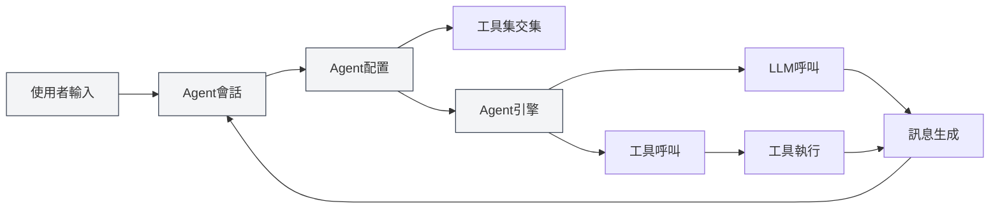
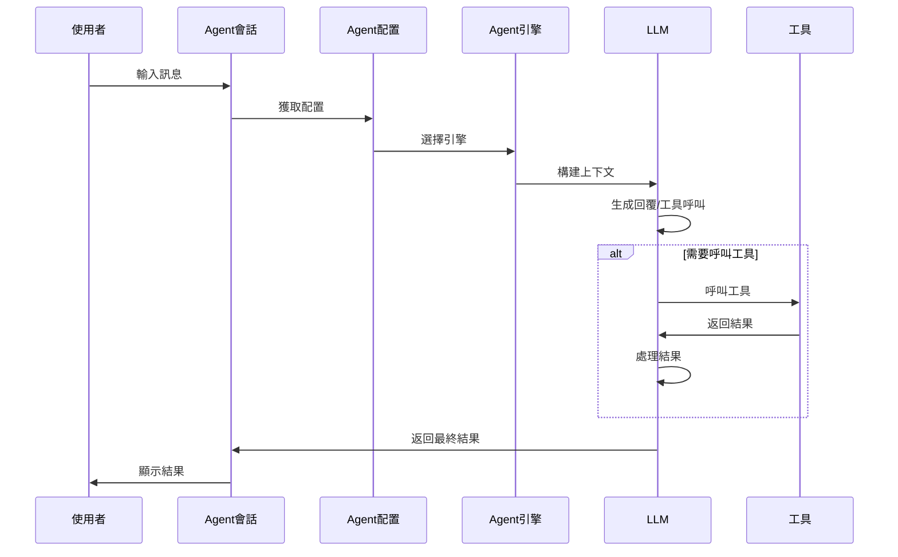

# Agent框架概述

## 概述

Agent框架是MetaDoc中用於構建和管理智能Agent系統的核心框架，採用**分層架構設計**。它提供了完整的Agent生命週期管理，包括會話管理、配置管理、工具集管理和引擎管理等功能。

Agent框架基於已有的Tool系統構建，透過Agent配置（AgentConfig）、工具集（ToolCollection）和Agent會話（AgentSession）等核心組件，實現了靈活、可擴展的Agent系統。

<AgentSessionManager mode="demo" />

## 介面預覽

Agent框架提供了直觀的介面來管理 Agent 會話和工具：

<AgentView mode="demo" />

## 技術架構

### 架構分層



### 核心檔案路徑

| 類別           | 檔案路徑                                                            | 說明                      |
| -------------- | ------------------------------------------------------------------- | ------------------------- |
| **類型定義**   | `src/renderer/src/types/agent-framework.ts`                         | Agent框架核心類型定義     |
| **類型定義**   | `src/renderer/src/types/agent-tool.ts`                              | Agent工具類型定義         |
| **配置管理**   | `src/renderer/src/utils/agent-framework/agent-config-manager.ts`    | AgentConfig的CRUD和持久化 |
| **會話管理**   | `src/renderer/src/utils/agent-framework/agent-session-manager.ts`   | AgentSession生命週期管理  |
| **工具集管理** | `src/renderer/src/utils/agent-framework/tool-collection-manager.ts` | 工具集的組織和管理        |
| **引擎管理**   | `src/renderer/src/utils/agent-framework/agent-engine-manager.ts`    | Agent引擎配置管理         |
| **引擎執行**   | `src/renderer/src/utils/agent-framework/agent-engine-executor.ts`   | 4種執行範式實現           |
| **工具執行**   | `src/renderer/src/utils/agent-framework/tool-runner.ts`             | 統一工具呼叫入口          |
| **LLM適配**    | `src/renderer/src/utils/agent-framework/llm-adapter.ts`             | 多LLM提供商適配           |



## 核心概念

### Agent會話（AgentSession）

<AgentView mode="demo" />

Agent會話是AgentConfig的實例，代表一個獨立的、有上下文的Agent執行環境。基於 `agent-session-manager.ts` 實現，每個會話維護自己的訊息歷史、引用素材、公共上下文空間，並支援訊息佇列、重試、Duplicate等高階功能。

**類型定義**（`types/agent-framework.ts` 第387-424行）：

```typescript
export interface AgentSession {
  entityType: 'agent-session'
  id: string
  title: string
  agentConfigId: string // 關聯的AgentConfig
  messages: AgentMessage[] // 訊息歷史
  messageQueue: QueuedMessage[] // 訊息佇列
  referenceStore: Reference[] // 引用素材
  publicContext: PublicContext // 公共上下文
  executionNodes: ExecutionNode[] // 執行節點（用於重試）
  status: AgentSessionStatus // 會話狀態
}
```

**會話狀態機**：

```
idle → thinking → generating → tool-calling → waiting-input → error
```

詳見[[agent.session|Agent會話管理]]。

### Agent配置（AgentConfig）

<CompletionSettingsPanel mode="demo" />

AgentConfig定義了Agent的身份和能力範圍，基於 `agent-config-manager.ts` 實現。

**類型定義**（`types/agent-framework.ts` 第242-289行）：

```typescript
export interface AgentConfig {
  entityType: 'agent-config'
  id: string
  name: LocalizedText // 支援i18n的名稱
  description: LocalizedText // 支援i18n的描述
  toolCollectionIds: string[] // 關聯的工具集ID（取交集）
  maxToolCalls?: number | null // 最大工具呼叫次數
  llmConfig?: {
    model?: string
    temperature?: number
    systemPrompt?: string // 系統提示詞
    injectTimestamp?: boolean
  }
  behavior?: {
    allowToolCalls?: boolean
  }
  scenario?: 'outline' | 'editor' | 'analysis' | 'visualization' | 'custom'
}
```

**核心功能**：

- **預設配置**：`default-agent-config`（內建，不可刪除）
- **工具集交集**：關聯多個工具集時，可用工具是所有工具集的交集
- **LLM參數覆蓋**：可以覆蓋全域LLM配置
- **持久化**：儲存於 `localStorage`，鍵為 `'agent-configs'`

詳見[[agent.config|Agent配置管理]]。

### 工具集（ToolCollection）

<DataAnalysisDisplay mode="demo" />

工具集是一組Agent工具的集合，用於組織和管理Agent可用的工具。AgentConfig可以關聯多個工具集，可用工具取所有工具集的交集。

詳見[[agent.tools|工具集管理]]。

### 引用素材（Reference）

<RAGToolDisplay mode="demo" />

引用素材是Agent會話中引用的文件和檔案，Agent可以感知這些內容並基於它們進行推理和操作。支援檔案、URL、知識庫等多種類型的引用。

詳見[[agent.references|引用素材管理]]。

### Agent引擎（AgentEngine）

<DiffDisplay mode="demo" />

Agent引擎定義了Agent的執行策略和行為方式，包括AutoGPT、ReAct、PlanExecute等多種範式。不同的引擎適用於不同的任務場景。

詳見[[agent.engine|Agent引擎管理]]。

## 系統架構

Agent框架的系統架構如下：



## 執行流程

Agent的基本執行流程：

1. **使用者輸入**：使用者在Agent會話中輸入訊息
2. **意圖識別**：系統識別使用者意圖，更新可用工具說明
3. **引擎選擇**：根據Agent配置選擇執行引擎
4. **上下文構建**：構建包含歷史訊息、引用素材、工具說明的上下文
5. **LLM呼叫**：呼叫LLM生成回覆或工具呼叫
6. **工具執行**：如果LLM決定呼叫工具，執行相應的工具
7. **結果處理**：將工具執行結果作為觀察（Observation）返回給LLM
8. **迭代循環**：根據引擎類型，可能進行多輪迭代直到完成任務
9. **結果輸出**：將最終結果展示給使用者



## 功能特性

### 核心功能

- **會話管理**：建立、刪除、複製、匯出/匯入會話
- **配置管理**：靈活的Agent配置，支援多工具集交集
- **工具集管理**：組織和管理Agent工具
- **引用素材管理**：管理會話中的引用文件和檔案
- **引擎管理**：支援多種執行範式，可自訂引擎

### 高階功能

- **訊息佇列**：在Agent執行過程中插入訊息
- **重試機制**：支援重試失敗的執行節點
- **Duplicate功能**：複製會話或執行節點
- **公共上下文**：會話層級的共享上下文空間
- **執行節點追蹤**：記錄每個執行節點的狀態和結果

## 使用場景

Agent框架適用於以下場景：

- **文件編輯**：使用Agent工具進行文件編輯和優化
- **資料分析**：使用資料分析工具進行資料處理和視覺化
- **內容生成**：使用Agent引擎與工具集生成結構化內容
- **知識檢索**：結合知識庫進行智慧檢索和分析
- **自動化任務**：透過 Agent 與工具集實現多步驟任務

## 快速開始

要開始使用Agent框架，建議按以下順序學習：

1. [[agent.introduction|Agent框架概述]]（本文檔）
2. [[agent.config|Agent配置管理]]：了解如何配置Agent
3. [[agent.tools|工具集管理]]：學習如何管理工具集
4. [[agent.session|Agent會話管理]]：建立和管理會話
5. [[agent.references|引用素材管理]]：管理引用素材
6. [[agent.engine|Agent引擎管理]]：選擇和配置引擎

## 常見問題

### Q: Agent框架和AI對話有什麼區別？

A: AI對話是簡單的對話功能，而Agent框架提供了完整的Agent系統，包括工具呼叫、引用素材管理等高階功能。Agent框架可以執行複雜的任務，而不僅僅是對話。

### Q: 如何選擇合適的Agent引擎？

A:

- **AutoGPT引擎**：適合大多數智慧任務，自主決策能力強
- **ReAct引擎**：適合需要詳細推理步驟的任務，顯式思考過程
- **PlanExecute引擎**：適合需要結構化執行的任務，先規劃再執行
- **SimpleChat引擎**：適合純對話任務，不呼叫工具

### Q: 工具集交集是什麼意思？

A: 當AgentConfig關聯多個工具集時，可用的工具是所有工具集的交集。例如，工具集A包含`[tool1, tool2, tool3]`，工具集B包含`[tool2, tool3, tool4]`，則AgentConfig可用工具為`[tool2, tool3]`。

## 相關文件

- [[agent.session|Agent會話管理]]
- [[agent.config|Agent配置管理]]
- [[agent.tools|工具集管理]]
- [[agent.references|引用素材管理]]
- [[agent.engine|Agent引擎管理]]
- [[ai.llm-config|LLM配置]]

<QuickStartPanel mode="demo" />