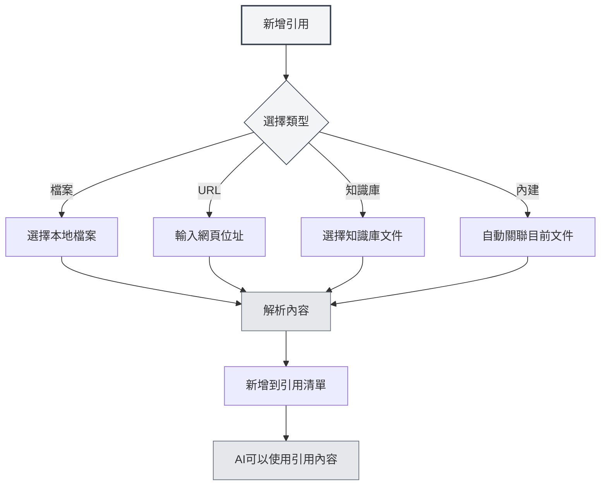

# 引用素材管理

## 概述

引用素材是Agent會話中的重要功能，允許您將外部文件、網頁、檔案等內容引入對話中。Agent可以基於這些引用素材進行推理和回答，讓AI的回答更加準確和相關。

透過引用素材，您可以：

- 讓AI參考特定的文件內容
- 基於網頁資訊進行討論
- 分析本地檔案的內容
- 結合知識庫進行深度問答

## 開啟引用管理

在Agent會話介面中，點擊"引用"標籤即可開啟引用素材管理面板。

引用面板顯示目前會話中所有已新增的引用素材，包括：

- 檔案名稱或URL
- 引用類型（檔案/URL/知識庫/內建文件）
- 啟用狀態
- 內容預覽

您可以透過側邊欄存取Agent檢視：

<ReferenceManager mode="demo" />
<ReferenceDisplay mode="demo" />

## 新增引用

### 新增檔案引用

將本地檔案新增為引用素材：

1.  在引用面板點擊"新增引用"按鈕
2.  選擇"檔案"類型
3.  在檔案選擇器中選擇要引用的檔案
4.  確認新增

**支援的檔案格式**：

- Markdown文件（.md）
- LaTeX文件（.tex）
- PDF檔案（.pdf）
- Word文件（.docx）
- 純文字檔案（.txt）
- 圖片檔案（.png, .jpg）

<ReferenceManager mode="demo" />

### 新增URL引用

引用網頁內容：

1.  在引用面板點擊"新增引用"按鈕
2.  選擇"URL"類型
3.  輸入要引用的網頁位址
4.  點擊確認

MetaDoc會自動抓取網頁內容並新增到引用中。

<ReferenceManager mode="demo" />
<ReferenceDisplay mode="demo" />

### 新增知識庫引用

引用知識庫中的文件：

1.  在引用面板點擊"新增引用"按鈕
2.  選擇"知識庫"類型
3.  從知識庫清單中選擇要引用的文件
4.  確認新增

<ReferenceDisplay mode="demo" />

### 內建文件引用

每個Agent會話預設啟用"內建文件引用"（0號引用），它會動態取得目前開啟的文件內容作為引用素材。



## 管理引用

### 啟用/停用引用

每個引用素材都可以獨立控制啟用狀態：

-   **啟用**：引用的內容會參與AI的推理過程
-   **停用**：引用的內容暫時不參與推理，但保留在清單中

點擊引用素材旁的開關即可切換啟用狀態。

<ReferenceDisplay mode="demo" />

### 預覽引用內容

點擊引用素材可以預覽其內容：

-   **檔案引用**：顯示檔案內容的文字預覽
-   **URL引用**：顯示抓取的網頁內容
-   **知識庫引用**：顯示知識庫中的相關片段
-   **內建引用**：顯示目前文件的內容

### 刪除引用

從引用清單中移除不再需要的引用：

1.  在引用面板中找到要刪除的引用
2.  點擊刪除按鈕（×圖示）
3.  確認刪除

**注意**：刪除引用只會移除引用關係，不會影響原始檔案。

<ReferenceManager mode="demo" />

## 引用在對話中的作用

### 引用感知

當您啟動引用後，Agent在回覆時會：

1.  **分析引用內容**：理解引用的文件、網頁或檔案內容
2.  **結合上下文**：將引用內容與對話歷史結合
3.  **產生回答**：基於引用內容產生更準確的回答

### 使用範例

**場景1：基於文件問答**

```
使用者：[新增了一篇技術文件作為引用]
使用者提問：這篇文件中提到的最佳實踐是什麼？
AI：根據您引用的文件，最佳實踐包括...
```

**場景2：多文件對比**

```
使用者：[新增了兩篇論文作為引用]
使用者提問：比較這兩篇論文的研究方法
AI：第一篇論文使用了...而第二篇論文採用了...
```

**場景3：網頁內容分析**

```
使用者：[新增了一個新聞網頁作為引用]
使用者提問：總結這篇報導的主要內容
AI：根據網頁內容，主要報導了...
```

## 最佳實踐

### 高效使用引用

1.  **選擇相關素材**：只新增與目前話題相關的引用，避免資訊過載
2.  **控制引用數量**：建議同時啟動的引用不超過5個，以保證處理效率
3.  **及時清理**：對話結束後，刪除不再需要的引用，保持清單整潔

### 引用策略

1.  **文件分析**：分析長文件時，新增文件引用並詢問具體問題
2.  **知識檢索**：使用知識庫引用進行基於知識庫的問答
3.  **即時資訊**：透過URL引用取得最新的網頁資訊
4.  **上下文延續**：利用內建引用讓AI理解目前編輯的文件

## 使用技巧

### 快速新增

-   **拖曳新增**：將檔案直接拖曳到引用面板
-   **右鍵新增**：在檔案或網頁上右鍵選擇"新增到引用"
-   **快速鍵**：使用快速鍵快速開啟引用面板

<ReferenceManager mode="demo" />

### 引用組合

可以同時新增多個不同類型的引用：

-   一份PDF文件 + 一個網頁連結
-   多篇知識庫文件
-   本地檔案 + 內建文件引用

AI會綜合分析所有啟動的引用內容。

<ReferenceDisplay mode="demo" />

### 暫時停用

如果不確定某個引用是否有用，可以先停用它：

1.  觀察AI不帶該引用的回答
2.  再啟動引用，對比回答差異
3.  根據效果決定是否保留

## 常見問題

### Q: 引用內容有大小限制嗎？

A: 有。過大的檔案可能會被截斷處理。建議：

-   超大文件分章節新增
-   使用知識庫處理大量文件
-   長文件可以先擷取關鍵部分

### Q: 為什麼新增了引用但AI似乎沒有使用？

A: 可能原因：

-   引用未啟用（檢查開關狀態）
-   引用內容與問題無關
-   引用解析失敗（檢查檔案格式）

### Q: URL引用失敗怎麼辦？

A: 可能原因：

-   網頁需要登入存取
-   網頁有反爬蟲機制
-   網路連線問題
    建議：將網頁內容儲存為檔案後新增檔案引用

### Q: 引用會佔用儲存空間嗎？

A: 引用本身只是連結，不佔用額外空間。但引用的解析結果會快取在本地。

## 相關文件

-   [[agent.session|Agent會話管理]]
-   [[agent.config|Agent配置管理]]
-   [[knowledge-base.usage|知識庫使用]]
-   [[agent.introduction|Agent框架概述]]