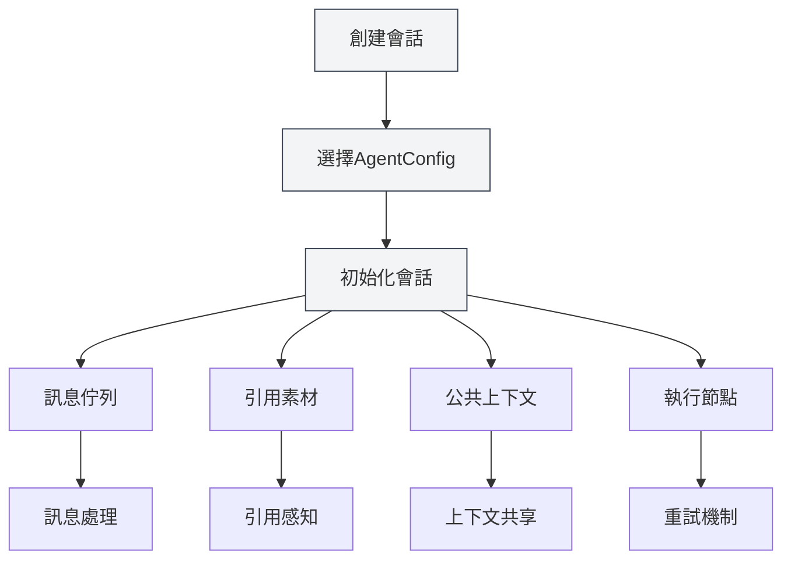
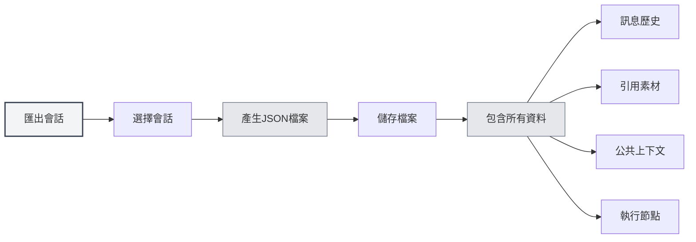
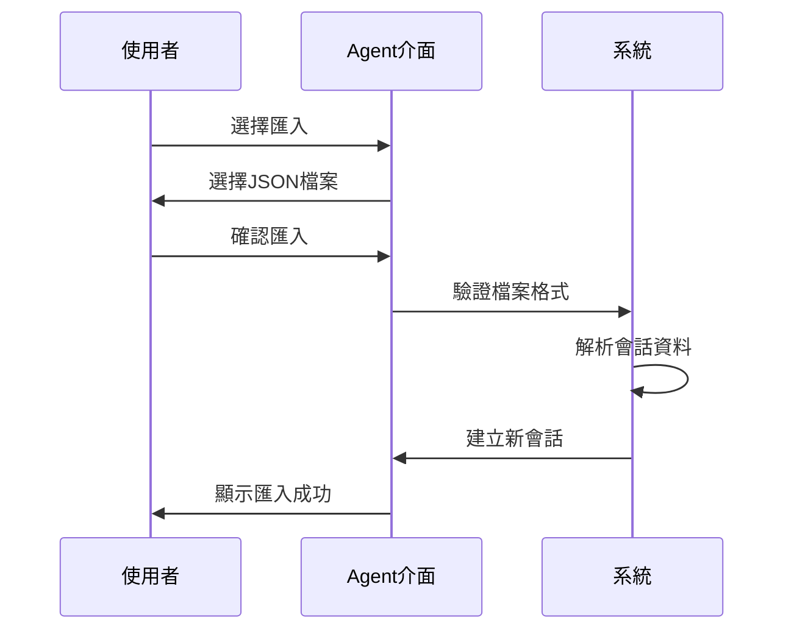
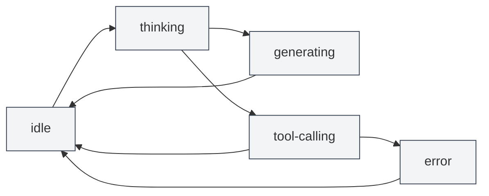

# Agent會話管理

## 概述

Agent會話是Agent框架的核心組件，代表一個獨立的、有上下文的Agent執行環境。每個會話維護自己的訊息歷史、引用素材、公共上下文空間，並支援訊息佇列、重試、複製等進階功能。

<AgentView mode="demo" />

Agent會話基於AgentConfig創建，繼承了AgentConfig的工具集和能力範圍，但每個會話都有獨立的執行狀態和歷史記錄。

## 創建會話

### 創建新會話

創建Agent會話的步驟：

<AgentView mode="demo" />

1.  **開啟Agent視圖**：點擊選單列的"AI" → "Agent"開啟Agent視圖
2.  **選擇AgentConfig**：在會話列表上方選擇要使用的AgentConfig
3.  **創建會話**：點擊"新建會話"按鈕
4.  **輸入標題**：可選輸入會話標題（預設使用第一條訊息作為標題）
5.  **開始對話**：輸入第一條訊息開始與Agent互動

### 會話初始化

創建會話時，系統會自動：

<AgentSessionManager mode="demo" />

-   **創建會話ID**：產生唯一的會話識別碼
-   **關聯AgentConfig**：綁定到指定的AgentConfig
-   **初始化訊息佇列**：建立空的訊息佇列
-   **初始化引用素材**：建立空的引用素材儲存
-   **初始化公共上下文**：建立公共上下文空間，包含目前時間等資訊
-   **建立問候語**：自動加入Agent的問候語訊息
-   **啟用內建引用**：預設啟用內建0號reference（動態取得目前文件內容）

## 重新命名會話

### 重新命名操作

重新命名現有會話：

<AgentView mode="demo" />

1.  **右鍵選單**：右鍵點擊會話，選擇"重新命名"
2.  **輸入新名稱**：在彈出的對話方塊中輸入新的會話名稱
3.  **確認儲存**：點擊確認儲存新名稱

會話名稱用於識別和區分不同的會話，建議使用描述性的名稱。

## 刪除會話

### 刪除操作

刪除不需要的會話：

<AgentSessionManager mode="demo" />

1.  **右鍵選單**：右鍵點擊會話，選擇"刪除"
2.  **確認刪除**：在彈出的確認對話方塊中確認刪除

**注意**：刪除會話會同時刪除該會話的所有訊息歷史、引用素材和執行節點，此操作不可恢復。

### 批次刪除

目前不支援批次刪除，需要逐個刪除會話。

## 複製會話

### 複製操作

複製現有會話：

<AgentView mode="demo" />

1.  **右鍵選單**：右鍵點擊會話，選擇"複製"
2.  **建立副本**：系統會建立一個新的會話副本

複製會話會複製：

-   **訊息歷史**：所有訊息記錄
-   **引用素材**：所有引用素材
-   **公共上下文**：公共上下文空間的內容
-   **執行節點**：所有執行節點記錄

複製後的會話是獨立的，修改不會影響原會話。

### 使用場景

複製會話適用於：

-   **分支討論**：基於現有對話繼續討論不同的主題
-   **實驗測試**：測試不同的Agent配置或工具集
-   **備份儲存**：儲存重要的會話狀態

## 匯出/匯入會話

### 匯出會話

<AgentView mode="demo" />

匯出會話為JSON檔案：

<AgentView mode="demo" />

1.  **右鍵選單**：右鍵點擊會話，選擇"匯出"
2.  **選擇位置**：選擇儲存位置和檔案名稱
3.  **儲存檔案**：點擊儲存匯出會話

匯出的JSON檔案包含：

-   會話基本資訊（ID、標題、描述等）
-   訊息歷史
-   引用素材
-   公共上下文
-   執行節點

### 匯入會話

<AgentSessionManager mode="demo" />

從JSON檔案匯入會話：

1.  **開啟匯入**：在Agent視圖中找到匯入功能
2.  **選擇檔案**：選擇要匯入的JSON檔案
3.  **驗證資料**：系統驗證檔案格式和內容
4.  **匯入會話**：匯入成功後建立新會話

匯入的會話會建立新的會話ID，不會覆蓋現有會話。

## 重試會話

### 重試功能

重試會話允許您重新執行失敗的Agent任務：

1.  **檢視執行節點**：在會話中檢視執行節點列表
2.  **選擇節點**：選擇要重試的執行節點
3.  **重試執行**：點擊"重試"按鈕重新執行

重試會從選定的執行節點開始重新執行，保留之前的訊息歷史。

### 執行節點

執行節點記錄Agent執行過程中的每個步驟：

-   **訊息節點**：使用者訊息或AI回覆
-   **工具呼叫節點**：工具呼叫和執行結果
-   **工作流程呼叫節點**：工作流程執行過程
-   **LLM呼叫節點**：LLM呼叫和回應

每個節點都有狀態（pending、running、succeeded、failed、cancelled）和結果。

## 會話訊息管理

### 訊息操作

對會話訊息可以進行以下操作：

-   **編輯訊息**：編輯使用者訊息，重新傳送
-   **重新產生**：重新產生AI回覆
-   **複製訊息**：複製訊息內容
-   **刪除訊息**：刪除訊息（會刪除該訊息之後的所有訊息）

### 訊息佇列

<AgentView mode="demo" />

訊息佇列允許在Agent執行過程中插入訊息：

1.  **插入時機**：當Agent正在產生回覆或呼叫工具時，訊息會暫存到佇列
2.  **處理時機**：目前任務執行完成後，在執行下一步之前，會先處理佇列中的訊息
3.  **標註資訊**：佇列訊息會標註插入時間點和插入時的訊息ID，幫助Agent理解上下文

訊息佇列功能讓您可以在Agent執行過程中提供額外的資訊或指令。

## 引用素材管理

### 新增引用

<ReferenceManager mode="demo" />

為會話新增引用素材：

1.  **開啟引用管理**：點擊會話中的"引用"標籤
2.  **新增引用**：點擊"新增引用"按鈕
3.  **選擇類型**：選擇引用類型（檔案、URL、文字等）
4.  **選擇內容**：選擇要引用的內容

詳見[[agent.references|引用素材管理]]。

### 引用類型

支援以下引用類型：

-   **檔案引用**：引用本機檔案（Markdown、LaTeX、PDF、Word、圖片等）
-   **URL引用**：引用網頁URL
-   **文字引用**：引用自訂文字內容
-   **知識庫引用**：引用知識庫中的內容
-   **內建引用**：動態取得目前文件內容（預設啟用）

### 啟用引用

<ReferenceManager mode="demo" />

引用素材可以啟用或停用：

-   **啟用引用**：啟用的引用會在Agent執行時使用
-   **停用引用**：停用的引用不會影響Agent執行

Agent可以感知引用素材的內容，並基於它們進行推理和操作。

## 公共上下文

### 上下文空間

公共上下文是會話層級的共享上下文空間，包含：

<AgentView mode="demo" />

-   **目前時間**：自動更新的時間戳記
-   **文件資訊**：目前開啟的文件資訊（如果啟用）
-   **自訂資料**：使用者自訂的上下文資料

### 使用場景

公共上下文適用於：

-   **時間感知**：讓Agent知道目前時間
-   **文件感知**：讓Agent知道目前開啟的文件
-   **狀態共享**：在工作流程中共享狀態資訊

## 會話狀態

<AgentSessionManager mode="demo" />

### 狀態類型

會話有以下狀態：

-   **idle**：閒置狀態，等待使用者輸入
-   **thinking**：Agent正在思考
-   **generating**：Agent正在產生回覆
-   **tool-calling**：Agent正在呼叫工具
-   **waiting-input**：等待使用者輸入
-   **error**：發生錯誤

### 狀態轉換

## 使用技巧

<AgentView mode="demo" />

### 會話組織

1.  **分類管理**：為不同主題建立不同會話
2.  **命名規範**：使用清晰的會話名稱
3.  **定期清理**：定期刪除不需要的會話

### 訊息管理

1.  **編輯訊息**：如果AI回覆不理想，可以編輯使用者訊息重新傳送
2.  **使用引用**：新增引用素材提供更多上下文
3.  **訊息佇列**：在Agent執行過程中使用訊息佇列插入額外資訊

### 重試機制

1.  **檢視節點**：檢視執行節點了解Agent的執行過程
2.  **選擇重試**：選擇失敗的節點進行重試
3.  **調整配置**：如果頻繁失敗，考慮調整AgentConfig或工具集

## 常見問題

<AgentView mode="demo" />

### Q: 如何建立新會話？

A: 在Agent視圖中選擇AgentConfig，然後點擊"新建會話"按鈕。建立會話後輸入第一條訊息開始對話。

### Q: 會話訊息歷史會儲存嗎？

A: 是的，會話訊息歷史會自動儲存到文件的metadata中。重新開啟文件時會恢復所有會話。

### Q: 如何刪除會話？

A: 右鍵點擊會話，選擇"刪除"，然後在確認對話方塊中確認刪除。刪除操作不可恢復。

### Q: 複製會話會複製什麼？

A: 複製會話會複製訊息歷史、引用素材、公共上下文和執行節點。複製後的會話是獨立的。

### Q: 如何匯出會話？

A: 右鍵點擊會話，選擇"匯出"，然後選擇儲存位置。匯出的JSON檔案包含會話的所有資訊。

### Q: 訊息佇列是什麼？

A: 訊息佇列允許在Agent執行過程中插入訊息。目前任務執行完成後會處理佇列中的訊息。

### Q: 如何重試失敗的執行？

A: 在會話中檢視執行節點列表，選擇失敗的節點，然後點擊"重試"按鈕。

### Q: 引用素材如何影響Agent？

A: Agent可以感知引用素材的內容，並基於它們進行推理和操作。啟用的引用會在Agent執行時使用。

## 相關文件

-   [[agent.introduction|Agent框架概述]]
-   [[agent.config|Agent配置管理]]
-   [[agent.references|引用素材管理]]
-   [[agent.engine|Agent引擎管理]]