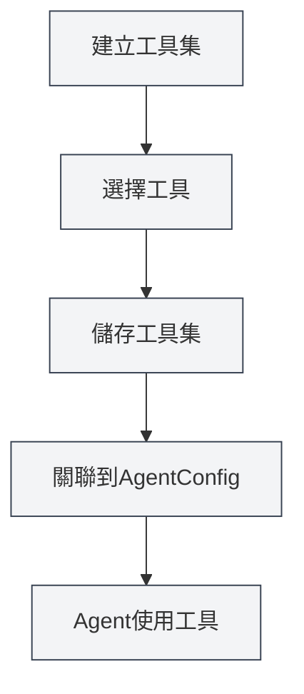

# 工具集管理

## 概述

工具集（ToolCollection）是Agent框架中用於組織和管理Agent工具的集合。工具集將相關的工具組織在一起，方便管理和複用。AgentConfig通過關聯工具集來確定Agent可以使用哪些工具。

工具集支援工具的動態添加和移除，可以建立專門用途的工具集，也可以組合多個工具集使用。

## 核心概念

### 工具集結構

<AgentView mode="demo" />

工具集包含以下主要部分：

- **基本資訊**：ID、名稱、描述、版本號
- **工具列表**：包含的工具ID列表（包括內部 tool、外部 tool）
- **啟用狀態**：是否啟用該工具集
- **標籤**：用於分類和搜尋的標籤
- **內建標識**：是否為內建工具集（不可刪除）

### 工具類型

<GrepDisplay mode="demo" />

工具集可以包含以下類型的工具：

- **內部工具**：MetaDoc內建的Agent工具（如edit-tool、proofread-tool等）
- **外部工具**：使用者自訂的外部工具

### 預設工具集

系統提供一個預設工具集（`default-tool-set`），包含所有內建Agent工具，不可刪除但可以複製。

## 建立工具集

<AgentView mode="demo" />

### 建立新工具集

建立工具集的步驟：

1. **開啟工具集管理**：在Agent檢視中點擊"管理" → "工具集"
2. **建立工具集**：點擊"新建工具集"按鈕
3. **填寫基本資訊**：
   - 名稱：工具集的名稱（支援多語言）
   - 描述：工具集的描述（支援多語言）
4. **選擇工具**：從下拉清單中選擇一個或多個工具
   - 可以搜尋工具名稱
   - 支援多選
   - 顯示工具的類型和描述
5. **儲存工具集**：點擊"儲存"按鈕

您可以透過側邊欄存取Agent檢視：

### Agent工具集介面

下圖展示了工具集管理介面的主要功能：

<AgentView mode="demo" />

### 工具選擇

選擇工具時，系統會顯示：

- **工具名稱**：工具的顯示名稱
- **工具ID**：工具的唯一識別碼
- **工具類型**：內部工具、外部工具或工作流程工具
- **工具描述**：工具的簡要描述

<DialogDemo mode="demo" dialogType="tool-select" />

## 編輯工具集

<AgentView mode="demo" />

### 編輯操作

編輯現有工具集：

1. **開啟管理介面**：在工具集管理介面找到要編輯的工具集
2. **點擊編輯**：點擊工具集卡片上的"編輯"按鈕
3. **修改資訊**：修改名稱、描述或工具列表
4. **儲存變更**：點擊"儲存"按鈕

**注意**：預設工具集（`default-tool-set`）不允許編輯，但可以複製後編輯。

### 添加工具

向工具集添加工具：

1. **開啟編輯介面**：編輯工具集
2. **選擇工具**：在工具下拉清單中選擇要添加的工具
3. **儲存變更**：點擊"儲存"按鈕

### 移除工具

從工具集移除工具：

1. **開啟編輯介面**：編輯工具集
2. **取消選擇**：在工具清單中取消選擇要移除的工具
3. **儲存變更**：點擊"儲存"按鈕

## 刪除工具集

<AgentView mode="demo" />

### 刪除操作

刪除不需要的工具集：

1. **開啟管理介面**：在工具集管理介面找到要刪除的工具集
2. **點擊刪除**：點擊工具集卡片上的"刪除"按鈕
3. **確認刪除**：在彈出的確認對話方塊中確認刪除

**注意**：

- 預設工具集（`default-tool-set`）不可刪除
- 刪除工具集不會影響已建立的AgentConfig，但關聯該工具集的AgentConfig將無法使用該工具集
- 如果工具集正在被AgentConfig使用，刪除前會提示

## 複製工具集

### 複製操作

<OutlineTreeDisplay mode="demo" />

複製現有工具集：

1. **開啟管理介面**：在工具集管理介面找到要複製的工具集
2. **點擊複製**：點擊工具集卡片上的"複製"按鈕
3. **編輯副本**：系統會建立一個副本，名稱自動添加"（副本）"後綴
4. **儲存修改**：根據需要修改副本並儲存

複製工具集會複製所有工具，包括工具清單和配置。

## 匯入/匯出工具集

### 匯出工具集

匯出工具集為JSON檔案：

1. **開啟管理介面**：在工具集管理介面找到要匯出的工具集
2. **點擊匯出**：點擊工具集卡片上的"匯出"按鈕
3. **選擇位置**：選擇儲存位置和檔案名
4. **儲存檔案**：點擊儲存匯出工具集

<DialogDemo mode="demo" dialogType="export-config" />

匯出的JSON檔案包含工具集的所有資訊，可以用於備份或分享。

### 匯入工具集

<DataAnalysisDisplay mode="demo" />

從JSON檔案匯入工具集：

1. **開啟管理介面**：在工具集管理介面
2. **點擊匯入**：點擊"匯入工具集"按鈕
3. **選擇檔案**：選擇要匯入的JSON檔案
4. **驗證資料**：系統驗證檔案格式和內容
5. **匯入工具集**：匯入成功後建立新工具集

<DialogDemo mode="demo" dialogType="import-config" />

匯入的工具集會建立新的ID，不會覆蓋現有工具集（除非使用覆蓋模式）。

## 工具集與AgentConfig

### 關聯工具集

AgentConfig通過關聯工具集來確定可用工具：

1. **建立AgentConfig**：建立新的AgentConfig
2. **選擇工具集**：在AgentConfig中選擇一個或多個工具集
3. **工具交集**：如果選擇多個工具集，可用工具是所有工具集的交集

### 工具集交集

<DiffDisplay mode="demo" />

當AgentConfig關聯多個工具集時：

- 工具集A包含：`[tool1, tool2, tool3]`
- 工具集B包含：`[tool2, tool3, tool4]`
- AgentConfig可用工具為：`[tool2, tool3]`（交集）

這種機制讓您可以精確控制Agent的能力範圍。

## 使用技巧

### 工具集組織

1. **按功能分類**：建立按功能分類的工具集，如"文件編輯工具集"、"資料分析工具集"
2. **按場景分類**：建立按場景分類的工具集，如"學術寫作工具集"、"程式碼分析工具集"
3. **命名規範**：使用清晰的名稱，便於識別和管理

### 工具集設計

1. **單一職責**：每個工具集專注於特定功能或場景
2. **工具組合**：合理組合相關工具，避免工具集過大
3. **複用性**：設計可複用的工具集，便於在不同AgentConfig中使用

### 工具集管理

1. **定期清理**：刪除不再使用的工具集
2. **版本管理**：透過匯出功能備份重要工具集
3. **文件記錄**：在工具集描述中說明用途和使用場景

## 常見問題

### Q: 如何建立專門的工具集？

A: 建立新工具集，選擇相關的工具，設定清晰的名稱和描述。例如，建立"資料分析工具集"，選擇資料分析相關的工具。

### Q: 工具集和AgentConfig的關係？

A: AgentConfig通過關聯工具集來確定可用工具。一個AgentConfig可以關聯多個工具集，可用工具是所有工具集的交集。

### Q: 可以修改預設工具集嗎？

A: 預設工具集（`default-tool-set`）不允許編輯，但可以複製後編輯。複製預設工具集，然後修改副本。

### Q: 如何添加自訂工具到工具集？

A: 首先需要註冊自訂工具，然後在建立或編輯工具集時選擇該工具。自訂工具需要符合Agent工具規範。

### Q: 刪除工具集會影響AgentConfig嗎？

A: 刪除工具集不會影響已建立的AgentConfig，但關聯該工具集的AgentConfig將無法使用該工具集。如果工具集正在被使用，刪除前會提示。

## 相關文件

- [[agent.introduction|Agent框架概述]]
- [[agent.capabilities|規則、技能與 MCP 管理]]
- [[agent.session|Agent會話管理]]
