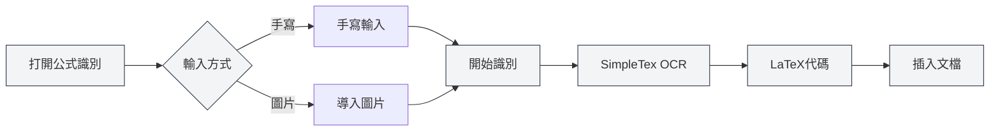

# AI助手功能

## 概述

AI助手功能提供了多種智能輔助工具，幫助您完成文件創作、公式識別、圖表生成、數據分析等任務。透過AI助手，您可以高效地完成各種文件處理工作。

AI助手功能包括：AI對話、手寫公式識別、智能繪圖助手、數據分析工具、OCR文字識別、附件解析工具、AIGC檢測等。

<AgentView mode="demo" />

## AI對話

### 功能介紹

AI對話功能提供了一個智能對話助手，可以基於當前文件內容進行對話：

- **上下文理解**：理解當前文件的內容和上下文
- **智能回答**：根據文件內容回答相關問題
- **文件分析**：分析文件結構、內容、風格等

您可以透過AI助手選單存取AI對話功能：

<MenuItemsDemo mode="demo" :items='[{"id": "ai-assistant", "items": ["ai-chat"]}]' />

### 介面預覽

AI對話介面包含會話列表和對話區域，支援多會話管理和引用素材：

<AIChat mode="demo" />

詳見[[ai.chat|AI對話]]。

## 手寫公式識別

### 功能介紹

手寫公式識別功能可以將手寫的數學公式轉換為LaTeX代碼：

<FormulaRecognition mode="demo" />

- **手寫輸入**：支援滑鼠/觸控手寫輸入
- **圖片匯入**：支援匯入公式圖片進行識別
- **即時識別**：使用SimpleTex OCR API進行識別
- **LaTeX輸出**：自動轉換為標準LaTeX格式

### 使用方法

1. **開啟公式識別**：從AI助手選單開啟公式識別視窗
2. **手寫輸入**：在畫布上手寫數學公式
3. **或匯入圖片**：點擊匯入按鈕，選擇公式圖片
4. **開始識別**：點擊識別按鈕
5. **查看結果**：查看識別出的LaTeX代碼
6. **插入文件**：將LaTeX代碼插入到文件中

您可以透過AI助手選單存取手寫公式識別功能：

<MenuItemsDemo mode="demo" :items='[{"id": "ai-assistant", "items": ["formula-recognition"]}]' />

### 識別精度

- **高精度識別**：SimpleTex OCR API提供高精度的數學公式識別
- **支援複雜公式**：支援分數、根號、積分、求和等複雜公式
- **自動糾錯**：識別結果可以手動編輯和修正

## 智能繪圖助手

### 功能介紹

智能繪圖助手使用AI生成圖表代碼，支援多種圖表格式：

- **Mermaid圖表**：流程圖、時序圖、類圖、狀態圖等
- **PlantUML圖表**：UML圖、時序圖、活動圖等
- **ECharts圖表**：折線圖、柱狀圖、餅圖、散點圖等
- **直接插入**：生成的圖表可以直接插入文件

### 介面預覽

智能繪圖助手支援多會話管理，自動選擇圖表引擎，生成可視化圖表：

<GraphWindow mode="demo" />

<MenuItemsDemo mode="demo" :items='[{"id": "ai-assistant"}]' />

### 使用方法

1. **開啟繪圖助手**：從選單或工具列開啟繪圖助手
2. **描述需求**：用自然語言描述要生成的圖表
3. **選擇類型**：選擇圖表類型（Mermaid、PlantUML、ECharts等）
4. **生成圖表**：AI根據描述生成圖表代碼
5. **預覽圖表**：預覽生成的圖表
6. **插入文件**：將圖表插入到文件中

### 支援的圖表類型

- **Mermaid**：流程圖、時序圖、類圖、狀態圖、ER圖、甘特圖、餅圖、Git圖、旅程圖、思維導圖、時間線等
- **PlantUML**：UML圖、時序圖、活動圖、元件圖、部署圖等
- **ECharts**：折線圖、柱狀圖、餅圖、散點圖、雷達圖、熱力圖、樹圖、矩形樹圖、旭日圖等

詳見[[charts.introduction|圖表功能介紹]]。

## 數據分析工具

### 功能介紹

數據分析工具可以分析文件中的數據表格，生成可視化圖表：

- **表格識別**：自動識別文件中的表格數據
- **數據分析**：分析表格數據的統計資訊
- **圖表生成**：根據數據生成可視化圖表
- **圖表插入**：將生成的圖表插入文件

<DataAnalysisWindow mode="demo" />

### 使用方法

1. **開啟數據分析**：從選單或工具列開啟數據分析視窗
2. **選擇表格**：在文件中選擇要分析的表格
3. **分析數據**：點擊分析按鈕，AI分析表格數據
4. **生成圖表**：根據分析結果生成可視化圖表
5. **插入文件**：將圖表插入到文件中

## OCR文字識別

### 功能介紹

OCR文字識別功能可以識別圖片中的文字，提取文字內容：

- **圖片識別**：識別圖片中的文字內容
- **多語言支援**：支援中文、英文等多種語言
- **文字提取**：提取識別出的文字內容
- **插入文件**：將提取的文字插入文件

### 介面預覽

OCR識別視窗支援多圖片管理、圖片預處理參數調整和識別結果編輯：

<OcrWindow mode="demo" />

<MenuItemsDemo mode="demo" :items='[{"id": "ai-assistant", "items": ["proofread"]}]' />

### 使用方法

1. **開啟OCR識別**：從選單或工具列開啟OCR識別視窗
2. **匯入圖片**：匯入要識別的圖片
3. **開始識別**：點擊識別按鈕
4. **查看結果**：查看識別出的文字內容
5. **插入文件**：將文字插入到文件中

## 附件解析工具

### 功能介紹

附件解析工具可以解析PDF、Word等附件檔案，提取檔案內容：

- **檔案解析**：解析PDF、Word等檔案格式
- **內容提取**：提取檔案中的文字和圖片
- **新增到知識庫**：將提取的內容新增到知識庫
- **文件引用**：在文件中引用附件內容

<KnowledgeBase mode="demo" />

### 使用方法

1. **開啟附件解析**：從選單或工具列開啟附件解析視窗
2. **選擇檔案**：選擇要解析的PDF或Word檔案
3. **開始解析**：點擊解析按鈕
4. **查看結果**：查看解析出的內容
5. **新增到知識庫**：將內容新增到知識庫（可選）

## AIGC檢測

### 功能介紹

AIGC檢測功能可以檢測文字是否為AI生成內容：

- **文字檢測**：檢測文字是否為AI生成
- **置信度評分**：提供AI生成概率評分
- **檢測報告**：生成詳細的檢測報告

<AigcDetectionWindow mode="demo" />

### 使用方法

1. **開啟AIGC檢測**：從選單或工具列開啟AIGC檢測視窗
2. **選擇文字**：選擇要檢測的文字
3. **開始檢測**：點擊檢測按鈕
4. **查看結果**：查看檢測結果和置信度評分

## 使用技巧

### 高效使用AI助手

1. **明確需求**：清晰描述需求，獲得更好的結果
2. **提供上下文**：提供足夠的上下文資訊
3. **迭代優化**：根據結果迭代優化需求

### 公式識別技巧

1. **清晰書寫**：手寫時保持清晰，避免潦草
2. **正確格式**：使用正確的數學符號格式
3. **檢查結果**：識別後檢查結果，必要時手動修正

### 圖表生成技巧

1. **詳細描述**：詳細描述圖表需求，包括數據類型、樣式等
2. **選擇類型**：根據需求選擇合適的圖表類型
3. **預覽調整**：預覽圖表後根據需要進行調整

## 常見問題

### Q: 公式識別不準確？

A: 公式識別基於SimpleTex OCR API，可能不準確。建議手寫時保持清晰，或使用圖片匯入。

### Q: 圖表生成不符合預期？

A: 可以詳細描述需求，或手動編輯生成的圖表代碼進行調整。

### Q: OCR識別支援哪些語言？

A: OCR識別支援中文、英文等多種語言，具體取決於使用的OCR服務。

### Q: 附件解析支援哪些格式？

A: 附件解析支援PDF、Word等常見格式，具體取決於解析服務的能力。

<AgentView mode="demo" />

## 相關文件

- [[ai.chat|AI對話]]
- [[charts.introduction|圖表功能介紹]]
- [[knowledge-base.usage|知識庫使用]]