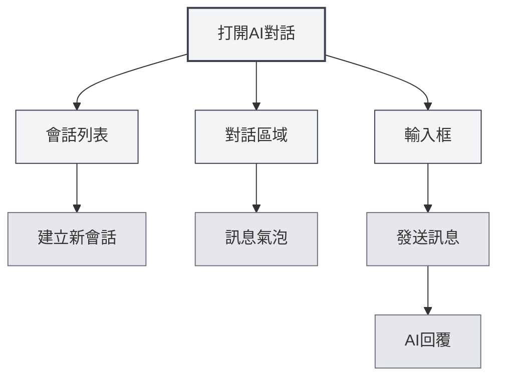
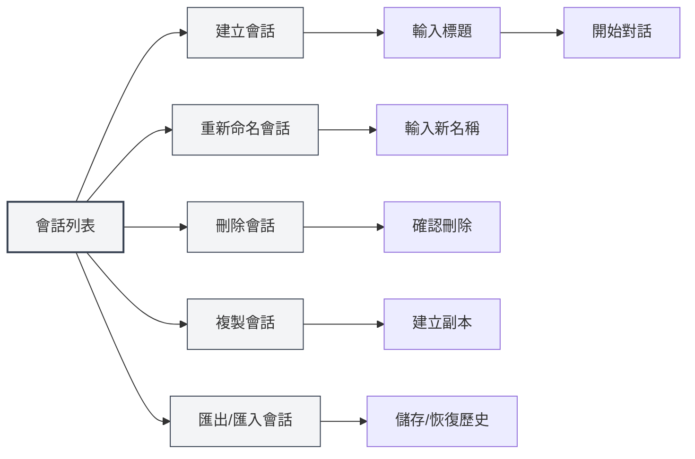
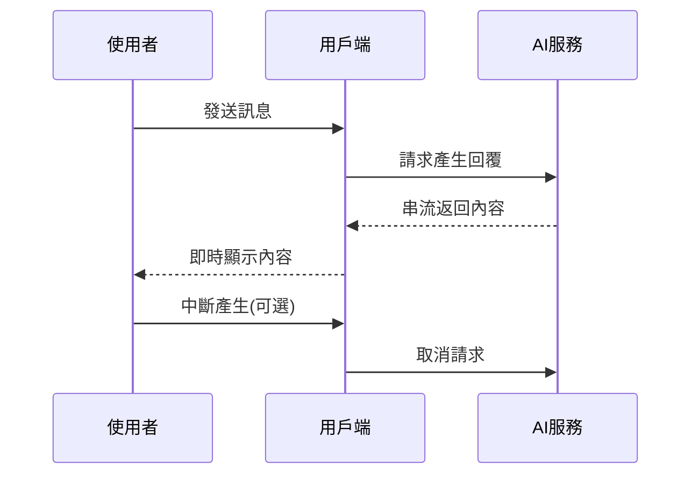
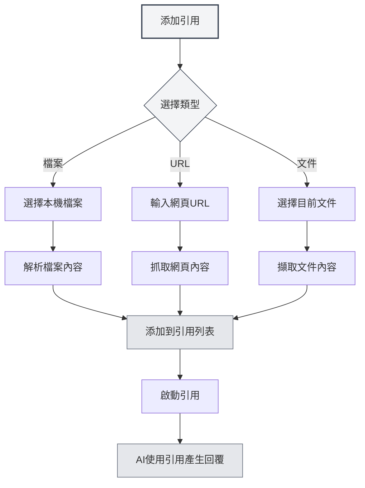

# AI對話

## 概述

AI對話功能提供了一個智慧對話助手，可以幫助您解答問題、生成內容、分析文件等。透過AI對話，您可以與AI進行自然語言互動，獲得智慧化的幫助和建議。

AI對話支援多會話管理、引用素材、知識庫整合等功能，讓您能夠高效地使用AI輔助完成各種任務。

## 開啟AI對話

### 開啟方式

有多種方式可以開啟AI對話：

- **選單列**：點擊"AI"選單，選擇"AI對話"
- **快速鍵**：使用快速鍵快速開啟（如果配置了）
- **側邊欄**：從側邊欄開啟AI對話面板

您可以透過頂部選單列的AI助手選單存取AI對話功能：

<MenuItemsDemo mode="demo" :items='[{"id": "ai-assistant", "items": ["ai-chat"]}]' />

### 介面介紹

AI對話介面包含以下部分：

<AIChat mode="demo" />

- **會話列表**：左側顯示所有會話列表
- **對話區域**：中間顯示對話訊息
- **輸入框**：底部輸入訊息
- **引用管理**：管理引用素材

## 會話管理

AI對話支援多會話管理，您可以建立、重新命名、刪除和複製會話。

<AIChat mode="demo" />

### 建立會話

建立新的AI對話會話：

1. **點擊新建**：點擊會話列表上方的"新建會話"按鈕
2. **輸入標題**：可選輸入會話標題（預設使用第一條訊息）
3. **開始對話**：輸入第一條訊息開始對話

### 會話操作

### 重新命名會話

重新命名現有會話：

1. **右鍵選單**：右鍵點擊會話，選擇"重新命名"
2. **輸入新名稱**：輸入新的會話名稱
3. **確認儲存**：確認後儲存新名稱

### 刪除會話

刪除不需要的會話：

1. **右鍵選單**：右鍵點擊會話，選擇"刪除"
2. **確認刪除**：確認後刪除會話

刪除會話會同時刪除該會話的所有訊息歷史。

### 複製會話

複製現有會話：

1. **右鍵選單**：右鍵點擊會話，選擇"複製"
2. **建立副本**：系統會建立一個新的會話副本

複製會話會複製所有訊息歷史，方便您基於現有對話繼續討論。

### 匯出/匯入會話

匯出和匯入會話：

- **匯出會話**：右鍵點擊會話，選擇"匯出"，儲存為JSON檔案
- **匯入會話**：從檔案匯入會話，恢復訊息歷史

匯出/匯入功能方便您備份和分享對話內容。

<MenuItemsDemo mode="demo" :items='[{"id": "file", "items": ["save", "open"]}]' />

## 發送訊息

AI對話提供豐富的訊息發送功能。

<AIChat mode="demo" />

### 輸入訊息

在輸入框中輸入訊息：

1. **輸入文字**：在輸入框中輸入您的問題或請求
2. **格式化**：支援Markdown格式，可以格式化文字
3. **發送訊息**：點擊發送按鈕或按`Enter`發送

### 訊息類型

支援以下訊息類型：

- **文字訊息**：普通文字訊息
- **Markdown訊息**：支援Markdown格式的訊息
- **程式碼訊息**：包含程式碼的訊息

### 快速鍵

發送訊息的快速鍵：

- **Enter**：發送訊息
- **Shift+Enter**：換行（不發送）
- **Ctrl+Enter**：發送訊息（某些配置下）

## AI回覆

AI回覆功能提供串流輸出和訊息操作功能。

<AIChat mode="demo" />

<AIChat mode="demo" />

### 串流輸出

AI回覆採用串流輸出：

- **即時顯示**：AI產生的內容會即時顯示
- **逐步產生**：內容逐步產生，無需等待完成
- **可中斷**：可以隨時中斷AI產生

### 訊息操作

對AI回覆可以進行以下操作：

- **複製**：複製AI回覆內容
- **重新產生**：重新產生AI回覆
- **編輯**：編輯AI回覆（如果支援）
- **刪除**：刪除AI回覆

### 訊息編輯

編輯使用者訊息：

1. **點擊編輯**：點擊訊息旁的編輯按鈕
2. **修改內容**：修改訊息內容
3. **重新發送**：重新發送修改後的訊息

編輯訊息會刪除該訊息之後的所有訊息，重新開始對話。

## 引用素材

您可以為AI對話添加引用素材，幫助AI更好地理解上下文。

<AIChat mode="demo" />

### 添加引用

為會話添加引用素材：

1. **開啟引用管理**：點擊對話區域上方的引用標籤
2. **添加引用**：點擊"添加引用"按鈕
3. **選擇類型**：選擇引用類型（檔案、URL等）
4. **選擇內容**：選擇要引用的內容

### 引用類型

支援以下引用類型：

- **檔案引用**：引用本機檔案
- **URL引用**：引用網頁URL
- **文件引用**：引用目前開啟的文件

### 啟動引用

啟動和停用引用：

- **啟動引用**：點擊引用標籤啟動引用
- **停用引用**：再次點擊停用引用
- **啟動狀態**：啟動的引用會在AI回覆時使用

啟動引用後，AI會參考引用內容產生回覆。

### 引用預覽

預覽引用內容：

- **點擊預覽**：點擊引用標籤查看引用內容
- **查看詳情**：查看引用的詳細內容
- **編輯引用**：編輯或刪除引用

## 知識庫整合

AI對話可以與知識庫整合，自動檢索相關知識。

<KnowledgeBase mode="demo" />

<AIChat mode="demo" />

### 啟用知識庫

啟用知識庫查詢：

1. **開啟設定**：在輸入框下方找到知識庫開關
2. **啟用查詢**：切換開關啟用知識庫查詢
3. **自動檢索**：AI回覆時會自動檢索知識庫

### 知識庫檢索

知識庫檢索功能：

- **自動檢索**：發送訊息時自動檢索相關知識
- **上下文理解**：根據對話上下文檢索相關內容
- **結果整合**：將檢索結果整合到AI回覆中

### 檢索設定

知識庫檢索設定：

- **信賴度閾值**：設定檢索的信賴度閾值
- **檢索數量**：設定檢索結果的數量
- **檢索範圍**：設定檢索的範圍

詳見[[knowledge-base.config|知識庫配置]]。

## 訊息管理

管理AI對話中的訊息。

<AIChat mode="demo" />

### 訊息操作

對訊息可以進行以下操作：

- **複製訊息**：複製訊息內容
- **編輯訊息**：編輯使用者訊息
- **刪除訊息**：刪除訊息
- **重新產生**：重新產生AI回覆

### 訊息歷史

訊息歷史管理：

- **自動儲存**：訊息歷史自動儲存
- **會話隔離**：每個會話的訊息歷史獨立
- **歷史恢復**：重新開啟會話時恢復歷史

### 訊息格式

訊息支援以下格式：

<AIChat mode="demo" />

- **Markdown**：支援Markdown格式
- **程式碼區塊**：支援程式碼區塊高亮
- **數學公式**：支援LaTeX數學公式
- **表格**：支援表格顯示

## 使用技巧

透過以下技巧可以更高效地使用AI對話功能。

<AIChat mode="demo" />

### 高效對話

1. **明確問題**：提出明確的問題，獲得更好的回覆
2. **提供上下文**：提供足夠的上下文資訊
3. **使用引用**：使用引用素材提供更多資訊

### 會話組織

1. **分類管理**：為不同主題建立不同會話
2. **命名規範**：使用清晰的會話名稱
3. **定期清理**：定期刪除不需要的會話

### 知識庫使用

1. **添加相關文件**：將相關文件添加到知識庫
2. **啟用查詢**：啟用知識庫查詢獲得更好的回覆
3. **調整設定**：根據需求調整檢索設定

## 常見問題

<AIChat mode="demo" />

<MenuItemsDemo mode="demo" :items='[{"id": "ai-assistant"}]' />

### Q: AI回覆不準確？

A: AI回覆基於訓練資料，可能不準確。可以提供更多上下文資訊或使用引用素材提高準確性。

### Q: 如何中斷AI產生？

A: 點擊"取消"按鈕可以中斷AI產生。已產生的內容不會遺失。

### Q: 訊息歷史遺失？

A: 訊息歷史會自動儲存。如果遺失，檢查是否刪除了會話或清除了資料。

### Q: 如何提高回覆品質？

A: 提供清晰的上下文、使用引用素材、啟用知識庫查詢都可以提高回覆品質。

### Q: 支援哪些LLM？

A: 支援多種LLM，包括OpenAI、Ollama、DeepSeek等。詳見[[ai.llm-config|LLM配置]]。

## 相關文件

- [[ai.proofread|AI校對]]
- [[ai.completion|AI自動補全]]
- [[knowledge-base.config|知識庫配置]]
- [[ai.llm-config|LLM配置]]
