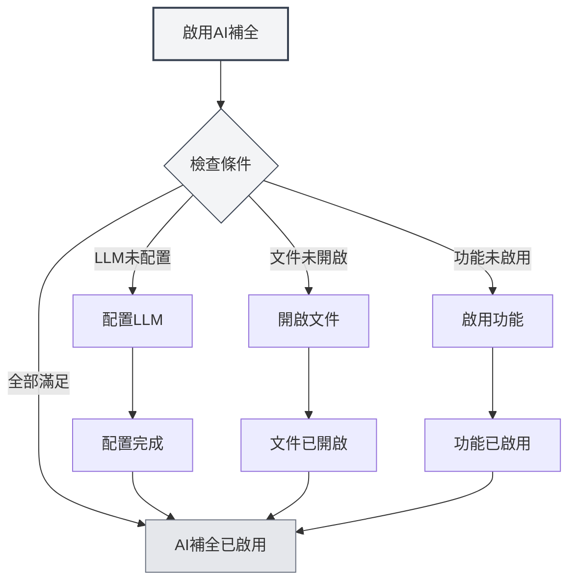
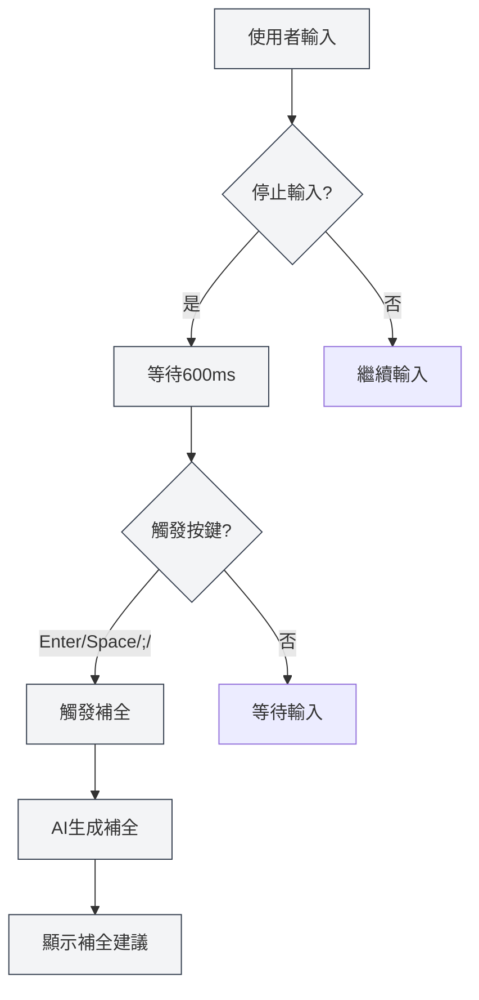
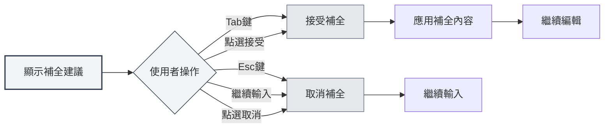

# AI自動補全

## 概述

AI自動補全功能使用AI技術自動補全您正在輸入的內容。當您停止輸入時，AI會根據上下文自動生成補全建議，幫助您快速完成文件編寫。

AI自動補全支援多種文件格式（Markdown、LaTeX、純文字），可以智慧理解上下文，生成符合文件風格和內容的補全建議。

## 啟用AI補全

### 啟用方式

有多種方式可以啟用AI自動補全：

- **右鍵選單**：在編輯器中右鍵，選擇"啟用AI自動補全"
- **設定頁面**：在設定中啟用AI自動補全功能
- **快速鍵**：使用快速鍵快速切換（如果配置了）

您可以透過頂端選單列存取設定：

<MenuItemsDemo mode="demo" :items='[{"id": "settings"}]' />

<CompletionSettingsPanel mode="demo" />

### 啟用條件

啟用AI自動補全需要滿足以下條件：

- **LLM已配置**：需要配置LLM服務
- **文件已開啟**：需要在編輯器中開啟文件
- **功能已啟用**：需要在設定中啟用AI補全功能

詳見[[ai.llm-config|LLM配置]]。

<CompletionSettingsPanel mode="demo" />

## 自動觸發

<AISuggestionGhost mode="demo" />

### 觸發條件

AI自動補全會在以下情況自動觸發：

- **停止輸入**：停止輸入600ms後自動觸發
- **觸發按鍵**：輸入特定按鍵後觸發（Enter、Space、`;`、`,`等）

### 觸發延遲

觸發延遲設定：

- **預設延遲**：600ms（0.6秒）
- **可配置**：可以在設定中調整延遲時間
- **平衡考慮**：延遲太短會頻繁觸發，延遲太長會影響體驗

<CompletionSettingsPanel mode="demo" />

### 觸發按鍵

支援的觸發按鍵：

- **Enter**：Enter鍵觸發
- **Space**：空白鍵觸發
- **;**：分號觸發
- **,**：逗號觸發

可以在設定中配置觸發按鍵，支援同時啟用多個按鍵。

## 手動觸發

<AISuggestionGhost mode="demo" />

### 觸發方式

手動觸發補全的方式：

- **快速鍵**：按`Shift+Tab`手動觸發補全
- **右鍵選單**：右鍵選擇"手動觸發補全"

手動觸發會立即啟動補全，跳過自動觸發的延遲。

<CompletionSettingsPanel mode="demo" />

### 使用場景

適合手動觸發的場景：

- **需要立即補全**：需要立即獲得補全建議
- **自動觸發失敗**：自動觸發沒有生效
- **特定位置**：在特定位置需要補全

## 補全內容

<AISuggestionGhost mode="demo" />

### 上下文理解

AI補全理解以下上下文：

- **目前段落**：理解目前段落的內容
- **文件結構**：理解文件的整體結構
- **文件風格**：理解文件的寫作風格
- **文件主題**：理解文件的主題和內容

### 補全模式

AI補全支援兩種模式：

- **完全生成**：生成完整的補全內容
- **部分生成**：只生成部分內容（根據設定）

補全模式可以在設定中配置。

<CompletionSettingsPanel mode="demo" />

### 補全長度

補全內容長度控制：

- **最大Token數**：可以設定補全的最大Token數
- **預設值**：50 Token
- **範圍**：20 Token到無限制（0表示無限制）

Token數越大，補全的內容越多，但生成時間也會更長。

<CompletionSettingsPanel mode="demo" />

## 接受補全

<AISuggestionGhost mode="demo" />

### 接受方式

接受補全建議的方式：

- **Tab鍵**：按`Tab`鍵接受補全建議
- **點選接受**：點選補全建議上的"接受"按鈕

### 取消補全

取消補全建議的方式：

- **Esc鍵**：按`Esc`鍵取消補全建議
- **繼續輸入**：繼續輸入會自動取消補全
- **點選取消**：點選補全建議上的"取消"按鈕

### 編輯補全

接受補全後可以繼續編輯：

- **直接編輯**：接受後可以直接編輯補全內容
- **部分接受**：可以只接受部分補全內容
- **修改補全**：可以修改補全內容後再使用

## 知識庫整合

### 啟用知識庫

啟用知識庫整合：

1. **開啟設定**：在設定中啟用知識庫整合
2. **配置知識庫**：配置知識庫相關設定
3. **自動檢索**：補全時會自動檢索知識庫

詳見[[knowledge-base.config|知識庫配置]]。

### 上下文檢索

知識庫檢索功能：

- **自動檢索**：補全時自動檢索相關知識
- **語意匹配**：根據語意相似度匹配相關內容
- **結果整合**：將檢索結果整合到補全建議中

### 檢索設定

知識庫檢索設定：

- **信賴度閾值**：設定檢索的信賴度閾值
- **檢索數量**：設定檢索結果的數量
- **檢索範圍**：設定檢索的範圍

## 補全設定

### 基本設定

AI補全的基本設定：

- **啟用/關閉**：啟用或關閉AI補全功能
- **觸發延遲**：設定自動觸發的延遲時間
- **觸發按鍵**：配置觸發按鍵
- **最大Token數**：設定補全的最大Token數

<CompletionSettingsPanel mode="demo" />

### 進階設定

AI補全的進階設定：

- **補全模式**：選擇補全模式（完全生成/部分生成）
- **上下文長度**：設定補全使用的上下文長度
- **溫度設定**：設定AI生成的溫度參數
- **知識庫整合**：配置知識庫整合選項

<CompletionSettingsPanel mode="demo" />

### 格式設定

不同格式的補全設定：

- **Markdown**：Markdown格式的補全設定
- **LaTeX**：LaTeX格式的補全設定
- **純文字**：純文字格式的補全設定

不同格式可能有不同的補全策略和設定。

## 使用技巧

### 提高補全品質

1. **提供上下文**：在文件中提供足夠的上下文資訊
2. **啟用知識庫**：啟用知識庫整合可以提高補全品質
3. **調整設定**：根據需求調整補全設定

### 高效使用

1. **合理使用**：不要過度依賴AI補全
2. **檢查內容**：接受補全後檢查內容是否正確
3. **手動調整**：必要時手動調整補全內容

### 避免問題

1. **避免頻繁觸發**：避免頻繁觸發補全，影響輸入體驗
2. **檢查準確性**：檢查補全內容的準確性
3. **及時取消**：不需要的補全及時取消

## 常見問題

### Q: 補全不準確？

A: AI補全基於上下文和訓練資料，可能不準確。可以提供更多上下文資訊或啟用知識庫整合提高準確性。

### Q: 補全很慢？

A: 補全速度取決於AI服務回應速度。可以調整補全設定或使用更快的LLM服務。

### Q: 如何關閉自動補全？

A: 在設定中關閉AI自動補全功能，或使用右鍵選單關閉。

### Q: 可以自訂觸發按鍵嗎？

A: 可以。在設定中配置觸發按鍵，支援同時啟用多個按鍵。

### Q: 補全內容太長？

A: 可以在設定中調整補全的最大Token數，限制補全內容的長度。

## 相關文件

- [[ai.chat|AI對話]]
- [[ai.proofread|AI校對]]
- [[knowledge-base.config|知識庫配置]]
- [[ai.llm-config|LLM配置]]