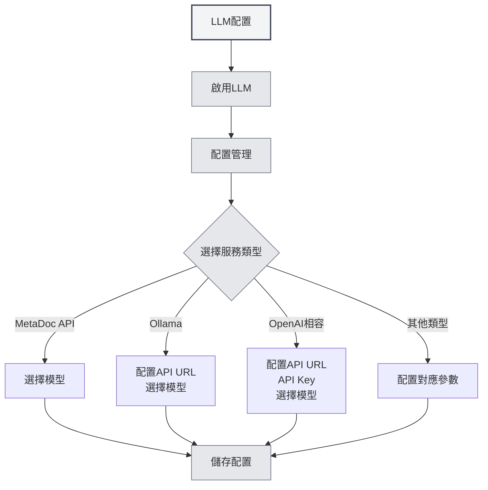

# LLM配置引導

## 概述

LLM（大型語言模型）是 MetaDoc 中 AI 對話、校對、補全、助手與 Agent 等功能的共同基礎。本文說明為何需要配置 LLM、配置會影響哪些功能，以及如何進入具體配置介面。

**發行管道**：若您透過 **Steam** 使用 MetaDoc，建議先閱讀「[[settings.llm|LLM 設定]]」中的 **Steam／MetaDoc 官方雲**（儲值、餘額、模型切換）；只有需要 **自備第三方 API** 時，才在 **實驗性選項** 中開啟 **啟用實驗性連線**，並繼續閱讀下文與 [[settings.llm-types|LLM 類型設定]]。

<Demo component="SettingLlmSection" mode="demo" />

## 為何要配置 LLM

- **API 呼叫**：對話、補全、校對等會請求您所選的 LLM 介面，需正確配置地址與金鑰。
- **模型差異**：不同模型在品質、速度、成本上差異較大，按場景選擇合適的模型可提升體驗並控制成本。
- **統一入口**：在[[settings.llm|LLM配置]]中集中管理啟用狀態、溫度、推理標籤等，一次設定即可影響所有 AI 功能。

## 配置會影響哪些功能

配置並啟用 LLM 後，將影響以下能力：

| 功能        | 說明                 |
| ----------- | -------------------- | ---------------------------------------------- |
| **AI 對話** | [[ai.chat            | AI對話功能]]：與 AI 多輪對話、基於上下文的回答 |
| **AI 校對** | [[ai.proofread       | AI校對功能]]：語法與拼寫檢查、修改建議         |
| **AI 補全** | [[ai.completion      | AI自動補全]]：寫作時的智慧續寫與補全           |
| **AI 助手** | [[ai.assistants      | AI助手功能]]：公式識別、繪圖助手、資料分析等   |
| **Agent**   | [[agent.introduction | Agent框架]]：會話、工具呼叫、工作流程執行        |

關閉 LLM 或未配置可用服務時，上述功能將不可用或會提示先完成配置。

## 如何配置 LLM

### 進入配置頁

1. 開啟 **設定** → **LLM 配置**（或應用內等價入口）。
2. 在「[[settings.llm|LLM配置]]」頁中可：
   - 啟用/關閉 LLM
   - 設定溫度、是否自動移除推理標籤等全域選項
   - 管理多個 LLM 配置（建立、編輯、刪除、排序）

您可以透過頂端選單列存取LLM設定：

<MenuItemsDemo mode="demo" :items='[{"id": "settings"}]' />

<MenuItemsDemo mode="demo" :items='[{"id": "ai"}]' />

### 配置具體服務

在 **LLM 配置管理** 中選擇或新建一條配置，並按服務類型填寫：

- **MetaDoc API / Ollama / OpenAI 相容 / OpenAI 官方 / DeepSeek / Gemini** 等  
  詳細欄位與步驟見 [[settings.llm-types|LLM類型配置]]（API 地址、API Key、模型名、最大 Token 等）。

### 使用建議

- **首次使用**：先完成一條可用的 LLM 配置並儲存，再開啟「啟用 LLM」。
- **多配置**：可為不同場景建多條配置（如「日常對話」「校對專用」），在對應功能或 Agent 配置中選擇使用。
- **成本與隱私**：使用雲端 API 會產生費用並可能上傳內容；若需本地與隱私，可優先考慮 Ollama 等本地部署方式（見 [[settings.llm-types|LLM類型配置]]）。

## 相關文件

- [[settings.llm|LLM配置]]
- [[settings.llm-types|LLM類型配置]]
- [[settings.llm-management|LLM配置管理]]
- [[ai.chat|AI對話功能]]
- [[agent.introduction|Agent框架概述]]

<AIChat mode="demo" />
