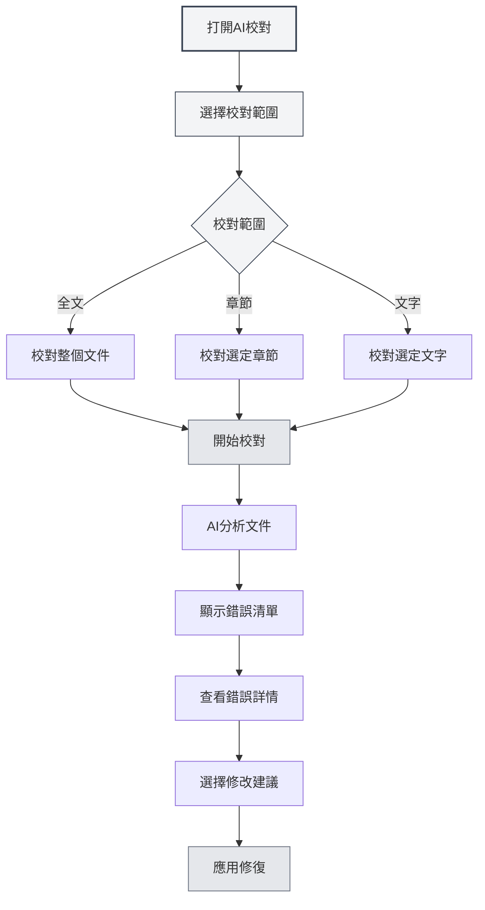
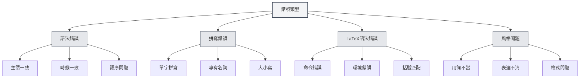
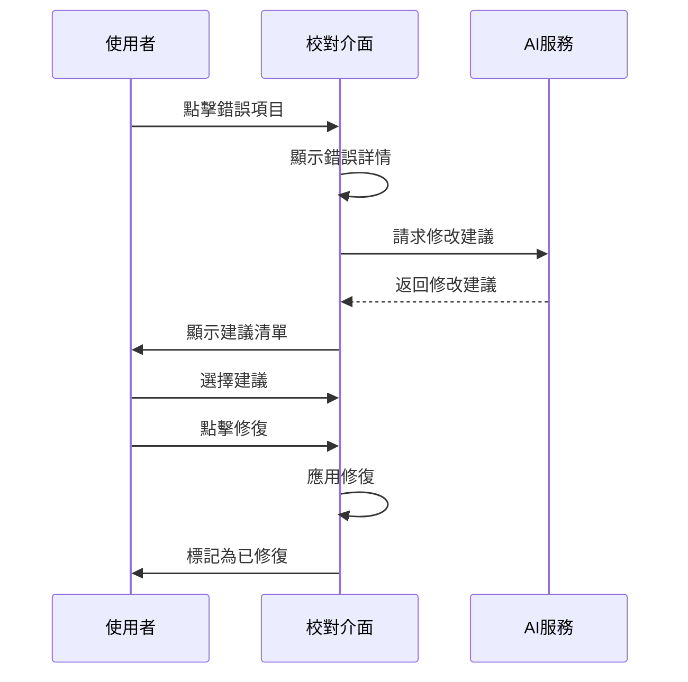

# AI校對

## 概述

AI校對功能使用AI技術自動檢查文件中的語法錯誤、拼寫錯誤、LaTeX語法錯誤等問題，並提供修改建議。透過AI校對，您可以快速發現和修復文件中的錯誤，提高文件品質。

AI校對支援多種文件格式（Markdown、LaTeX、純文字），可以校對全文或特定章節，提供詳細的錯誤資訊和修改建議。

## 開啟AI校對

### 開啟方式

有多種方式可以開啟AI校對：

- **選單列**：點擊"AI"選單，選擇"AI校對"
- **快速鍵**：使用快速鍵快速開啟（如果配置了）
- **側邊欄**：從側邊欄開啟AI校對面板

您可以透過頂部選單列的AI助手選單存取AI校對功能：

<MenuItemsDemo mode="demo" :items='[{"id": "ai-assistant", "items": ["proofread"]}]' />

### 介面介紹

AI校對介面包含以下部分：

- **錯誤清單**：左側顯示所有錯誤
- **文件預覽**：右側顯示文件內容
- **錯誤統計**：頂部顯示錯誤統計資訊
- **操作按鈕**：頂部提供操作按鈕

<ProofreadView mode="demo" />

<ProofreadDisplay mode="demo" />

## 校對範圍

### 校對全文

校對整個文件：

1. **開啟校對**：開啟AI校對面板
2. **點擊開始**：點擊"開始校對"按鈕
3. **等待完成**：等待AI完成校對

校對全文會自動檢查文件中的所有內容。

<ProofreadView mode="demo" />

<ProofreadDisplay mode="demo" />

### 校對特定章節

校對文件的特定章節：

1. **選擇章節**：在大綱視圖中選擇要校對的章節
2. **開啟校對**：開啟AI校對面板
3. **指定章節**：在校對設定中指定章節路徑
4. **開始校對**：點擊"開始校對"按鈕

校對特定章節只檢查選定章節及其子章節的內容。

<ProofreadView mode="demo" />

<ProofreadDisplay mode="demo" />

### 校對指定文字

校對指定的文字內容：

1. **選擇文字**：在編輯器中選擇要校對的文字
2. **開啟校對**：開啟AI校對面板
3. **貼上文字**：將文字貼上到校對輸入框
4. **開始校對**：點擊"開始校對"按鈕

<ProofreadDisplay mode="demo" />

## 錯誤類型

AI校對可以檢測以下類型的錯誤：

### 語法錯誤

檢查文件中的語法錯誤：

<ProofreadDisplay mode="demo" />

- **主謂一致**：檢查主謂一致問題
- **時態一致**：檢查時態一致問題
- **語序問題**：檢查語序問題
- **其他語法**：檢查其他語法問題

### 拼寫錯誤

檢查文件中的拼寫錯誤：

- **單字拼寫**：檢查單字拼寫錯誤
- **專有名詞**：檢查專有名詞拼寫
- **大小寫**：檢查大小寫問題

### LaTeX語法錯誤

檢查LaTeX文件中的語法錯誤：

- **命令錯誤**：檢查LaTeX命令錯誤
- **環境錯誤**：檢查LaTeX環境錯誤
- **括號匹配**：檢查括號匹配問題
- **其他語法**：檢查其他LaTeX語法問題

### 風格問題

檢查文件的風格問題：

- **用詞不當**：檢查用詞是否恰當
- **表達不清**：檢查表達是否清晰
- **格式問題**：檢查格式問題

## 錯誤資訊

### 錯誤顯示

錯誤資訊包含以下內容：

<ProofreadDisplay mode="demo" />

- **錯誤類型**：顯示錯誤類型（語法、拼寫、LaTeX等）
- **錯誤位置**：顯示錯誤所在的行號和列號
- **錯誤文字**：顯示錯誤的文字內容
- **修改建議**：顯示修改建議
- **嚴重程度**：顯示錯誤的嚴重程度

### 嚴重程度

錯誤按嚴重程度分類：

- **錯誤（Error）**：必須修復的錯誤
- **警告（Warning）**：建議修復的問題
- **資訊（Info）**：僅供參考的資訊

### 錯誤定位

快速定位錯誤位置：

1. **點擊錯誤**：點擊錯誤清單中的錯誤項目
2. **自動定位**：編輯器自動捲動到錯誤位置
3. **高亮顯示**：錯誤位置會高亮顯示

## 修改建議

### 查看建議

查看AI提供的修改建議：

<ProofreadDisplay mode="demo" />

- **單個建議**：如果只有一個建議，直接顯示
- **多個建議**：如果有多個建議，以標籤形式顯示
- **選擇建議**：點擊建議標籤選擇建議

### 應用修復

應用修改建議：

<ProofreadDisplay mode="demo" />

1. **選擇建議**：點擊建議標籤選擇建議
2. **點擊修復**：點擊"修復"按鈕
3. **確認修復**：確認後應用修復

修復後，錯誤會被標記為"已修復"。

### 一鍵修復

一鍵修復所有錯誤：

1. **點擊修復全部**：點擊"一鍵修復全部"按鈕
2. **確認修復**：確認後修復所有錯誤

一鍵修復會使用第一個建議修復所有錯誤。

## 錯誤管理

### 忽略錯誤

忽略不需要修復的錯誤：

1. **選擇錯誤**：選擇要忽略的錯誤
2. **點擊忽略**：點擊"忽略"按鈕
3. **確認忽略**：確認後忽略錯誤

忽略的錯誤會從錯誤清單中移除。

### 新增到詞典

將單字新增到詞典：

1. **選擇錯誤**：選擇拼寫錯誤
2. **新增到詞典**：點擊"新增到詞典"按鈕
3. **確認新增**：確認後新增到詞典

新增到詞典後，該單字不會再被標記為拼寫錯誤。

### 清空已修復

清空已修復的錯誤：

1. **點擊清空**：點擊"清空已修復"按鈕
2. **確認清空**：確認後清空已修復的錯誤

清空已修復的錯誤可以讓錯誤清單更清晰。

## 使用技巧

<ProofreadView mode="demo" />

### 高效校對

1. **先校對全文**：先校對全文了解整體情況
2. **再校對章節**：針對問題章節進行詳細校對
3. **批次修復**：使用一鍵修復快速修復常見錯誤

### 錯誤處理

1. **優先處理錯誤**：優先處理嚴重錯誤
2. **檢查建議**：仔細檢查修改建議
3. **手動調整**：必要時手動調整修改內容

### 詞典管理

1. **新增專業術語**：將專業術語新增到詞典
2. **定期更新**：定期更新詞典內容
3. **匯出詞典**：匯出詞典備份

## 常見問題

### Q: 校對結果不準確？

A: AI校對基於AI模型，可能不準確。建議人工檢查校對結果，特別是專業術語和特殊表達。

### Q: 如何校對特定章節？

A: 在校對設定中指定章節路徑（如"1.1"），或使用大綱視圖選擇章節。

### Q: 可以忽略某些錯誤嗎？

A: 可以。點擊"忽略"按鈕可以忽略不需要修復的錯誤。

### Q: 如何新增到詞典？

A: 選擇拼寫錯誤，點擊"新增到詞典"按鈕可以將單字新增到詞典。

### Q: 校對很慢？

A: 校對速度取決於文件大小和AI服務回應速度。對於大文件，建議分段校對。

## 相關文件

- [[ai.chat|AI對話]]
- [[ai.completion|AI自動補全]]
- [[outline.basics|大綱視圖功能]]