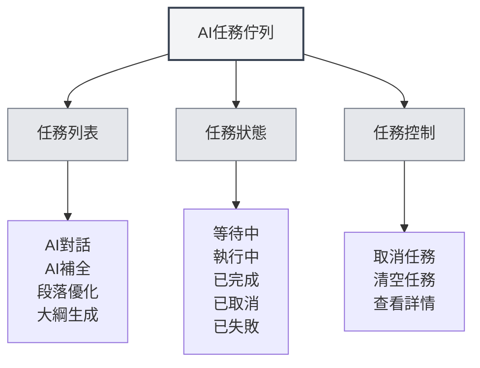

# AI任務佇列

## 概述

AI任務佇列用於管理和監控所有正在執行的AI任務。透過任務佇列，您可以查看任務狀態、取消任務、查看任務進度，確保AI功能的高效運行。

## 任務佇列介紹

<AITaskQueue mode="demo" />

### 什麼是任務佇列

AI任務佇列是一個管理介面，顯示所有正在執行或等待執行的AI任務：

- **任務列表**：顯示所有任務及其狀態
- **任務狀態**：顯示任務的執行狀態
- **任務進度**：顯示任務的執行進度
- **任務控制**：可以取消或管理任務

### 任務類型

任務佇列中可能包含以下類型的任務：

- **AI對話**：AI對話任務
- **AI補全**：AI自動補全任務
- **段落優化**：段落優化任務
- **大綱生成**：大綱生成任務
- **其他AI任務**：其他AI相關任務

## 打開任務佇列

### 訪問方式

可以透過以下方式打開任務佇列：

- **側邊欄**：在側邊欄中可能有任務佇列入口
- **選單選項**：某些選單中可能有任務佇列選項
- **快速鍵**：某些情況下可能有快速鍵（未來可能支援）

### 任務佇列面板

<AITaskQueue mode="demo" />

任務佇列通常顯示為側邊面板：

- **任務列表**：顯示所有任務
- **任務詳情**：顯示選中任務的詳細資訊
- **控制按鈕**：提供任務控制功能

## 任務查看

<AITaskQueue mode="demo" />

### 任務列表

任務列表顯示所有任務：

- **任務名稱**：顯示任務的名稱
- **任務狀態**：顯示任務的目前狀態
- **任務進度**：顯示任務的執行進度
- **任務時間**：顯示任務的建立時間

### 任務狀態

任務可能處於以下狀態：

- **等待中**：任務已建立，等待執行
- **執行中**：任務正在執行
- **已完成**：任務執行完成
- **已取消**：任務已被取消
- **已失敗**：任務執行失敗

### 任務詳情

可以查看任務的詳細資訊：

- **任務名稱**：任務的名稱
- **任務類型**：任務的類型
- **任務參數**：任務的參數
- **任務結果**：任務的結果（如果已完成）
- **錯誤資訊**：任務的錯誤資訊（如果失敗）

## 任務控制

<AITaskQueue mode="demo" />

### 取消任務

可以取消正在執行的任務：

1. **選擇任務**：在任務列表中選擇要取消的任務
2. **點擊取消**：點擊"取消"按鈕
3. **確認取消**：確認取消操作
4. **任務取消**：任務會被取消並移除

<AITaskQueue mode="demo" />

### 清空任務

可以清空所有任務：

1. **打開任務佇列**：打開任務佇列面板
2. **點擊清空**：點擊"清空"按鈕
3. **確認清空**：確認清空操作
4. **任務清空**：所有任務會被取消並移除

### 任務優先級

某些任務可能有優先級：

- **高優先級**：重要的任務優先執行
- **普通優先級**：普通任務按順序執行
- **低優先級**：低優先級任務最後執行

## 任務進度顯示

<AITaskQueue mode="demo" />

### 進度條

任務進度透過進度條顯示：

- **進度百分比**：顯示任務完成的百分比
- **進度條**：視覺化顯示任務進度
- **進度更新**：進度即時更新

### 進度資訊

可以查看任務的進度資訊：

- **目前步驟**：顯示目前執行的步驟
- **已完成步驟**：顯示已完成的步驟
- **總步驟數**：顯示總步驟數
- **預計時間**：顯示預計完成時間

<AITaskQueue mode="demo" />

## 任務延遲

<AITaskQueue mode="demo" />

### 延遲補全

可以延遲AI補全任務：

1. **打開任務佇列**：打開任務佇列面板
2. **選擇延遲時間**：選擇延遲時間（分鐘）
3. **應用延遲**：應用延遲設定
4. **任務延遲**：補全任務會延遲執行

### 延遲顯示

延遲時間會顯示在任務佇列中：

- **剩餘時間**：顯示剩餘的延遲時間
- **倒數計時**：即時倒數計時顯示
- **自動執行**：延遲時間結束後自動執行

## 任務歷史

<AITaskQueue mode="demo" />

### 歷史記錄

任務佇列可能儲存任務歷史：

- **已完成任務**：顯示已完成的任務
- **失敗任務**：顯示失敗的任務
- **取消任務**：顯示取消的任務

### 歷史查看

可以查看任務歷史：

- **歷史列表**：顯示歷史任務列表
- **任務詳情**：查看歷史任務的詳細資訊
- **結果查看**：查看任務的結果

## 最佳實踐

<AITaskQueue mode="demo" />

1. **定期查看**：定期查看任務佇列，了解任務執行情況
2. **及時取消**：不需要的任務及時取消，釋放資源
3. **監控進度**：關注任務進度，確保任務正常執行
4. **錯誤處理**：失敗的任務及時處理，避免影響後續任務
5. **資源管理**：合理管理任務，避免資源浪費

## 注意事項

1. **任務數量**：過多任務可能影響效能
2. **任務取消**：取消任務可能影響正在執行的操作
3. **任務狀態**：任務狀態可能即時變化
4. **資源佔用**：任務會佔用系統資源
5. **網路依賴**：某些任務需要網路連線

## 相關文件

- [[ai.chat|AI對話功能]]
- [[ai.completion|AI自動補全]]
- [[features.paragraph-optimization|段落優化功能]]