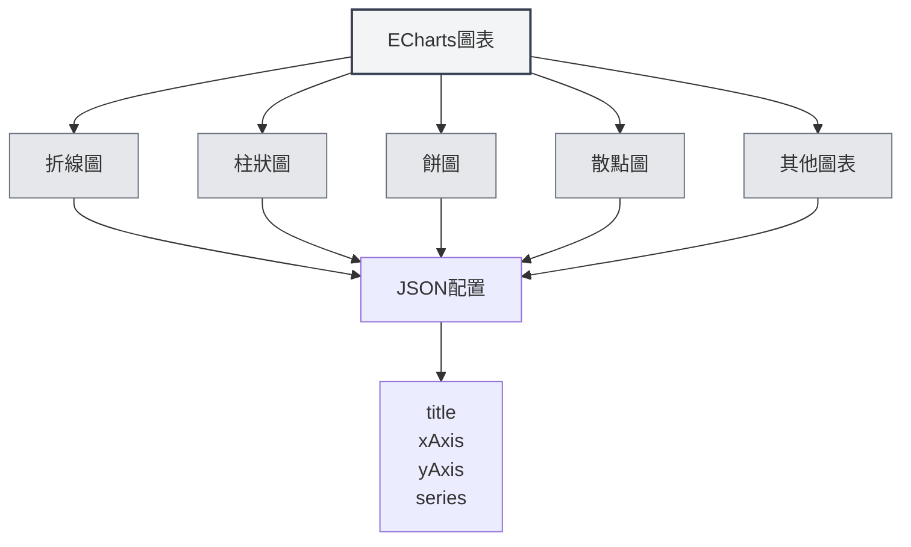

# ECharts圖表

## 概述

ECharts是一個強大的資料視覺化圖表庫，支援多種圖表類型。MetaDoc支援ECharts圖表，可以在Markdown文件中使用ECharts配置建立各種資料視覺化圖表。

<DataAnalysisWindow mode="demo" />

## ECharts語法

<ChartGenerationDisplay mode="demo" />

### 基本語法

ECharts使用JSON配置格式：

````markdown
```echarts
{
  "title": {
    "text": "示例圖表"
  },
  "xAxis": {
    "type": "category",
    "data": ["A", "B", "C"]
  },
  "yAxis": {
    "type": "value"
  },
  "series": [{
    "data": [10, 20, 30],
    "type": "bar"
  }]
}
```
````

### 配置格式

ECharts配置必須是有效的JSON：

- **JSON格式**：使用標準JSON格式
- **英文標點**：使用英文逗號、冒號、引號
- **配置完整**：包含必要的配置項



## 支援的圖表類型

<DataAnalysisDisplay mode="demo" />

### 折線圖

建立折線圖：

````markdown
```echarts
{
  "xAxis": {
    "type": "category",
    "data": ["Mon", "Tue", "Wed"]
  },
  "yAxis": {
    "type": "value"
  },
  "series": [{
    "data": [120, 200, 150],
    "type": "line"
  }]
}
```
````

### 柱狀圖

<ChartGenerationDisplay mode="demo" />

建立柱狀圖：

````markdown
```echarts
{
  "xAxis": {
    "type": "category",
    "data": ["A", "B", "C"]
  },
  "yAxis": {
    "type": "value"
  },
  "series": [{
    "data": [10, 20, 30],
    "type": "bar"
  }]
}
```
````

### 餅圖

<DataAnalysisDisplay mode="demo" />

建立餅圖：

````markdown
```echarts
{
  "series": [{
    "type": "pie",
    "data": [
      {"value": 335, "name": "類別A"},
      {"value": 310, "name": "類別B"},
      {"value": 234, "name": "類別C"}
    ]
  }]
}
```
````

### 散點圖

<ChartGenerationDisplay mode="demo" />

建立散點圖：

````markdown
```echarts
{
  "xAxis": {
    "type": "value"
  },
  "yAxis": {
    "type": "value"
  },
  "series": [{
    "type": "scatter",
    "data": [[10, 20], [15, 25], [20, 30]]
  }]
}
```
````

### 雷達圖

<OutlineTreeDisplay mode="demo" />

建立雷達圖：

````markdown
```echarts
{
  "radar": {
    "indicator": [
      {"name": "指標1", "max": 100},
      {"name": "指標2", "max": 100}
    ]
  },
  "series": [{
    "type": "radar",
    "data": [{
      "value": [80, 90]
    }]
  }]
}
```
````

### 熱力圖

<DataAnalysisDisplay mode="demo" />

建立熱力圖：

````markdown
```echarts
{
  "xAxis": {
    "type": "category",
    "data": ["A", "B", "C"]
  },
  "yAxis": {
    "type": "category",
    "data": ["X", "Y", "Z"]
  },
  "series": [{
    "type": "heatmap",
    "data": [[0, 0, 10], [0, 1, 20], [1, 0, 30]]
  }]
}
```
````

## 圖表配置

<OutlineTreeDisplay mode="demo" />

### 標題配置

設定圖表標題：

```json
{
  "title": {
    "text": "圖表標題",
    "subtext": "副標題"
  }
}
```

### 座標軸配置

配置座標軸：

```json
{
  "xAxis": {
    "type": "category",
    "data": ["A", "B", "C"]
  },
  "yAxis": {
    "type": "value"
  }
}
```

### 系列配置

配置資料系列：

```json
{
  "series": [
    {
      "name": "系列名稱",
      "type": "bar",
      "data": [10, 20, 30]
    }
  ]
}
```

### 圖例配置

配置圖例：

```json
{
  "legend": {
    "data": ["系列1", "系列2"]
  }
}
```

### 工具提示配置

配置工具提示：

```json
{
  "tooltip": {
    "trigger": "axis"
  }
}
```

## 進階功能

<ChartGenerationDisplay mode="demo" />

### 多系列圖表

建立多系列圖表：

````markdown
```echarts
{
  "xAxis": {
    "type": "category",
    "data": ["Mon", "Tue", "Wed"]
  },
  "yAxis": {
    "type": "value"
  },
  "series": [
    {
      "name": "系列1",
      "type": "bar",
      "data": [10, 20, 30]
    },
    {
      "name": "系列2",
      "type": "line",
      "data": [15, 25, 35]
    }
  ]
}
```
````

### 資料縮放

加入資料縮放：

```json
{
  "dataZoom": [
    {
      "type": "slider",
      "start": 0,
      "end": 100
    }
  ]
}
```

### 視覺映射

加入視覺映射：

```json
{
  "visualMap": {
    "min": 0,
    "max": 100,
    "inRange": {
      "color": ["#50a3ba", "#eac736", "#d94e5d"]
    }
  }
}
```

## 渲染方式

### 主行程渲染

ECharts使用主行程渲染：

- **伺服器端渲染**：在主行程中渲染圖表
- **SVG格式**：預設渲染為SVG格式
- **PNG格式**：可以轉換為PNG格式

### 渲染效能

ECharts渲染特點：

- **渲染速度**：主行程渲染速度較快
- **資源佔用**：渲染時佔用主行程資源
- **錯誤處理**：渲染錯誤會在控制台顯示

## 注意事項

### 語法注意事項

1. **JSON格式**：必須使用有效的JSON格式
2. **英文標點**：使用英文逗號、冒號、引號
3. **配置完整**：包含必要的配置項
4. **語法正確**：確保JSON語法正確，否則無法渲染

### 渲染注意事項

1. **配置驗證**：渲染前會驗證配置格式
2. **語法錯誤**：JSON語法錯誤時圖表無法渲染
3. **複雜圖表**：過於複雜的圖表可能影響渲染效能
4. **匯出相容**：匯出時確保圖表在目標格式中正常顯示

## 最佳實踐

1. **配置規範**：遵循ECharts官方配置規範
2. **JSON格式**：確保JSON格式正確
3. **程式碼清晰**：保持配置程式碼清晰易讀
4. **測試渲染**：編輯後測試圖表渲染效果
5. **參考文件**：參考ECharts官方文件和範例

## 相關文件

- [[charts.introduction|圖表功能介紹]]
- [[charts.mermaid|Mermaid圖表]]
- [[charts.plantuml|PlantUML圖表]]
