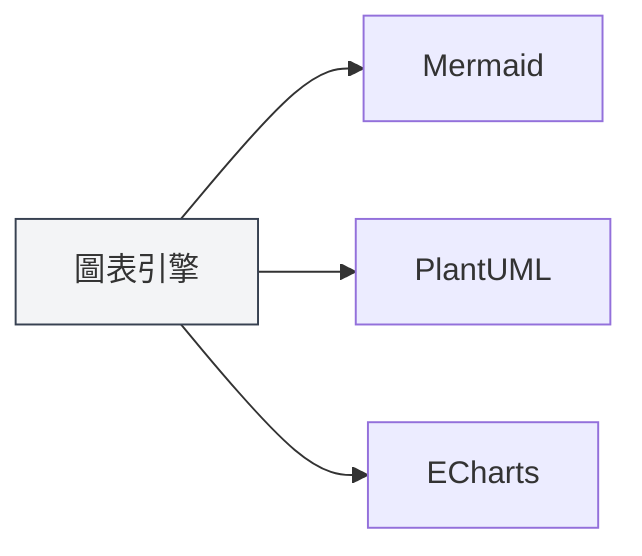
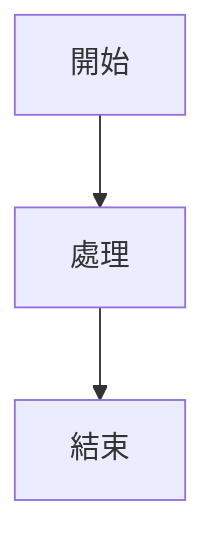

# 圖表功能介紹

## 概述

MetaDoc支援多種圖表繪製引擎，可以在Markdown文件中插入和渲染各種類型的圖表。圖表功能讓您能夠建立流程圖、UML圖、資料視覺化圖表等，豐富文件內容。

<GraphWindow mode="demo" />

## 支援的圖表引擎

<ChartGenerationDisplay mode="demo" />

### 圖表類型

MetaDoc支援以下圖表引擎：

- **Mermaid**：流程圖、UML圖、甘特圖等
- **PlantUML**：專業UML建模圖表
- **ECharts**：資料視覺化圖表
- **Flowchart**：基礎流程圖
- **Graphviz**：圖形視覺化
- **Mindmap**：思維導圖
- **Markmap**：Markdown思維導圖
- **SMILES**：化學結構式
- **ABC**：音樂樂譜

### 引擎對比

<DataAnalysisDisplay mode="demo" />

| 引擎      | 適用場景                       | 渲染方式   |
| --------- | ------------------------------ | ---------- |
| Mermaid   | 流程圖、序列圖、類圖、甘特圖   | 瀏覽器渲染 |
| PlantUML  | 專業UML建模                    | 主行程渲染 |
| ECharts   | 資料視覺化（折線圖、柱狀圖等） | 主行程渲染 |
| Flowchart | 基礎流程圖                     | Vditor渲染 |
| Graphviz  | 圖形視覺化                     | Vditor渲染 |
| Mindmap   | 思維導圖                       | Vditor渲染 |

### 引擎對比圖表

<OutlineTreeDisplay mode="demo" />



## 插入圖表

<DataAnalysisWindow mode="demo" />

### 程式碼區塊語法

在Markdown文件中使用程式碼區塊插入圖表：

````markdown

````

### 圖表類型標識

不同的圖表類型使用不同的程式碼區塊標識：

- **Mermaid**：` ```mermaid `
- **PlantUML**：` ```plantuml `
- **ECharts**：` ```echarts `
- **Flowchart**：` ```flowchart `
- **Graphviz**：` ```graphviz `
- **Mindmap**：` ```mindmap `

## 圖表渲染

<ChartGenerationDisplay mode="demo" />

### 即時渲染

圖表會在編輯器中即時渲染：

- **自動渲染**：輸入圖表程式碼後自動渲染
- **即時預覽**：在預覽視窗中即時顯示圖表
- **錯誤提示**：語法錯誤時會顯示錯誤提示

### 渲染方式

不同圖表使用不同的渲染方式：

- **瀏覽器渲染**：Mermaid等使用瀏覽器API渲染
- **主行程渲染**：PlantUML、ECharts使用主行程渲染
- **Vditor渲染**：Flowchart等使用Vditor渲染

### 渲染格式

圖表可以渲染為不同格式：

- **SVG**：向量圖格式（預設）
- **PNG**：點陣圖格式（可轉換）

## 圖表匯出

<OutlineTreeDisplay mode="demo" />

### 匯出支援

圖表支援匯出到多種格式：

- **PDF匯出**：圖表會包含在PDF中
- **HTML匯出**：圖表會包含在HTML中
- **圖片匯出**：可以單獨匯出圖表為圖片

### 匯出品質

匯出時保持圖表品質：

- **向量圖**：SVG格式保持清晰度
- **點陣圖**：PNG格式適合列印
- **解析度**：根據匯出格式調整解析度

## 圖表編輯

<DataAnalysisDisplay mode="demo" />

### 程式碼編輯

可以直接編輯圖表程式碼：

- **語法突顯**：程式碼區塊支援語法突顯
- **自動補全**：某些編輯器支援自動補全
- **錯誤檢查**：即時檢查語法錯誤

### 預覽更新

編輯程式碼後預覽會自動更新：

- **即時更新**：程式碼修改後預覽立即更新
- **錯誤顯示**：語法錯誤時顯示錯誤資訊
- **渲染狀態**：顯示圖表的渲染狀態

## 多語言支援

<DataAnalysisWindow mode="demo" />

### 圖表程式碼多語言

圖表程式碼支援多語言：

- **中文支援**：可以使用中文標籤和文字
- **英文支援**：可以使用英文標籤和文字
- **混合使用**：可以混合使用中英文

### 國際化

圖表功能支援國際化：

- **介面語言**：圖表相關介面跟隨系統語言
- **錯誤提示**：錯誤提示使用目前語言
- **說明文件**：說明文件支援多語言

## 最佳實踐

1. **選擇合適的引擎**：根據需求選擇合適的圖表引擎
2. **語法規範**：遵循各引擎的語法規範
3. **程式碼清晰**：保持圖表程式碼清晰易讀
4. **測試渲染**：編輯後測試圖表渲染效果
5. **匯出測試**：匯出前測試圖表在目標格式中的顯示效果

## 注意事項

1. **語法正確**：確保圖表程式碼語法正確，否則無法渲染
2. **渲染效能**：複雜圖表可能影響渲染效能
3. **匯出相容**：某些圖表格式可能在某些匯出格式中不相容
4. **程式碼安全**：注意圖表程式碼的安全性，避免惡意程式碼
5. **版本相容**：不同版本的圖表引擎可能有語法差異

## 相關文件

- [[charts.mermaid|Mermaid圖表]]
- [[charts.plantuml|PlantUML圖表]]
- [[charts.echarts|ECharts圖表]]
- [[markdown.features|Markdown編輯器功能]]