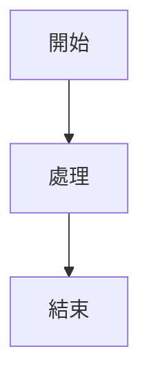
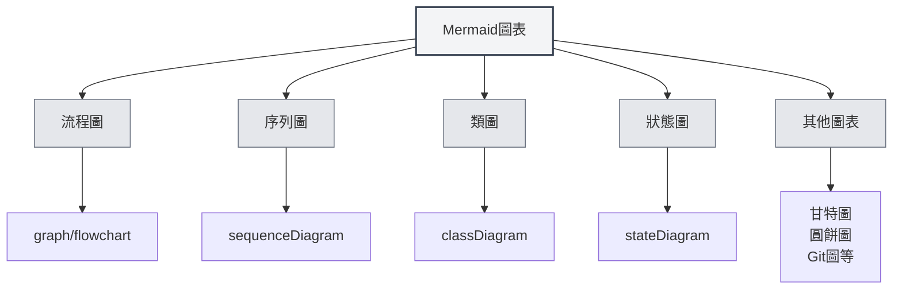
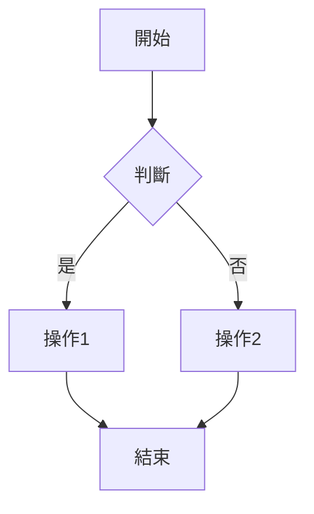
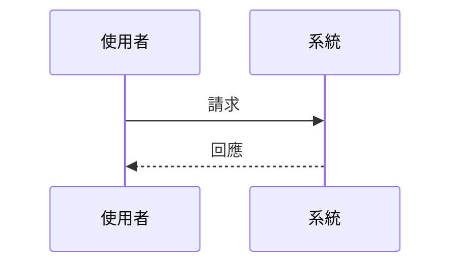
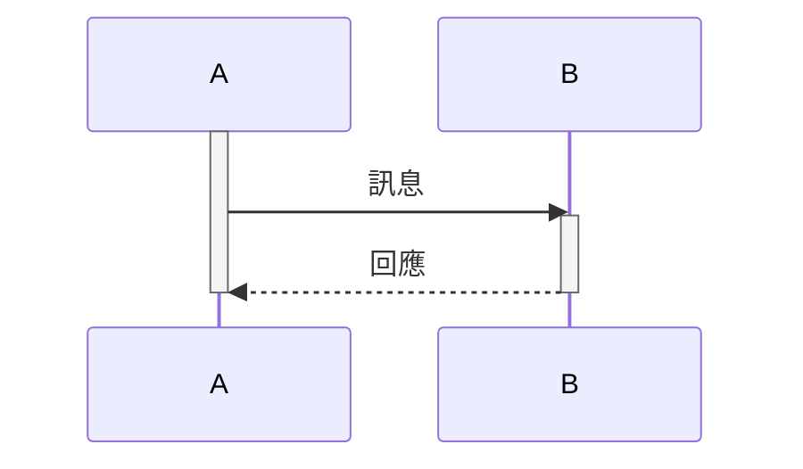
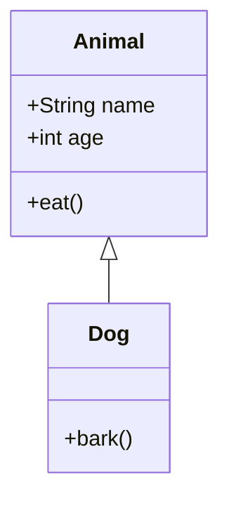
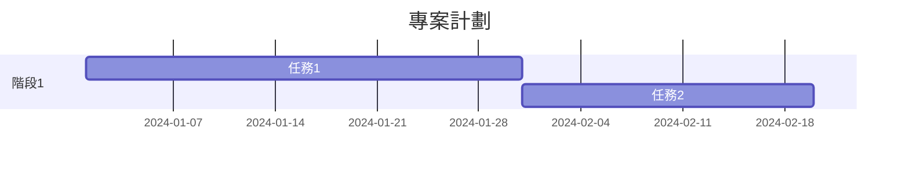
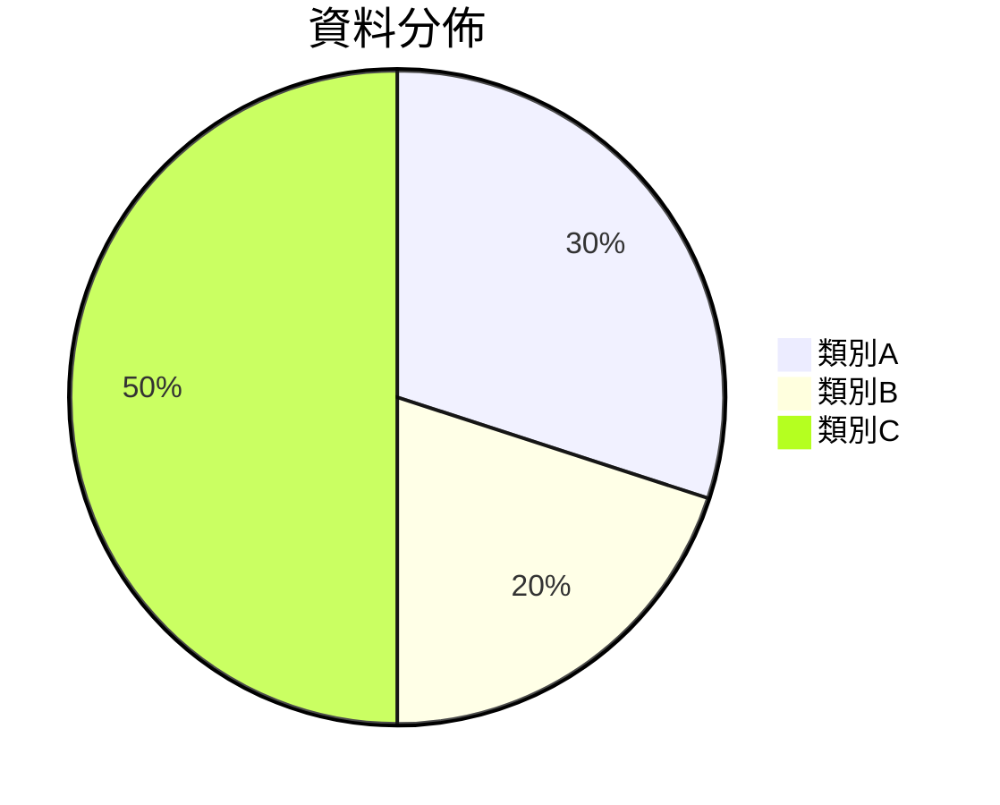
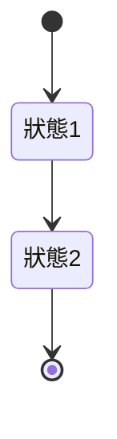
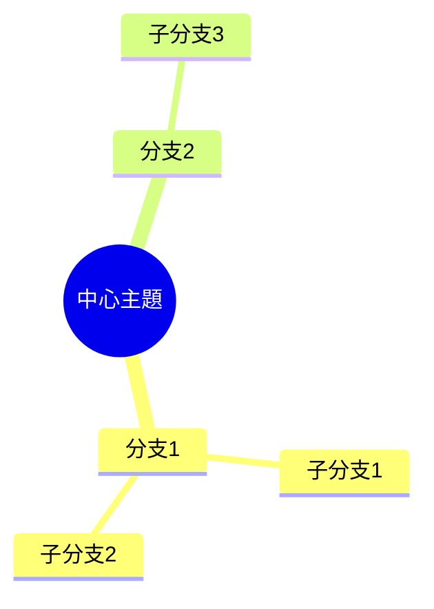

# Mermaid圖表

## 概述

Mermaid是一個流行的圖表繪製工具，適合快速繪製流程圖、序列圖、類圖、甘特圖等。MetaDoc支援Mermaid圖表，可以在Markdown文件中直接使用Mermaid語法建立各種圖表。

<GraphWindow mode="demo" initialTool="mermaid" />

## Mermaid語法

<OutlineTreeDisplay mode="demo" />

### 基本語法

Mermaid使用簡單的文字語法描述圖表：

````markdown

````

### 圖表類型

<ChartGenerationDisplay mode="demo" />

Mermaid支援多種圖表類型：

- **流程圖**（graph/flowchart）
- **序列圖**（sequenceDiagram）
- **類圖**（classDiagram）
- **狀態圖**（stateDiagram）
- **實體關係圖**（erDiagram）
- **甘特圖**（gantt）
- **圓餅圖**（pie）
- **Git圖**（gitgraph）
- **使用者旅程圖**（journey）
- **心智圖**（mindmap）
- **時間軸**（timeline）



## 流程圖

<OutlineTreeDisplay mode="demo" />

### 基本流程圖

建立基本流程圖：

````markdown

````

### 流程圖方向

可以設定流程圖的方向：

- **TD**：從上到下（Top Down）
- **BT**：從下到上（Bottom Top）
- **LR**：從左到右（Left Right）
- **RL**：從右到左（Right Left）

### 節點形狀

可以使用不同的節點形狀：

- **矩形**：`[文字]`
- **圓角矩形**：`(文字)`
- **菱形**：`{文字}`
- **圓形**：`((文字))`
- **六邊形**：`{{文字}}`
- **梯形**：`[/文字\]`
- **倒梯形**：`[\文字/]`

## 序列圖

<DataAnalysisDisplay mode="demo" />

### 基本序列圖

建立序列圖：

````markdown

````

### 訊息類型

可以使用不同類型的訊息：

- **實線箭頭**：`->>` 同步訊息
- **虛線箭頭**：`-->>` 非同步訊息
- **實線**：`->` 同步訊息（不回傳）
- **虛線**：`-->` 非同步訊息（不回傳）

### 啟動框

可以新增啟動框表示物件活動：

````markdown

````

## 類圖

<ChartGenerationDisplay mode="demo" />

### 基本類圖

建立類圖：

````markdown

````

### 類別關係

可以表示不同的類別關係：

- **繼承**：`<|--` 或 `--|>`
- **實作**：`<|..` 或 `..|>`
- **組合**：`*--` 或 `--*`
- **聚合**：`o--` 或 `--o`
- **關聯**：`-->` 或 `<--`
- **依賴**：`..>` 或 `<..`

### 類別成員

可以定義類別的成員：

- **屬性**：`+name: String`（公有）、`-name: String`（私有）
- **方法**：`+method()`（公有）、`-method()`（私有）

## 甘特圖

<OutlineTreeDisplay mode="demo" />

### 基本甘特圖

建立甘特圖：

````markdown

````

### 日期格式

可以設定日期格式：

- **YYYY-MM-DD**：年-月-日
- **MM/DD/YYYY**：月/日/年
- **其他格式**：支援多種日期格式

### 任務關係

可以設定任務關係：

- **after**：在某個任務之後
- **里程碑**：使用`milestone`標記里程碑

## 圓餅圖

<DataAnalysisDisplay mode="demo" />

### 基本圓餅圖

建立圓餅圖：

````markdown

````

## 狀態圖

<ChartGenerationDisplay mode="demo" />

### 基本狀態圖

建立狀態圖：

````markdown

````

## 心智圖

<OutlineTreeDisplay mode="demo" />

### 基本心智圖

建立心智圖：

````markdown

````

## 注意事項

<DataAnalysisDisplay mode="demo" />

### 語法注意事項

1. **字串包裹**：建議使用 `["..."]` 包裹字串避免跳脫錯誤
2. **識別符號**：在類圖中避免使用帶空格或特殊字元的識別符號
3. **中文支援**：可以使用中文，但建議使用英文識別符號
4. **語法版本**：注意Mermaid語法版本，不同版本可能有差異

### 渲染注意事項

1. **語法錯誤**：語法錯誤時圖表無法渲染
2. **複雜圖表**：過於複雜的圖表可能影響渲染效能
3. **瀏覽器相容**：某些瀏覽器可能不支援某些Mermaid特性
4. **匯出相容**：匯出時確保圖表在目標格式中正常顯示

## 最佳實踐

1. **語法規範**：遵循Mermaid官方語法規範
2. **程式碼清晰**：保持圖表程式碼清晰易讀
3. **測試渲染**：編輯後測試圖表渲染效果
4. **使用範例**：參考Mermaid官方文件的範例
5. **版本相容**：注意Mermaid版本相容性

## 相關文件

- [[charts.introduction|圖表功能介紹]]
- [[charts.plantuml|PlantUML圖表]]
- [[charts.echarts|ECharts圖表]]