# PlantUML圖表

## 概述

PlantUML是一個專業的UML建模工具，支援多種UML圖表類型。MetaDoc支援PlantUML圖表，可以在Markdown文件中使用PlantUML語法建立專業的UML圖表。

<GraphWindow mode="demo" initialTool="plantuml" />

## PlantUML語法

<OutlineTreeDisplay mode="demo" />

### 基本語法

PlantUML使用特定的標記和語法：

````markdown
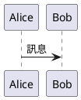
````

### 必需標記

<ChartGenerationDisplay mode="demo" />

PlantUML圖表必須包含：

- **@startuml**：圖表開始標記
- **@enduml**：圖表結束標記

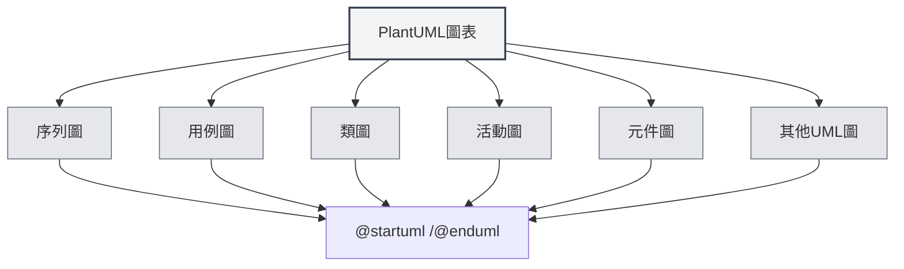

## 支援的圖表類型

<DataAnalysisDisplay mode="demo" />

### 序列圖

建立序列圖：

````markdown
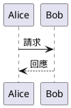
````

### 用例圖

<OutlineTreeDisplay mode="demo" />

建立用例圖：

````markdown
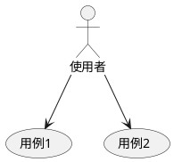
````

### 類圖

<ChartGenerationDisplay mode="demo" />

建立類圖：

````markdown
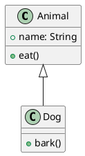
````

### 活動圖

<DataAnalysisDisplay mode="demo" />

建立活動圖：

````markdown
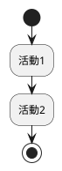
````

### 元件圖

<OutlineTreeDisplay mode="demo" />

建立元件圖：

````markdown
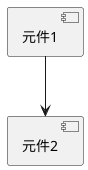
````

### 部署圖

<ChartGenerationDisplay mode="demo" />

建立部署圖：

````markdown
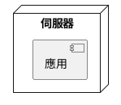
````

### 狀態圖

<DataAnalysisDisplay mode="demo" />

建立狀態圖：

````markdown
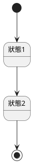
````

## 序列圖詳解

<OutlineTreeDisplay mode="demo" />

### 參與者

定義參與者：

````markdown
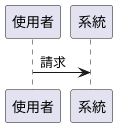
````

### 訊息類型

可以使用不同類型的訊息：

- **同步訊息**：`->`
- **非同步訊息**：`-->`
- **返回訊息**：`<-` 或 `<--`
- **自呼叫**：`->` 指向自己

### 啟動框

新增啟動框：

````markdown
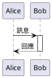
````

## 類圖詳解

<ChartGenerationDisplay mode="demo" />

### 類別定義

定義類別：

````markdown
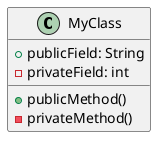
````

### 類別關係

表示類別關係：

- **繼承**：`<|--` 或 `--|>`
- **實作**：`<|..` 或 `..|>`
- **組合**：`*--` 或 `--*`
- **聚合**：`o--` 或 `--o`
- **關聯**：`-->` 或 `<--`
- **依賴**：`..>` 或 `<..`

### 介面和抽象類別

定義介面和抽象類別：

````markdown
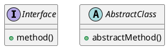
````

## 活動圖詳解

### 基本活動

定義活動：

````markdown

````

### 判斷節點

新增判斷：

````markdown
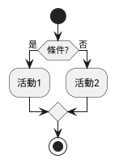
````

### 迴圈

新增迴圈：

````markdown
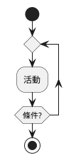
````

## 樣式和主題

### 主題設定

可以設定主題：

````markdown
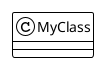
````

### 顏色設定

可以設定顏色：

````markdown
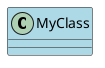
````

## 渲染方式

### 主行程渲染

PlantUML使用主行程渲染：

- **伺服器端渲染**：在主行程中渲染圖表
- **SVG格式**：預設渲染為SVG格式
- **PNG格式**：可以轉換為PNG格式

### 渲染效能

PlantUML渲染特點：

- **渲染速度**：主行程渲染速度較快
- **資源佔用**：渲染時佔用主行程資源
- **錯誤處理**：渲染錯誤會在控制台顯示

## 注意事項

### 語法注意事項

1. **必需標記**：必須包含 `@startuml` 和 `@enduml`
2. **語法規範**：遵循PlantUML官方語法規範
3. **中文支援**：可以使用中文，但建議使用英文識別符號
4. **版本相容**：注意PlantUML版本相容性

### 渲染注意事項

1. **程式碼擷取**：確保程式碼擷取正確，避免包含XML標籤
2. **語法錯誤**：語法錯誤時圖表無法渲染
3. **複雜圖表**：過於複雜的圖表可能影響渲染效能
4. **匯出相容**：匯出時確保圖表在目標格式中正常顯示

## 最佳實踐

1. **語法規範**：遵循PlantUML官方語法規範
2. **程式碼清晰**：保持圖表程式碼清晰易讀
3. **使用標記**：始終使用 `@startuml` 和 `@enduml` 標記
4. **測試渲染**：編輯後測試圖表渲染效果
5. **參考文件**：參考PlantUML官方文件

## 相關文件

- [[charts.introduction|圖表功能介紹]]
- [[charts.mermaid|Mermaid圖表]]
- [[charts.echarts|ECharts圖表]]
