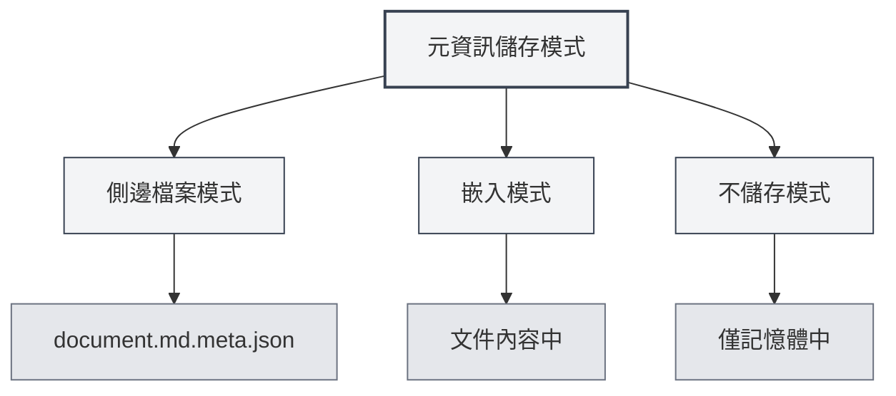

# 文件元資訊

## 概述

文件元資訊是描述文件基本屬性的資料，包括標題、作者、描述、關鍵字等。合理設置元資訊有助於文件管理和檢索，並且在匯出文件時會自動包含這些資訊。

MetaDoc支援為每個文件設置元資訊，這些資訊可以儲存在側邊檔案中、嵌入到文件內容中，或者不儲存。您也可以使用AI自動產生元資訊。

<MetaInfoPanel mode="demo" :meta='{"title": "", "author": "", "description": "", "keywords": []}' :outlineJson='""' />

## 元資訊介紹

### 標題（Title）

文件的標題，通常顯示在文件頂部和標籤頁中。

- **用途**：標識文件的主要內容
- **顯示位置**：標籤頁標題、匯出文件的標題頁
- **範例**：`"MetaDoc使用者手冊"`

<MetaInfoPanel mode="demo" :meta='{"title": "MetaDoc使用者手冊", "author": "", "description": "", "keywords": []}' :outlineJson='""' />

### 作者（Author）

文件的作者或建立者。

- **用途**：標識文件的建立者
- **顯示位置**：匯出文件的作者資訊
- **範例**：`"張三"`

<MetaInfoPanel mode="demo" :meta='{"title": "範例文件", "author": "張三", "description": "", "keywords": []}' :outlineJson='""' />

### 描述（Description）

文件的簡要描述或摘要。

- **用途**：概括文件的主要內容
- **顯示位置**：匯出文件的摘要部分
- **範例**：`"本文件介紹MetaDoc的基本使用方法"`

<MetaInfoPanel mode="demo" :meta='{"title": "範例文件", "author": "作者名", "description": "本文件介紹MetaDoc的基本使用方法", "keywords": []}' :outlineJson='""' />

### 關鍵字（Keywords）

文件的關鍵字列表，用於文件檢索和分類。

- **用途**：幫助檢索和分類文件
- **格式**：字串陣列
- **範例**：`["MetaDoc", "使用者手冊", "文件編輯"]`

<MetaInfoPanel mode="demo" :meta='{"title": "範例文件", "author": "作者名", "description": "文件描述", "keywords": ["MetaDoc", "使用者手冊", "文件編輯"]}' :outlineJson='""' />

## 設置元資訊

### 手動設置

1. **開啟元資訊面板**：

   - 在編輯器中點選工具列的"元資訊"按鈕
   - 或使用快捷鍵（如果配置了）

2. **填寫元資訊**：

   - **標題**：輸入文件標題
   - **作者**：輸入作者名稱
   - **描述**：輸入文件描述（支援多行）
   - **關鍵字**：輸入關鍵字，多個關鍵字用逗號分隔

3. **儲存**：點選"儲存"按鈕儲存元資訊

元資訊面板介面如下：

<MetaInfoPanel mode="demo" :meta='{"title": "範例文件", "author": "作者名", "description": "文件描述", "keywords": ["關鍵字1", "關鍵字2"]}' :outlineJson='""' />

### 批次設置

您可以一次性設置所有元資訊欄位：

1. 開啟元資訊面板
2. 填寫所有欄位
3. 點選"儲存"按鈕

<MetaInfoPanel mode="demo" :meta='{"title": "批次設置範例", "author": "管理員", "description": "批次設置所有元資訊欄位的範例", "keywords": ["批次", "設置", "元資訊"]}' :outlineJson='""' />

### 編輯元資訊

已設置的元資訊可以隨時修改：

1. 開啟元資訊面板
2. 修改需要更改的欄位
3. 點選"儲存"按鈕

修改後的元資訊會立即生效，並在下次儲存文件時儲存。

## 元資訊儲存模式

MetaDoc支援三種元資訊儲存模式，可在[[settings.basic|基礎設置]]中配置：



### 側邊檔案模式

元資訊儲存在與文件同名的側邊檔案中（`.meta.json`）。

<MetaInfoPanel mode="demo" :meta='{"title": "側邊檔案模式範例", "author": "系統", "description": "元資訊儲存在.meta.json檔案中", "keywords": ["側邊檔案", "元資料"]}' :outlineJson='""' />

**優點**：

- 不修改原文件內容
- 可以隨時刪除側邊檔案恢復原文件
- 適合版本控制

**缺點**：

- 會產生額外的檔案
- 移動文件時需要同時移動側邊檔案

**範例**：

- 文件：`document.md`
- 元資訊檔案：`document.md.meta.json`

### 嵌入模式

元資訊嵌入到文件內容中（Markdown的front matter或LaTeX的註釋）。

<MetaInfoPanel mode="demo" :meta='{"title": "嵌入模式範例", "author": "嵌入作者", "description": "元資訊嵌入在文件中", "keywords": ["嵌入", "front matter"]}' :outlineJson='""' />

**優點**：

- 文件和元資訊在一起，便於管理
- 不需要額外的檔案

**缺點**：

- 修改了原文件內容
- 某些格式可能不支援嵌入

**範例**（Markdown）：

```markdown
---
title: 文件標題
author: 作者名稱
description: 文件描述
keywords: [關鍵字1, 關鍵字2]
---

文件內容...
```

### 不儲存模式

元資訊僅在編輯時使用，不儲存到檔案。

<MetaInfoPanel mode="demo" :meta='{"title": "不儲存模式", "author": "臨時", "description": "僅在記憶體中儲存元資訊", "keywords": ["臨時", "不儲存"]}' :outlineJson='""' />

**優點**：

- 不影響原文件
- 不產生額外檔案

**缺點**：

- 關閉文件後元資訊會遺失
- 無法在匯出時使用元資訊

## AI產生元資訊

MetaDoc支援使用AI自動產生文件元資訊，基於文件內容和大綱結構智慧產生。

### 產生單個欄位

產生特定欄位的元資訊：

1. 開啟元資訊面板
2. 點選欄位旁的"AI產生"按鈕
3. 等待AI產生結果
4. 檢視產生的內容，可以接受或重新產生

### 產生所有欄位

一次性產生所有元資訊欄位：

1. 開啟元資訊面板
2. 點選"AI產生全部"按鈕
3. 等待AI產生結果
4. 檢視產生的內容，可以接受、修改或重新產生

<MetaInfoPanel mode="demo" :meta='{"title": "AI產生範例", "author": "AI助手", "description": "使用AI自動產生的元資訊", "keywords": ["AI", "自動產生", "智慧"]}' :outlineJson='""' />

### 產生原理

AI產生元資訊基於：

- **文件大綱**：分析文件的標題結構
- **文件內容**：分析文件的主要內容
- **上下文理解**：理解文件的主題和目的

產生的結果會根據文件內容自動調整，確保元資訊準確反映文件內容。

## 元資訊在匯出中的應用

匯出的文件會自動包含元資訊：

### PDF匯出

- **標題**：顯示在PDF文件屬性中
- **作者**：顯示在PDF文件屬性中
- **描述**：作為PDF主題（Subject）
- **關鍵字**：顯示在PDF文件屬性中

### DOCX匯出

- **標題**：顯示在Word文件屬性中
- **作者**：顯示在Word文件屬性中
- **描述**：作為Word摘要
- **關鍵字**：顯示在Word文件屬性中

### HTML匯出

- **標題**：顯示在HTML的`<title>`標籤中
- **作者**：顯示在HTML的`<meta>`標籤中
- **描述**：顯示在HTML的`<meta>`標籤中
- **關鍵字**：顯示在HTML的`<meta>`標籤中

## 使用技巧

### 合理設置標題

- **簡潔明瞭**：標題應該簡潔地概括文件內容
- **避免過長**：標題過長會影響顯示效果
- **使用關鍵字**：在標題中包含重要的關鍵字

### 關鍵字設置

- **數量適中**：建議設置3-10個關鍵字
- **相關性高**：關鍵字應該與文件內容高度相關
- **避免重複**：避免設置重複或相似的關鍵字

### AI產生優化

- **產生後檢查**：AI產生的內容需要人工檢查
- **適當修改**：根據實際需要修改產生的內容
- **多次產生**：如果不滿意，可以多次產生選擇最佳結果

<MetaInfoPanel mode="demo" :meta='{"title": "元資訊完整範例", "author": "演示使用者", "description": "展示完整的元資訊配置範例", "keywords": ["元資訊", "配置", "範例"]}' :outlineJson='""' />

## 常見問題

### Q: 元資訊儲存在哪裡？

A: 根據儲存模式不同，元資訊可能儲存在側邊檔案、嵌入文件內容中，或不儲存。可以在設置中配置儲存模式。

### Q: 如何刪除元資訊？

A: 在元資訊面板中清空所有欄位並儲存，即可刪除元資訊。

### Q: AI產生的內容不準確怎麼辦？

A: AI產生的內容僅供參考，您可以手動修改或重新產生。建議產生後檢查並調整。

### Q: 元資訊會影響文件內容嗎？

A: 如果使用嵌入模式，元資訊會嵌入到文件內容中。如果使用側邊檔案模式或不儲存模式，不會影響原文件內容。

### Q: 匯出時元資訊會遺失嗎？

A: 不會。匯出時會自動包含元資訊，顯示在匯出文件的屬性中。

## 相關文件

- [[core.file-operations|檔案操作]]
- [[core.export|匯出功能]]
- [[settings.basic|基礎設置]]
- [[ai.assistants|AI助手功能]]
