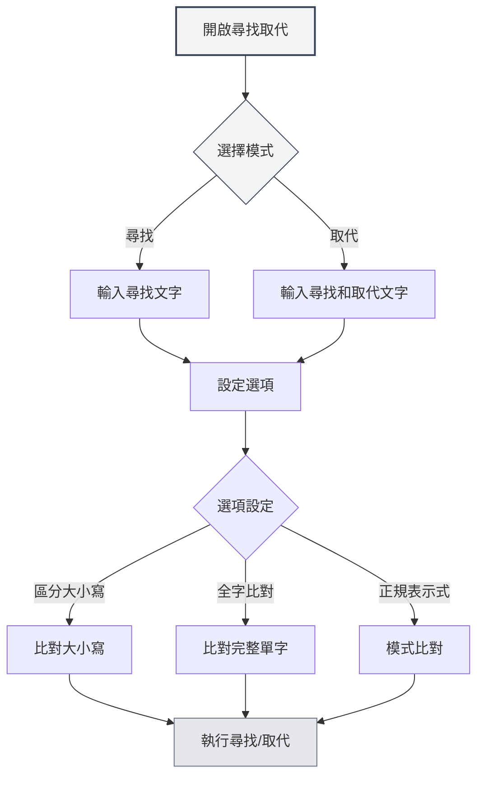

# 編輯器基礎操作

## 概述

編輯器基礎操作是使用MetaDoc編輯文件的基本技能。掌握這些操作能顯著提高您的編輯效率。

MetaDoc的編輯器支援標準的文字編輯操作，包括復原、重做、複製、貼上、剪下、全選和尋找取代等功能。

<SearchReplaceMenu mode="demo" :position='{"top": 100, "left": 200}' :adapter='null' />

<MenuItemsDemo mode="demo" :items='[{"id": "edit"}]' />

## 復原和重做

### 復原操作

復原上一次編輯操作：

- **快速鍵**：`Ctrl+Z`（Windows/Linux）或 `Cmd+Z`（macOS）
- **選單**：點擊「編輯」 → 「復原」

可以連續復原多次操作，直到恢復到文件的初始狀態。

### 重做操作

<MenuItemsDemo mode="demo" :items='[{"id": "edit"}]' />

恢復被復原的操作：

- **快速鍵**：`Ctrl+Y` 或 `Ctrl+Shift+Z`（Windows/Linux）或 `Cmd+Shift+Z`（macOS）
- **選單**：點擊「編輯」 → 「重做」

重做操作會按照復原的相反順序恢復操作。

## 複製、貼上、剪下

<MenuItemsDemo mode="demo" :items='[{"id": "edit"}]' />

### 複製

將選取的文字複製到剪貼簿：

- **快速鍵**：`Ctrl+C`（Windows/Linux）或 `Cmd+C`（macOS）
- **選單**：點擊「編輯」 → 「複製」
- **右鍵選單**：選取文字後右鍵選擇「複製」

### 貼上

<MenuItemsDemo mode="demo" :items='[{"id": "edit"}]' />

將剪貼簿中的內容貼上到目前位置：

- **快速鍵**：`Ctrl+V`（Windows/Linux）或 `Cmd+V`（macOS）
- **選單**：點擊「編輯」 → 「貼上」
- **右鍵選單**：右鍵選擇「貼上」

貼上操作會將內容插入到游標位置，如果已有選取文字，會取代選取的內容。

### 剪下

<MenuItemsDemo mode="demo" :items='[{"id": "edit"}]' />

將選取的文字剪下到剪貼簿（刪除原位置的內容）：

- **快速鍵**：`Ctrl+X`（Windows/Linux）或 `Cmd+X`（macOS）
- **選單**：點擊「編輯」 → 「剪下」
- **右鍵選單**：選取文字後右鍵選擇「剪下」

剪下操作會刪除原位置的文字，並將其儲存到剪貼簿，之後可以貼上到其他位置。

## 全選

<MenuItemsDemo mode="demo" :items='[{"id": "edit"}]' />

選取文件中的所有內容：

- **快速鍵**：`Ctrl+A`（Windows/Linux）或 `Cmd+A`（macOS）
- **選單**：點擊「編輯」 → 「全選」

全選後，您可以：

- 複製整個文件內容
- 刪除整個文件內容
- 統一格式化所有文字

## 尋找取代

### 尋找

<SearchReplaceMenu mode="demo" :position='{"top": 100, "left": 200}' :adapter='null' />

在文件中尋找指定的文字：

- **快速鍵**：`Ctrl+F`（Windows/Linux）或 `Cmd+F`（macOS）
- **選單**：點擊「編輯」 → 「尋找」

尋找功能支援：

- **大小寫比對**：區分大小寫尋找
- **全字比對**：只比對完整的單字
- **正規表示式**：使用正規表示式進行進階尋找
- **醒目提示**：尋找結果會在文件中醒目提示

### 取代

<SearchReplaceMenu mode="demo" :position='{"top": 100, "left": 200}' :adapter='null' />

尋找並取代文字：

- **快速鍵**：`Ctrl+H`（Windows/Linux）或 `Cmd+H`（macOS）
- **選單**：點擊「編輯」 → 「尋找取代」

取代功能支援：

- **單個取代**：逐個取代比對的文字
- **全部取代**：一次性取代所有比對的文字
- **預覽取代**：在取代前預覽取代結果

### 尋找取代選項

尋找取代對話方塊提供以下選項：

- **區分大小寫**：只比對大小寫完全相同的文字
- **全字比對**：只比對完整的單字（不比對單字的一部分）
- **正規表示式**：使用正規表示式進行模式比對
- **循環尋找**：到達文件末尾後自動從頭開始尋找

尋找取代選單介面如下：

<SearchReplaceMenu mode="demo" :position='{"top": 100, "left": 200}' :adapter='null' />

## 文字選取

### 基本選取

- **單擊**：將游標定位到點擊位置
- **拖曳**：選取從起始位置到結束位置的文字
- **雙擊**：選取整個單字
- **三擊**：選取整行

### 擴展選取

- **Shift+點擊**：擴展選取範圍到點擊位置
- **Ctrl+點擊**：新增多個不連續的選取區域（如果編輯器支援）
- **Alt+拖曳**：欄選取模式（如果編輯器支援）

## 游標移動

### 基本移動

- **方向鍵**：上下左右移動游標
- **Home/End**：移動到行首/行尾
- **Ctrl+Home/End**：移動到文件開頭/結尾
- **Page Up/Page Down**：向上/向下翻頁

### 單字移動

- **Ctrl+左/右箭頭**：按單字移動游標
- **Ctrl+上/下箭頭**：向上/向下移動段落

## 刪除操作

### 基本刪除

- **Backspace**：刪除游標前的字元
- **Delete**：刪除游標後的字元
- **Ctrl+Backspace**：刪除游標前的整個單字
- **Ctrl+Delete**：刪除游標後的整個單字

## 編輯器差異

MetaDoc提供兩種主要的編輯器：

### Markdown編輯器（Vditor）

- 支援即時預覽
- 提供格式化工具列
- 支援多種編輯模式（IR/WYSIWYG/SV）
- 詳見[[markdown.editor|Markdown編輯器使用指南]]

### LaTeX編輯器（Monaco）

- 專業的程式碼編輯體驗
- 語法醒目提示和自動完成
- 支援程式碼摺疊
- 詳見[[latex.editor|LaTeX編輯器使用指南]]

兩種編輯器的基礎操作基本相同，但在進階功能上有所差異。

## 快速鍵參考

### 通用快速鍵

| 操作     | Windows/Linux              | macOS         |
| -------- | -------------------------- | ------------- |
| 復原     | `Ctrl+Z`                   | `Cmd+Z`       |
| 重做     | `Ctrl+Y` 或 `Ctrl+Shift+Z` | `Cmd+Shift+Z` |
| 複製     | `Ctrl+C`                   | `Cmd+C`       |
| 貼上     | `Ctrl+V`                   | `Cmd+V`       |
| 剪下     | `Ctrl+X`                   | `Cmd+X`       |
| 全選     | `Ctrl+A`                   | `Cmd+A`       |
| 尋找     | `Ctrl+F`                   | `Cmd+F`       |
| 尋找取代 | `Ctrl+H`                   | `Cmd+H`       |

## 注意事項

1. **復原歷史**：復原歷史在關閉文件後會清空，建議及時儲存文件
2. **剪貼簿**：複製和剪下的內容儲存在系統剪貼簿中，關閉應用後可能遺失
3. **尋找取代**：使用正規表示式時，注意逸出特殊字元
4. **大文件**：在處理大文件時，尋找取代操作可能需要一些時間

## 相關文件

- [[core.file-operations|檔案操作]]
- [[core.editor-settings|編輯器設定]]
- [[markdown.editor|Markdown編輯器使用指南]]
- [[latex.editor|LaTeX編輯器使用指南]]