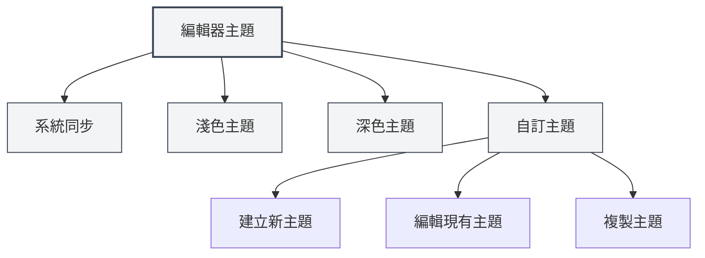
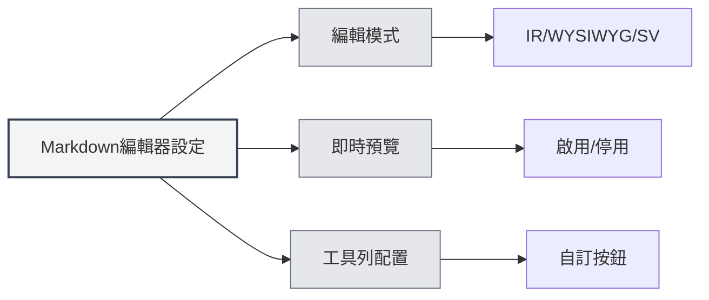

# 編輯器設定

## 概述

編輯器設定允許您自訂編輯器的外觀和行為，包括主題、字型、行號顯示等。合理的設定能提升您的編輯體驗和工作效率。

編輯器設定分為全域設定和編輯器特定設定。全域設定會影響所有編輯器，而某些設定可能只適用於特定類型的編輯器（如Markdown編輯器或LaTeX編輯器）。

<MenuItemsDemo mode="demo" :items='[{"id": "settings"}]' />

## 編輯器主題

<MenuItemsDemo mode="demo" :items='[{"id": "settings"}]' />

### 主題類型

MetaDoc支援多種主題模式：

- **系統同步**：自動跟隨系統主題（淺色/深色）
- **淺色主題**：始終使用淺色主題
- **深色主題**：始終使用深色主題
- **自訂主題**：使用自訂顏色配置

### 設定主題

<SettingThemeSection mode="demo" />

1. 開啟設定頁面（點擊選單"設定"或使用快速鍵）
2. 進入"主題設定"部分
3. 選擇您喜歡的主題

您可以透過頂部選單列存取設定：

點擊頂部選單列的"設定"選單，可以開啟設定面板，配置編輯器主題、內容主題、程式碼主題等選項。

<MenuItemsDemo mode="demo" :items='[{"id": "settings"}]' />

主題設定會立即生效，無需重啟應用。

### 自訂主題

<SettingThemeSection mode="demo" />

您可以建立和編輯自訂主題：

1. 在主題設定頁面點擊"新增主題"
2. 設定主題名稱和主題顏色
3. 儲存後即可使用

自訂主題支援：

- **編輯**：修改主題名稱和顏色
- **複製**：複製現有主題作為新主題的起點
- **刪除**：刪除不需要的自訂主題

## 內容主題

<SettingThemeSection mode="demo" />

內容主題控制文件預覽區域的顯示樣式：

- **自動**：根據全域主題自動選擇
- **淺色**：始終使用淺色預覽樣式
- **深色**：始終使用深色預覽樣式

內容主題主要影響Markdown預覽和PDF預覽的顯示效果。

## 程式碼主題

<SettingThemeSection mode="demo" />

程式碼主題控制程式碼區塊的語法突顯樣式：

- **自動**：根據全域主題自動選擇
- **預設主題**：選擇預設的程式碼主題（如GitHub、Monokai、Solarized等）

程式碼主題影響：

- Markdown程式碼區塊的語法突顯
- LaTeX編輯器的程式碼突顯
- 控制台輸出的顯示樣式

## 字型設定

<SettingBasicSection mode="demo" />

### 編輯器字型

編輯器使用的字型可以在系統設定中配置。預設使用等寬字型，如：

- JetBrains Mono
- Consolas
- Courier New
- Microsoft YaHei Mono

### 字型大小

- **放大**：使用 `Ctrl+=` 或 `Ctrl+滑鼠滾輪向上`
- **縮小**：使用 `Ctrl+-` 或 `Ctrl+滑鼠滾輪向下`
- **重設**：使用 `Ctrl+0` 重設為預設大小

字型大小調整會立即生效，但不會儲存到設定中。

## 行號顯示

<SettingBasicSection mode="demo" />

### 顯示/隱藏行號

行號顯示設定控制編輯器是否顯示行號：

- **啟用**：顯示行號，方便定位程式碼位置
- **停用**：隱藏行號，獲得更大的編輯區域

### 設定行號顯示

1. 開啟設定頁面
2. 在"編輯器設定"部分找到"行號顯示"
3. 切換開關啟用或停用行號

行號設定會影響：

- LaTeX編輯器
- 純文字編輯器
- 程式碼預覽區域

注意：Markdown編輯器（Vditor）的行號顯示由其自身配置控制。

## 小地圖顯示

小地圖（Minimap）是編輯器右側的程式碼縮圖，幫助您快速瀏覽和定位文件內容。

### 顯示/隱藏小地圖

小地圖顯示設定：

- **啟用**：顯示小地圖，方便瀏覽長文件
- **停用**：隱藏小地圖，獲得更大的編輯區域

### 設定小地圖

小地圖設定通常在編輯器的右鍵選單或工具列中：

1. 在編輯器中右鍵
2. 尋找"小地圖"或"Minimap"選項
3. 切換顯示狀態

小地圖功能主要適用於：

- LaTeX編輯器（Monaco）
- 純文字編輯器（Monaco）

## 編輯器特定設定

### Markdown編輯器設定

Markdown編輯器（Vditor）的特定設定：

- **編輯模式**：IR模式、WYSIWYG模式、SV模式
- **即時預覽**：啟用/停用即時預覽功能
- **工具列配置**：自訂工具列按鈕

詳見[[markdown.editor|Markdown編輯器使用指南]]。

### LaTeX編輯器設定

LaTeX編輯器（Monaco）的特定設定：

- **程式碼摺疊**：啟用/停用程式碼摺疊功能
- **自動換行**：控制長行的顯示方式
- **語法檢查**：啟用/停用LaTeX語法檢查

詳見[[latex.editor|LaTeX編輯器使用指南]]。

## 設定同步

編輯器設定會儲存在本機配置中，包括：

- 主題選擇
- 行號顯示偏好
- 字型大小（目前工作階段）
- 小地圖顯示狀態

設定會在應用重啟後自動恢復。

## 快速鍵參考

### 字型調整

| 操作         | Windows/Linux | macOS      |
| ------------ | ------------- | ---------- |
| 放大字型     | `Ctrl+=`      | `Cmd+=`    |
| 縮小字型     | `Ctrl+-`      | `Cmd+-`    |
| 重設字型     | `Ctrl+0`      | `Cmd+0`    |
| 滑鼠滾輪縮放 | `Ctrl+滾輪`   | `Cmd+滾輪` |

## 最佳實踐

1. **主題選擇**：

   - 長時間編輯建議使用深色主題，減少眼部疲勞
   - 列印預覽時使用淺色主題，獲得更好的列印效果

2. **行號顯示**：

   - 編寫程式碼時建議啟用行號，方便定位錯誤
   - 純文字編輯時可以關閉行號，獲得更大編輯區域

3. **小地圖**：

   - 編輯長文件時啟用小地圖，快速瀏覽文件結構
   - 編輯短文件時可以關閉小地圖

4. **字型大小**：
   - 根據螢幕大小和個人習慣調整字型大小
   - 建議使用14-16px的字型大小，平衡可讀性和螢幕空間

## 注意事項

1. **主題同步**：選擇"系統同步"後，主題會跟隨系統設定自動切換
2. **設定範圍**：某些設定只影響特定編輯器，不影響其他編輯器
3. **效能影響**：啟用某些功能（如即時預覽）可能會影響編輯效能
4. **自訂主題**：自訂主題的顏色會影響整個應用的配色方案

## 相關文件

- [[core.editor-basics|編輯器基礎操作]]
- [[settings.basic|基礎設定]]
- [[settings.theme|主題設定]]
- [[markdown.editor|Markdown編輯器使用指南]]
- [[latex.editor|LaTeX編輯器使用指南]]
