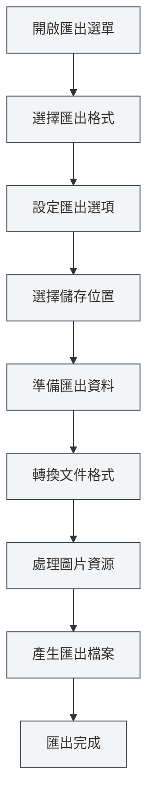

# 匯出功能

## 概述

MetaDoc支援將文件匯出為多種格式，包括PDF、HTML、DOCX、LaTeX、Markdown、JSON等。匯出功能會根據文件格式提供不同的匯出選項，確保匯出的文件保持原有的格式和樣式。

匯出功能會自動包含文件中繼資訊（標題、作者、描述、關鍵字），並在匯出過程中處理圖片、表格、數學公式等元素。

<MenuItemsDemo mode="demo" :items='[{"id": "file", "items": ["export"]}]' />

<MetaInfoPanel mode="demo" :meta='{"title": "匯出範例", "author": "作者", "description": "文件描述", "keywords": ["匯出", "PDF"]}' :outlineJson='""' />

<MenuItemsDemo mode="demo" :items='[{"id": "file", "items": ["export"]}]' />

<MetaInfoPanel mode="demo" :meta='{"title": "匯出格式", "author": "MetaDoc", "description": "支援的匯出格式介紹", "keywords": ["匯出", "格式"]}' :outlineJson='""' />

## 匯出格式支援

<MenuItemsDemo mode="demo" :items='[{"id": "file", "items": ["export"]}]' />

### Markdown文件匯出

Markdown文件（`.md`）可以匯出為以下格式：

- **PDF**：適合列印和分享
- **HTML**：適合網頁展示
- **DOCX**：適合Word編輯
- **LaTeX**：適合學術論文
- **JSON**：適合程式處理

<MetaInfoPanel mode="demo" :meta='{"title": "LaTeX匯出", "author": "系統", "description": "LaTeX文件匯出選項", "keywords": ["LaTeX", "匯出"]}' :outlineJson='""' /

### LaTeX文件匯出

LaTeX文件（`.tex`）可以匯出為以下格式：

- **PDF**：透過LaTeX編譯產生
- **Markdown**：轉換為Markdown格式
- **HTML**：轉換為HTML格式
- **DOCX**：轉換為Word格式

<MenuItemsDemo mode="demo" :items='[{"id": "file", "items": ["export"]}]' /

### JSON文件匯出

JSON文件（`.json`）可以匯出為：

- **JSON**：保持JSON格式

## 匯出操作

### 基本匯出

1. **開啟匯出選單**：
   - 點擊選單列的"檔案" → "匯出"
   - 或使用快速鍵（如果已設定）

檔案選單中的匯出選項如下：

<MenuItemsDemo mode="demo" :items='[{"id": "file", "items": ["export"]}]' />

2. **選擇匯出格式**：

   - 在匯出選單中選擇目標格式
   - 系統會根據目前文件格式顯示可用的匯出選項

3. **選擇儲存位置**：

   - 在檔案儲存對話方塊中選擇儲存位置
   - 輸入檔案名稱（系統會自動加入正確的副檔名）

4. **等待匯出完成**：
   - 匯出過程中會顯示進度條
   - 匯出完成後會顯示成功提示

### 快速匯出

對於常用格式，可以使用快速鍵快速匯出：

- **匯出為PDF**：`Ctrl+Shift+E`（如果已設定）
- **匯出為HTML**：透過選單選擇

## Markdown匯出詳解

<MenuItemsDemo mode="demo" :items='[{"id": "file", "items": ["export"]}]' />

### 匯出為PDF

PDF匯出會將Markdown轉換為PDF格式：

- **包含內容**：文件正文、圖片、表格、數學公式
- **包含中繼資訊**：標題、作者、描述、關鍵字
- **樣式**：使用PDF專用樣式，適合列印
- **圖片處理**：圖片會自動調整大小以適應頁面

**使用場景**：

- 列印文件
- 分享文件給他人
- 歸檔儲存

### 匯出為HTML

<MetaInfoPanel mode="demo" :meta='{"title": "HTML匯出", "author": "系統", "description": "HTML匯出設定和選項", "keywords": ["HTML", "匯出"]}' :outlineJson='""' />

HTML匯出會將Markdown轉換為網頁格式：

- **包含內容**：文件正文、圖片、表格、數學公式
- **包含中繼資訊**：標題、作者、描述、關鍵字（在HTML的meta標籤中）
- **樣式**：使用HTML樣式，適合網頁展示
- **圖片處理**：可以選擇保留原始URL、轉換為base64或儲存到資料夾

**使用場景**：

- 發佈到網站
- 在瀏覽器中檢視
- 分享給他人

### 匯出為DOCX

<MenuItemsDemo mode="demo" :items='[{"id": "file", "items": ["export"]}]' />

DOCX匯出會將Markdown轉換為Word格式：

- **包含內容**：文件正文、圖片、表格、數學公式
- **包含中繼資訊**：標題、作者、描述、關鍵字（在Word文件屬性中）
- **樣式**：使用Word樣式，可以在Word中進一步編輯
- **圖片處理**：圖片會嵌入到Word文件中

**使用場景**：

- 在Word中進一步編輯
- 與他人協作編輯
- 提交文件

### 匯出為LaTeX

<MetaInfoPanel mode="demo" :meta='{"title": "LaTeX匯出", "author": "學術", "description": "Markdown轉LaTeX匯出", "keywords": ["LaTeX", "學術"]}' :outlineJson='""' />

LaTeX匯出會將Markdown轉換為LaTeX格式：

- **包含內容**：文件正文、圖片、表格、數學公式
- **包含中繼資訊**：標題、作者、描述、關鍵字（在LaTeX文件中）
- **格式轉換**：Markdown語法轉換為對應的LaTeX命令
- **數學公式**：保持LaTeX數學公式格式

**使用場景**：

- 學術論文寫作
- 需要LaTeX格式的場景
- 進一步編輯LaTeX文件

### 匯出為JSON

<MenuItemsDemo mode="demo" :items='[{"id": "file", "items": ["export"]}]' />

JSON匯出會將文件儲存為JSON格式：

- **包含內容**：文件的所有資料（內容、中繼資訊、大綱等）
- **格式**：結構化的JSON資料
- **用途**：程式處理、資料備份

## LaTeX匯出詳解

<MetaInfoPanel mode="demo" :meta='{"title": "LaTeX匯出詳解", "author": "系統", "description": "LaTeX文件匯出詳細說明", "keywords": ["LaTeX", "PDF", "匯出"]}' :outlineJson='""' />

### 匯出為PDF

LaTeX文件匯出為PDF需要透過LaTeX編譯：

1. **編譯LaTeX**：系統會自動編譯LaTeX文件
2. **產生PDF**：編譯成功後產生PDF檔案
3. **包含中繼資訊**：PDF文件屬性中包含中繼資訊

**注意事項**：

- 需要安裝LaTeX發行版（如TeX Live）
- 編譯可能需要一些時間
- 如果編譯失敗，會顯示錯誤訊息

### 匯出為Markdown

LaTeX文件可以轉換為Markdown格式：

- **格式轉換**：LaTeX命令轉換為Markdown語法
- **數學公式**：LaTeX公式轉換為Markdown數學公式格式
- **表格**：LaTeX表格轉換為Markdown表格

### 匯出為HTML

LaTeX文件可以轉換為HTML格式：

- **格式轉換**：LaTeX命令轉換為HTML標籤
- **數學公式**：使用MathJax或KaTeX渲染
- **樣式**：使用HTML樣式展示

### 匯出為DOCX

LaTeX文件可以轉換為Word格式：

- **格式轉換**：LaTeX命令轉換為Word格式
- **數學公式**：轉換為Word數學公式格式
- **表格**：轉換為Word表格格式

## 匯出選項設定

### 圖片處理選項

匯出時可以設定圖片處理方式：

- **保留原始URL**：保持圖片的原始URL（適用於HTML匯出）
- **轉換為Base64**：將圖片嵌入到文件中（適用於HTML、DOCX匯出）
- **儲存到資料夾**：將圖片儲存到指定資料夾（適用於HTML匯出）

### PDF匯出選項

PDF匯出支援以下選項：

- **頁面大小**：A4、Letter等
- **頁邊距**：自訂頁邊距
- **字型**：選擇字型和字號
- **圖片品質**：調整圖片品質

### HTML匯出選項

HTML匯出支援以下選項：

- **樣式**：選擇HTML樣式主題
- **數學公式渲染**：選擇MathJax或KaTeX
- **程式碼高亮**：啟用或停用程式碼高亮

## 匯出進度

匯出過程中會顯示進度條：

- **準備階段**：準備匯出資料
- **轉換階段**：轉換文件格式
- **處理圖片**：處理文件中的圖片
- **產生檔案**：產生最終檔案

如果匯出時間較長，您可以：

- **檢視進度**：在進度條中檢視目前進度
- **取消匯出**：點擊"取消"按鈕取消匯出操作

## 匯出檔案命名

匯出的檔案會自動命名：

- **預設名稱**：使用文件標題或檔案名稱
- **自動副檔名**：根據匯出格式自動加入副檔名
- **自訂名稱**：可以在儲存對話方塊中選擇自訂名稱

## 使用技巧

### 選擇合適的格式

- **PDF**：適合列印和正式分享
- **HTML**：適合網頁展示和線上檢視
- **DOCX**：適合需要進一步編輯的場景
- **LaTeX**：適合學術寫作和需要LaTeX格式的場景

### 圖片處理建議

- **HTML匯出**：如果要在網頁上展示，建議使用Base64或儲存到資料夾
- **DOCX匯出**：圖片會自動嵌入，無需額外處理
- **PDF匯出**：圖片會自動調整大小，確保適合頁面

### 批次匯出

如果需要匯出多個文件：

1. 逐個開啟文件
2. 分別匯出為需要的格式
3. 或使用指令碼批次處理（進階使用者）

## 常見問題

### Q: 匯出失敗怎麼辦？

A: 檢查文件是否有錯誤，確保所有圖片和資源都可存取。如果匯出PDF失敗，檢查LaTeX編譯是否有錯誤。

### Q: 匯出的PDF格式不正確？

A: 檢查PDF匯出選項設定，調整頁面大小和頁邊距。確保文件內容格式正確。

### Q: 圖片在匯出後不顯示？

A: 檢查圖片路徑是否正確，確保圖片檔案存在。對於HTML匯出，選擇合適的圖片處理方式。

### Q: 可以自訂匯出樣式嗎？

A: 部分格式支援自訂樣式，可以在匯出選項中設定。PDF和HTML匯出支援樣式自訂。

### Q: 匯出會包含中繼資訊嗎？

A: 是的，匯出時會自動包含文件中繼資訊（標題、作者、描述、關鍵字），顯示在匯出文件的屬性中。

## 相關文件

- [[core.file-operations|檔案操作]]
- [[core.document-metadata|文件中繼資訊]]
- [[markdown.basics|Markdown語法]]
- [[latex.basics|LaTeX語法]]
- [[latex.compilation|LaTeX編譯與預覽]]