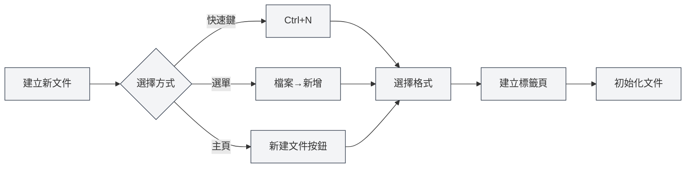
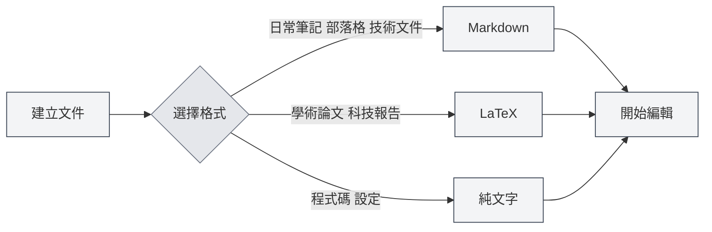
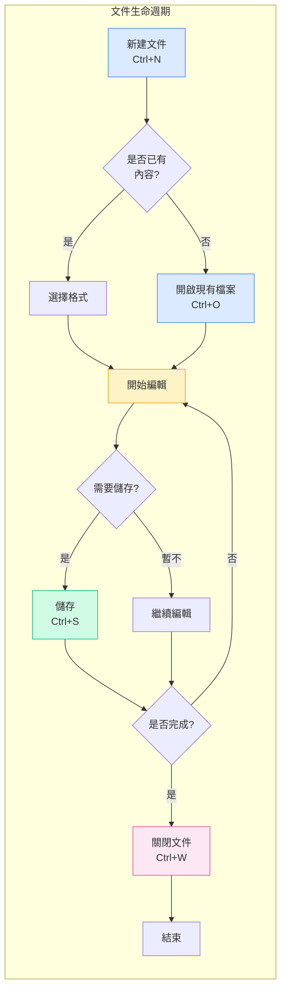

# 檔案操作

## 概述

檔案操作是MetaDoc的基礎功能。無論您是在撰寫技術文件、學術論文，還是記錄日常筆記，熟練的檔案操作都能讓創作過程更加順暢。本文將詳細介紹如何建立、開啟、儲存和管理文件。

## 新建文件

<MainTabs mode="demo" />

<MenuItemsDemo mode="demo" :items='[{"id": "file", "items": ["new"]}]' />

### 建立空白文件

MetaDoc提供了多種便捷方式建立新文件，您可以根據當前操作習慣選擇最適合的方法：

**方法一：快速鍵（最快）**

- 按下 `Ctrl+N`，立即建立新文件
- 適合正在編輯時快速建立新文件

**方法二：檔案選單**

- 點擊左側選單列的"檔案"圖示
- 在展開的選單中選擇"新增"

**方法三：主頁入口**

- 在主頁點擊"新建文件"按鈕
- 適合剛開啟應用時開始創作

下方展示了檔案選單的介面，包含新建、開啟、儲存等常用操作：

<MenuItemsDemo mode="demo" :items='[{"id": "file", "items": ["new", "open", "save", "save-as", "save-all", "close"]}]' />

<MainTabs mode="demo" />

**建立文件後的狀態**：

建立新文件後，您會看到：

- 頂部出現一個新的標籤頁，標題顯示為"未命名"
- 系統會詢問您選擇文件格式（Markdown、LaTeX或純文字）
- 此時文件只在記憶體中，需要儲存後才能保留到磁碟

### 選擇文件格式

建立文件時，您需要選擇文件格式。不同格式適用於不同場景：

**Markdown (.md)** —— 最常用的輕量級格式

- 適合：日常筆記、部落格文章、技術文件、專案文件
- 優點：語法簡單、易於閱讀、匯出格式豐富
- 範例使用場景：記錄會議要點、寫技術部落格、整理學習筆記

**LaTeX (.tex)** —— 專業的學術排版格式

- 適合：學術論文、學位論文、科技報告、數學文件
- 優點：排版精美、公式支援完善、自動產生目錄和引用
- 範例使用場景：撰寫科研論文、編寫數學教材、準備學術報告

**純文字 (.txt)** —— 最簡單的文字格式

- 適合：程式碼片段、設定檔、臨時筆記
- 優點：通用性強、任何編輯器都能開啟
- 範例使用場景：儲存程式碼片段、記錄臨時資訊

## 開啟文件

<MenuItemsDemo mode="demo" :items='[{"id": "file", "items": ["open"]}]' />

### 開啟已有檔案

1.  **快速鍵方式**：按 `Ctrl+O` 開啟檔案選擇對話方塊
2.  **選單方式**：點擊"檔案" → "開啟"
3.  **主頁方式**：在主頁點擊"開啟檔案"按鈕

### 支援的檔案格式

MetaDoc支援開啟以下格式的檔案：

- `.md` - Markdown文件
- `.tex` - LaTeX文件
- `.txt` - 純文字檔案
- `.json` - JSON格式檔案

### 最近檔案清單

主頁會顯示最近開啟的文件清單，方便您快速存取：

- 點擊最近文件卡片即可快速開啟
- 右鍵點擊可以刪除最近文件記錄
- 最多顯示12個最近文件

### 檔案關聯

MetaDoc支援檔案關聯功能：

- 雙擊系統中的 `.md` 或 `.tex` 檔案，會自動使用MetaDoc開啟
- 如果檔案已在其他視窗中開啟，會提示您檔案已在其他視窗開啟

## 儲存文件

<MenuItemsDemo mode="demo" :items='[{"id": "file", "items": ["save", "save-as", "save-all"]}]' />

### 儲存目前文件

養成經常儲存的好習慣，可以避免因意外情況遺失工作成果。

**儲存方式**：

- **快速鍵**（推薦）：`Ctrl+S` —— 最常用的儲存方式，一手不離鍵盤
- **選單操作**：點擊"檔案"選單 → "儲存"

**首次儲存**：
如果文件是新建的，第一次儲存時會彈出"另存新檔"對話方塊，您需要：

1.  選擇儲存位置（如"文件"資料夾）
2.  輸入檔案名稱（如"專案計劃.md"）
3.  點擊"儲存"按鈕

**已儲存文件的更新儲存**：
如果文件之前已經儲存過，按 `Ctrl+S` 會直接覆蓋原檔案，不會有對話方塊彈出。

### 另存新檔 —— 建立文件副本

當您需要保留原文件的同時建立一個新版本時，使用"另存新檔"功能。

**使用場景**：

- 修改文件前建立備份副本
- 將文件儲存到不同位置
- 以不同檔案名稱儲存文件的不同版本

**操作方式**：

- **快速鍵**：`Ctrl+Shift+S`
- **選單**：點擊"檔案" → "另存新檔"

**範例**：
您正在編輯"報告v1.md"，想儲存一個備份後再大幅修改：

1.  按 `Ctrl+Shift+S`
2.  輸入新檔案名稱"報告v1\_備份.md"
3.  點擊儲存
4.  繼續編輯原文件，安心修改

### 全部儲存 —— 一鍵儲存所有文件

當您同時開啟了多個文件，可以使用"全部儲存"功能一次性儲存所有文件。

**操作方式**：

- **快速鍵**：`Ctrl+K S`（先按 `Ctrl+K`，再按 `S`）
- **選單**：點擊"檔案" → "全部儲存"

**使用場景**：

- 工作結束時快速儲存所有開啟的文件
- 確保所有修改都被儲存

### 自動儲存 —— 讓系統幫您儲存

MetaDoc支援自動儲存功能，可以在您專注於創作時自動儲存文件。

**設定方法**：
進入 [[settings.basic|基礎設定]]，找到"自動儲存"選項，選擇合適的時間間隔：

- **關閉**：手動控制儲存時機
- **1分鐘**：最保險，但會增加磁碟寫入
- **5分鐘**：平衡方案（推薦）
- **10分鐘/30分鐘/1小時**：適合長文件，減少儲存頻率

**工作原理**：

- 自動儲存在背景靜默進行，不會打斷您的編輯
- 自動儲存時，標籤頁上的"未儲存"標記會消失
- 您可以隨時手動儲存（`Ctrl+S`），不受自動儲存影響

**建議**：

- 對於重要文件，建議啟用5分鐘自動儲存
- 即使啟用了自動儲存，在關鍵節點（如完成一個章節）仍建議手動儲存

## 關閉檔案

<MainTabs mode="demo" />

### 關閉目前標籤頁

- **快速鍵**：`Ctrl+W`
- **點擊標籤頁關閉按鈕**：點擊標籤頁右側的 × 按鈕

### 關閉前提示

如果文件有未儲存的變更，關閉時會提示您：

- **儲存**：儲存變更後關閉
- **不儲存**：放棄變更直接關閉
- **取消**：取消關閉操作

### 重新開啟已關閉的標籤頁

- **快速鍵**：`Ctrl+Shift+T`

可以恢復最近關閉的標籤頁（最多恢復20個）。

## 多標籤頁管理

<MainTabs mode="demo" />

MetaDoc支援同時開啟多個文件，每個文件在獨立的標籤頁中顯示：

標籤頁欄顯示所有開啟的文件，支援切換、關閉、拖曳等操作：

<MainTabs mode="demo" />

- **切換標籤頁**：使用 `Ctrl+Tab` 切換到下一個標籤頁，`Ctrl+Shift+Tab` 切換到上一個
- **拖曳排序**：拖曳標籤頁可以重新排序
- **固定標籤頁**：右鍵標籤頁選擇"固定"，固定後的標籤頁始終靠左顯示且不可關閉

更多標籤頁操作詳見[[core.multi-tab|多標籤頁管理]]。

## 檔案狀態指示

標籤頁會顯示文件的狀態：

- **未儲存**：標籤頁標題旁顯示圓點（●），表示有未儲存的變更
- **已儲存**：無特殊標記
- **唯讀**：顯示鎖定圖示，表示檔案為唯讀模式

## 注意事項

1.  **檔案路徑**：儲存檔案時，確保有足夠的磁碟空間和寫入權限
2.  **檔案格式**：儲存時注意選擇合適的檔案格式，避免格式不相容
3.  **備份**：重要文件建議定期備份，可以使用"另存新檔"功能建立副本
4.  **檔案衝突**：如果檔案在外部被修改，MetaDoc會偵測並提示您處理衝突

## 相關文件

- [[core.editor-basics|編輯器基礎操作]]
- [[core.multi-tab|多標籤頁管理]]
- [[core.document-metadata|文件元資訊]]
- [[core.export|匯出功能]]
- [[settings.basic|基礎設定]]