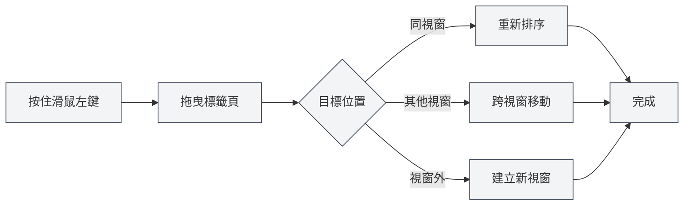

# 多標籤頁管理

## 概述

MetaDoc 支援多標籤頁管理，允許您同時開啟多個文件，每個文件在獨立的標籤頁中顯示。掌握標籤頁操作能顯著提高您的工作效率。

標籤頁管理包括新建、切換、關閉、拖曳排序、固定等功能，讓您能夠靈活地組織和管理多個文件。

<MainTabs mode="demo" />

<AIChat mode="demo" />

<KnowledgeBase mode="demo" />

<ProofreadView mode="demo" />

<GraphWindow mode="demo" />

<OcrWindow mode="demo" />

<DataAnalysisWindow mode="demo" />

<AgentView mode="demo" />

<MenuItemsDemo mode="demo" :items='[{"id": "file", "items": ["new", "open", "save"]}]' />

<ViewMenuItemsDemo mode="demo" :items='["editor", "outline"]' />

<Outline mode="demo" />

<ResizableDivider mode="demo" />

<TitleMenu mode="demo" title="標籤頁範例" :position='{"top": 100, "left": 200}' path="1" :tree='{}' />

## 新建標籤頁

### 建立新標籤頁

有多種方式可以建立新標籤頁：

1.  **快捷鍵**：按 `Ctrl+T` 快速建立新標籤頁
2.  **點擊按鈕**：點擊標籤列右側的"+"按鈕
3.  **選單**：點擊"檔案" → "新建"

標籤頁列顯示所有開啟的文件，支援新建、切換、關閉等操作：

<MainTabs mode="demo" />

新建的標籤頁會開啟一個空白文件，您可以選擇文件格式（Markdown/LaTeX/純文字）。

### 從檔案建立標籤頁

開啟檔案時會自動建立新標籤頁：

1.  **快捷鍵**：按 `Ctrl+O` 開啟檔案選擇對話方塊
2.  **選單**：點擊"檔案" → "開啟"
3.  **主頁**：在主頁點擊"開啟檔案"按鈕

開啟的檔案會在新標籤頁中顯示。

## 切換標籤頁

### 快捷鍵切換

-   **下一個標籤頁**：`Ctrl+Tab` 切換到下一個標籤頁
-   **上一個標籤頁**：`Ctrl+Shift+Tab` 切換到上一個標籤頁

切換時會循環顯示，到達最後一個標籤頁後會自動回到第一個。

### 滑鼠切換

-   **點擊標籤頁**：直接點擊標籤頁標題即可切換到該標籤頁
-   **滑鼠滾輪**：在標籤列上滾動滑鼠滾輪可以切換標籤頁
    -   **向下滾動**：切換到下一個標籤頁
    -   **向上滾動**：切換到上一個標籤頁

### 標籤頁切換指示器

使用快捷鍵切換標籤頁時，會顯示切換指示器，顯示當前選中的標籤頁，方便您快速定位。

## 關閉標籤頁

### 關閉目前標籤頁

-   **快捷鍵**：`Ctrl+W` 關閉目前啟用的標籤頁
-   **點擊關閉按鈕**：點擊標籤頁右側的 × 按鈕
-   **中鍵點擊**：使用滑鼠中鍵點擊標籤頁即可關閉

### 關閉前提示

如果標籤頁中的文件有未儲存的變更，關閉時會提示您：

-   **儲存**：儲存變更後關閉標籤頁
-   **不儲存**：放棄變更直接關閉標籤頁
-   **取消**：取消關閉操作，繼續編輯

### 重新開啟已關閉的標籤頁

-   **快捷鍵**：`Ctrl+Shift+T` 重新開啟最近關閉的標籤頁

系統會儲存最近關閉的 20 個標籤頁，您可以按關閉的相反順序依序恢復。

## 標籤頁拖曳

### 重新排序

您可以拖曳標籤頁來改變它們的順序：

1.  **按住滑鼠左鍵**：在標籤頁標題上按住滑鼠左鍵
2.  **拖曳**：拖動標籤頁到目標位置
3.  **釋放**：釋放滑鼠左鍵完成排序

拖曳時會有視覺回饋，顯示標籤頁的目標位置。

### 跨視窗拖曳

標籤頁可以拖曳到其他視窗：

1.  **拖曳標籤頁**：按住滑鼠左鍵拖曳標籤頁
2.  **移動到其他視窗**：將標籤頁拖曳到另一個 MetaDoc 視窗
3.  **釋放**：在目標視窗中釋放滑鼠，標籤頁會移動到該視窗

跨視窗拖曳讓您可以在多個視窗間靈活組織文件。

### 建立新視窗

拖曳標籤頁到視窗外部可以建立新視窗：

1.  **拖曳標籤頁**：按住滑鼠左鍵拖曳標籤頁
2.  **移動到視窗外**：將標籤頁拖曳到目前視窗外部
3.  **釋放**：釋放滑鼠，系統會建立新視窗並開啟該標籤頁

## 標籤頁固定

### 固定標籤頁

固定標籤頁會始終顯示在標籤列最左側，且不可關閉：

-   **雙擊標籤頁**：雙擊標籤頁標題可以固定該標籤頁
-   **右鍵選單**：右鍵點擊標籤頁，選擇"固定"

固定後的標籤頁：

-   顯示在標籤列最左側
-   顯示鎖定圖示
-   無法透過常規方式關閉
-   無法拖曳移動位置

### 取消固定

-   **右鍵選單**：右鍵點擊固定的標籤頁，選擇"取消固定"

取消固定後，標籤頁恢復正常的可關閉和可拖曳狀態。

## 標籤頁狀態

### 未儲存狀態

標籤頁會顯示文件的儲存狀態：

-   **未儲存**：標籤頁標題旁顯示圓點（●），表示有未儲存的變更
-   **已儲存**：無特殊標記

### 唯讀狀態

如果文件是唯讀的，標籤頁會顯示鎖定圖示：

-   **唯讀文件**：顯示鎖定圖示，表示文件不可編輯
-   **可編輯文件**：無特殊標記

### 預覽狀態

預覽狀態的標籤頁：

-   **預覽模式**：單機開啟的檔案會以預覽模式顯示
-   **雙擊啟用**：雙擊預覽標籤頁可以將其啟用為正式標籤頁
-   **自動啟用**：編輯或切換檢視後自動啟用

## 標籤頁右鍵選單

右鍵點擊標籤頁會顯示上下文選單，提供以下操作：

-   **關閉**：關閉目前標籤頁
-   **關閉其他**：關閉除目前標籤頁外的所有標籤頁
-   **關閉右側**：關閉目前標籤頁右側的所有標籤頁
-   **固定/取消固定**：固定或取消固定標籤頁
-   **移動到新視窗**：將標籤頁移動到新視窗
-   **複製路徑**：複製文件路徑到剪貼簿

## 標籤頁數量限制

MetaDoc 對同時開啟的標籤頁數量沒有嚴格限制，但建議：

-   **合理數量**：同時開啟 10-20 個標籤頁比較合理
-   **效能影響**：開啟過多標籤頁可能會影響應用效能
-   **記憶體佔用**：每個標籤頁都會佔用一定的記憶體

如果標籤頁過多，建議關閉不需要的標籤頁。

## 快捷鍵參考

### 標籤頁操作快捷鍵

| 操作           | Windows/Linux    | macOS           |
| -------------- | ---------------- | --------------- |
| 新建標籤頁     | `Ctrl+T`         | `Cmd+T`         |
| 關閉標籤頁     | `Ctrl+W`         | `Cmd+W`         |
| 切換到下一個   | `Ctrl+Tab`       | `Cmd+Tab`       |
| 切換到上一個   | `Ctrl+Shift+Tab` | `Cmd+Shift+Tab` |
| 重新開啟已關閉 | `Ctrl+Shift+T`   | `Cmd+Shift+T`   |

### 滑鼠操作

| 操作       | 方法                   |
| ---------- | ---------------------- |
| 切換標籤頁 | 點擊標籤頁標題         |
| 關閉標籤頁 | 點擊 × 按鈕或中鍵點擊  |
| 固定標籤頁 | 雙擊標籤頁標題         |
| 拖曳排序   | 按住左鍵拖曳           |
| 滾輪切換   | 在標籤列上滾動滑鼠滾輪 |

## 使用技巧

### 組織標籤頁

1.  **固定常用文件**：將經常使用的文件固定，方便快速存取
2.  **按專案分組**：將相關文件放在一起，使用拖曳排序組織
3.  **使用多視窗**：將不同專案的文件放在不同視窗中

### 快速切換

1.  **使用快捷鍵**：熟練使用 `Ctrl+Tab` 快速切換標籤頁
2.  **使用滾輪**：在標籤列上滾動滑鼠滾輪快速瀏覽
3.  **使用切換指示器**：使用快捷鍵時會顯示切換指示器，方便定位

### 批次操作

1.  **關閉多個標籤頁**：使用右鍵選單的"關閉其他"或"關閉右側"功能
2.  **儲存所有標籤頁**：使用 `Ctrl+K S` 儲存所有開啟的文件
3.  **重新開啟**：使用 `Ctrl+Shift+T` 快速恢復關閉的標籤頁

## 常見問題

### Q: 如何快速找到特定標籤頁？

A: 使用 `Ctrl+Tab` 快捷鍵，會顯示切換指示器，顯示所有標籤頁，您可以繼續按 Tab 鍵選擇，或直接點擊。

### Q: 標籤頁太多怎麼辦？

A: 可以固定常用標籤頁，關閉不需要的標籤頁，或使用多視窗將文件分組。

### Q: 如何恢復誤關閉的標籤頁？

A: 使用 `Ctrl+Shift+T` 快捷鍵可以重新開啟最近關閉的標籤頁。

### Q: 固定標籤頁可以關閉嗎？

A: 固定標籤頁無法透過常規方式關閉，需要先取消固定。右鍵點擊固定標籤頁，選擇"取消固定"。

### Q: 可以跨視窗拖曳標籤頁嗎？

A: 可以。拖曳標籤頁到其他 MetaDoc 視窗即可將標籤頁移動到該視窗。

## 相關文件

-   [[core.file-operations|檔案操作]]
-   [[core.multi-window|多視窗管理]]
-   [[core.editor-basics|編輯器基礎操作]]
