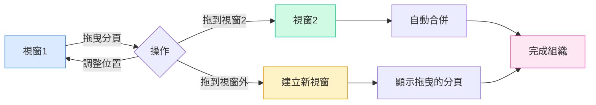

# 多視窗管理

## 概述

MetaDoc 支援多視窗管理，允許您在不同的視窗中開啟不同的文件。透過多視窗管理，您可以同時檢視和編輯多個文件，提升工作效率。

## 多視窗支援

### 視窗類型

MetaDoc 支援兩種類型的視窗：

- **主視窗**：承載文件編輯、主頁等主要功能，支援多分頁管理
- **輔助視窗**：設定、AI 聊天、OCR 等工具視窗，單實例視窗

### 視窗特點

主視窗的特點：

- **多分頁**：每個視窗有獨立的分頁列表
- **獨立狀態**：每個視窗有獨立的文件狀態
- **拖曳支援**：支援分頁拖曳拆分與合併
- **視窗池**：預先建立空閒視窗，實現快速顯示

## 建立新視窗

### 拖曳建立

透過拖曳分頁可以建立新視窗：

1.  **拖曳分頁**：將分頁拖曳出視窗邊界
2.  **建立視窗**：系統會自動建立新視窗
3.  **顯示內容**：新視窗會顯示拖曳的分頁內容

分頁欄支援拖曳操作，可以將分頁拖曳出視窗以建立新視窗：

<MainTabs mode="demo" />

**注意事項**：

- 單一分頁的視窗無法透過拖曳建立新視窗
- 拖曳時會自動從視窗池取得預先載入的視窗，實現快速顯示

### 右鍵選單建立

可以透過右鍵選單建立新視窗：

1.  **右鍵分頁**：在要移動的分頁上點擊滑鼠右鍵
2.  **選擇選項**：選擇「在新視窗中開啟」
3.  **建立視窗**：系統會建立新視窗並移動分頁

### 視窗池機制

MetaDoc 使用視窗池機制最佳化視窗建立：

- **預先載入視窗**：系統預先建立 2 個空閒視窗
- **快速顯示**：使用預先載入的視窗可以瞬間顯示（<100ms）
- **自動補充**：使用後會自動補充新視窗到池中

## 視窗間分頁拖曳

### 拖曳合併

可以將分頁從一個視窗拖曳到另一個視窗，實現靈活的視窗組織：

**操作步驟**：

1.  **拖曳分頁**：在來源視窗中拖曳分頁
2.  **拖到目標視窗**：將分頁拖曳到目標視窗的分頁欄
3.  **自動合併**：分頁會自動加入到目標視窗

### 拖曳位置

拖曳時可以指定插入位置：

- **自動定位**：根據滑鼠位置自動決定插入位置
- **指定位置**：可以拖曳到特定位置插入
- **末尾插入**：拖曳到末尾會在末尾插入

### 單一分頁視窗合併

如果來源視窗只有一個分頁：

- **自動合併**：拖曳到其他視窗時會自動合併
- **視窗關閉**：合併後來源視窗會自動關閉
- **避免空視窗**：防止出現空的視窗

## 視窗管理

### 視窗切換

可以使用系統快速鍵切換視窗：

- **Alt+Tab**（Windows/Linux）：切換視窗
- **Cmd+Tab**（macOS）：切換視窗

### 視窗狀態

每個視窗有獨立的狀態：

- **分頁列表**：每個視窗有獨立的分頁列表
- **文件狀態**：每個視窗有獨立的文件狀態
- **檢視狀態**：每個視窗有獨立的檢視狀態

### 視窗關閉

關閉視窗的方式：

- **關閉按鈕**：點擊視窗的關閉按鈕
- **快速鍵**：使用系統快速鍵關閉視窗
- **選單選項**：透過選單關閉視窗

**注意事項**：

- 關閉視窗前會提示儲存未儲存的文件
- 輔助視窗關閉時會隱藏而非真正關閉

## 視窗同步

### 狀態同步

某些狀態會在視窗間同步：

- **語言設定**：語言切換會同步到所有視窗
- **主題設定**：主題切換會同步到所有視窗
- **系統設定**：系統設定會同步到所有視窗

### 檔案關聯

檔案關聯功能：

- **防止重複**：同一檔案不會在多個視窗中同時開啟
- **視窗定位**：如果檔案已在其他視窗開啟，會提示並定位到該視窗
- **檔案鎖定**：檔案轉移時會暫時鎖定，防止衝突

## 最佳實踐

1.  **合理分屏**：使用多視窗實現分屏編輯，提升效率
2.  **視窗組織**：將相關文件放在同一視窗，無關文件分開
3.  **分頁管理**：合理使用分頁拖曳，組織視窗佈局
4.  **視窗切換**：熟練使用 Alt+Tab 快速切換視窗
5.  **狀態儲存**：關閉視窗前確保重要文件已儲存

## 注意事項

1.  **視窗數量**：過多視窗可能影響效能，建議合理控制
2.  **檔案鎖定**：檔案轉移時會暫時鎖定，避免衝突
3.  **狀態獨立**：每個視窗的狀態獨立，不會相互影響
4.  **視窗池**：視窗池機制會自動管理，無需手動干預
5.  **輔助視窗**：輔助視窗是單實例的，關閉時會隱藏

## 相關文件

- [[core.multi-tab|多分頁管理]]
- [[core.file-operations|檔案操作]]

<ViewMenuItemsDemo mode="demo" :items='["home", "outline"]' />

<ViewMenuItemsDemo mode="demo" :items='["chat", "agent"]' />

<MenuItemsDemo mode="demo" :items='[{"id": "file"}]' />

<MenuItemsDemo mode="demo" :items='[{"id": "edit"}]' />

<MenuItemsDemo mode="demo" :items='[{"id": "view"}]' />

<QuickStartPanel mode="demo" />

<LeftMenu mode="demo" />