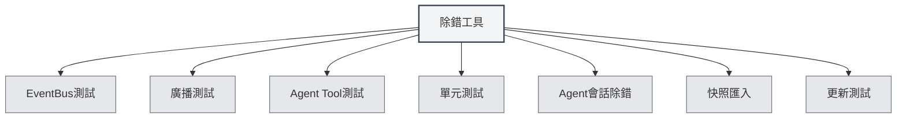

# 除錯工具

## 概述

除錯工具是MetaDoc提供的開發環境功能，用於測試和除錯應用功能。這些工具僅在開發環境中可用，幫助開發者快速測試和除錯程式碼。

<SettingDebugSection mode="demo" />

## 除錯工具介紹

<SettingDebugSection mode="demo" />

<ConsoleTerminal mode="demo" consoleKey="debug" :history='[]' />

### 存取除錯工具

除錯工具僅在開發環境中可用：

1.  **開發環境**：確保在開發環境中執行
2.  **設定頁面**：開啟設定頁面
3.  **除錯工具**：在設定頁面中找到"除錯工具"選項
4.  **開啟工具**：點選開啟除錯工具介面

您可以透過頂端選單列存取除錯工具（僅在開發環境）：

<MenuItemsDemo mode="demo" :items='[{"id": "settings"}]' />

### 工具類型

除錯工具包含以下功能模組：

-   **EventBus測試**：測試EventBus事件
-   **廣播測試**：測試廣播事件
-   **Agent Tool測試**：測試Agent工具
-   **單元測試**：執行單元測試
-   **Agent會話除錯**：除錯Agent會話
-   **快照匯入**：匯入文件快照
-   **更新測試**：測試更新功能

<SettingDebugSection mode="demo" />

## EventBus測試

### 傳送事件

可以傳送EventBus事件進行測試：

1.  **事件名稱**：輸入要傳送的事件名稱
2.  **事件資料**：可選，輸入JSON格式的事件資料
3.  **傳送事件**：點選"傳送事件"按鈕
4.  **檢視結果**：檢視事件傳送結果

<ConsoleTerminal mode="demo" consoleKey="debug" :history='[]' />

### 事件監聽

可以監聽EventBus事件：

-   **事件清單**：顯示所有已傳送的事件
-   **事件詳情**：檢視事件的詳細資訊
-   **事件資料**：檢視事件的資料內容

## 廣播測試

### 傳送廣播

可以傳送廣播事件進行測試：

1.  **目標視窗**：選擇廣播目標（all/home/ai-chat等）
2.  **事件名稱**：輸入要廣播的事件名稱
3.  **事件資料**：可選，輸入JSON格式的事件資料
4.  **傳送廣播**：點選"傳送廣播"按鈕
5.  **檢視結果**：檢視廣播傳送結果

<ConsoleTerminal mode="demo" consoleKey="debug" :history='[]' />

### 廣播監聽

可以監聽廣播事件：

-   **廣播清單**：顯示所有已傳送的廣播
-   **廣播詳情**：檢視廣播的詳細資訊
-   **目標視窗**：檢視廣播的目標視窗

## Agent Tool測試

### 測試工具

可以測試Agent工具：

1.  **選擇工具**：選擇要測試的Agent工具
2.  **輸入參數**：輸入工具的測試參數（JSON格式）
3.  **選擇上下文**：選擇測試的上下文Tab ID
4.  **執行測試**：點選"執行測試"按鈕
5.  **檢視結果**：檢視測試結果

### 測試歷史

可以檢視測試歷史：

-   **歷史清單**：顯示所有測試歷史
-   **測試結果**：檢視每次測試的結果
-   **錯誤資訊**：檢視測試的錯誤資訊

## 單元測試

### 單個測試

可以執行單個單元測試：

1.  **選擇模組**：選擇要測試的模組
2.  **選擇測試**：選擇要執行的測試函式
3.  **編輯參數**：編輯測試函式的參數
4.  **執行測試**：點選"執行測試"按鈕
5.  **檢視結果**：檢視測試結果

<ConsoleTerminal mode="demo" consoleKey="debug" :history='[]' />

### 批次測試

可以批次執行單元測試：

1.  **選擇模組**：選擇一個或多個模組
2.  **選擇上下文**：選擇測試的上下文Tab ID
3.  **開始測試**：點選"開始批次測試"按鈕
4.  **檢視進度**：檢視測試進度
5.  **檢視結果**：檢視所有測試結果

### 測試結果

測試結果包含：

-   **測試狀態**：顯示測試是否通過
-   **測試輸出**：顯示測試的輸出資訊
-   **錯誤資訊**：顯示測試的錯誤資訊（如果有）
-   **執行時間**：顯示測試的執行時間

## Agent會話除錯

### 會話除錯

可以除錯Agent會話：

1.  **選擇會話**：選擇要除錯的Agent會話
2.  **檢視訊息**：檢視會話的訊息歷史
3.  **傳送訊息**：傳送測試訊息
4.  **檢視回應**：檢視Agent的回應

<ConsoleTerminal mode="demo" consoleKey="debug" :history='[]' />

### 除錯資訊

可以檢視除錯資訊：

-   **會話狀態**：顯示會話的目前狀態
-   **工具呼叫**：檢視工具呼叫歷史
-   **錯誤資訊**：檢視錯誤資訊

## 快照匯入

### 匯入快照

可以匯入文件快照：

1.  **選擇快照**：選擇要匯入的快照檔案
2.  **匯入快照**：點選"匯入快照"按鈕
3.  **檢視結果**：檢視匯入結果

<ConsoleTerminal mode="demo" consoleKey="debug" :history='[]' />

### 快照格式

快照檔案格式：

-   **JSON格式**：快照檔案為JSON格式
-   **文件內容**：包含文件的完整內容
-   **文件狀態**：包含文件的狀態資訊

## 更新測試

### 測試更新

可以測試更新功能：

1.  **選擇更新通道**：選擇更新通道（release/dev）
2.  **檢查更新**：點選"檢查更新"按鈕
3.  **檢視結果**：檢視更新檢查結果

<SettingDebugSection mode="demo" />

## 最佳實踐

1.  **開發環境**：僅在開發環境中使用除錯工具
2.  **測試隔離**：測試時使用獨立的測試資料
3.  **錯誤處理**：注意處理測試中的錯誤
4.  **結果記錄**：記錄重要的測試結果
5.  **工具使用**：合理使用除錯工具，提高開發效率

## 注意事項

1.  **開發環境**：除錯工具僅在開發環境中可用
2.  **資料安全**：測試時注意資料安全，避免影響生產資料
3.  **效能影響**：某些測試可能影響應用效能
4.  **錯誤處理**：測試中的錯誤需要正確處理
5.  **工具限制**：某些工具可能有使用限制

## 相關文件

-   [[agent.session|Agent會話管理]]
-   [[agent.tools|工具集管理]]
-   [[settings.basic|基礎設定]]
