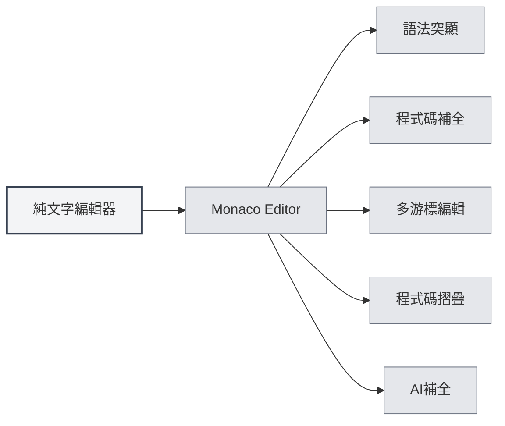
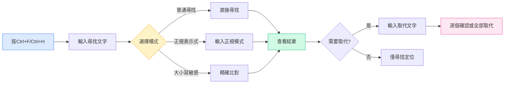

# 純文字編輯器

## 概述

純文字編輯器用於編輯純文字檔案和程式碼檔案。MetaDoc的純文字編輯器基於Monaco Editor，提供了專業的程式碼編輯體驗，支援語法突顯、程式碼補全、AI補全等功能。

純文字編輯器支援多種檔案格式，包括程式碼檔案（`.js`、`.py`、`.java`等）和設定檔（`.json`、`.yaml`、`.ini`等），根據檔案副檔名自動識別語言並套用相應的語法突顯。

## Monaco編輯器功能

<LaTeXEditorDemo mode="demo" />

<SearchReplaceMenu mode="demo" :position='{"top": 100, "left": 200}' :adapter='null' />

<MenuItemsDemo mode="demo" :items='[{"id": "file"}]' />

<ViewMenuItemsDemo mode="demo" :items='["editor", "outline"]' />

### 編輯器介紹

純文字編輯器使用Monaco Editor，具有以下特點：

- **專業程式碼編輯**：提供類似Visual Studio Code的編輯體驗
- **語法突顯**：根據檔案類型自動套用語法突顯
- **程式碼補全**：支援智慧程式碼補全
- **多游標編輯**：支援多游標同時編輯
- **程式碼摺疊**：支援程式碼區塊摺疊

### 支援的檔案格式

純文字編輯器支援以下檔案格式：

**程式碼檔案**：

- JavaScript/TypeScript: `.js`, `.jsx`, `.ts`, `.tsx`
- Python: `.py`
- Java: `.java`
- C/C++: `.c`, `.cpp`, `.h`, `.hpp`
- C#: `.cs`
- Go: `.go`
- Rust: `.rs`
- Swift: `.swift`
- Kotlin: `.kt`
- 其他: `.php`, `.rb`, `.scala`, `.dart`, `.lua`等

**設定檔**：

- JSON: `.json`
- YAML: `.yaml`, `.yml`
- XML: `.xml`
- TOML: `.toml`
- INI: `.ini`, `.conf`
- SQL: `.sql`

**腳本檔案**：

- Shell: `.sh`, `.bash`, `.zsh`
- PowerShell: `.ps1`
- 其他: `.vim`, `.diff`, `.patch`, `.log`

### 自動語言識別

編輯器會根據檔案副檔名自動識別語言：

- **檔案副檔名**：根據檔案副檔名選擇對應的語言模式
- **語法突顯**：自動套用相應的語法突顯規則
- **程式碼補全**：啟用對應語言的程式碼補全功能

如果檔案沒有副檔名或副檔名不被識別，編輯器會使用純文字模式。

## 程式碼突顯

### 語法突顯

編輯器會根據檔案類型自動套用語法突顯：

- **關鍵字突顯**：語言關鍵字使用不同顏色顯示
- **字串突顯**：字串使用特定顏色顯示
- **註解突顯**：註解使用灰色顯示
- **函式突顯**：函式名稱使用特定顏色顯示

語法突顯讓程式碼結構更清晰，便於閱讀和編輯。

### 主題同步

程式碼突顯主題會跟隨編輯器主題：

- **淺色主題**：在淺色主題下使用淺色語法突顯
- **深色主題**：在深色主題下使用深色語法突顯
- **自動同步**：自動同步編輯器主題設定

## 行號顯示

### 顯示行號

行號顯示在編輯器左側，幫助您：

- **定位程式碼**：快速定位到特定行
- **引用程式碼**：方便在文件中引用特定程式碼行
- **除錯程式碼**：快速定位錯誤位置

### 設定行號

行號顯示可以在設定中配置：

1. 開啟設定頁面
2. 在"編輯器設定"部分找到"行號顯示"
3. 切換開關啟用或停用行號

行號設定會影響所有Monaco編輯器（純文字編輯器、LaTeX編輯器等）。

<MenuItemsDemo mode="demo" :items='[{"id": "file", "items": ["new", "open", "save"]}]' />

<ViewMenuItemsDemo mode="demo" :items='["editor", "outline"]' />

<MainTabs mode="demo" />

<AISuggestionGhost mode="demo" />

<LaTeXEditorDemo mode="demo" />

## 檔案預覽和統計資訊

### 檔案統計

編輯器會顯示檔案的統計資訊：

- **字元數**：顯示檔案的總字元數
- **行數**：顯示檔案的總行數
- **單字數**：顯示檔案的總單字數（如果適用）

統計資訊顯示在狀態列或編輯器底部。

### 檔案預覽

開啟檔案時，編輯器會：

- **載入內容**：快速載入檔案內容
- **套用突顯**：根據檔案類型套用語法突顯
- **顯示統計**：顯示檔案的統計資訊

### 檔案格式偵測

編輯器會自動偵測檔案格式：

- **副檔名偵測**：根據檔案副檔名識別格式
- **內容偵測**：如果副檔名不明確，嘗試根據內容識別
- **手動選擇**：可以手動選擇檔案格式

## AI補全功能

### AI自動補全

純文字編輯器支援AI自動補全功能：

- **自動觸發**：停止輸入後自動觸發補全
- **手動觸發**：使用`Shift+Tab`手動觸發補全
- **智慧補全**：根據上下文產生補全建議

AI補全功能可以幫助您：

- **產生程式碼**：根據註解或上下文產生程式碼
- **補全函式**：補全函式定義或呼叫
- **產生註解**：產生程式碼註解

### 補全設定

AI補全的設定與Markdown編輯器相同：

- **啟用/關閉**：可以在設定中啟用或關閉
- **觸發按鍵**：可以配置觸發按鍵（Enter、Space、`;`、`,`）
- **補全模式**：可以選擇完全產生或部分產生
- **最大Token數**：可以設定補全的最大Token數

詳見[[ai.completion|AI自動補全]]。

## 編輯器功能

### 程式碼摺疊

編輯器支援程式碼區塊摺疊：

- **摺疊程式碼區塊**：點擊行號左側的摺疊圖示
- **展開程式碼區塊**：點擊摺疊標記展開
- **快速鍵**：`Ctrl+Shift+[`摺疊，`Ctrl+Shift+]`展開

程式碼摺疊讓您能夠專注於當前編輯的部分。

### 尋找取代

編輯器支援強大的尋找取代功能，幫助您在程式碼中快速定位和修改內容：

**基本操作**：

- **尋找**：`Ctrl+F` 開啟尋找對話方塊，輸入要尋找的文字
- **取代**：`Ctrl+H` 開啟尋找取代對話方塊，輸入尋找內容和取代內容
- **逐個取代**：逐個確認後取代
- **全部取代**：一次性取代所有符合項目

**進階選項**：

- **正規表示式**：使用正規表示式進行複雜模式比對
- **大小寫比對**：區分大小寫尋找
- **全字比對**：只比對完整的單字

**使用場景**：

- 批次修改變數名稱
- 尋找特定函式呼叫
- 取代程式碼中的字串
- 使用正規表示式進行複雜取代

尋找取代面板介面如下：

<SearchReplaceMenu mode="demo" :position='{"top": 100, "left": 200}' :adapter='null' />

### 多游標編輯

編輯器支援多游標同時編輯：

- **新增游標**：`Alt+點擊`在點擊位置新增新游標
- **新增上方游標**：`Ctrl+Alt+↑`在上方新增游標
- **新增下方游標**：`Ctrl+Alt+↓`在下方新增游標
- **選取相同單字**：`Ctrl+D`選取下一個相同的單字

多游標編輯可以同時修改多個位置，提高編輯效率。

## 使用技巧

<LaTeXEditorDemo mode="demo" />

<ConsoleTerminal mode="demo" consoleKey="plaintext" :history='[]' />

### 高效編輯

1. **使用快速鍵**：熟練掌握常用快速鍵，提高編輯效率
2. **使用程式碼摺疊**：摺疊不需要查看的程式碼區塊
3. **使用多游標**：使用多游標同時編輯多個位置

### 程式碼補全

1. **啟用AI補全**：啟用AI補全功能獲得智慧補全建議
2. **使用手動觸發**：需要時使用`Shift+Tab`手動觸發補全
3. **調整設定**：根據需求調整補全設定

### 檔案管理

1. **識別格式**：確保檔案副檔名正確，以便自動識別格式
2. **查看統計**：查看檔案統計資訊了解檔案大小
3. **儲存檔案**：及時儲存檔案，避免遺失更改

## 常見問題

### Q: 語法突顯不正確？

A: 檢查檔案副檔名是否正確。如果副檔名不正確，編輯器可能無法識別檔案類型。可以手動選擇檔案格式。

### Q: 程式碼補全不顯示？

A: 確保AI補全功能已啟用。某些檔案類型可能不支援程式碼補全。

### Q: 如何切換檔案格式？

A: 檔案格式根據檔案副檔名自動識別。如果需要更改，可以重新命名檔案或手動選擇格式。

### Q: 行號不顯示？

A: 檢查設定中的"行號顯示"選項是否啟用。行號設定會影響所有Monaco編輯器。

### Q: 檔案太大無法編輯？

A: 對於非常大的檔案，編輯器可能會限制某些功能。建議使用專門的文字編輯器處理超大檔案。

## 相關文件

- [[core.editor-basics|編輯器基礎操作]]
- [[core.editor-settings|編輯器設定]]
- [[latex.editor|LaTeX編輯器使用指南]]
- [[ai.completion|AI自動補全]]
