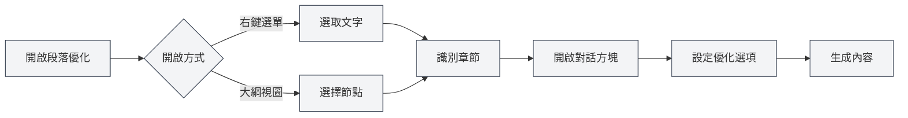

# 段落優化功能

## 概述

段落優化功能允許您使用AI優化文件中的特定段落或章節。您可以從右鍵選單或大綱視圖中開啟段落優化功能，生成或優化段落內容。

## 開啟段落優化

### 從右鍵選單開啟

在編輯器中可以右鍵開啟段落優化：

1.  **選取文字**：在編輯器中選中要優化的文字
2.  **右鍵選單**：右鍵點擊選中的文字
3.  **選擇優化**：在右鍵選單中選擇「段落優化」或類似選項
4.  **開啟對話方塊**：段落優化對話方塊會開啟

### 從大綱開啟

在大綱視圖中可以開啟段落優化：

1.  **選擇節點**：在大綱樹中選擇要優化的節點
2.  **右鍵選單**：右鍵點擊節點
3.  **選擇優化**：在右鍵選單中選擇「段落優化」或類似選項
4.  **開啟對話方塊**：段落優化對話方塊會開啟

您可以透過側邊欄存取大綱視圖：

<ViewMenuItemsDemo mode="demo" :items='["outline"]' />

<ViewMenuItemsDemo mode="demo" :items='["chat"]' />

<AIChat mode="demo" />

段落優化器介面如下：

<SectionOptimizer mode="demo" title="示例章節" path="1" :tree='{"text": "示例章節", "children": []}' language="markdown" :adapter='null' />

### 自動識別章節

段落優化會自動識別目前章節：

-   **游標位置**：根據游標位置識別目前章節
-   **選中文字**：如果選中了文字，使用選中的文字
-   **大綱節點**：如果從大綱開啟，使用對應的大綱節點

## 優化選項

### 優化模式

可以選擇不同的優化模式：

-   **生成內容**：生成新的段落內容
-   **優化內容**：優化現有段落內容
-   **追加內容**：在現有內容後追加新內容
-   **替換內容**：替換現有段落內容

### 上下文模式

可以選擇上下文模式：

-   **全文上下文**：使用整個文件作為上下文
-   **章節上下文**：只使用目前章節作為上下文
-   **無上下文**：不使用上下文資訊

### 自訂提示

可以輸入自訂提示：

-   **優化目標**：描述優化目標
-   **內容要求**：說明內容要求
-   **風格要求**：指定寫作風格

### 預設提示

可以使用預設提示：

-   **擴展內容**：擴展段落內容
-   **精簡內容**：精簡段落內容
-   **改寫內容**：改寫段落內容
-   **補充內容**：補充段落內容

## 生成內容

### 生成過程

生成內容的過程：

1.  **分析章節**：分析目前章節的結構和內容
2.  **建構提示**：根據選項建構優化提示
3.  **呼叫AI**：呼叫AI生成優化內容
4.  **顯示結果**：在對話方塊中顯示生成的內容

### 生成結果

生成的內容會顯示在對話方塊中：

-   **預覽內容**：可以預覽生成的內容
-   **編輯內容**：可以編輯生成的內容
-   **套用內容**：可以將內容套用到文件

### 生成選項

生成時可以設定選項：

-   **串流輸出**：即時顯示生成過程
-   **一次性生成**：等待生成完成後顯示
-   **取消生成**：可以隨時取消生成過程

## 套用內容

### 套用方式

可以將生成的內容套用到文件：

-   **替換**：替換原有段落內容
-   **插入**：在指定位置插入內容
-   **追加**：在段落末尾追加內容

### 套用位置

可以指定套用位置：

-   **目前位置**：在目前游標位置套用
-   **章節位置**：在章節開始位置套用
-   **章節末尾**：在章節末尾套用

## 對話功能

### 繼續對話

生成內容後可以繼續對話：

1.  **開啟對話**：點擊「繼續對話」按鈕
2.  **進入對話**：進入AI對話介面
3.  **繼續優化**：可以繼續優化或修改內容

### 對話上下文

對話會包含以下上下文：

-   **原始內容**：原始段落內容
-   **生成內容**：生成的內容
-   **優化歷史**：優化歷史記錄

## 最佳實踐

1.  **明確目標**：明確優化目標，使用清晰的提示
2.  **選擇上下文**：根據情況選擇合適的上下文模式
3.  **預覽內容**：生成後預覽內容，確保符合要求
4.  **編輯調整**：生成後可以進一步編輯調整
5.  **多次優化**：可以多次優化，逐步完善內容

## 注意事項

1.  **章節識別**：確保正確識別章節，避免優化錯誤的內容
2.  **上下文使用**：合理使用上下文，避免內容過長
3.  **內容品質**：生成的內容需要人工審核和調整
4.  **Token消耗**：優化功能會消耗Token，注意使用量
5.  **儲存文件**：套用內容後記得儲存文件

## 相關文件

-   [[outline.basics|大綱視圖功能]]
-   [[ai.chat|AI對話功能]]
-   [[ai.completion|AI自動補全]]

<Outline mode="demo" />

<CompletionSettingsPanel mode="demo" />

<MenuItemsDemo mode="demo" :items='[{"id": "ai"}]' />

<ViewMenuItemsDemo mode="demo" :items='["chat"]' />
