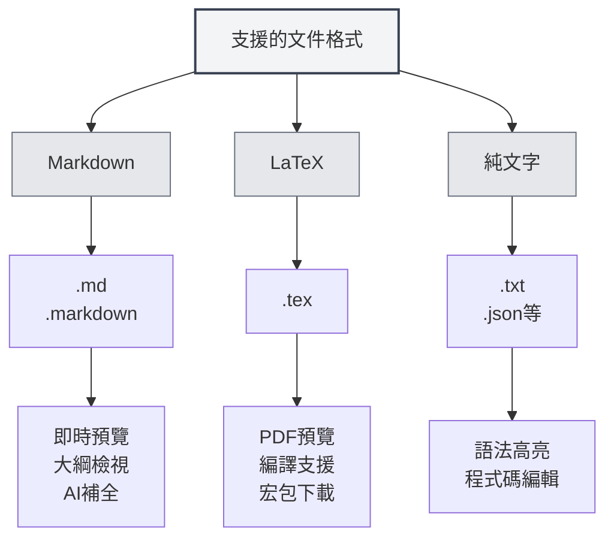

# 支援的文件格式

## 概述

MetaDoc 支援多種文件格式，包括 Markdown、LaTeX 和純文字格式。系統會自動偵測檔案格式，也支援手動選擇格式。

<MenuItemsDemo mode="demo" :items='[{"id": "file"}]' />

<MenuItemsDemo mode="demo" :items='[{"id": "edit"}]' />

<MenuItemsDemo mode="demo" :items='[{"id": "view"}]' />

<ViewMenuItemsDemo mode="demo" :items='["home", "outline", "chat"]' />

<MainTabs mode="demo" />

<QuickStartPanel mode="demo" />

<QuickStartMarkdown mode="demo" />

<QuickStartLatex mode="demo" />

## 支援的格式

### Markdown 格式

**檔案副檔名**：`.md`、`.markdown`

**特點**：

- 支援標準 Markdown 語法
- 支援擴充語法（表格、程式碼區塊、數學公式等）
- 支援即時預覽
- 支援大綱檢視
- 支援 AI 自動補全

**使用場景**：

- 技術文件撰寫
- 部落格文章創作
- 筆記記錄
- 文件編寫

### LaTeX 格式

**檔案副檔名**：`.tex`

**特點**：

- 專業的學術論文編寫格式
- 支援數學公式、表格、圖表
- 即時 PDF 預覽
- 支援宏包自動下載
- 支援編譯錯誤提示

**使用場景**：

- 學術論文編寫
- 技術報告編寫
- 書籍排版
- 複雜文件排版

### 純文字格式

**檔案副檔名**：`.txt`、`.json` 等

**特點**：

- 簡單的文字編輯
- 語法高亮支援
- 程式碼編輯功能
- 不支援預覽和大綱

**使用場景**：

- 程式碼檔案編輯
- 設定檔編輯
- 簡單文字編輯
- 資料檔案編輯

## 檔案格式偵測

### 自動偵測

MetaDoc 會自動偵測檔案格式：

1. **副檔名偵測**：優先根據檔案副檔名偵測格式

   - `.md`、`.markdown` → Markdown 格式
   - `.tex` → LaTeX 格式
   - `.txt`、`.json` 等 → 純文字格式

2. **內容偵測**：如果副檔名無法確定格式，會偵測檔案內容

   - LaTeX 內容優先識別為 LaTeX 格式
   - 其他內容預設識別為 Markdown 格式

3. **預設格式**：如果無法偵測，預設使用 Markdown 格式

### 偵測優先順序

格式偵測遵循以下優先順序：

1. **檔案副檔名**：優先使用副檔名偵測
2. **檔案內容**：如果副檔名無法確定，偵測內容
3. **預設格式**：無法偵測時使用預設格式

### 偵測規則

- **Markdown 偵測**：副檔名為 `.md` 或 `.markdown` 時識別為 Markdown
- **LaTeX 偵測**：副檔名為 `.tex` 或內容包含 LaTeX 指令時識別為 LaTeX
- **純文字偵測**：其他副檔名或無法確定時識別為純文字

## 手動選擇格式

### 開啟檔案時選擇

開啟檔案時可以手動選擇格式：

1. **開啟檔案對話方塊**：在開啟檔案對話方塊中
2. **格式選擇**：選擇檔案格式（如果自動偵測不正確）
3. **確認開啟**：確認後以選擇的格式開啟

### 新增檔案時選擇

新增檔案時可以選擇格式：

1. **新增文件**：點擊「新增文件」按鈕
2. **選擇格式**：在格式選擇對話方塊中選擇格式
3. **建立文件**：建立指定格式的文件

### 切換格式

可以切換已開啟文件的格式：

1. **開啟文件**：開啟要切換格式的文件
2. **格式選單**：在選單中找到格式切換選項
3. **選擇格式**：選擇新的格式
4. **確認切換**：確認切換格式

**注意事項**：

- 切換格式可能會影響文件內容
- 某些格式特性可能無法轉換
- 切換前建議備份文件

## 格式特性對比

### 功能支援

| 功能       | Markdown | LaTeX    | 純文字 |
| ---------- | -------- | -------- | ------ |
| 即時預覽   | ✅       | ✅ (PDF) | ❌     |
| 大綱檢視   | ✅       | ✅       | ❌     |
| AI 補全    | ✅       | ✅       | ✅     |
| 數學公式   | ✅       | ✅       | ❌     |
| 表格支援   | ✅       | ✅       | ❌     |
| 程式碼高亮 | ✅       | ✅       | ✅     |
| 元資訊支援 | ✅       | ✅       | ❌     |

### 編輯器特性

| 特性       | Markdown | LaTeX | 純文字 |
| ---------- | -------- | ----- | ------ |
| 語法高亮   | ✅       | ✅    | ✅     |
| 自動補全   | ✅       | ✅    | ✅     |
| 錯誤提示   | ✅       | ✅    | ❌     |
| 摺疊功能   | ✅       | ✅    | ✅     |
| 多游標編輯 | ✅       | ✅    | ✅     |

## 格式轉換

### 匯出格式

可以將文件匯出為其他格式：

- **Markdown → PDF**：匯出為 PDF 文件
- **Markdown → HTML**：匯出為 HTML 文件
- **Markdown → DOCX**：匯出為 Word 文件
- **LaTeX → PDF**：編譯為 PDF 文件
- **LaTeX → Markdown**：轉換為 Markdown 格式

### 轉換注意事項

格式轉換時需要注意：

- **內容相容性**：某些格式特性可能無法轉換
- **樣式遺失**：轉換後可能遺失部分樣式
- **內容調整**：轉換後可能需要手動調整內容

## 最佳實踐

1. **選擇合適的格式**：根據文件類型選擇合適的格式
2. **使用標準副檔名**：使用標準的檔案副檔名，方便自動偵測
3. **格式一致性**：同一專案使用統一的格式
4. **備份文件**：格式轉換前備份原始文件
5. **測試轉換**：轉換後檢查內容是否正確

## 注意事項

1. **格式偵測**：自動偵測可能不準確，可以手動選擇
2. **格式切換**：切換格式可能影響文件內容
3. **相容性**：不同格式的功能支援不同
4. **檔案副檔名**：建議使用標準副檔名
5. **格式轉換**：轉換時可能遺失部分內容或樣式

## 相關文件

- [[markdown.basics|Markdown 語法]]
- [[latex.basics|LaTeX 語法]]
- [[editor.plain-text|純文字編輯器]]
- [[core.file-operations|檔案操作]]