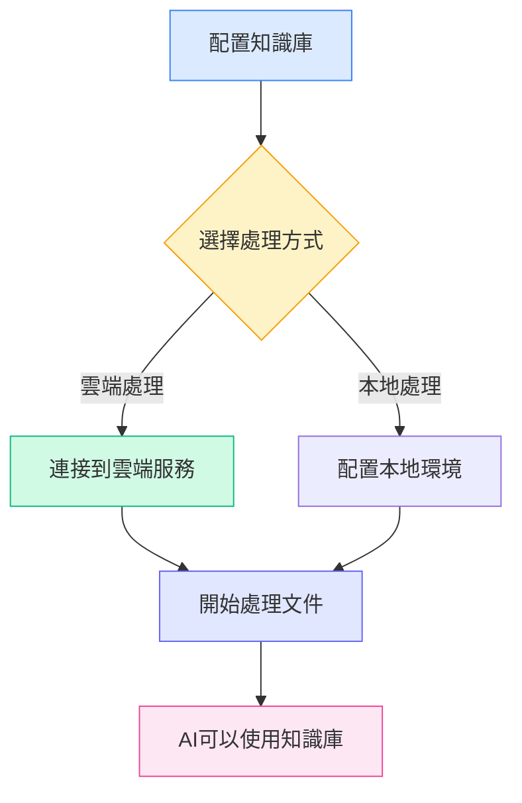
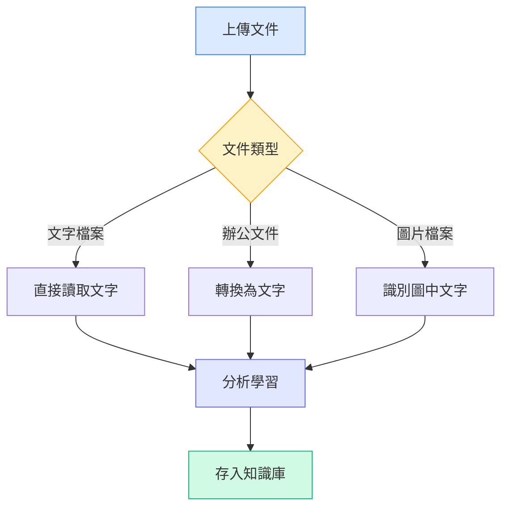

# 知識庫配置

## 概述

知識庫是MetaDoc的智能文件管理系統。透過將您的文件「學習」進知識庫，AI就能理解和引用這些內容，為您提供更準確的回答和建議。

本指南將幫助您配置知識庫，讓它更好地為您服務。

## 啟用知識庫功能

在知識庫設定頁面，首先需要啟用知識庫功能：

1.  找到「啟用知識庫」開關
2.  將開關切換到「啟用」狀態
3.  配置知識庫相關參數

您可以透過頂端選單列存取知識庫管理：

<KnowledgeBase mode="demo" />

上圖展示了知識庫管理介面的主要功能區域：

-   **左側面板**：知識庫列表和搜尋功能
-   **中間區域**：已新增的文件列表
-   **右側詳情**：選中文件的詳細資訊和處理狀態
-   **底部工具列**：新增文件、開始處理、刪除等操作按鈕

## 選擇處理方式

### 兩種方式簡介

MetaDoc提供兩種處理文件的方式：

**雲端處理（推薦）**

-   將文件傳送到雲端服務進行分析
-   處理速度快，無需佔用本地資源
-   需要網路連線

**本地處理（開發中）**

-   在您的電腦上直接處理文件
-   資料完全本地，保護隱私
-   需要較強的電腦配置

目前版本僅支援雲端處理方式。您可以在設定中選擇：

<MenuItemsDemo mode="demo" :items='[{"id": "settings"}]' />

### 雲端處理的優勢

對於大多數使用者，我們推薦使用雲端處理：

-   **快速上手**：無需配置複雜的本地環境
-   **節省時間**：處理大量文件時速度更快
-   **節省資源**：不佔用電腦記憶體和處理器
-   **維護簡單**：自動更新，無需手動管理

### 何時需要本地處理

如果您有以下需求，可以等待本地處理功能上線：

-   處理高度敏感的機密文件
-   經常在沒有網路的環境下工作
-   擁有高效能的電腦配置（帶獨立顯示卡）
-   需要處理海量文件（超過10GB）

<SettingKnowledgeBaseSection mode="demo" />

## 理解知識庫的工作原理

### 文件是如何被「學習」的

<RAGToolDisplay mode="demo" />

當您將文件新增到知識庫時，MetaDoc會執行以下步驟：

1.  **讀取文件內容**

    -   從PDF、Word、圖片等格式中提取文字
    -   保持文件的結構和格式資訊

2.  **理解文件含義**

    -   將文字轉換為AI能理解的「語義表示」
    -   這就像給文件打上智能標籤

3.  **建立索引**

    -   建立快速查找的索引
    -   讓AI能在瞬間找到相關內容

4.  **儲存知識**
    -   將處理結果儲存在本地資料庫
    -   隨時可以呼叫

<KnowledgeBase mode="demo" />

## 支援的文件類型

### 可以直接處理的格式

MetaDoc知識庫支援多種常見文件格式：

**文字類**

-   Markdown文件（.md）—— 技術文件的首選格式
-   LaTeX文件（.tex）—— 學術論文常用格式
-   純文字檔案（.txt）—— 簡單的文字記錄

**辦公文件**

-   PDF檔案（.pdf）—— 最通用的文件格式
-   Word文件（.docx）—— Microsoft Office格式

**圖片類**

-   PNG圖片（.png）—— 截圖、圖表
-   JPEG圖片（.jpg, .jpeg）—— 照片、掃描件

### 不同文件的處理方式

不同類型的文件，MetaDoc會用不同的方式處理：

**文字文件**（Markdown、LaTeX、TXT）

-   直接讀取文字內容
-   保留標題結構和格式
-   處理速度最快

**辦公文件**（PDF、Word）

-   先轉換為純文字
-   提取標題、段落等結構
-   保留文件的邏輯層次

**圖片文件**（PNG、JPG）

-   使用OCR技術識別圖中的文字
-   適合處理掃描的紙本文件
-   處理時間相對較長

<RAGToolDisplay mode="demo" />

## 智能檢索機制

### 知識庫如何找到相關內容

當AI需要使用知識庫時，MetaDoc採用智能檢索策略：

**語義匹配**

-   不僅匹配關鍵詞，還理解問題的含義
-   例如：搜尋「如何安裝」，也能找到「安裝步驟」、「部署指南」等相關內容

**混合檢索**

-   結合語義理解和關鍵詞匹配
-   既保證準確性，又提高召回率
-   自動排序，最相關的內容優先展示

**快速響應**

-   使用高效的索引演算法
-   毫秒級響應，不影響對話流暢度

<KnowledgeBase mode="demo" />

## 分塊處理說明

### 為什麼需要分塊

為了更高效地檢索，MetaDoc會將長文件分成小塊：

**分塊的好處**

-   **精準定位**：可以找到文件中的具體段落
-   **提高速度**：小塊處理更快，檢索更迅速
-   **保持上下文**：相鄰塊之間有重疊，不會切斷語義

**預設設定**

-   每塊約500個字元（約250個漢字）
-   相鄰塊之間重疊50個字元
-   這種設定在準確性和效率之間取得平衡

### 分塊範例

假設有一篇長文章：

原文：[開頭段落...中間段落...結尾段落...]

分塊後：

-   塊1：開頭段落 + 部分中間內容
-   塊2：部分中間內容（重疊區域）+ 更多中間內容
-   塊3：更多中間內容 + 結尾段落

這樣即使問題只涉及「中間內容」，也能準確找到相關部分。

<SettingKnowledgeBaseSection mode="demo" />

## 配置建議

### 初次使用推薦設定

如果您是第一次使用知識庫，建議採用以下設定：

-   **處理方式**：雲端處理（預設）
-   **檢索靈敏度**：中等（預設值）
    -   靈敏度太高：可能返回過多不相關內容
    -   靈敏度太低：可能遺漏一些相關內容
    -   中等設定：平衡兩者

### 針對不同類型的文件

**技術文件/手冊**

-   適合建立專門的知識庫
-   AI可以準確回答技術問題
-   支援程式碼片段的檢索

**學術論文**

-   保留完整的引用資訊
-   支援跨文件的知識關聯
-   適合文獻綜述和研究

**日常筆記**

-   建立個人知識庫
-   快速檢索過往記錄
-   支援創意寫作時的參考

### 使用建議

**1. 定期維護**

-   刪除過時或不再需要的文件
-   更新已有文件的新版本
-   保持知識庫的整潔和準確

**2. 合理分類**

-   將相關主題的文件放在一起
-   為知識庫設定清晰的名稱
-   便於管理和使用

**3. 隱私考慮**

-   機密文件謹慎上傳
-   了解資料的處理方式
-   選擇適合的處理方式

<RAGToolDisplay mode="demo" />

## 注意事項

### 使用前須知

1.  **處理時間**

    -   小文件（1-10頁）：幾秒鐘
    -   中等文件（10-50頁）：幾十秒
    -   大文件（50頁以上）：可能需要幾分鐘
    -   請耐心等待處理完成

2.  **儲存空間**

    -   知識庫會佔用一定的硬碟空間
    -   大致是原文件大小的2-3倍
    -   定期清理不用的文件可以釋放空間

3.  **網路要求**

    -   新增文件時需要網路連線
    -   檢索時不需要網路（已儲存本地）
    -   不穩定的網路可能影響處理速度

4.  **檔案格式**
    -   確保上傳的檔案格式正確
    -   損壞的檔案可能無法處理
    -   加密的PDF需要先解密

### 常見問題

**Q: 知識庫中的文件安全嗎？**
A: 文件處理後的向量資料儲存在本地。如使用雲端處理，原始文件會傳送到雲端服務處理，處理完成後刪除。建議不要上傳高度敏感的內容。

**Q: 可以處理多大的文件？**
A: 單一文件建議不超過100MB。超大文件可以分割成多個小文件處理。

**Q: 處理後的文件還能修改嗎？**
A: 知識庫中的內容是原始文件的「快照」。如果文件有更新，需要重新新增到知識庫。

**Q: 為什麼有些內容檢索不到？**
A: 可能原因：1) 文件尚未完成處理；2) 內容在圖片中且OCR識別失敗；3) 檢索詞和文件內容表達方式差異較大。

## 相關文件

-   [[knowledge-base.management|知識庫管理]] - 學習如何新增、刪除、管理知識庫中的文件
-   [[knowledge-base.usage|知識庫使用]] - 了解如何在AI對話中使用知識庫
-   [[ai.chat|AI對話功能]] - 探索AI對話的高級功能