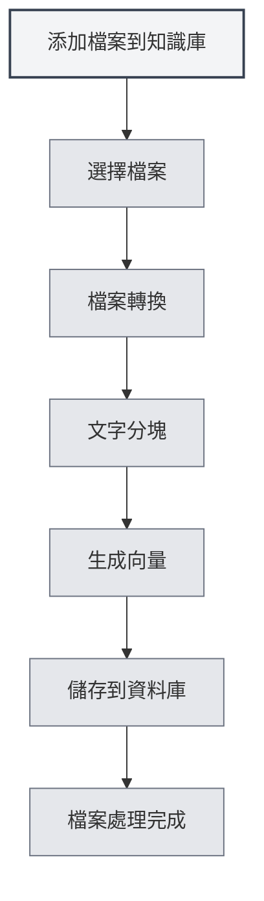

# 知識庫使用

## 概述

知識庫是MetaDoc的RAG（檢索增強生成）系統，透過向量搜尋為AI功能提供上下文資訊。合理使用知識庫可以顯著提升AI回答的準確性和相關性。

<KnowledgeBase mode="demo" />

## 知識庫介紹

### 什麼是知識庫

知識庫是一個文件儲存和檢索系統，它能夠：

- **儲存文件**：將文件轉換為向量並儲存
- **語義搜尋**：基於語義相似度搜尋相關內容
- **增強AI**：為AI對話提供上下文資訊

### 工作原理

<RAGToolDisplay mode="demo" />

知識庫使用向量嵌入技術：

1. **文件處理**：將文件分割成文字區塊
2. **向量化**：為每個文字區塊生成向量嵌入
3. **儲存**：將向量儲存到資料庫中
4. **檢索**：根據查詢生成向量，搜尋相似內容

<KnowledgeBase mode="demo" />

## 添加檔案到知識庫

### 添加檔案

1. 開啟知識庫管理頁面
2. 點擊"添加檔案"按鈕
3. 選擇要添加的檔案
4. 等待檔案處理完成

### 支援的檔案格式

知識庫支援以下檔案格式：

- **Markdown** (.md)：Markdown文件
- **LaTeX** (.tex)：LaTeX文件
- **PDF** (.pdf)：PDF文件
- **Word** (.docx)：Word文件
- **圖片** (.png, .jpg等)：透過OCR辨識文字
- **純文字** (.txt)：純文字檔案

### 檔案處理

<RAGToolDisplay mode="demo" />

添加檔案後，系統會自動：

1. **轉換文字**：將檔案轉換為文字內容
2. **文字分塊**：將文字分割成固定大小的區塊
3. **生成向量**：為每個區塊生成向量嵌入
4. **儲存資料**：將向量和文字儲存到資料庫

處理時間取決於檔案大小，大檔案可能需要較長時間。

<KnowledgeBase mode="demo" />

## 知識庫檔案管理

### 檔案列表

知識庫管理頁面顯示所有已添加的檔案：

- **檔案名稱**：檔案的名稱
- **大小/區塊數**：檔案大小和資料區塊數量
- **狀態**：檔案是否啟用

### 檔案操作

<RAGToolDisplay mode="demo" />

#### 啟用/停用檔案

- **啟用**：檔案會被檢索，用於AI功能
- **停用**：檔案不會被檢索，但資料保留

#### 預覽檔案

點擊檔案可以預覽檔案內容：

- **查看內容**：在預覽面板查看檔案文字
- **開啟編輯器**：在編輯器中開啟檔案

#### 重新命名檔案

1. 選擇要重新命名的檔案
2. 點擊檔案名稱旁的編輯按鈕
3. 輸入新檔案名稱
4. 確認重新命名

#### 刪除檔案

1. 選擇要刪除的檔案
2. 點擊"刪除"按鈕
3. 確認刪除操作

刪除檔案會刪除所有相關的向量和資料區塊。

#### 下載檔案

可以下載知識庫中的檔案：

1. 選擇要下載的檔案
2. 點擊"下載"按鈕
3. 選擇儲存位置

<KnowledgeBase mode="demo" />

## 向量搜尋

### 搜尋原理

向量搜尋使用ANN（近似最近鄰）演算法：

- **向量相似度**：計算查詢向量與文件向量的相似度
- **餘弦相似度**：使用餘弦相似度衡量相似程度
- **排序結果**：按相似度排序返回結果

### 搜尋方式

<RAGToolDisplay mode="demo" />

知識庫支援兩種搜尋方式：

- **向量搜尋**：基於語義相似度
- **混合檢索**：結合向量搜尋和關鍵字匹配

### 搜尋測試

在知識庫管理頁面可以測試搜尋功能：

1. 在搜尋框中輸入查詢文字
2. 調整置信度閾值
3. 點擊"搜尋"按鈕
4. 查看搜尋結果

### 置信度閾值

置信度閾值控制搜尋結果的篩選：

- **低閾值（0.1-0.3）**：返回更多結果，但可能包含不相關內容
- **中等閾值（0.4-0.6）**：平衡相關性和數量（推薦）
- **高閾值（0.7-0.9）**：只返回高度相關的結果

<KnowledgeBase mode="demo" />

## 混合檢索

### 檢索機制

混合檢索結合兩種方法：

- **向量搜尋**：基於語義相似度
- **關鍵字匹配**：基於文字匹配

### 評分機制

混合檢索使用綜合評分：

- **向量相似度**：語義相似度分數
- **關鍵字匹配**：文字匹配分數
- **綜合評分**：結合兩種分數的最終評分

### 優勢

混合檢索的優勢：

- **準確性**：向量搜尋提供語義理解
- **精確性**：關鍵字匹配提供精確匹配
- **平衡性**：綜合兩種方法的優勢

<RAGToolDisplay mode="demo" />

## 搜尋測試

### 測試搜尋

在知識庫管理頁面可以測試搜尋：

1. **輸入查詢**：在搜尋框輸入要查詢的內容
2. **調整閾值**：使用滑桿調整置信度閾值
3. **執行搜尋**：點擊"搜尋"按鈕或按Enter鍵
4. **查看結果**：在結果區域查看搜尋結果

### 搜尋結果

搜尋結果會顯示：

- **匹配文字**：與查詢相關的文字片段
- **相似度**：文字與查詢的相似度分數
- **來源檔案**：文字來源的檔案

### 結果排序

搜尋結果按相似度排序：

- **最相關**：相似度最高的結果排在最前面
- **相關性遞減**：相似度遞減排序

## 向量重建

### 重建向量

如果檔案的向量資料出現問題，可以重建向量：

1. 選擇要重建的檔案
2. 點擊"重建向量"按鈕
3. 等待重建完成

### 重建全部向量

可以重建所有檔案的向量：

1. 點擊"重建全部向量"按鈕
2. 確認操作
3. 等待所有檔案重建完成

### 重建場景

需要重建向量的場景：

- **更換Embedding模型**：更換模型後需要重建
- **向量資料損壞**：向量資料出現問題時
- **更新向量表示**：需要更新向量表示時

## 清空知識庫

### 清空操作

如果需要清空整個知識庫：

1. 點擊"清空知識庫"按鈕
2. 確認操作
3. 等待清空完成

### 清空影響

清空知識庫會：

- 刪除所有檔案記錄
- 刪除所有資料區塊
- 刪除所有向量
- 操作不可恢復

**注意事項**：

- 清空操作不可恢復，請謹慎操作
- 清空前建議先備份重要檔案
- 清空後需要重新添加檔案

<KnowledgeBase mode="demo" />

## 在AI功能中使用

### AI對話

知識庫會自動為AI對話提供上下文：

- **自動檢索**：根據對話內容自動檢索相關知識
- **上下文注入**：將檢索結果注入到對話上下文
- **增強回答**：基於知識庫內容生成更準確的回答

### AI補全

知識庫可以增強AI補全功能：

- **上下文理解**：基於知識庫內容理解上下文
- **內容生成**：生成與知識庫內容相關的內容
- **準確性提升**：提高補全內容的準確性

### Agent工具

知識庫可以作為Agent工具使用：

- **RAG工具**：在Agent工作流程中使用RAG檢索
- **上下文提供**：為Agent提供相關上下文資訊
- **任務執行**：幫助Agent完成需要知識的任務

## 最佳實踐

1. **檔案組織**：按主題或專案組織檔案
2. **定期更新**：檔案內容更新後及時重建向量
3. **閾值調整**：根據使用效果調整置信度閾值
4. **檔案清理**：定期刪除不再需要的檔案
5. **測試搜尋**：定期測試搜尋功能，確保效果良好

## 注意事項

1. **啟用知識庫**：使用知識庫功能前需要先啟用
2. **檔案處理**：大檔案處理需要時間，請耐心等待
3. **儲存空間**：知識庫會佔用一定的儲存空間
4. **網路連線**：使用API模式需要網路連線
5. **資料安全**：注意保護知識庫中的敏感資訊

## 相關文件

- [[knowledge-base.management|知識庫管理]]
- [[knowledge-base.config|知識庫配置]]
- [[settings.llm|LLM配置]]
- [[ai.chat|AI對話功能]]

<KnowledgeBase mode="demo" />

<RAGToolDisplay mode="demo" />