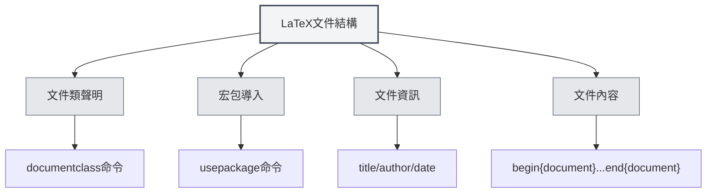

# LaTeX語法

## 概述

LaTeX是一種基於TeX的排版系統，廣泛用於學術論文和科技文件的編寫。MetaDoc提供了完整的LaTeX編輯、編譯和預覽支援。

<LaTeXEditorDemo mode="demo" />

<PdfPreviewPanel mode="demo" />

<LaTeXCompilerPanel mode="demo" />

<LaTeXConsole mode="demo" />

## 基本語法

### 文件結構

LaTeX文件的基本結構：

```latex
\documentclass{article}
\usepackage[utf8]{inputenc}

\title{文件標題}
\author{作者}
\date{\today}

\begin{document}
\maketitle

\section{章節標題}
內容...

\end{document}
```



### 數學公式

**行內公式**：

```latex
這是行內公式：$E = mc^2$
```

**區塊公式**：

```latex
\begin{equation}
\int_{-\infty}^{\infty} e^{-x^2} dx = \sqrt{\pi}
\end{equation}
```

**多行公式**：

```latex
\begin{align}
x &= a + b \\
y &= c + d
\end{align}
```

### 表格

使用 `tabular` 環境：

```latex
\begin{tabular}{|c|c|c|}
\hline
欄1 & 欄2 & 欄3 \\
\hline
資料1 & 資料2 & 資料3 \\
\hline
\end{tabular}
```

### 圖片插入

使用 `figure` 環境：

```latex
\begin{figure}[h]
\centering
\includegraphics[width=0.8\textwidth]{image.png}
\caption{圖片標題}
\label{fig:example}
\end{figure}
```

### 參考文獻

使用 `BibTeX` 或 `natbib`：

```latex
\bibliographystyle{plain}
\bibliography{references}
```

## 編譯和預覽

LaTeX文件需要編譯才能生成PDF。詳見[[latex.compilation|LaTeX編譯與預覽]]。

編譯完成後，可以在[[latex.pdf-preview|PDF預覽功能]]中查看結果。

## 相關文件

- [[latex.editor|LaTeX編輯器使用指南]]
- [[latex.compilation|LaTeX編譯與預覽]]
- [[latex.pdf-preview|PDF預覽功能]]
- [[latex.console|控制台輸出]]