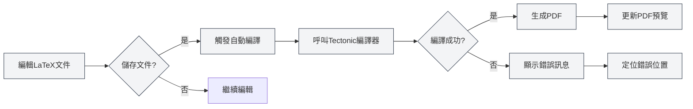
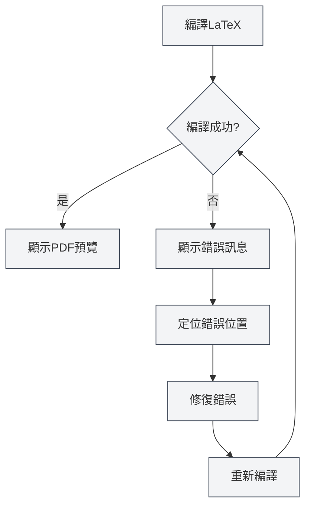

# LaTeX編譯與預覽

## 概述

LaTeX文件需要編譯才能生成PDF。MetaDoc使用Tectonic編譯器，支援自動編譯、即時預覽、錯誤定位等功能，讓您能夠高效地編寫和除錯LaTeX文件。

編譯過程會自動下載所需的宏包，無需手動配置，大大簡化了LaTeX的使用流程。

## 編譯LaTeX文件

<LaTeXCompilerPanel mode="demo" />

### 自動編譯

MetaDoc支援自動編譯功能：

- **儲存時編譯**：儲存LaTeX文件時自動觸發編譯
- **手動編譯**：點選工具列的"編譯"按鈕手動觸發編譯
- **編譯狀態**：編譯過程中會顯示進度和狀態

### 編譯過程

<LaTeXConsole mode="demo" />

編譯過程包括以下步驟：

1. **準備編譯環境**：檢查Tectonic編譯器是否可用
2. **下載宏包**：自動下載文件中使用的LaTeX宏包
3. **執行編譯**：執行Tectonic編譯器生成PDF
4. **處理輸出**：處理編譯日誌和錯誤訊息
5. **更新預覽**：如果編譯成功，更新PDF預覽

### 編譯選項

<LaTeXEditorDemo mode="demo" />

編譯支援以下選項：

- **編譯器**：使用Tectonic編譯器（預設）
- **編譯模式**：非互動模式，遇到錯誤時停止
- **輸出目錄**：PDF檔案儲存在文件同目錄下

### 編譯時間

<ConsoleTerminal mode="demo" consoleKey="demo" :history='[{"content": "Tectonic編譯器啟動...", "type": "out"}, {"content": "解析文件結構", "type": "out"}]' />

編譯時間取決於：

- **文件大小**：文件越大，編譯時間越長
- **宏包數量**：使用的宏包越多，首次編譯時間越長（需要下載）
- **圖片數量**：包含的圖片越多，編譯時間越長

首次編譯可能需要較長時間，因為需要下載宏包。後續編譯會更快。

## PDF預覽

<PdfPreviewPanel mode="demo" pdfUrl="" />

### 自動更新

PDF預覽會在編譯成功後自動更新：

- **即時預覽**：編譯成功後立即顯示PDF預覽
- **自動重新整理**：PDF內容變化時自動重新整理預覽
- **同步捲動**：支援PDF和程式碼的同步定位

### 預覽功能

<LaTeXCompilerPanel mode="demo" />

PDF預覽面板提供以下功能：

- **頁面導覽**：上一頁、下一頁、跳轉到指定頁面
- **縮放控制**：放大、縮小、重設縮放
- **重新整理預覽**：手動重新整理PDF預覽
- **定位到程式碼**：從PDF位置定位到LaTeX程式碼

詳見[[latex.pdf-preview|PDF預覽功能]]。

PDF預覽面板介面如下：

<PdfPreviewPanel mode="demo" pdfUrl="" />

## 控制台輸出

<LaTeXConsole mode="demo" />

### 編譯日誌

編譯過程中的日誌會顯示在控制台輸出面板中：

- **標準輸出**：編譯過程的正常輸出
- **錯誤訊息**：編譯錯誤和警告訊息
- **即時更新**：編譯過程中即時更新日誌

控制台輸出面板介面如下：

<ConsoleTerminal mode="demo" consoleKey="demo" :history='[{"content": "編譯開始...", "type": "out"}, {"content": "正在下載宏包: amsmath", "type": "out"}, {"content": "警告: 未定義的引用", "type": "warn"}, {"content": "編譯完成", "type": "out"}]' />

### 錯誤訊息

<ConsoleTerminal mode="demo" consoleKey="demo" :history='[{"content": "錯誤: 未定義的命令", "type": "error"}, {"content": "警告: 超文字引用未找到", "type": "warn"}]' />

編譯錯誤會以不同顏色顯示：

- **錯誤**：紅色顯示，表示編譯失敗
- **警告**：黃色顯示，表示可能的問題
- **資訊**：灰色顯示，表示一般資訊

### 錯誤定位

編譯錯誤會顯示：

- **錯誤位置**：顯示錯誤發生的行號和列號
- **錯誤類型**：顯示錯誤類型和描述
- **快速跳轉**：點選錯誤訊息可以跳轉到對應程式碼位置

詳見[[latex.console|控制台輸出]]。

## 定位到PDF

<LaTeXEditorDemo mode="demo" />

### 從程式碼定位到PDF

在LaTeX編輯器中，您可以：

1. **選中程式碼**：選中LaTeX程式碼
2. **右鍵選單**：右鍵選擇"定位到PDF"
3. **跳轉預覽**：PDF預覽會自動跳轉到對應位置

### 從PDF定位到程式碼

在PDF預覽中，您可以：

1. **點選PDF位置**：點選PDF中的某個位置
2. **自動跳轉**：編輯器會自動跳轉到對應的LaTeX程式碼位置

這個功能讓您能夠快速在PDF和程式碼之間切換，方便除錯和編輯。

## 編譯錯誤處理

<LaTeXConsole mode="demo" />

### 常見錯誤類型

LaTeX編譯可能遇到以下錯誤：

- **語法錯誤**：LaTeX語法不正確
- **宏包缺失**：使用了未安裝的宏包（Tectonic會自動下載）
- **檔案缺失**：引用的檔案不存在
- **編碼錯誤**：檔案編碼不正確

### 錯誤處理流程

### 除錯技巧

1. **檢視控制台**：仔細檢視控制台輸出的錯誤訊息
2. **定位錯誤**：使用錯誤定位功能快速找到問題程式碼
3. **逐步修復**：從第一個錯誤開始，逐個修復
4. **檢查語法**：確保LaTeX語法正確
5. **檢查檔案**：確保引用的檔案存在且路徑正確

## Tectonic編譯器

<LaTeXCompilerPanel mode="demo" />

### 編譯器介紹

MetaDoc使用Tectonic編譯器，具有以下特點：

- **無需安裝TeX發行版**：Tectonic是獨立的二進位檔案
- **自動下載宏包**：編譯時自動從CTAN下載所需宏包
- **快速編譯**：相比傳統TeX發行版，編譯速度更快
- **跨平台支援**：Windows、macOS、Linux全平台支援

### 宏包管理

Tectonic會自動管理LaTeX宏包：

- **自動下載**：首次使用時自動下載
- **快取管理**：下載的宏包會快取，後續編譯更快
- **版本管理**：自動管理宏包版本

您無需手動下載或配置任何宏包，只需在文件中使用`\usepackage{}`命令即可。

## 使用技巧

<LaTeXEditorDemo mode="demo" />

### 提高編譯速度

1. **減少圖片**：減少文件中的圖片數量
2. **最佳化程式碼**：最佳化LaTeX程式碼結構
3. **使用快取**：利用Tectonic的宏包快取

### 除錯編譯錯誤

1. **檢視完整日誌**：檢視控制台的完整編譯日誌
2. **檢查語法**：仔細檢查LaTeX語法
3. **逐步編譯**：註解掉部分程式碼，逐步定位問題
4. **參考文件**：查閱LaTeX宏包的文件

### 最佳化編譯流程

1. **儲存時編譯**：啟用儲存時自動編譯
2. **使用預覽**：使用PDF預覽快速檢視效果
3. **定位功能**：使用定位功能快速切換程式碼和PDF

## 常見問題

### Q: 編譯失敗怎麼辦？

A: 檢視控制台輸出的錯誤訊息，根據錯誤提示修復程式碼。常見問題包括語法錯誤、檔案缺失等。

### Q: 編譯時間很長？

A: 首次編譯需要下載宏包，時間較長是正常的。後續編譯會更快。如果持續很慢，檢查文件大小和圖片數量。

### Q: 宏包下載失敗？

A: 檢查網路連線，確保可以存取CTAN。Tectonic會自動重試下載。

### Q: PDF預覽不更新？

A: 點選"重新整理"按鈕手動重新整理預覽，或檢查編譯是否成功。

### Q: 如何檢視編譯日誌？

A: 編譯日誌顯示在控制台輸出面板中，可以檢視標準輸出、錯誤訊息和警告訊息。

## 相關文件

- [[latex.editor|LaTeX編輯器使用指南]]
- [[latex.basics|LaTeX語法]]
- [[latex.pdf-preview|PDF預覽功能]]
- [[latex.console|控制台輸出]]

<LaTeXCompilerPanel mode="demo" />

<LaTeXEditorDemo mode="demo" />
