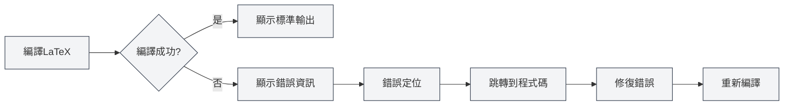

# 控制台輸出

## 概述

控制台輸出面板顯示 LaTeX 編譯過程中的日誌資訊，包括標準輸出、錯誤資訊、警告資訊等。透過查看控制台輸出，您可以了解編譯過程、定位錯誤、偵錯問題。

控制台輸出使用 Monaco 編輯器顯示，支援語法高亮、錯誤定位、日誌過濾等功能，讓您能夠高效地查看和分析編譯日誌。

## LaTeX 編譯輸出

<LaTeXConsole mode="demo" />

### 標準輸出

編譯過程中的標準輸出會顯示在控制台中：

- **編譯進度**：顯示編譯的各個階段
- **宏包下載**：顯示下載的宏包資訊
- **編譯資訊**：顯示編譯過程的詳細資訊

標準輸出以普通文字顯示，幫助您了解編譯過程。

控制台輸出面板介面如下：

<ConsoleTerminal mode="demo" consoleKey="demo" :history='[{"content": "編譯開始...", "type": "out"}, {"content": "警告：未定義的引用", "type": "warn"}, {"content": "編譯完成", "type": "out"}]' />

### 輸出格式

<ConsoleTerminal mode="demo" consoleKey="demo" :history='[{"content": "標準輸出資訊", "type": "out"}, {"content": "警告資訊", "type": "warn"}, {"content": "錯誤資訊", "type": "error"}]' />

控制台輸出使用不同顏色區分不同類型的資訊：

- **標準輸出**：灰色文字，顯示正常的編譯資訊
- **錯誤資訊**：紅色文字，顯示編譯錯誤
- **警告資訊**：黃色文字，顯示編譯警告
- **偵錯資訊**：深灰色文字，顯示偵錯資訊

## 錯誤資訊顯示

<LaTeXConsole mode="demo" />

### 錯誤格式

編譯錯誤會以特定格式顯示：

- **錯誤位置**：顯示錯誤發生的檔案名稱、行號和欄號
- **錯誤類型**：顯示錯誤類型（如語法錯誤、檔案缺失等）
- **錯誤描述**：顯示錯誤的詳細描述

### 錯誤定位

控制台輸出支援錯誤定位功能：

- **點擊錯誤**：點擊錯誤資訊可以跳轉到對應的程式碼位置
- **高亮顯示**：錯誤對應的程式碼行會高亮顯示
- **快速修復**：快速定位到錯誤位置，方便修復

### 常見錯誤類型

LaTeX 編譯可能遇到以下錯誤：

- **語法錯誤**：LaTeX 語法不正確
- **命令未定義**：使用了未定義的 LaTeX 命令
- **環境未閉合**：環境沒有正確閉合
- **檔案缺失**：引用的檔案不存在
- **宏包錯誤**：宏包載入失敗或衝突

## 警告資訊顯示

<ConsoleTerminal mode="demo" consoleKey="demo" :history='[{"content": "警告: 未定義的引用", "type": "warn"}]' />

### 警告格式

編譯警告會以特定格式顯示：

- **警告位置**：顯示警告發生的位置
- **警告類型**：顯示警告類型
- **警告描述**：顯示警告的詳細描述

### 警告處理

警告資訊通常不會阻止編譯，但可能影響最終效果：

- **查看警告**：仔細查看警告資訊，了解可能的問題
- **修復警告**：根據警告資訊修復程式碼
- **忽略警告**：如果警告不影響效果，可以暫時忽略

## 日誌過濾

<LaTeXConsole mode="demo" />

### 過濾功能

控制台輸出支援日誌過濾功能：

- **按類型過濾**：只顯示錯誤、警告或標準輸出
- **按關鍵詞過濾**：過濾包含特定關鍵詞的日誌
- **按時間過濾**：過濾特定時間段的日誌

### 過濾設定

日誌過濾可以在控制台面板中配置：

1.  開啟控制台輸出面板
2.  使用過濾選項選擇要顯示的內容
3.  輸入關鍵詞進行搜尋過濾

### 清除日誌

清除控制台輸出：

- **清除按鈕**：點擊控制台的「清除」按鈕
- **快速鍵**：`Ctrl+L`（如果配置了）

清除日誌會刪除所有已顯示的日誌資訊。

## 日誌操作

<ConsoleTerminal mode="demo" consoleKey="demo" :history='[{"content": "編譯日誌內容...", "type": "out"}]' />

### 複製日誌

複製控制台輸出到剪貼簿：

- **複製按鈕**：點擊控制台的「複製」按鈕
- **快速鍵**：`Ctrl+C`（選中文字後）

複製日誌可以儲存到其他位置或分享給他人。

### 儲存日誌

儲存控制台輸出到檔案：

- **儲存按鈕**：點擊控制台的「儲存日誌」按鈕
- **檔案選擇**：選擇儲存位置和檔案名稱

儲存的日誌檔案可以用於後續分析或問題報告。

### AI 分析

控制台輸出支援 AI 分析功能：

- **啟用 AI 分析**：在控制台面板中啟用 AI 分析開關
- **自動分析**：AI 會自動分析錯誤資訊並提供修復建議
- **查看建議**：查看 AI 提供的錯誤修復建議

AI 分析功能可以幫助您快速理解和修復編譯錯誤。

## 控制台設定

<LaTeXConsole mode="demo" />

### 顯示選項

控制台輸出支援以下顯示選項：

- **行號顯示**：顯示日誌行的行號
- **自動換行**：長行自動換行顯示
- **字型大小**：調整日誌顯示的字型大小

### 主題設定

控制台輸出會跟隨編輯器主題：

- **淺色主題**：在淺色主題下使用淺色背景
- **深色主題**：在深色主題下使用深色背景
- **自動同步**：自動同步編輯器主題設定

## 使用技巧

<ConsoleTerminal mode="demo" consoleKey="demo" :history='[{"content": "定位到錯誤位置...", "type": "out"}]' />

### 快速定位錯誤

1.  **查看錯誤資訊**：仔細查看錯誤資訊的格式和內容
2.  **使用定位功能**：點擊錯誤資訊快速跳轉到程式碼位置
3.  **檢查上下文**：查看錯誤位置的上下文程式碼

### 理解編譯日誌

1.  **閱讀標準輸出**：了解編譯過程的各個階段
2.  **關注錯誤資訊**：重點關注錯誤資訊，優先修復
3.  **查看警告資訊**：查看警告資訊，了解可能的問題

### 偵錯技巧

1.  **逐步編譯**：註解掉部分程式碼，逐步定位問題
2.  **查看完整日誌**：查看完整的編譯日誌，了解編譯過程
3.  **使用 AI 分析**：啟用 AI 分析功能，取得修復建議

## 常見問題

<LaTeXConsole mode="demo" />

### Q: 控制台輸出不顯示？

A: 確保控制台輸出面板已開啟。編譯 LaTeX 文件時會自動開啟控制台面板。

### Q: 如何快速找到錯誤？

A: 錯誤資訊會以紅色顯示，點擊錯誤資訊可以快速跳轉到程式碼位置。

### Q: 日誌太多怎麼辦？

A: 使用過濾功能過濾不需要的日誌，或使用清除功能清除舊日誌。

### Q: 如何儲存編譯日誌？

A: 點擊控制台的「儲存日誌」按鈕，選擇儲存位置即可儲存日誌檔案。

### Q: AI 分析不準確？

A: AI 分析僅供參考，建議結合錯誤資訊和程式碼上下文進行判斷。可以手動修復或重新分析。

## 相關文件

- [[latex.compilation|LaTeX 編譯與預覽]]
- [[latex.editor|LaTeX 編輯器使用指南]]
- [[latex.pdf-preview|PDF 預覽功能]]

<PdfPreviewPanel mode="demo" pdfUrl="" />

<LaTeXCompilerPanel mode="demo" />

<LaTeXEditorDemo mode="demo" />
