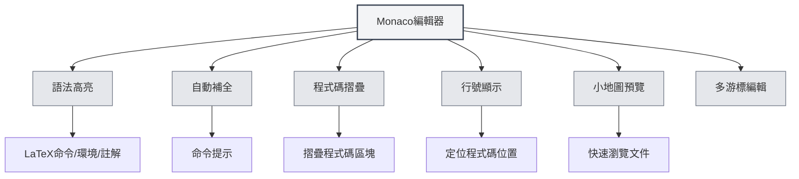

# LaTeX編輯器使用指南

## 概述

MetaDoc的LaTeX編輯器基於Monaco Editor，提供了專業的LaTeX程式碼編輯體驗。編輯器支援語法高亮、自動補全、程式碼摺疊等功能，幫助您高效編寫LaTeX文件。

Monaco Editor是Visual Studio Code使用的編輯器核心，具有強大的程式碼編輯能力和豐富的功能特性。

<PdfPreviewPanel mode="demo" pdfUrl="" />

<ConsoleTerminal mode="demo" consoleKey="demo" :history='[{"content": "編譯完成", "type": "out"}]' />

<QuickStartLatex mode="demo" />

<LaTeXEditor mode="demo" />

## Monaco編輯器介紹

Monaco Editor為LaTeX編輯提供了以下特性：

- **語法高亮**：LaTeX命令、環境、註解等不同語法元素使用不同顏色顯示
- **自動補全**：輸入LaTeX命令時自動顯示補全建議
- **程式碼摺疊**：支援摺疊程式碼區塊，方便瀏覽長文件
- **行號顯示**：顯示行號，方便定位程式碼位置
- **小地圖預覽**：右側顯示程式碼縮圖，快速瀏覽文件結構
- **多游標編輯**：支援多游標同時編輯

<LaTeXEditorDemo mode="demo" />

## 程式碼高亮和語法提示

### 語法高亮

LaTeX編輯器會自動識別並高亮顯示：

- **命令**：`\documentclass`、`\usepackage` 等LaTeX命令
- **環境**：`\begin{document}`、`\end{document}` 等環境標記
- **註解**：以 `%` 開頭的註解行
- **數學公式**：`$`、`$$` 包裹的數學公式區域
- **特殊字元**：`&`、`#`、`$` 等特殊字元

語法高亮讓程式碼結構更清晰，便於閱讀和編輯。

### 語法提示

編輯器會在以下情況顯示語法提示：

- **輸入命令**：輸入 `\` 後自動顯示可用的LaTeX命令
- **輸入環境**：輸入 `\begin{` 後顯示可用的環境名稱
- **輸入套件名**：輸入 `\usepackage{` 後顯示常用的套件名

語法提示幫助您快速輸入正確的LaTeX命令，減少輸入錯誤。

<LaTeXEditor mode="demo" />

## 行號顯示

### 顯示行號

行號顯示在編輯器左側，幫助您：

- **定位程式碼**：快速定位到特定行
- **查找錯誤**：編譯錯誤會顯示行號，方便定位問題
- **程式碼引用**：方便在文件中引用特定程式碼行

### 設定行號

行號顯示可以在設定中配置：

1. 開啟設定頁面
2. 找到"行號顯示"選項
3. 切換開關啟用或停用行號

行號設定會影響所有Monaco編輯器（LaTeX編輯器、純文字編輯器等）。

<LaTeXEditorDemo mode="demo" />

## 小地圖預覽

### 小地圖功能

小地圖（Minimap）是編輯器右側的程式碼縮圖：

- **快速瀏覽**：在小地圖中可以看到整個文件的結構
- **快速定位**：點擊小地圖可以快速跳轉到對應位置
- **結構預覽**：透過顏色差異了解文件的不同部分

### 顯示/隱藏小地圖

小地圖可以透過以下方式控制：

1. 在編輯器中右鍵
2. 查找"小地圖"或"Minimap"選項
3. 切換顯示狀態

小地圖特別適合編輯長文件，幫助您快速了解文件結構。

## 程式碼摺疊

### 摺疊功能

程式碼摺疊允許您摺疊程式碼區塊，隱藏不需要檢視的部分：

- **摺疊環境**：摺疊 `\begin{...}...\end{...}` 環境區塊
- **摺疊函式**：摺疊自訂命令定義
- **摺疊註解**：摺疊大段註解

### 使用摺疊

- **摺疊**：點擊行號左側的摺疊圖示，或使用快速鍵 `Ctrl+Shift+[`
- **展開**：點擊摺疊標記，或使用快速鍵 `Ctrl+Shift+]`
- **摺疊所有**：使用快速鍵 `Ctrl+K Ctrl+0` 摺疊所有程式碼區塊
- **展開所有**：使用快速鍵 `Ctrl+K Ctrl+J` 展開所有程式碼區塊

程式碼摺疊讓您專注於當前編輯的部分，提高編輯效率。

<LaTeXEditorDemo mode="demo" />

## 自動補全

### 補全觸發

編輯器會在以下情況自動顯示補全建議：

- **輸入命令**：輸入 `\` 後顯示LaTeX命令列表
- **輸入環境**：輸入 `\begin{` 後顯示環境名稱
- **輸入套件名**：輸入 `\usepackage{` 後顯示常用套件名
- **其他字元**：輸入其他字元後也可能顯示相關建議

### 接受補全

- **Enter鍵**：接受當前選中的補全建議
- **Tab鍵**：接受當前選中的補全建議
- **方向鍵**：在補全列表中上下移動選擇
- **Esc鍵**：取消補全建議

### 補全設定

補全功能可以在編輯器設定中配置：

- **快速建議**：在其他字元後自動顯示補全建議
- **觸發字元**：在特定字元（如 `\`）後自動顯示補全
- **接受字元**：在輸入提交字元時自動接受補全

<LaTeXEditor mode="demo" />

## 編輯功能

### 多游標編輯

Monaco編輯器支援多游標同時編輯：

- **Alt+點擊**：在點擊位置新增新游標
- **Ctrl+Alt+上/下箭頭**：在上方/下方新增游標
- **Ctrl+D**：選取下一個相同的單字並新增游標
- **Ctrl+Shift+L**：選取所有相同的單字並新增游標

多游標編輯可以同時修改多個位置，提高編輯效率。

### 欄選擇

支援欄選擇模式：

- **Alt+Shift+拖拽**：選取矩形區域
- **Alt+Shift+方向鍵**：擴展欄選擇

欄選擇適合編輯表格或對齊的程式碼。

### 程式碼格式化

編輯器支援基本的程式碼格式化：

- **自動縮排**：根據程式碼結構自動縮排
- **自動換行**：長行自動換行顯示
- **縮排方式**：支援不同的縮排方式（空格、Tab）

<LaTeXEditorDemo mode="demo" />

## 查找取代

### 查找功能

- **快速鍵**：`Ctrl+F` 開啟查找對話方塊
- **高亮顯示**：查找結果會在文件中高亮顯示
- **循環查找**：到達文件末尾後自動從頭開始

### 取代功能

- **快速鍵**：`Ctrl+H` 開啟查找取代對話方塊
- **單個取代**：逐個取代匹配的文字
- **全部取代**：一次性取代所有匹配的文字

### 進階選項

查找取代支援以下選項：

- **區分大小寫**：只匹配大小寫完全相同的文字
- **全字匹配**：只匹配完整的單字
- **正規表示式**：使用正規表示式進行模式匹配

<LaTeXEditorDemo mode="demo" />

## 快速鍵參考

### 編輯快速鍵

| 操作 | Windows/Linux | macOS   |
| ---- | ------------- | ------- |
| 復原 | `Ctrl+Z`      | `Cmd+Z` |
| 重做 | `Ctrl+Y`      | `Cmd+Y` |
| 複製 | `Ctrl+C`      | `Cmd+C` |
| 貼上 | `Ctrl+V`      | `Cmd+V` |
| 全選 | `Ctrl+A`      | `Cmd+A` |
| 查找 | `Ctrl+F`      | `Cmd+F` |
| 取代 | `Ctrl+H`      | `Cmd+H` |

### 程式碼摺疊快速鍵

| 操作     | Windows/Linux   | macOS          |
| -------- | --------------- | -------------- |
| 摺疊     | `Ctrl+Shift+[`  | `Cmd+Option+[` |
| 展開     | `Ctrl+Shift+]`  | `Cmd+Option+]` |
| 摺疊所有 | `Ctrl+K Ctrl+0` | `Cmd+K Cmd+0`  |
| 展開所有 | `Ctrl+K Ctrl+J` | `Cmd+K Cmd+J`  |

### 多游標快速鍵

| 操作               | Windows/Linux  | macOS          |
| ------------------ | -------------- | -------------- |
| 新增游標           | `Alt+點擊`     | `Option+點擊`  |
| 新增上方游標       | `Ctrl+Alt+↑`   | `Cmd+Option+↑` |
| 新增下方游標       | `Ctrl+Alt+↓`   | `Cmd+Option+↓` |
| 選取下一個相同單字 | `Ctrl+D`       | `Cmd+D`        |
| 選取所有相同單字   | `Ctrl+Shift+L` | `Cmd+Shift+L`  |

<LaTeXEditor mode="demo" />

## 使用技巧

### 快速輸入

1. **命令補全**：輸入 `\` 後使用方向鍵選擇命令，按Enter接受
2. **環境補全**：輸入 `\begin{` 後選擇環境名稱，編輯器會自動補全 `\end{...}`
3. **套件名補全**：輸入 `\usepackage{` 後選擇套件名，快速新增巨集套件

<LaTeXEditor mode="demo" />

### 程式碼組織

1. **使用摺疊**：摺疊不需要檢視的程式碼區塊，保持編輯區域整潔
2. **使用註解**：新增註解說明程式碼功能，方便後續維護
3. **合理縮排**：保持程式碼縮排一致，提高可讀性

<LaTeXEditorDemo mode="demo" />

### 錯誤定位

1. **檢視行號**：編譯錯誤會顯示行號，在編輯器中快速定位
2. **使用查找**：使用查找功能快速定位特定命令或文字
3. **使用小地圖**：在小地圖中快速瀏覽文件結構

## 常見問題

### Q: 自動補全不顯示？

A: 檢查編輯器設定中的"快速建議"選項是否啟用。輸入 `\` 後應該會自動顯示補全建議。

### Q: 如何摺疊程式碼？

A: 點擊行號左側的摺疊圖示，或使用快速鍵 `Ctrl+Shift+[`。摺疊的環境區塊會在行號左側顯示摺疊標記。

### Q: 小地圖不顯示？

A: 檢查編輯器設定中的"小地圖"選項是否啟用。小地圖顯示在編輯器右側。

### Q: 如何快速跳轉到特定行？

A: 使用快速鍵 `Ctrl+G`（Windows/Linux）或 `Cmd+G`（macOS）開啟"跳至行"對話方塊，輸入行號即可跳轉。

### Q: 程式碼格式化不正確？

A: Monaco編輯器會根據LaTeX語法自動縮排。如果縮排不正確，可以手動調整或使用Tab鍵。

## 相關文件

- [[latex.basics|LaTeX語法]]
- [[latex.compilation|LaTeX編譯與預覽]]
- [[latex.pdf-preview|PDF預覽功能]]
- [[latex.console|控制台輸出]]
- [[core.editor-basics|編輯器基礎操作]]
- [[core.editor-settings|編輯器設定]]