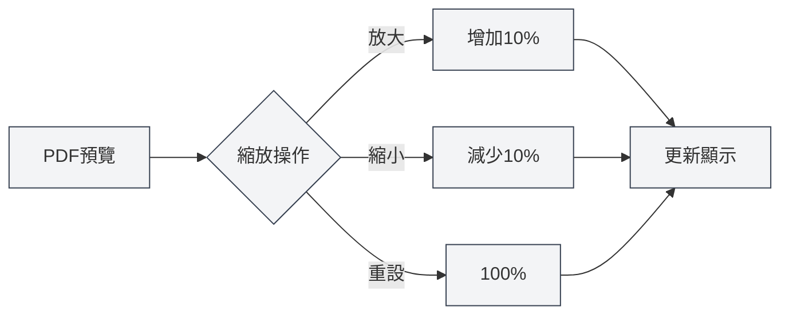

# PDF預覽功能

## 概述

PDF預覽功能允許您在編輯LaTeX文件時即時查看編譯後的PDF效果。預覽面板提供了豐富的互動功能，包括縮放、翻頁、定位等，讓您能夠高效地編輯和除錯LaTeX文件。

PDF預覽會在LaTeX編譯成功後自動顯示，支援與程式碼編輯器的雙向定位，方便您在PDF和程式碼之間快速切換。

<PdfPreviewPanel mode="demo" pdfUrl="" />

## PDF預覽介紹

### 預覽面板

PDF預覽面板顯示在LaTeX編輯器的右側或下方，包含：

- **PDF內容區域**：顯示PDF頁面內容
- **工具列**：提供縮放、翻頁、重新整理等操作按鈕
- **頁面資訊**：顯示目前頁碼和總頁數

PDF預覽面板介面如下：

<PdfPreviewPanel mode="demo" pdfUrl="" />

<LaTeXCompilerPanel mode="demo" />

### 自動顯示

PDF預覽會在以下情況自動顯示：

- **編譯成功**：LaTeX編譯成功後自動顯示PDF預覽
- **開啟文件**：開啟已有PDF的LaTeX文件時自動顯示預覽
- **手動開啟**：點選工具列的「預覽」按鈕手動開啟預覽

<PdfPreviewPanel mode="demo" pdfUrl="" />

## PDF縮放

### 放大PDF

放大PDF預覽：

- **工具列按鈕**：點選工具列的「放大」按鈕（+圖示）
- **滑鼠滾輪**：按住 `Ctrl` 鍵並滾動滑鼠滾輪向上
- **快速鍵**：`Ctrl+=`（如果已設定）

每次放大增加10%的縮放比例。

<LaTeXEditorDemo mode="demo" />

### 縮小PDF

縮小PDF預覽：

- **工具列按鈕**：點選工具列的「縮小」按鈕（-圖示）
- **滑鼠滾輪**：按住 `Ctrl` 鍵並滾動滑鼠滾輪向下
- **快速鍵**：`Ctrl+-`（如果已設定）

每次縮小減少10%的縮放比例。

### 重設縮放

重設PDF縮放到100%：

- **工具列按鈕**：點選工具列的「重設縮放」按鈕
- **快速鍵**：`Ctrl+0`（如果已設定）

### 縮放範圍

PDF縮放支援的範圍：

- **最小值**：20%（0.2倍）
- **最大值**：500%（5倍）
- **預設值**：100%（1倍）

縮放比例會自動限制在有效範圍內。

<PdfPreviewPanel mode="demo" pdfUrl="" />

## PDF重新整理

### 手動重新整理

手動重新整理PDF預覽：

- **工具列按鈕**：點選工具列的「重新整理」按鈕
- **快速鍵**：`F5`（如果已設定）

重新整理會重新載入PDF檔案，顯示最新的編譯結果。

### 自動重新整理

PDF預覽會在以下情況自動重新整理：

- **編譯成功**：LaTeX編譯成功後自動重新整理預覽
- **PDF檔案更新**：偵測到PDF檔案更新時自動重新整理

### 重新整理時機

建議在以下情況重新整理PDF：

- **修改程式碼後**：修改LaTeX程式碼並重新編譯後
- **預覽異常**：PDF預覽顯示異常或內容不正確時
- **長時間編輯**：長時間編輯後需要查看最新效果時

<LaTeXEditorDemo mode="demo" />

## PDF定位到程式碼

### 從PDF定位到程式碼

在PDF預覽中點選某個位置，編輯器會自動跳轉到對應的LaTeX程式碼位置：

1.  **點選PDF位置**：在PDF預覽中點選要查看的位置
2.  **自動跳轉**：編輯器自動跳轉到對應的LaTeX程式碼
3.  **高亮顯示**：對應的程式碼行會高亮顯示

這個功能讓您能夠快速從PDF效果定位到原始碼，方便除錯和修改。

<PdfPreviewPanel mode="demo" pdfUrl="" />

### 從程式碼定位到PDF

在LaTeX編輯器中，您可以：

1.  **選中程式碼**：選中要查看的LaTeX程式碼
2.  **右鍵選單**：右鍵選擇「定位到PDF」
3.  **跳轉預覽**：PDF預覽自動跳轉到對應位置

### 雙向定位

PDF和程式碼之間的雙向定位功能：

-   **PDF → 程式碼**：點選PDF位置跳轉到程式碼
-   **程式碼 → PDF**：選中程式碼跳轉到PDF位置
-   **同步捲動**：支援PDF和程式碼的同步捲動

<ConsoleTerminal mode="demo" consoleKey="demo" :history='[{"content": "PDF頁面導航...", "type": "out"}]' />

## PDF頁面導航

### 翻頁操作

PDF預覽支援以下翻頁操作：

-   **上一頁**：點選工具列的「上一頁」按鈕，或使用方向鍵
-   **下一頁**：點選工具列的「下一頁」按鈕，或使用方向鍵
-   **跳轉到頁面**：在頁碼輸入框中輸入頁碼並按 Enter

### 頁面資訊

PDF預覽顯示以下頁面資訊：

-   **目前頁碼**：顯示目前查看的頁碼
-   **總頁數**：顯示PDF的總頁數
-   **頁碼輸入框**：可以直接輸入頁碼跳轉

### 多頁顯示

PDF預覽支援多頁顯示模式：

-   **單頁模式**：一次顯示一頁
-   **多頁模式**：一次顯示多頁（在主頁預覽中）

多頁模式適合快速瀏覽整個文件。

<PdfPreviewPanel mode="demo" pdfUrl="" />

## PDF儲存

### 儲存PDF

儲存目前PDF檔案：

-   **工具列按鈕**：點選工具列的「儲存」按鈕
-   **選單**：點選「檔案」 → 「儲存PDF」
-   **快速鍵**：`Ctrl+S`（如果PDF是目前使用中文件）

儲存PDF會將PDF檔案儲存到文件同目錄下。

### 開啟PDF目錄

開啟PDF檔案所在的目錄：

-   **工具列按鈕**：點選工具列的「開啟目錄」按鈕
-   **選單**：點選「檔案」 → 「開啟PDF目錄」

開啟目錄後，您可以在檔案管理員中查看和管理PDF檔案。

<LaTeXEditorDemo mode="demo" />

## PDF互動模式

### 指標模式

指標模式是預設的互動模式：

-   **選取文字**：可以選中PDF中的文字
-   **複製文字**：可以複製選中的文字
-   **點選定位**：點選PDF位置可以定位到程式碼

### 手形模式

手形模式用於拖曳PDF：

-   **拖曳PDF**：按住滑鼠左鍵拖曳PDF內容
-   **移動檢視**：移動PDF檢視位置
-   **適合大PDF**：適合查看大尺寸的PDF

切換模式：

-   **工具列按鈕**：點選工具列的模式切換按鈕
-   **快速鍵**：`H` 鍵切換手形模式

## 使用技巧

### 高效預覽

1.  **使用縮放**：根據內容調整合適的縮放比例
2.  **使用定位**：使用定位功能快速切換程式碼和PDF
3.  **使用重新整理**：修改程式碼後及時重新整理查看效果

### 除錯技巧

1.  **定位錯誤**：從PDF定位到程式碼，快速找到問題位置
2.  **對比效果**：對比PDF效果和程式碼，檢查格式是否正確
3.  **多頁瀏覽**：使用多頁模式快速瀏覽整個文件

### 效能最佳化

1.  **合理縮放**：不要使用過大的縮放比例
2.  **關閉預覽**：不需要時關閉預覽面板節省資源
3.  **重新整理策略**：根據需要選擇自動或手動重新整理

## 常見問題

### Q: PDF預覽不顯示？

A: 確保LaTeX文件已成功編譯。如果編譯失敗，PDF預覽不會顯示。檢查主控台輸出的錯誤訊息。

### Q: PDF預覽不更新？

A: 點選「重新整理」按鈕手動重新整理預覽，或重新編譯LaTeX文件。確保PDF檔案已成功產生。

### Q: 如何從PDF定位到程式碼？

A: 在PDF預覽中點選要查看的位置，編輯器會自動跳轉到對應的LaTeX程式碼。

### Q: 如何從程式碼定位到PDF？

A: 選中LaTeX程式碼，右鍵選擇「定位到PDF」，PDF預覽會自動跳轉到對應位置。

### Q: PDF縮放不生效？

A: 確保PDF預覽面板已載入完成。如果問題持續，嘗試重新整理PDF預覽。

## 相關文件

-   [[latex.compilation|LaTeX編譯與預覽]]
-   [[latex.editor|LaTeX編輯器使用指南]]
-   [[latex.console|主控台輸出]]

<LaTeXCompilerPanel mode="demo" />

<LaTeXEditorDemo mode="demo" />

<ConsoleTerminal mode="demo" consoleKey="demo" :history='[{"content": "編譯日誌...", "type": "out"}]' />