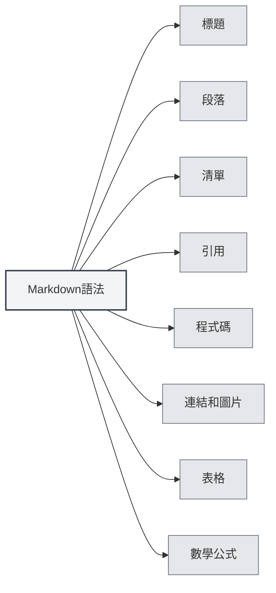

# Markdown語法

## 概述

Markdown是一種輕量級標記語言，允許您使用易讀易寫的純文字格式編寫文件。MetaDoc提供了完整的Markdown編輯和預覽支援。

<ViewMenuItemsDemo mode="demo" :items='["outline", "preview"]' />

## 基本語法

### 標題

使用 `#` 符號建立標題，`#` 的數量表示標題級別：

```markdown
# 一級標題

## 二級標題

### 三級標題
```



### 段落

段落之間使用空行分隔。

### 清單

**無序清單**使用 `-`、`*` 或 `+`：

```markdown
- 項目1
- 項目2
- 項目3
```

**有序清單**使用數字：

```markdown
1. 第一項
2. 第二項
3. 第三項
```

### 引用

使用 `>` 建立引用：

```markdown
> 這是一段引用文字
```

### 程式碼

**行內程式碼**使用反引號：

```markdown
使用 `console.log()` 輸出內容
```

**程式碼區塊**使用三個反引號：

````markdown
```javascript
function hello() {
  console.log('Hello, World!')
}
```
````

### 連結和圖片

**連結**：

```markdown
[連結文字](https://example.com)
```

**圖片**：

```markdown

```

### 表格

```markdown
| 欄1   | 欄2   | 欄3   |
| ----- | ----- | ----- |
| 資料1 | 資料2 | 資料3 |
```

## 數學公式

### 行內公式

使用 `$` 包裹：

```markdown
這是行內公式：$E = mc^2$
```

### 區塊公式

使用 `$$` 包裹：

```markdown
$$
\int_{-\infty}^{\infty} e^{-x^2} dx = \sqrt{\pi}
$$
```

## 進階功能

### LaTeX公式轉換

MetaDoc支援將Markdown中的數學公式轉換為LaTeX格式。詳見[[latex.basics|LaTeX語法]]。

### 圖表支援

MetaDoc支援多種圖表格式：

- [[charts.mermaid|Mermaid圖表]]
- [[charts.plantuml|PlantUML圖表]]
- [[charts.echarts|ECharts圖表]]

## 相關文件

- [[markdown.editor|Markdown編輯器使用指南]]
- [[markdown.advanced|Markdown進階功能]]
- [[markdown.features|Markdown編輯器功能]]
- [[core.editor-basics|編輯器基礎操作]]

<LaTeXEditorDemo mode="demo" />

<Outline mode="demo" />

<ViewMenuItemsDemo mode="demo" :items='["outline"]' />

<MenuItemsDemo mode="demo" :items='[{"id": "file", "items": ["new", "open", "save"]}]' />

<TitleMenu mode="demo" title="Markdown文件範例" path="1" :tree='{}' />

<ViewMenuItemsDemo mode="demo" :items='["editor", "preview"]' />
