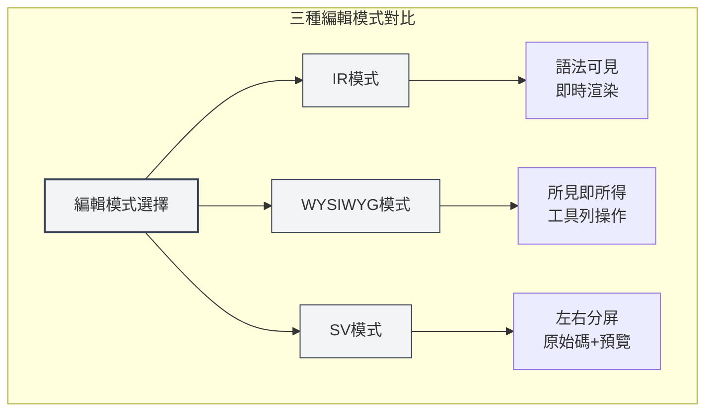
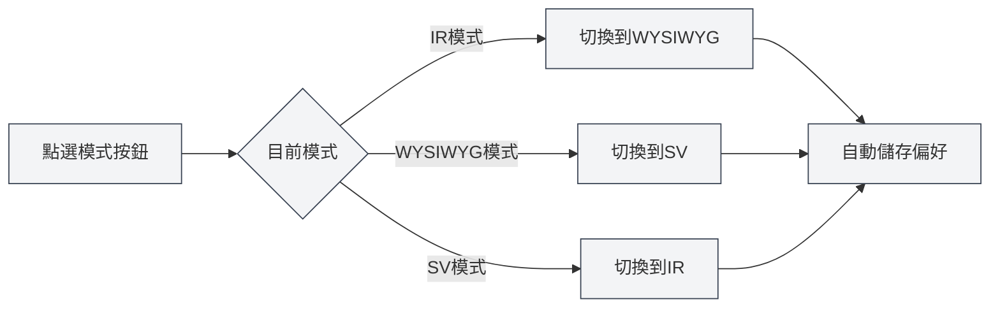
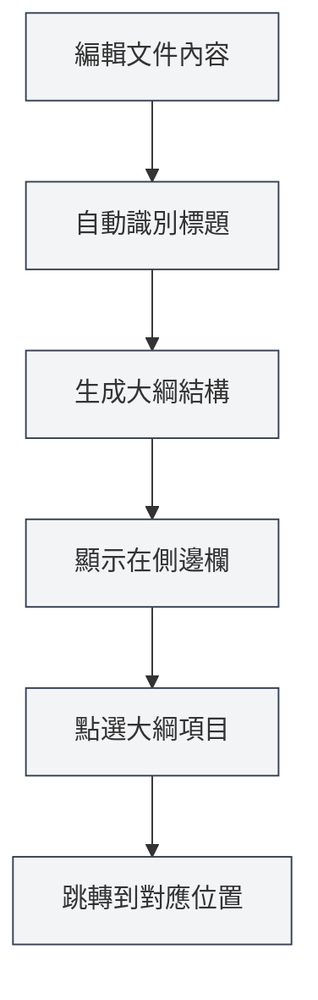
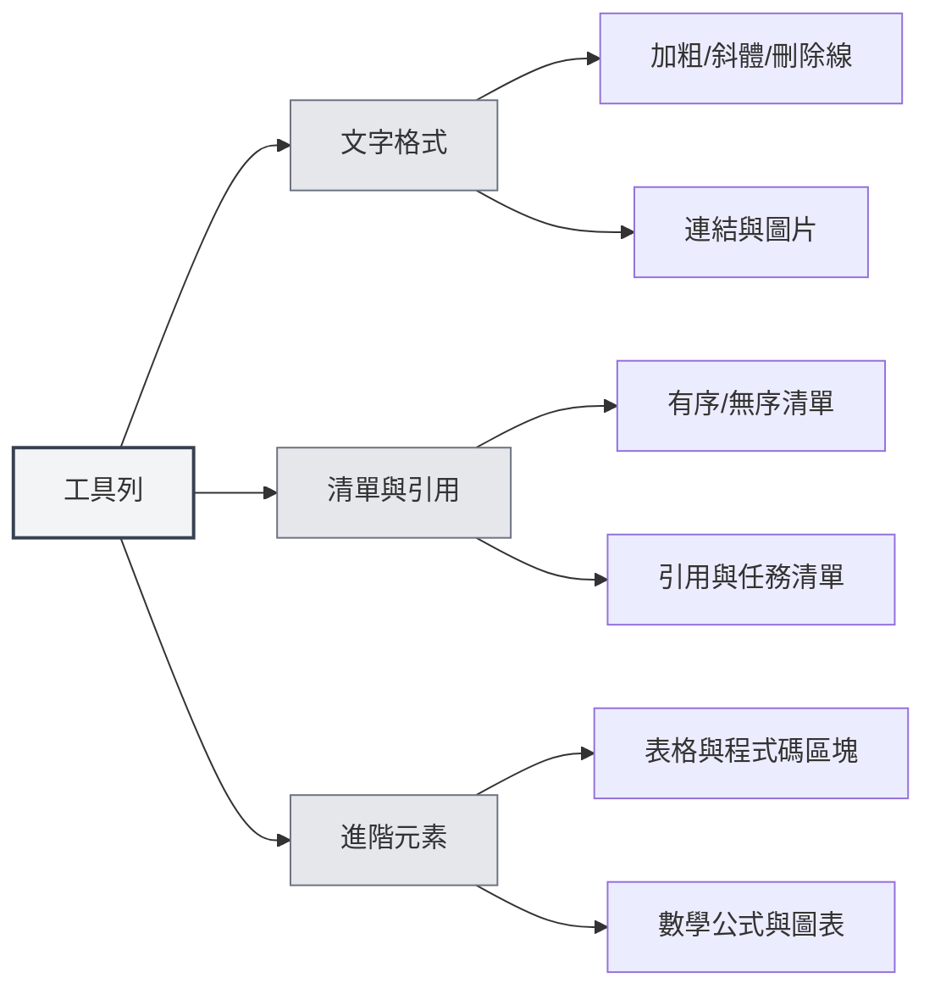

# Markdown編輯器使用指南

## 概述

MetaDoc 的 Markdown 編輯器為您提供了一個專業而優雅的寫作環境。它不僅僅是一個文字輸入框，而是一個深度優化的創作空間——支援三種靈活的編輯模式、即時的內容預覽、以及豐富的排版工具，讓您可以專注於內容本身，而不必為格式操心。

無論您是在撰寫技術部落格、整理學習筆記，還是編寫專案文件，這個編輯器都能滿足您的需求。特別是它深度整合的 AI 能力，能夠在您寫作時提供智慧補全和建議，讓創作變得更加流暢。

<TitleMenu mode="demo" title="Markdown編輯器示例" path="1" :tree='{}' />

<SectionOptimizer mode="demo" title="段落優化示例" path="1" :tree='{}' language="markdown" :adapter='null' />


## 三種編輯模式

MetaDoc 理解不同使用者有不同的編輯習慣，因此提供了三種編輯模式供您選擇：

### IR 模式（即時渲染）

這是預設的編輯模式，也是大多數 Markdown 使用者的首選。在這個模式下：

- **即時回饋**：您輸入 Markdown 語法的同時，內容會立即顯示為格式化後的樣子
- **語法可見**：Markdown 標記符號（如 `#`、` **`）依然可見，方便您精確控制格式
- **編輯流暢**：渲染速度快，即使編輯長文件也不會感到卡頓
- **學習友好**：對於正在學習 Markdown 語法的使用者，可以即時看到語法和效果的對應關係

**適用場景**：

- 熟悉 Markdown 語法的使用者
- 需要精確控制文件格式的場景
- 編輯較長的技術文件或部落格文章

### WYSIWYG 模式（所見即所得）

如果您更習慣類似 Word 的編輯體驗，這個模式會讓您感到親切：

- **直接編輯**：您看到的就是最終效果，直接點選即可編輯
- **無需記憶語法**：透過工具列按鈕完成加粗、標題、清單等操作
- **直觀操作**：選中文字後點選按鈕即可套用格式
- **降低門檻**：不熟悉 Markdown 語法的使用者也能快速上手

**適用場景**：

- 初次接觸 Markdown 的使用者
- 需要快速排版、不關注底層語法的場景
- 更習慣視覺化編輯的使用者

### SV 模式（分屏預覽）

這個模式將編輯區域一分為二：

- **左右對照**：左側顯示 Markdown 原始碼，右側顯示渲染效果
- **即時同步**：在左側編輯時，右側會即時更新預覽
- **學習利器**：可以同時看到語法和最終效果，加深對 Markdown 的理解
- **精確校對**：方便檢查複雜格式（如表格、巢狀清單）是否正確

**適用場景**：

- 學習 Markdown 語法的使用者
- 需要同時檢視原始碼和效果進行校對
- 編輯包含複雜格式的文件



### 如何切換模式

切換編輯模式非常簡單：

1. **工具列按鈕**：在編輯器頂部的工具列中，找到模式切換按鈕
2. **循環切換**：點選按鈕會在三種模式間循環切換
3. **記憶偏好**：系統會記住您最後使用的模式，下次開啟文件時自動恢復



## 即時預覽

MetaDoc 的即時預覽功能讓寫作成為一種享受：

- **自動渲染**：您在左側輸入內容，右側（或下方）立即顯示渲染效果
- **完整支援**：從基礎的標題、清單，到複雜的數學公式、圖表，都能正確渲染
- **程式碼突顯**：程式碼區塊會根據語言類型自動進行語法突顯，讓程式碼更易讀
- **數學公式**：支援 LaTeX 語法的數學公式，無論是行內公式 `$E=mc^2$` 還是獨立公式區塊，都能完美顯示
- **圖片自適應**：插入的圖片會自動適應編輯器寬度，點選可以放大檢視

## 大綱同步

在長文件中導航從未如此簡單：

- **自動擷取**：編輯器會自動識別文件中的標題，生成層級分明的大綱
- **即時更新**：當您新增、修改或刪除標題時，大綱會同步更新
- **一鍵跳轉**：點選大綱中的任意標題，編輯器會立即跳轉到對應位置
- **結構預覽**：透過大綱可以快速了解整篇文件的結構框架

您可以透過側邊欄存取大綱檢視：

<ViewMenuItemsDemo mode="demo" :items='["editor", "outline"]' />



大綱功能的詳細介紹請檢視[[outline.basics|大綱檢視功能]]。

## 工具列功能

編輯器頂部的工具列彙集了最常用的排版功能：



### 文字格式化

- **加粗**（`Ctrl+B`）：讓重點內容更醒目
- **斜體**（`Ctrl+I`）：用於強調或表示特殊含義
- **刪除線**：表示廢棄或修改的內容
- **行內程式碼**：標記程式碼片段或技術術語
- **連結**（`Ctrl+K`）：插入可點選的超連結
- **圖片**：插入本機圖片或網路圖片

### 清單與引用

- **無序清單**：用項目符號列舉內容
- **有序清單**：用數字編號列舉內容
- **引用區塊**：引用他人的觀點或重要提示
- **任務清單**：帶核取方塊的待辦事項清單

### 進階元素

- **表格**：建立結構化的資料表格，支援對齊和巢狀
- **程式碼區塊**：插入多行程式碼，支援數十種程式語言的語法突顯
- **數學公式**：使用 LaTeX 語法插入數學公式
- **圖表**：插入 Mermaid、PlantUML、ECharts 等圖表

## 快速鍵

熟練使用快速鍵可以大幅提升寫作效率：

### 格式化快速鍵

| 操作     | Windows/Linux  | macOS         |
| -------- | -------------- | ------------- |
| 加粗     | `Ctrl+B`       | `Cmd+B`       |
| 斜體     | `Ctrl+I`       | `Cmd+I`       |
| 插入連結 | `Ctrl+K`       | `Cmd+K`       |
| 插入程式碼 | `Ctrl+Shift+K` | `Cmd+Shift+K` |

### 編輯快速鍵

| 操作 | Windows/Linux | macOS         |
| ---- | ------------- | ------------- |
| 復原 | `Ctrl+Z`      | `Cmd+Z`       |
| 重做 | `Ctrl+Y`      | `Cmd+Shift+Z` |
| 全選 | `Ctrl+A`      | `Cmd+A`       |
| 尋找 | `Ctrl+F`      | `Cmd+F`       |

## 使用技巧

### 快速輸入

1. **快速建立標題**：輸入 `#` 後按空格，自動轉為標題格式
2. **快速建立清單**：輸入 `-` 或 `*` 後按空格，自動轉為清單項目
3. **快速插入程式碼區塊**：輸入三個反引號 ` ``` ` 後按 Enter
4. **快速插入分隔線**：輸入三個減號 `---` 後按 Enter

### 格式化技巧

1. **選中文字後格式化**：先選中文字，再點選工具列按鈕或使用快速鍵
2. **批次取代**：使用尋找取代功能（`Ctrl+H`）批次修改格式
3. **程式碼突顯**：在程式碼區塊的第一行指定語言，如 ````python`

### 預覽技巧

1. **模式切換預覽**：在 SV 模式下可以同時看到原始碼和效果
2. **數學公式預覽**：輸入 `$` 包裹公式，即時檢視渲染效果
3. **圖表即時渲染**：Mermaid 圖表會在編輯完成後自動渲染

## 常見問題

### Q: 如何插入圖片？

A: 有三種方式：

1. 點選工具列的圖片按鈕
2. 使用快速鍵 `Ctrl+Shift+I`
3. 直接貼上剪貼簿中的圖片

圖片可以儲存在本機文件目錄，也可以上傳到圖床。

### Q: 如何建立表格？

A: 推薦使用工具列的表格按鈕，視覺化建立表格。也可以手動輸入 Markdown 表格語法：

```markdown
| 欄1  | 欄2  | 欄3  |
| ---- | ---- | ---- |
| 內容 | 內容 | 內容 |
```

### Q: 數學公式不顯示怎麼辦？

A: 檢查語法是否正確：

- 行內公式：用單個 `$` 包裹，如 `$E=mc^2$`
- 獨立公式：用兩個 `$$` 包裹，獨佔一行

### Q: 如何檢視文件大綱？

A: 點選側邊欄的"大綱"圖示，或按快速鍵切換到大綱檢視。文件中的標題會自動擷取為大綱。

### Q: 編輯模式切換後內容會遺失嗎？

A: 不會。三種模式共用同一個文件內容，切換模式只是改變了顯示和編輯方式，內容完全保留。

## 相關文件

- [[markdown.basics|Markdown語法]] - 學習 Markdown 基礎語法
- [[markdown.features|Markdown編輯器功能]] - 了解更多進階功能
- [[core.editor-basics|編輯器基礎操作]] - 通用編輯技巧
- [[core.editor-settings|編輯器設定]] - 個人化配置
- [[outline.basics|大綱檢視功能]] - 深度了解大綱功能

<LaTeXEditorDemo mode="demo" />

<Outline mode="demo" />

<MenuItemsDemo mode="demo" :items='[{"id": "file", "items": ["new", "open", "save"]}]' />

<TitleMenu mode="demo" title="Markdown編輯器示例" path="1" :tree='{}' />

<SectionOptimizer mode="demo" title="段落優化示例" path="1" :tree='{}' language="markdown" :adapter='null' />
