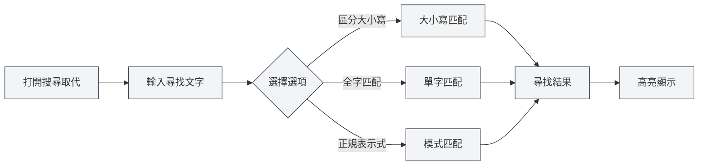
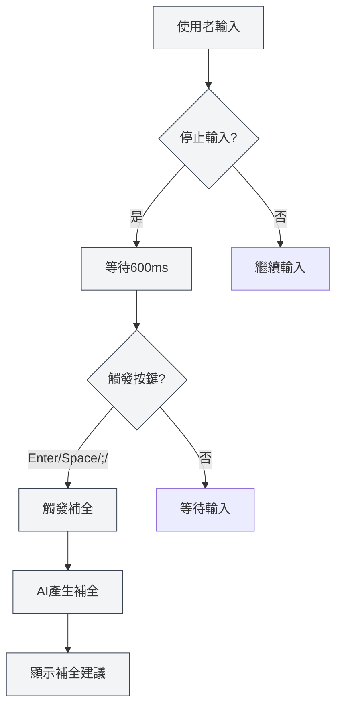

# Markdown編輯器功能

## 概述

Markdown編輯器提供了豐富的功能，包括搜尋取代、右鍵選單、AI自動補全、知識庫整合等。這些功能能顯著提高您的編輯效率和文件品質。

本文檔介紹Markdown編輯器的各項功能及其使用方法。

## 搜尋取代

### 開啟搜尋取代

有多種方式可以開啟搜尋取代功能：

- **快速鍵**：`Ctrl+F` 開啟尋找，`Ctrl+H` 開啟尋找取代
- **選單**：點擊"編輯" → "尋找" 或 "尋找取代"
- **工具列**：點擊工具列中的搜尋圖示

您可以透過頂端選單列的檔案選單存取檔案操作，透過編輯選單存取編輯功能：

<MenuItemsDemo mode="demo" :items='[{"id": "file", "items": ["new", "open", "save"]}]' />

### 尋找功能

尋找功能支援以下選項：

- **區分大小寫**：只匹配大小寫完全相同的文字
- **全字匹配**：只匹配完整的單字（不匹配單字的一部分）
- **正規表示式**：使用正規表示式進行模式匹配
- **保留大小寫**：取代時保留原文字的大小寫格式

搜尋取代選單介面如下：

<SearchReplaceMenu mode="demo" :adapter='null' />

### 取代功能

取代功能支援：

- **單個取代**：逐個取代匹配的文字
- **全部取代**：一次性取代所有匹配的文字
- **取代預覽**：在取代前預覽取代結果

### 匹配清單

搜尋取代面板會顯示匹配清單：

- **顯示位置**：顯示每個匹配項的行號和列號
- **上下文預覽**：顯示匹配項的上下文內容
- **快速跳轉**：點擊匹配項可以快速跳轉到對應位置

### 使用技巧

1. **正規表示式**：使用正規表示式可以實現複雜的尋找取代模式
2. **批次取代**：使用"全部取代"可以快速批次修改文件
3. **保留格式**：使用"保留大小寫"選項可以保持原文字的大小寫格式

## 右鍵選單

### 基本編輯操作

右鍵選單提供以下基本編輯操作：

- **剪下**：`Ctrl+X` 或右鍵選擇"剪下"
- **複製**：`Ctrl+C` 或右鍵選擇"複製"
- **貼上**：`Ctrl+V` 或右鍵選擇"貼上"
- **全選**：`Ctrl+A` 或右鍵選擇"全選"

### AI功能

右鍵選單提供以下AI功能：

- **AI分析**：分析目前文件內容，開啟AI對話視窗
- **段落優化**：優化目前段落的內容
- **插入圖表**：使用AI產生圖表程式碼並插入文件

### 功能開關

右鍵選單可以快速開關以下功能：

- **AI自動補全**：啟用/關閉AI自動補全功能
- **知識庫整合**：啟用/關閉知識庫整合功能

### 手動觸發補全

右鍵選單提供"手動觸發補全"選項：

- **快速鍵**：`Shift+Tab`
- **右鍵選單**：右鍵選擇"手動觸發補全"

手動觸發補全會立即啟動AI補全，無需等待自動觸發。

## AI自動補全

### 啟用/關閉

AI自動補全功能可以在以下位置啟用或關閉：

- **右鍵選單**：右鍵選擇"啟用/關閉AI自動補全"
- **設定頁面**：在設定中配置AI自動補全選項

### 自動觸發

AI自動補全會在以下情況自動觸發：

- **輸入停止**：停止輸入600ms後自動觸發
- **觸發按鍵**：輸入特定按鍵後觸發（Enter、Space、`;`、`,`）

### 手動觸發

手動觸發補全的方式：

- **快速鍵**：`Shift+Tab`
- **右鍵選單**：右鍵選擇"手動觸發補全"

手動觸發會立即啟動補全，跳過自動觸發的延遲。

### 補全模式

AI自動補全支援兩種模式：

- **完全產生**：產生完整的補全內容
- **部分產生**：只產生部分內容（根據設定）

補全模式可以在設定中配置。

### 觸發按鍵設定

補全觸發按鍵可以在設定中配置：

- **Enter**：Enter鍵觸發
- **Space**：空白鍵觸發
- **;**：分號觸發
- **,**：逗號觸發

可以同時啟用多個觸發按鍵。

### 補全最大Token數

補全最大Token數可以在設定中配置：

- **最小值**：20 Token
- **最大值**：無限制（設定為0表示無限制）
- **預設值**：50 Token

Token數越大，補全的內容越多，但產生時間也會更長。

### 接受補全

補全建議顯示後，可以：

- **Tab鍵**：接受補全建議
- **Esc鍵**：取消補全建議
- **繼續輸入**：取消補全並繼續輸入

<TitleMenu mode="demo" title="Markdown編輯器範例" path="1" :tree='{}' />

<SectionOptimizer mode="demo" title="段落優化範例" path="1" :tree='{}' language="markdown" :adapter='null' />

<ViewMenuItemsDemo mode="demo" :items='["editor", "outline", "agent"]' />

## 知識庫整合

### 啟用/關閉

知識庫整合功能可以在以下位置啟用或關閉：

- **右鍵選單**：右鍵選擇"啟用/關閉知識庫"
- **設定頁面**：在設定中配置知識庫選項

### 上下文檢索

啟用知識庫整合後，AI功能會自動檢索知識庫中的相關內容：

- **AI補全**：補全時會參考知識庫中的相關內容
- **AI分析**：分析文件時會使用知識庫中的知識
- **段落優化**：優化段落時會參考知識庫中的內容

### 檢索原理

知識庫檢索使用向量搜尋技術：

- **語義匹配**：根據語義相似度匹配相關內容
- **關鍵字匹配**：同時使用關鍵字匹配提高準確性
- **混合檢索**：結合向量搜尋和關鍵字匹配

### 信賴度閾值

知識庫檢索支援設定信賴度閾值：

- **閾值範圍**：0.0 - 1.0
- **預設值**：0.5
- **作用**：只返回相似度高於閾值的內容

信賴度閾值可以在設定中配置，詳見[[knowledge-base.config|知識庫配置]]。

## 功能組合使用

### 搜尋取代 + AI補全

結合使用搜尋取代和AI補全：

1. 使用搜尋取代尋找需要修改的內容
2. 使用AI補全產生新的內容
3. 使用取代功能批次更新

### 右鍵選單 + 知識庫

結合使用右鍵選單和知識庫：

1. 啟用知識庫整合
2. 使用右鍵選單的AI功能
3. AI功能會自動使用知識庫中的內容

### AI分析 + 段落優化

結合使用AI分析和段落優化：

1. 使用AI分析了解文件內容
2. 使用段落優化改進特定段落
3. 根據AI分析的建議進行優化

## 使用技巧

### 提高補全品質

1. **啟用知識庫**：啟用知識庫整合可以提高補全品質
2. **調整Token數**：根據需求調整補全最大Token數
3. **手動觸發**：需要時使用手動觸發獲得更好的補全效果

### 高效搜尋取代

1. **使用正規表示式**：複雜模式使用正規表示式
2. **預覽取代**：取代前預覽取代結果
3. **批次操作**：使用"全部取代"快速批次修改

### 知識庫使用

1. **新增相關文件**：將相關文件新增到知識庫
2. **調整信賴度**：根據需求調整信賴度閾值
3. **定期更新**：定期更新知識庫內容

## 常見問題

### Q: AI補全不顯示？

A: 檢查AI自動補全是否啟用，確保LLM配置正確。嘗試手動觸發補全（`Shift+Tab`）。

### Q: 搜尋取代找不到內容？

A: 檢查是否啟用了"區分大小寫"或"全字匹配"選項。如果使用正規表示式，檢查表示式是否正確。

### Q: 知識庫整合不生效？

A: 檢查知識庫是否啟用，確保知識庫中有相關文件。調整信賴度閾值可能有助於檢索到更多內容。

### Q: 如何關閉AI補全？

A: 右鍵選單選擇"關閉AI自動補全"，或在設定中關閉AI自動補全選項。

### Q: 補全內容不準確？

A: 嘗試啟用知識庫整合，調整補全最大Token數，或使用手動觸發獲得更好的效果。

## 相關文件

- [[markdown.editor|Markdown編輯器使用指南]]
- [[markdown.basics|Markdown語法]]
- [[ai.completion|AI自動補全]]
- [[knowledge-base.usage|知識庫使用]]
- [[core.editor-basics|編輯器基礎操作]]

<LaTeXEditorDemo mode="demo" />

<Outline mode="demo" />

<MenuItemsDemo mode="demo" :items='[{"id": "file", "items": ["new", "open", "save"]}]' />

<TitleMenu mode="demo" title="Markdown編輯器功能範例" path="1" :tree='{}' />

<SearchReplaceMenu mode="demo" :adapter='null' />

<ViewMenuItemsDemo mode="demo" :items='["editor", "outline", "agent"]' />

<MenuItemsDemo mode="demo" :items='[{"id": "edit", "items": ["find", "replace"]}]' />
