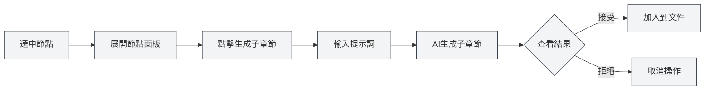
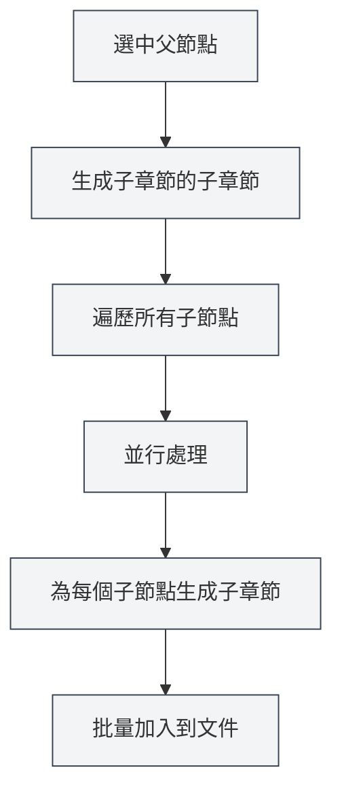

# 大綱AI功能

## 概述

大綱AI功能利用AI技術幫助您快速生成和優化文件結構。透過AI功能，您可以生成子章節、生成章節內容、優化大綱結構等，大大提高文件創作效率。

<Outline mode="demo" />

大綱AI功能支援多種操作模式，包括單個節點操作和批量操作，讓您能夠靈活地使用AI輔助文件創作。

<Outline mode="demo" />

## 生成子章節

### 為節點生成子章節

為指定節點生成子章節：

<OutlineAiToolbar mode="demo" />

1.  **選中節點**：在大綱視圖中選中要生成子章節的節點
2.  **展開節點**：點擊節點展開詳細面板
3.  **生成子章節**：點擊「生成子章節」按鈕
4.  **輸入提示**：可選輸入提示詞指導AI生成
5.  **等待生成**：AI會根據節點標題和內容生成子章節
6.  **確認接受**：查看生成結果，確認後接受

您可以透過側邊欄存取大綱視圖：

<ViewMenuItemsDemo mode="demo" :items='["outline"]' />

生成的子章節會自動加入到文件中，並更新大綱結構。

### 生成原理

<OutlineTreeDisplay mode="demo" />

AI生成子章節時會考慮：

-   **節點標題**：根據節點標題理解章節主題
-   **文件結構**：考慮文件的整體結構
-   **使用者提示**：根據使用者提示詞調整生成內容
-   **格式要求**：根據文件格式（Markdown/LaTeX）生成正確的標題格式

### 使用技巧

1.  **提供明確提示**：輸入清晰的提示詞，指導AI生成符合需求的子章節
2.  **參考現有結構**：AI會參考文件的現有結構，保持風格一致
3.  **多次生成**：如果不滿意，可以多次生成選擇最佳結果

## 生成章節內容

<Outline mode="demo" />

### 為節點生成內容

為指定節點生成正文內容：

1.  **選中節點**：在大綱視圖中選中要生成內容的節點
2.  **展開節點**：點擊節點展開詳細面板
3.  **生成內容**：點擊「生成內容」按鈕
4.  **輸入提示**：可選輸入提示詞指導AI生成
5.  **設定字數**：可選設定目標字數
6.  **等待生成**：AI會根據節點標題和文件結構生成內容
7.  **確認接受**：查看生成結果，確認後接受

生成的內容會自動加入到文件中對應章節。

### 內容生成模式

<OutlineAiToolbar mode="demo" />

內容生成支援以下模式：

-   **完全生成**：生成完整的章節內容
-   **部分生成**：只生成部分內容（根據設定）
-   **追加內容**：在現有內容基礎上追加新內容

### 字數控制

生成內容時可以設定目標字數：

-   **設定字數**：在生成對話方塊中輸入目標字數
-   **AI調整**：AI會根據字數要求調整生成內容的詳細程度
-   **靈活控制**：可以根據章節重要性設定不同的字數

<OutlineTreeDisplay mode="demo" />

## 生成子章節的子章節

### 批量生成子章節

為指定節點的所有子節點批量生成子章節：

1.  **選中節點**：選中要批量操作的節點
2.  **展開節點**：點擊節點展開詳細面板
3.  **生成子章節的子章節**：點擊「生成子章節的子章節」按鈕
4.  **輸入提示**：輸入提示詞指導AI生成
5.  **等待生成**：AI會並行處理所有子節點，為每個子節點生成子章節
6.  **確認接受**：查看生成結果，確認後接受

這個功能使用並行處理機制，可以快速為多個章節批量生成子章節。

### 並行處理優勢

<OutlineAiToolbar mode="demo" />

批量生成使用並行處理機制：

-   **高效處理**：同時處理多個節點，速度提升數十倍
-   **自動同步**：生成完成後自動同步到文件
-   **進度顯示**：顯示每個節點的生成進度

### 使用場景

適合以下場景：

-   **大規模生成**：需要為多個章節生成子章節時
-   **批量操作**：一鍵為所有章節生成子章節
-   **結構化生成**：按照大綱結構批量生成內容

## 生成子章節內容

### 批量生成內容

為指定節點的所有子節點批量生成內容：

1.  **選中節點**：選中要批量操作的節點
2.  **展開節點**：點擊節點展開詳細面板
3.  **生成子章節內容**：點擊「生成子章節內容」按鈕
4.  **輸入提示**：輸入提示詞指導AI生成
5.  **設定字數**：可選設定目標字數
6.  **等待生成**：AI會並行處理所有子節點，為每個子節點生成內容
7.  **確認接受**：查看生成結果，確認後接受

這個功能可以快速為整個文件的所有章節生成內容。

### 遞迴生成

生成子章節內容會遞迴處理：

-   **遍歷所有子節點**：遞迴遍歷所有子節點
-   **生成內容**：為每個子節點生成內容
-   **保持結構**：保持文件的層級結構

### 進度追蹤

批量生成時會顯示進度：

-   **節點進度**：顯示目前處理的節點
-   **總體進度**：顯示總體生成進度
-   **即時更新**：即時更新生成內容

<Outline mode="demo" />

## 大綱優化

### 優化功能

大綱優化功能可以幫助您：

-   **結構調整**：優化文件的結構和層級
-   **標題優化**：優化標題的命名和格式
-   **結構重組**：重新組織文件結構

### 優化操作

大綱優化支援以下操作：

-   **移動節點**：移動節點到新位置
-   **刪除節點**：刪除不需要的節點
-   **調整層級**：調整節點的層級關係
-   **合併節點**：合併相似的節點

### 使用優化

<OutlineTreeDisplay mode="demo" />

1.  **分析結構**：AI會分析目前文件結構
2.  **提供建議**：提供優化建議
3.  **應用優化**：確認後應用優化結果

## AI功能配置

### 溫度設定

AI生成時可以設定溫度參數：

-   **溫度範圍**：0.0 - 1.0
-   **預設值**：根據配置
-   **作用**：控制AI生成的創造性（溫度越高越有創造性）

### 提示詞設定

可以為每個操作設定提示詞：

-   **通用提示**：設定通用的提示詞
-   **操作提示**：為每個操作設定特定的提示詞
-   **字數要求**：在提示詞中包含字數要求

### 格式識別

AI會自動識別文件格式：

-   **Markdown格式**：生成Markdown格式的標題和內容
-   **LaTeX格式**：生成LaTeX格式的標題和內容
-   **自動適配**：根據文件格式自動調整生成內容

## 使用技巧

### 高效生成

1.  **使用批量操作**：需要生成大量內容時，使用批量操作提高效率
2.  **提供清晰提示**：輸入清晰的提示詞，獲得更好的生成結果
3.  **分步生成**：先生成結構，再生成內容，逐步完善文件

### 品質控制

1.  **檢查生成結果**：生成後仔細檢查結果，確保符合要求
2.  **多次生成**：如果不滿意，可以多次生成選擇最佳結果
3.  **手動調整**：生成後可以手動調整和完善內容

### 結構規劃

1.  **先規劃結構**：使用AI生成子章節規劃文件結構
2.  **再生成內容**：結構確定後再生成具體內容
3.  **逐步完善**：逐步完善文件，不要一次性生成所有內容

## 常見問題

### Q: AI生成的內容不準確？

A: AI生成的內容僅供參考，建議生成後檢查並調整。可以提供更詳細的提示詞獲得更好的結果。

### Q: 批量生成很慢？

A: 批量生成使用並行處理，速度已經很快。如果仍然很慢，可能是網路問題或AI服務回應慢。

### Q: 如何取消生成？

A: 生成過程中可以點擊「取消」按鈕取消操作。已生成的內容不會遺失。

### Q: 生成的內容格式不正確？

A: AI會自動識別文件格式。如果格式不正確，檢查文件格式設定，或手動調整生成的內容。

### Q: 可以修改生成的內容嗎？

A: 可以。生成的內容可以隨時編輯和修改。生成只是輔助創作，最終內容由您決定。

## 相關文件

-   [[outline.basics|大綱視圖功能]]
-   [[ai.llm-config|LLM配置]]
-   [[markdown.editor|Markdown編輯器使用指南]]
-   [[latex.editor|LaTeX編輯器使用指南]]

<Outline mode="demo" />

<OutlineAiToolbar mode="demo" />

<ViewMenuItemsDemo mode="demo" :items='["ai"]' />
