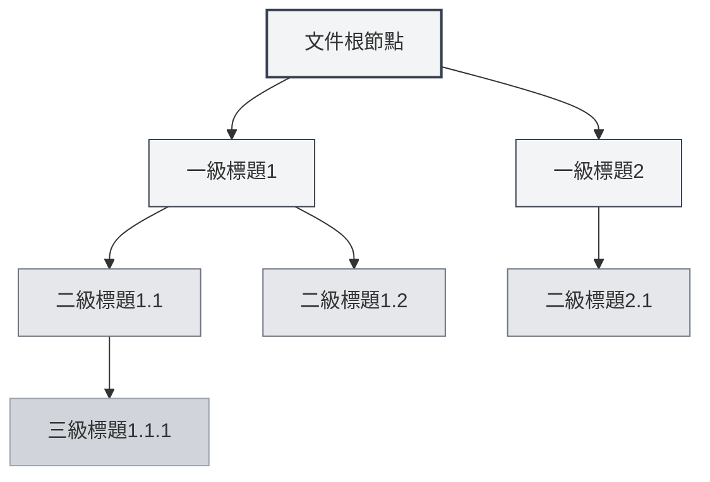
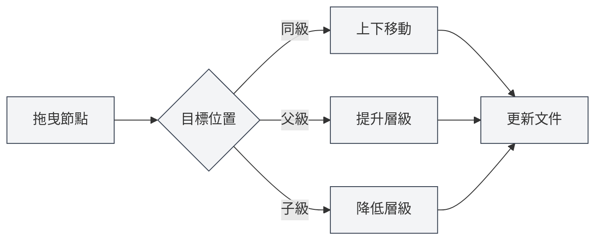

# 大綱視圖功能

## 概述

大綱視圖以樹形結構顯示文件的標題層次，幫助您快速瀏覽和編輯文件結構。透過大綱視圖，您可以快速跳轉到文件的任意位置，編輯文件結構，使用AI功能產生內容。

MetaDoc的大綱視圖支援自動擷取、手動編輯、拖曳排序、AI產生等功能，讓您能夠高效地組織和管理文件結構。

## 大綱視圖介紹

### 視圖位置

大綱視圖通常顯示在編輯器左側或右側的側邊欄中：

- **側邊欄**：大綱視圖作為側邊欄的一部分顯示
- **獨立面板**：可以獨立顯示或隱藏大綱視圖
- **寬度調整**：可以調整大綱視圖的寬度

您可以透過側邊欄存取大綱視圖，側邊欄提供編輯器、大綱等視圖切換：

<ViewMenuItemsDemo mode="demo" :items='["editor", "outline"]' />

### 介面預覽

大綱視圖以樹形結構展示文件標題層次，支援拖曳排序和節點編輯：

<Outline mode="demo" />

<ViewMenuItemsDemo mode="demo" :items='["outline"]" />

### 大綱結構

大綱視圖以樹形結構顯示文件的標題層次：

- **根節點**：文件的根節點（通常不顯示）
- **一級標題**：文件的一級標題（H1）
- **二級標題**：文件的二級標題（H2）
- **多級嵌套**：支援多級標題的嵌套顯示

### 自動擷取

大綱視圖會自動從文件中擷取標題結構：

- **Markdown文件**：從Markdown標題（`#`、`##`等）擷取
- **LaTeX文件**：從LaTeX章節指令（`\section`、`\subsection`等）擷取
- **即時更新**：編輯文件時自動更新大綱結構

## 大綱節點操作

### 新增子節點

在大綱中新增新的子節點：

1. **選中節點**：點選要新增子節點的節點
2. **新增按鈕**：點選節點旁的「新增子節點」按鈕（+圖示）
3. **輸入標題**：輸入新節點的標題
4. **確認建立**：確認後建立新節點

新節點會新增到文件的對應位置，並自動更新文件內容。

<Outline mode="demo" />

### 編輯節點

編輯大綱節點的標題：

1. **選中節點**：點選要編輯的節點
2. **編輯按鈕**：點選節點旁的「編輯」按鈕
3. **修改標題**：修改節點標題
4. **確認儲存**：確認後儲存變更

編輯節點標題會自動更新文件中對應的標題。

<TitleMenu mode="demo" title="範例標題" path="1" :tree='{}' />

<ViewMenuItemsDemo mode="demo" :items='["outline"]' />

### 刪除節點

刪除大綱節點：

1. **選中節點**：點選要刪除的節點
2. **刪除按鈕**：點選節點旁的「刪除」按鈕
3. **確認刪除**：確認後刪除節點

刪除節點會同時刪除文件中對應的標題和內容（如果設定了）。

<SectionOptimizer mode="demo" title="大綱節點優化範例" path="1" :tree='{}' language="markdown" :adapter='null' />

<OutlineTreeDisplay mode="demo" />

### 移動節點

移動大綱節點的位置：

- **上下移動**：使用「上移」和「下移」按鈕改變節點順序
- **左右移動**：使用「左移」和「右移」按鈕改變節點層級
- **拖曳移動**：直接拖曳節點到目標位置

移動節點會自動更新文件結構。

<OutlineTreeDisplay mode="demo" />

## 大綱節點拖曳

### 拖曳操作

大綱視圖支援拖曳操作來重新組織文件結構：

1. **按住滑鼠**：在節點上按住滑鼠左鍵
2. **拖曳節點**：拖動節點到目標位置
3. **釋放滑鼠**：釋放滑鼠完成移動

拖曳時會有視覺回饋，顯示節點的目標位置。

### 拖曳模式

拖曳支援以下模式：

- **上下移動**：在同一層級內上下移動節點
- **左右移動**：改變節點的層級（提升或降低）
- **跨層級移動**：將節點移動到其他層級

### 拖曳限制

拖曳操作有以下限制：

- **根節點**：根節點不能拖曳
- **自包含**：不能將節點拖曳到自己的子節點中（避免循環）
- **層級限制**：某些操作可能受到層級限制

<Outline mode="demo" />

## 大綱展開/摺疊

### 展開節點

展開節點檢視子節點：

- **點選節點**：點選節點標題展開或摺疊
- **展開圖示**：點選節點前的展開圖示
- **展開全部**：使用「展開全部」功能展開所有節點

### 摺疊節點

摺疊節點隱藏子節點：

- **點選節點**：再次點選已展開的節點摺疊
- **摺疊圖示**：點選節點前的摺疊圖示
- **摺疊全部**：使用「摺疊全部」功能摺疊所有節點

### 展開狀態

大綱的展開狀態會儲存：

- **自動儲存**：展開狀態會自動儲存
- **恢復狀態**：下次開啟文件時恢復展開狀態
- **獨立狀態**：每個文件的展開狀態獨立儲存

## 大綱寬度調整

### 調整寬度

大綱視圖的寬度可以調整：

1. **拖曳邊界**：將滑鼠移到大綱視圖的邊界
2. **按住拖曳**：按住滑鼠左鍵拖曳調整寬度
3. **釋放滑鼠**：釋放滑鼠完成調整

### 寬度限制

大綱寬度有以下限制：

- **最小寬度**：不能小於最小寬度（通常為150px）
- **最大寬度**：不能大於最大寬度（通常為螢幕寬度的50%）
- **自動適應**：寬度會根據內容自動調整

<ResizableDivider mode="demo" />

## 快速跳轉

### 點選跳轉

點選大綱節點可以快速跳轉到文件的對應位置：

- **點選節點**：點選節點標題跳轉到對應位置
- **高亮顯示**：跳轉後對應的標題會高亮顯示
- **捲動定位**：編輯器會自動捲動到對應位置

### 同步捲動

大綱視圖支援與編輯器的同步捲動：

- **編輯時同步**：編輯文件時，大綱會自動高亮目前編輯位置
- **捲動時同步**：捲動編輯器時，大綱會自動高亮可見的標題
- **雙向同步**：大綱和編輯器雙向同步

## 節點資訊顯示

### 節點標題

大綱節點顯示以下資訊：

- **標題文字**：顯示標題的文字內容
- **標題層級**：透過縮排顯示標題的層級
- **節點狀態**：顯示節點的狀態（展開/摺疊）

### 節點操作

每個節點提供以下操作按鈕：

- **新增子節點**：在目前節點下新增子節點
- **編輯**：編輯節點標題
- **刪除**：刪除節點
- **移動**：上下左右移動節點

操作按鈕在滑鼠懸停或選中節點時顯示。

<OutlineTreeDisplay mode="demo" />

<ViewMenuItemsDemo mode="demo" :items='["editor", "outline"]' />

## 使用技巧

### 組織文件結構

1. **使用大綱規劃**：先在大綱中規劃文件結構，再填入內容
2. **調整層級**：使用拖曳快速調整標題層級
3. **批次操作**：使用大綱視圖批次管理多個標題

### 快速導航

1. **使用跳轉**：點選大綱節點快速跳轉到文件位置
2. **使用搜尋**：在大綱中搜尋標題快速定位
3. **使用摺疊**：摺疊不需要檢視的部分，專注於目前內容

### 編輯效率

1. **拖曳排序**：使用拖曳快速調整文件結構
2. **批次編輯**：在大綱中批次編輯多個標題
3. **結構預覽**：使用大綱預覽整個文件結構

<OutlineTreeDisplay mode="demo" />

## 常見問題

### Q: 大綱不更新？

A: 大綱會自動更新。如果未更新，嘗試切換視圖或重新整理文件。確保文件中有正確的標題格式。

### Q: 如何快速新增多個標題？

A: 使用「新增子節點」功能快速新增標題，或直接在編輯器中輸入標題，大綱會自動更新。

### Q: 拖曳節點失敗？

A: 檢查是否將節點拖曳到自己的子節點中（會導致循環）。確保目標位置有效。

### Q: 大綱顯示不正確？

A: 檢查文件中的標題格式是否正確。Markdown使用`#`，LaTeX使用`\section`等指令。

### Q: 如何重設大綱？

A: 大綱會自動從文件中擷取。如果需要重設，可以重新開啟文件或手動編輯文件結構。

## 相關文件

- [[outline.ai-features|大綱AI功能]]
- [[markdown.editor|Markdown編輯器使用指南]]
- [[latex.editor|LaTeX編輯器使用指南]]
- [[core.editor-basics|編輯器基礎操作]]
