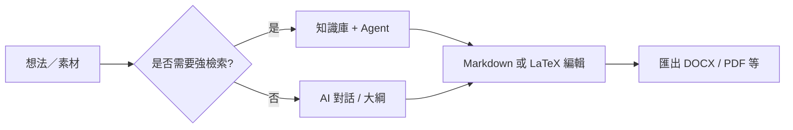

# 🚀 MetaDoc 最佳實踐手冊

MetaDoc 不是只有單一固定流程的軟體。

它比較像**工具組合平台**：同一件事——寫文章、做圖表、翻譯——可以用不同方式完成。

👉 這代表：

* 同一項任務，**常常有多條路徑**
* 各路徑在**速度、成本、效果**上並不相同
* 選對方法，比「背下所有功能」更重要

本手冊不逐一介紹功能，而是回答一個實際問題：

> 👉 **在這個情境下，我應該優先用哪一種做法？**

---

## 🧭 如何閱讀本手冊

| 標記       | 含義                             |
| ---------- | -------------------------------- |
| ⭐⭐⭐⭐⭐ | 建議優先使用（多數情境適用）     |
| ⭐⭐⭐⭐   | 穩定可靠，可能多一步操作         |
| ⭐⭐⭐     | 特定情境更合適                   |
| ⚠️       | 需注意品質、合規或風險           |
| 💰         | 會消耗較多 Token／成本較高       |

---

主視窗分頁示意：

<MainTabs mode="demo" />

---

# 📝 一、寫作：從想法到成稿

在 MetaDoc 裡，寫文章常見有三條路。不必全會，依目標選一條即可。

---

## ⭐⭐⭐⭐⭐ 路徑 1（最推薦）

### AI 起草 → Markdown 修改 → 匯出成品

**鏈路**：
[[ai.chat|AI 對話]] → Markdown 編輯 → [[core.export|匯出功能]]

**適合你如果：**

* 想快點開始寫
* 需要反覆修改
* 最後要交 Word／PDF／LaTeX

---

**為什麼列為首選**

* Markdown 讓你**少分心在版面上**
* 先顧內容與結構，格式往後處理
* 匯出後可在 Word 或 LaTeX 做最後調整

👉 可以想成：**內容先行，版式在後**

---

**注意**

* AI 產出務必自行核對（尤其事實與引用）
* 匯出後建議快速檢查排版

---

AI 對話介面示意：

<AIChat mode="demo" />

---

## ⭐⭐⭐⭐ 路徑 2

### 用知識庫輔助寫作（尤其專業／有依據需求）

**鏈路**：
[[knowledge-base.usage|知識庫]] → [[agent.introduction|Agent]] → 在編輯器統稿

---

**適合你如果：**

* 內容需要依據（論文、綜述、報告）
* 手邊已有 PDF、文件、資料

---

**優點**

* 可基於已上傳資料生成內容
* 較容易維持「有來源」的寫法

---

**需注意**

* ⚠️ 成效取決於資料品質與切片方式
* 💰 多輪對話會消耗較多 Token

---

👉 簡單講：

> 要**寫得有根據**，優先考慮這條路

---

知識庫介面示意：

<KnowledgeBase mode="demo" />

---

## ⭐⭐⭐ 路徑 3

### 由 Agent 直接產生 LaTeX 專案

**鏈路**：
Agent → LaTeX 專案 → 編譯 PDF

---

**適合你如果：**

* 需要標準論文型結構
* 已確定使用 LaTeX
* 時間較緊

---

### ⚠️ 使用前請先了解

* 💰 通常比一般對話或小範圍操作更耗 Token
* 產生的專案仍可能需要你調整套件與路徑
* 高敏感或合規要求極高的內容，不建議全權交給自動流程

---

Agent 介面示意：

<AgentView mode="demo" />

---

**提示詞範本（可直接使用）**

```text
你是 LaTeX 技術編輯。請為主題「（在此填寫論文／報告題目）」在目前工作區產生一套可直接編譯的 LaTeX 專案。

要求：
1) 使用 article 或我指定的文件類別；主檔為 main.tex，其餘章節拆成多個 .tex 並以 \input 組織。
2) 目錄結構清楚：figures/、sections/、bib/；提供範例占位圖與參考文獻條目。
3) 數學、圖表、文獻等使用標準套件（如 amsmath、graphicx、biblatex 或 natbib）；註明需安裝的套件。
4) 建議編譯指令（如 latexmk -pdf 或 xelatex 流程）；若需 Unicode 中文，說明使用 XeLaTeX 或 LuaLaTeX。
5) 勿省略檔案內容；路徑需自洽。若資訊不足，先列假設再產生。
```

---

# 📊 二、圖表與視覺化

重點不是「按鈕在哪」，而是：

> 👉 **你要快，還是要細？**

---


| 路徑 | 做法 | 推薦 | 適合 |
| ---- | ---- | ---- | ---- |
| A | 用 AI 對話或 Agent 產生 Mermaid／PlantUML／ECharts 等程式碼，貼進 Markdown | ⭐⭐⭐⭐ | 改圖快、與正文同檔 |
| B | 使用圖表視窗（見 [[charts.introduction|圖表功能]]） | ⭐⭐⭐⭐ | 偏好圖形介面時 |
| C | 選取文字 → 右鍵插入圖表 | ⭐⭐⭐⭐⭐ | 與目前段落最貼合 |

相關入口：[[ai.chat|AI 對話]]、[[agent.introduction|Agent]]。

---

**簡單建議**

* 日常寫作 → 右鍵（最快）
* 複雜圖 → 圖表工具
* 想試多種做法 → AI 產生程式碼

---

圖表工具示意：

<GraphWindow mode="demo" />

---

# 🌐 三、翻譯

一句話：

> 👉 **內容越短，方法越簡單**

---


| 路徑     | 推薦       | 適合        |
| -------- | ---------- | ----------- |
| 右鍵翻譯 | ⭐⭐⭐⭐⭐ | 單句／段落  |
| AI 對話  | ⭐⭐⭐⭐   | 多段文字    |
| Agent    | ⭐⭐⭐⭐   | 長文件      |

---

👉 建議：

* 短內容 → 右鍵
* 長內容 → AI 對話或 Agent

---

可拖曳分割條示意：

<ResizableDivider mode="demo" />

---

# ✨ 四、段落優化

把整篇一次丟給 AI，往往更慢、更貴。

較好的做法：

---


| 路徑            | 推薦       | 原因           |
| --------------- | ---------- | -------------- |
| 右鍵優化        | ⭐⭐⭐⭐⭐ | 較快、較省     |
| 大綱樹優化      | ⭐⭐⭐⭐   | 適合整理結構   |
| AI 對話／Agent | ⭐⭐⭐⭐   | 適合大範圍調整 |

---

👉 核心思路：

> **分段處理，效率較高**

---

大綱檢視示意：

<Outline mode="demo" />

---

# 🎯 五、依情境選擇

不確定時，可直接看本節。

---

## 🎒 課堂筆記

**建議**

* ⭐⭐⭐⭐⭐ 課中用 Markdown 快記 → 課後用 AI 擴寫
* ⭐⭐⭐⭐ 上傳講義／PDF → 產生複習提綱

👉 先記下來，再整理

---

## 🧪 實驗報告

**建議**

* ⭐⭐⭐⭐⭐ Markdown 撰寫 → 匯出 DOCX
* ⭐⭐⭐⭐ 知識庫輔助分析段落

⚠️ 實驗數據務必自行確認

---

## 🛠️ 技術文件

**建議**

* ⭐⭐⭐⭐⭐ Markdown ＋ 右鍵局部優化
* ⭐⭐⭐⭐ Agent 對齊舊版文件

👉 重點是清楚與一致

---

## 💬 問答／部落格

**建議**

* ⭐⭐⭐⭐⭐ 先產生大綱 → 再寫正文
* ⭐⭐⭐⭐ 用大綱控制長文結構

👉 結構比字數重要

---

## 📱 公眾號／內容創作

**建議**

* ⭐⭐⭐⭐⭐ Markdown 定稿 → 匯出 → 平台排版
* ⭐⭐⭐⭐ AI 產生標題與摘要變體

⚠️ 不建議一次請 AI 寫滿全文（成本高、風格難控）

---

# 🔁 流程總覽



---

# 📚 延伸閱讀

* [[quick-start.guide|快速開始指南]]
* [[core.export|匯出功能]]
* [[features.paragraph-optimization|段落優化功能]]
* [[charts.introduction|圖表功能介紹]]
